# Bộ Câu Hỏi Ôn Luyện Phỏng Vấn Frontend Senior

Tài liệu này là bộ câu hỏi dùng để ôn lại kiến thức trước mỗi lần phỏng vấn Frontend, đặc biệt cho level Senior. Mục tiêu không phải học trong một số ngày cố định, mà là có một checklist đủ rộng để rà lỗ hổng, luyện cách trả lời, và chuẩn bị các tình huống follow-up thực tế.

Tiêu chí biên soạn: mỗi câu có sơ đồ hoặc bảng dễ hiểu, thuật ngữ chuyên môn Anh - Việt, phần xoáy sâu dành cho Senior, ví dụ/case thực tế, follow-up thường gặp, và kết luận ngắn để nhớ lâu.

Ngày cập nhật: 2026-08-24

## Bản đồ kiến thức Senior Front-end

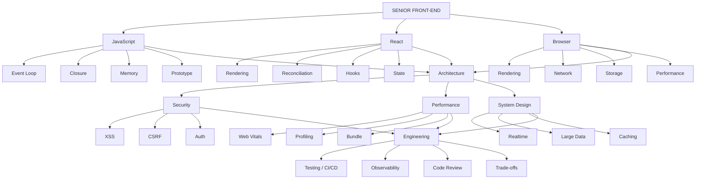

## Nguồn chính dùng để đối chiếu

- React docs: `useContext`, `memo`, `useTransition`, `useDeferredValue`, React Server Components.
- TanStack Query docs: server state, query key, cache, SSR, hydration.
- Redux docs: selector, memoized selector, normalized state.
- Zustand docs: selector, shallow comparison, subscription.
- web.dev: LCP, INP, CLS, Core Web Vitals.
- MDN: Event loop, microtask, AbortController, Web Worker, CORS, HTTP caching, Storage, CSP.
- Chrome DevTools docs: Performance panel, Memory panel, heap snapshot.
- OWASP Cheat Sheet Series: XSS, CSRF, HTML5 storage, session/token storage.

## Cách dùng bộ tài liệu trước phỏng vấn

Tài liệu này không chia theo ngày. Mỗi lần chuẩn bị phỏng vấn, hãy dùng nó như một bộ câu hỏi kiểm tra lại năng lực theo vòng lặp:

| Vòng ôn | Cách làm | Mục tiêu |
|---|---|---|
| Vòng 1: Rà lỗ hổng | Đọc tiêu đề từng câu và tự chấm: biết rõ, biết mơ hồ, chưa biết | Biết mình đang yếu phần nào |
| Vòng 2: Luyện trả lời | Trả lời miệng theo template bên dưới, không nhìn đáp án trước | Tập diễn đạt gọn, đúng trọng tâm |
| Vòng 3: Đào sâu Senior | Tự hỏi thêm follow-up, trade-off, bottleneck, edge case | Tránh trả lời ở mức thuộc lòng |
| Vòng 4: Gắn với dự án thật | Chuẩn bị ví dụ từ dự án cá nhân/công ty cho từng nhóm chủ đề | Trả lời như người từng làm production |

## Cơ chế ôn luyện

| Mức chuẩn bị | Khi nào dùng | Cách chọn câu hỏi |
|---|---|---|
| Cấp tốc | Sắp phỏng vấn trong vài ngày | Ưu tiên React, JavaScript, Browser, Performance, System Design, Security |
| Tiêu chuẩn | Có 1-2 tuần | Đi lần lượt tất cả phần, ghi lại câu chưa trả lời được |
| Chuyên sâu | Muốn nâng level Senior thật sự | Với mỗi câu, tự thêm case production, metric, trade-off, và câu chuyện dự án |

## Phạm vi câu hỏi cần phủ

Bộ câu hỏi này cần được xem như tài liệu sống. Khi gặp câu hỏi mới trong phỏng vấn thật, hãy thêm vào đúng nhóm chủ đề và viết theo cùng template.

| Nhóm | Trạng thái hiện tại | Ghi chú |
|---|---|---|
| JavaScript core | Đã có nền tốt | Cần tiếp tục bổ sung bài coding async/data structure nếu gặp |
| React core và React hiện đại | Đã có nền tốt | Có React 19, RSC, Server Action, hydration |
| Browser, network, storage | Đã có nền tốt | Có rendering, CORS, cache, storage, accessibility |
| Architecture, Performance, System Design | Đã có nền tốt | Phù hợp câu hỏi Senior và production scenario |
| Design System | Đã bổ sung chuyên sâu | Tokens, theming, component API, accessibility, Storybook, versioning, governance |
| Security | Đã có nền tốt | Có XSS, CSRF, token, CSP, refresh token race |
| Engineering/Behavioral | Đã có nền tốt | Nên gắn thêm câu chuyện dự án thật của bản thân |
| TypeScript | Cần bổ sung | Generic, utility types, type guard, discriminated union, typing React/API |
| CSS/Layout thực chiến | Cần bổ sung | Flex/Grid, responsive, stacking context, z-index, theming, animation |
| Live coding | Cần bổ sung | Debounce, throttle, promise pool, virtual list, tree, custom hooks |
| Tooling/Build system | Cần bổ sung | Vite, Webpack, tree shaking, source map, monorepo, CI build |
| Forms thực tế | Cần bổ sung | Validation, dirty state, async validation, duplicate submit, React Hook Form |

## Template trả lời bắt buộc

```md
## Câu X: ...

### Hình ảnh / Sơ đồ
Mermaid diagram hoặc bảng chứng minh.

### Trả lời dễ hiểu
...

### Giải thích chuyên sâu
- Thuật ngữ tiếng Anh: giải thích tiếng Việt.

### Ví dụ / Case thực tế
...

### Senior follow-up
...

### Kết luận dễ nhớ
...
```

---

# Phần 1: JavaScript

Nền tảng JavaScript là đáy của cây Senior Front-end: hiểu execution model, closure, memory, prototype và các cơ chế bất đồng bộ trước khi tối ưu React hoặc browser.

## Câu 1: Sự khác nhau giữa var, let, const là gì?

### Hình ảnh / Sơ đồ

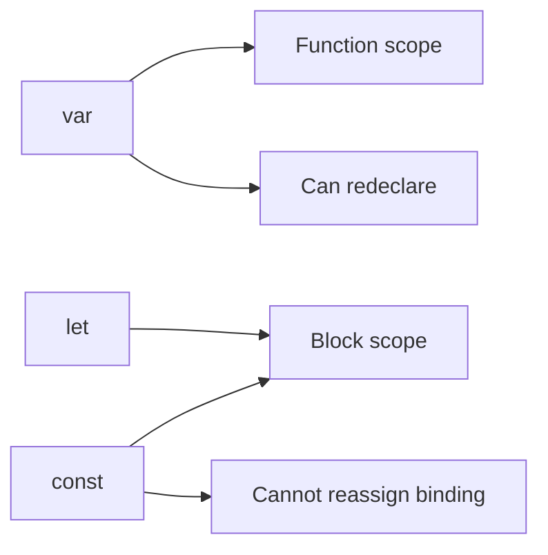

### Trả lời dễ hiểu

Ba từ khóa này đều dùng để khai báo biến, nhưng khác nhau về scope, hoisting và khả năng gán lại. Nếu hiểu sai, rất dễ gặp bug trong loop, closure hoặc block scope.

`var` có function scope, nghĩa là nó sống trong function gần nhất chứ không bị giới hạn bởi block `if` hoặc `for`. Nó được hoist và khởi tạo là `undefined`, nên đọc trước dòng khai báo không lỗi nhưng dễ gây bug. `let` có block scope và có thể gán lại. `const` cũng block scope nhưng không cho gán lại binding.

`const` không làm object immutable. `const user = {}` nghĩa là không gán `user` sang object khác, nhưng vẫn có thể đổi property bên trong nếu object không bị freeze.

### Giải thích chuyên sâu

- `Function scope` - biến sống trong phạm vi function.
- `Block scope` - biến sống trong `{ ... }`.
- `Redeclare` - khai báo lại cùng tên trong cùng scope.
- `Reassign` - gán lại giá trị cho biến.
- `TDZ` - vùng từ đầu scope đến dòng khai báo, truy cập sẽ lỗi.

### Bảng so sánh

| Tiêu chí | `var` | `let` | `const` |
|---|---|---|---|
| Scope | Function | Block | Block |
| Hoisting | Có, init `undefined` | Có, TDZ | Có, TDZ |
| Redeclare cùng scope | Có | Không | Không |
| Reassign | Có | Có | Không |
| Nên dùng hiện đại | Hạn chế | Khi cần gán lại | Mặc định nên dùng |

### Ví dụ / Case thực tế

```js
for (var i = 0; i < 3; i++) {
  setTimeout(() => console.log(i), 0);
}
// 3, 3, 3

for (let j = 0; j < 3; j++) {
  setTimeout(() => console.log(j), 0);
}
// 0, 1, 2
```

### Senior follow-up

- `const obj = {}` có nghĩa object immutable không?
- Vì sao `let/const` vẫn được xem là hoisted?

### Kết luận dễ nhớ

<span style="color: red; font-weight: 700;">Mặc định dùng `const`, cần đổi giá trị dùng `let`, tránh `var`.</span>

## Câu 2: Hoisting trong JavaScript: biến và function hoạt động thế nào?

### Hình ảnh / Sơ đồ

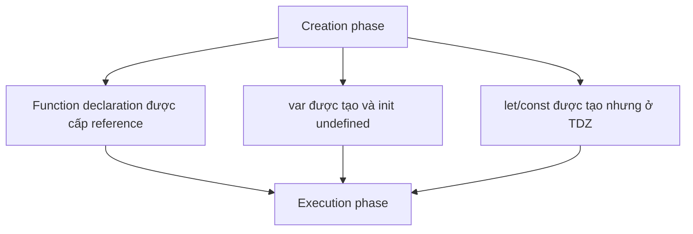

### Trả lời dễ hiểu

Hoisting nghĩa là trong giai đoạn chuẩn bị trước khi chạy code, JavaScript engine đã tạo binding cho biến và function. Nhưng mỗi loại khai báo được khởi tạo khác nhau.

Function declaration được cấp reference sớm, nên có thể gọi trước dòng khai báo. `var` cũng được hoist nhưng được khởi tạo là `undefined`, nên đọc trước khai báo ra `undefined`. `let` và `const` cũng được hoist, nhưng nằm trong Temporal Dead Zone từ đầu scope đến dòng khai báo, nên đọc trước sẽ bị `ReferenceError`.

Vì vậy nói “hoisting là JavaScript kéo code lên đầu file” là cách hiểu quá đơn giản và dễ sai. Chính xác hơn: engine tạo binding trước, còn dùng được trước hay không phụ thuộc loại khai báo.

### Giải thích chuyên sâu

- `Creation phase` - JS engine tạo lexical environment trước khi execute.
- `Function declaration` - khai báo function dạng `function foo() {}`.
- `Function expression` - function được gán vào biến, phụ thuộc hoisting của biến.
- `ReferenceError` - lỗi khi truy cập binding chưa được khởi tạo.

### Bảng so sánh

| Code | Kết quả |
|---|---|
| `console.log(a); var a = 1;` | `undefined` |
| `console.log(b); let b = 1;` | `ReferenceError` |
| `foo(); function foo() {}` | Chạy được |
| `bar(); const bar = () => {};` | `ReferenceError` |

### Ví dụ / Case thực tế

```js
sayHi();

function sayHi() {
  console.log("Hi");
}

console.log(count); // undefined
var count = 1;
```

### Senior follow-up

- Hoisting khác gì với việc "di chuyển code lên đầu file"?
- Function declaration trong block scope có hành vi cần cẩn thận gì?

### Kết luận dễ nhớ

<span style="color: red; font-weight: 700;">Hoisting xử lý khai báo trước, nhưng không phải khai báo nào cũng dùng được trước.</span>

## Câu 3: Falsy và truthy trong JavaScript là gì?

### Hình ảnh / Sơ đồ

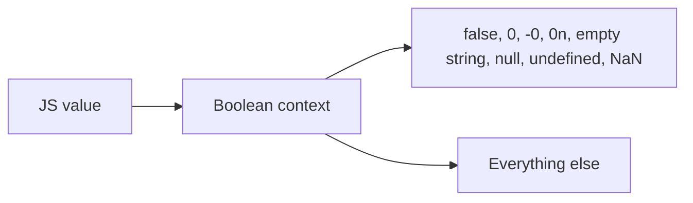

### Trả lời dễ hiểu

Trong JavaScript, nhiều chỗ cần giá trị boolean như `if`, `while`, `&&`, `||`, `!`. Khi đưa giá trị không phải boolean vào các chỗ này, JS sẽ ép kiểu ngầm sang true hoặc false.

Falsy là nhóm nhỏ các giá trị bị ép thành false: `false`, `0`, `-0`, `0n`, chuỗi rỗng `""`, `null`, `undefined`, `NaN`. Tất cả giá trị còn lại là truthy, kể cả `[]`, `{}`, `"0"`.

Điểm nguy hiểm là falsy không luôn có nghĩa “không hợp lệ”. Ví dụ số lượng `0` hoặc chuỗi rỗng có thể là dữ liệu hợp lệ. Khi cần phân biệt null/undefined, nên dùng `??` hoặc check rõ thay vì check truthy/falsy chung chung.

### Giải thích chuyên sâu

- `Boolean context` - ngữ cảnh cần true/false như `if`, `while`, `&&`, `||`, `!`.
- `Type coercion` - ép kiểu ngầm.
- `Nullish` - chỉ gồm `null` và `undefined`, khác với falsy.

### Bảng dễ nhầm

| Giá trị | Truthy/Falsy | Ghi chú |
|---|---|---|
| `[]` | Truthy | Array rỗng vẫn là object |
| `{}` | Truthy | Object rỗng vẫn truthy |
| `"0"` | Truthy | String không rỗng |
| `0` | Falsy | Number zero |
| `null` | Falsy | Nullish |
| `undefined` | Falsy | Nullish |

### Ví dụ / Case thực tế

```js
const count = 0;

if (count) {
  console.log("Có count");
} else {
  console.log("Bị rơi vào else dù count hợp lệ");
}
```

Khi `0` là giá trị hợp lệ, không nên check bằng truthy/falsy. Hãy check rõ:

```js
if (count !== null && count !== undefined) {
  console.log("Có count");
}
```

### Senior follow-up

- `||` khác `??` thế nào?
- Vì sao `items.length && <List />` có thể render ra `0` trong React?

### Kết luận dễ nhớ

<span style="color: red; font-weight: 700;">Falsy không đồng nghĩa với invalid; `0` và `""` đôi khi là dữ liệu hợp lệ.</span>

## Câu 4: ==, === và Object.is() khác nhau thế nào?

### Hình ảnh / Sơ đồ

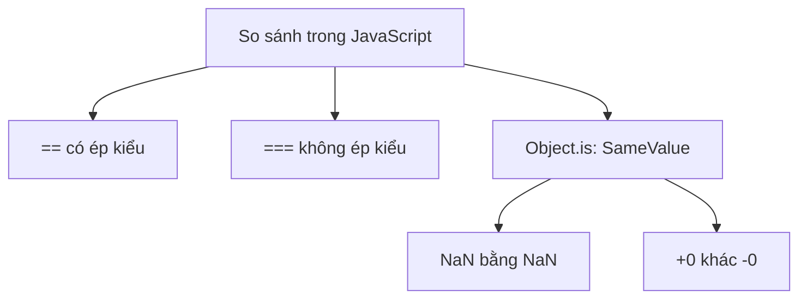

### Trả lời dễ hiểu

`==` là so sánh lỏng. Nếu hai giá trị khác kiểu, JavaScript có thể ép kiểu trước rồi mới so sánh. Vì vậy nhiều kết quả nhìn rất bất ngờ.

`===` là so sánh nghiêm ngặt. Nếu khác kiểu thì trả về `false`, không ép kiểu. Đây là lựa chọn mặc định nên dùng trong code hằng ngày.

`Object.is()` gần giống `===`, nhưng khác ở hai edge case quan trọng: `Object.is(NaN, NaN)` là `true`, và `Object.is(+0, -0)` là `false`. Trong khi đó `NaN === NaN` là `false`, còn `+0 === -0` là `true`.

### Giải thích chuyên sâu

- `Type coercion` - ép kiểu tự động, ví dụ string sang number hoặc boolean sang number.
- `Loose equality` - thuật toán của `==`, có ép kiểu.
- `Strict equality` - thuật toán của `===`, không ép kiểu.
- `SameValue` - thuật toán được `Object.is()` dùng.
- `Edge case` - trường hợp biên dễ gây sai nếu không biết.

### Bảng so sánh

| Biểu thức | Kết quả | Vì sao |
|---|---|---|
| `0 == "0"` | `true` | `"0"` bị ép sang number `0` |
| `0 === "0"` | `false` | Khác kiểu number và string |
| `false == 0` | `true` | `false` bị ép sang `0` |
| `null == undefined` | `true` | Trường hợp đặc biệt của `==` |
| `null === undefined` | `false` | Khác kiểu |
| `NaN === NaN` | `false` | `NaN` không bằng chính nó với `===` |
| `Object.is(NaN, NaN)` | `true` | `Object.is` xem hai `NaN` là cùng giá trị |
| `+0 === -0` | `true` | `===` xem hai zero là bằng nhau |
| `Object.is(+0, -0)` | `false` | `Object.is` phân biệt dấu của zero |

### == thực hiện type coercion như thế nào?

Không cần học thuộc toàn bộ thuật toán, nhưng cần nhớ các nhóm nguy hiểm:

| So sánh | Cách nghĩ |
|---|---|
| Number với string | String có thể bị chuyển sang number |
| Boolean với giá trị khác | Boolean thường bị chuyển thành `0` hoặc `1` |
| `null` với `undefined` | `null == undefined` là `true` |
| Object với primitive | Object có thể bị chuyển về primitive qua `valueOf`/`toString` |

Vì nhiều rule ép kiểu rất khó nhớ, code production nên ưu tiên `===`, trừ khi anh cố tình muốn dùng behavior của `==`, ví dụ check `value == null` để bắt cả `null` và `undefined`.

### Senior follow-up

- Vì sao nên ưu tiên `===` trong code production?
- Khi nào `value == null` có thể chấp nhận được?
- React dùng `Object.is` trong trường hợp nào?
- Vì sao `Object.is(NaN, NaN)` lại hữu ích?

### Kết luận dễ nhớ

<span style="color: red; font-weight: 700;">== có ép kiểu, === không ép kiểu, Object.is giống === nhưng xử lý khác NaN và dấu của zero.</span>

## Câu 5: Prototype và prototype chain trong JavaScript là gì?

### Hình ảnh / Sơ đồ

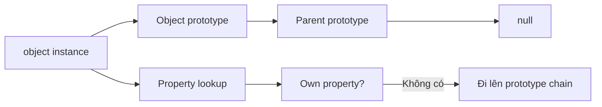

### Trả lời dễ hiểu

Trong JavaScript, object có thể kế thừa property/method từ một object khác thông qua **prototype**. Khi mình đọc `obj.name`, JavaScript tìm `name` trực tiếp trên `obj` trước. Nếu không thấy, nó đi lên prototype của `obj`, rồi prototype của prototype, cho tới khi gặp `null`. Chuỗi tìm kiếm đó gọi là **prototype chain**.

Prototype giúp nhiều object dùng chung method mà không cần copy method vào từng object. Ví dụ mọi array đều dùng được `map`, `filter`, `push` vì chúng kế thừa từ `Array.prototype`.

Điểm Senior cần nói rõ: `class` trong JavaScript chủ yếu là syntax đẹp hơn trên cơ chế prototype. Khi viết method trong class, method đó thường nằm trên prototype, không nằm riêng trên từng instance. Vì vậy hiểu prototype giúp debug inheritance, method lookup, `this`, monkey patching và performance khi tạo nhiều object.

### Giải thích chuyên sâu

- `Prototype` - object mà một object khác tham chiếu để kế thừa property/method.
- `Prototype chain` - chuỗi prototype mà JS đi qua khi lookup property.
- `Own property` - property nằm trực tiếp trên object, không phải kế thừa.
- `__proto__` - accessor lịch sử để xem prototype của object, không nên lạm dụng.
- `Object.getPrototypeOf()` - API chuẩn để đọc prototype.
- `Class syntax` - cú pháp hiện đại nhưng vẫn dựa trên prototype ở runtime.

### Bảng so sánh

| Khái niệm | Nghĩa dễ hiểu | Ví dụ |
|---|---|---|
| Own property | Thuộc tính riêng của object | `user.name` |
| Prototype property | Thuộc tính/method kế thừa | `arr.map` từ `Array.prototype` |
| Prototype chain | Đường lookup khi property không có trực tiếp | `arr -> Array.prototype -> Object.prototype -> null` |
| Class method | Method đặt trên prototype | `User.prototype.sayHi` |

### Ví dụ / Case thực tế

```js
class User {
  constructor(name) {
    this.name = name;
  }

  sayHi() {
    return `Hi ${this.name}`;
  }
}

const user = new User("An");

console.log(user.hasOwnProperty("name")); // true
console.log(user.hasOwnProperty("sayHi")); // false
console.log(Object.getPrototypeOf(user) === User.prototype); // true
```

`name` là own property vì mỗi user có name riêng. `sayHi` nằm trên `User.prototype`, nên các instance dùng chung method này.

### Senior follow-up

- `class` trong JavaScript khác class trong Java/C# ở điểm nào?
- Vì sao method đặt trong constructor tốn memory hơn method đặt trên prototype?
- Prototype pollution là gì và nguy hiểm thế nào?
- `Object.create(null)` khác object thường ở đâu?

### Kết luận dễ nhớ

<span style="color: red; font-weight: 700;">Prototype là cơ chế object đi mượn property/method từ object khác; class trong JS vẫn chạy trên nền prototype.</span>

## Câu 6: Closure trong JavaScript là gì?

### Hình ảnh / Sơ đồ

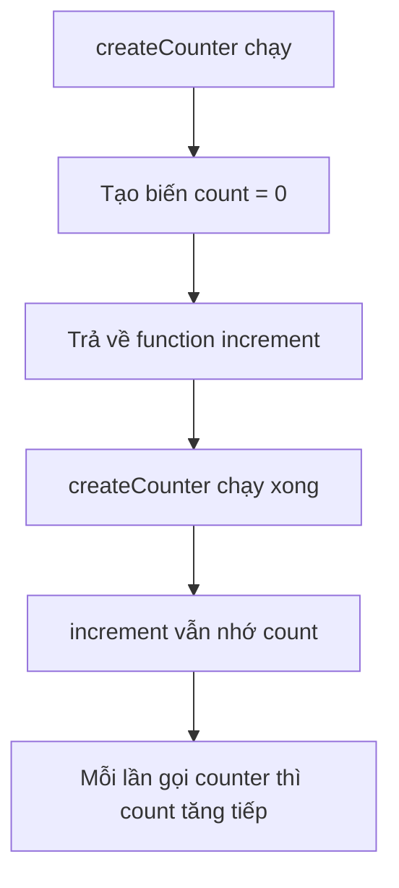

### Trả lời dễ hiểu

Closure hiểu đơn giản là: **một function có thể nhớ những biến xung quanh nó tại nơi nó được tạo ra**.

Anh có thể tưởng tượng function con giống như được cầm theo một cuốn sổ nhỏ. Trong cuốn sổ đó có ghi lại các biến mà nó cần dùng từ function cha. Dù function cha đã chạy xong, function con vẫn còn cuốn sổ đó, nên vẫn đọc và sửa được những biến liên quan.

Ví dụ `createCounter()` tạo ra biến `count = 0`, rồi trả về function `increment`. Sau khi `createCounter()` chạy xong, bình thường mình nghĩ biến `count` phải biến mất. Nhưng vì function `increment` vẫn cần dùng `count`, JavaScript giữ biến đó lại trong closure.

Vì vậy khi gọi:

```js
const counter = createCounter();
counter(); // 1
counter(); // 2
counter(); // 3
```

Ba lần gọi trên không tạo lại `count` từ đầu. Chúng đang dùng lại **cùng một biến `count` đã được nhớ lại**. Đây chính là closure.

Closure rất hữu ích khi cần giữ dữ liệu riêng tư mà bên ngoài không đụng trực tiếp được. Ví dụ counter, debounce/throttle, event handler, module pattern. Nhưng trong React, closure cũng có thể gây lỗi `stale closure` nếu callback đang nhớ state/props của render cũ.

### Giải thích chuyên sâu

- `Lexical scope` - scope được xác định theo vị trí code khi viết.
- `Environment record` - nơi JS engine lưu binding của scope.
- `Private state` - trạng thái kín, chỉ function bên trong truy cập được.
- `Stale closure` - callback giữ giá trị cũ của biến từ một lần render/chạy trước.

### Ví dụ / Case thực tế

```js
function createCounter() {
  let count = 0;

  return function increment() {
    count += 1;
    return count;
  };
}

const counter = createCounter();
counter(); // 1
counter(); // 2
```

Đi từng bước:

| Bước | Chuyện xảy ra | Ý nghĩa |
|---|---|---|
| 1 | Gọi `createCounter()` | Tạo scope mới |
| 2 | `let count = 0` | Biến `count` nằm trong scope của `createCounter` |
| 3 | Return `increment` | Function `increment` được đưa ra ngoài |
| 4 | `createCounter()` kết thúc | Scope cha đáng lẽ không còn dùng nữa |
| 5 | Gọi `counter()` | `increment` vẫn nhớ và cập nhật được `count` |

Ví dụ gần đời thực hơn:

```js
function createGreeting(name) {
  return function sayHello() {
    console.log(`Hello ${name}`);
  };
}

const helloAnh = createGreeting("Anh");
helloAnh(); // Hello Anh
```

Ở đây `sayHello` vẫn nhớ biến `name`, dù `createGreeting("Anh")` đã chạy xong.

### Bảng ứng dụng

| Ứng dụng | Closure giúp gì |
|---|---|
| Event handler | Nhớ data tại thời điểm tạo handler |
| Debounce/throttle | Giữ timer id giữa các lần gọi |
| Module/private state | Ẩn biến nội bộ |
| React hooks | Callback có thể giữ state/props theo render |

### Bảng hiểu sai vs hiểu đúng

| Hiểu sai | Hiểu đúng |
|---|---|
| Function cha chạy xong thì mọi biến bên trong mất hết | Nếu function con còn dùng biến đó, JS giữ biến lại trong closure |
| Closure là khái niệm chỉ dùng trong câu hỏi phỏng vấn | Closure xuất hiện hằng ngày trong callback, event, timer, hooks |
| Mỗi lần gọi function returned là tạo lại biến từ đầu | Nếu cùng một returned function, nó dùng lại cùng closure |
| Closure luôn tốt | Closure có thể giữ data cũ hoặc giữ reference gây leak nếu dùng sai |

### Senior follow-up

- Stale closure trong React xảy ra khi nào?
- Closure có thể gây memory leak không?
- Vì sao `var` trong loop kết hợp closure thường gây bug?
- Vì sao mỗi lần gọi `createCounter()` lại tạo ra một closure riêng?
- Closure khác global variable ở điểm nào?

### Kết luận dễ nhớ

<span style="color: red; font-weight: 700;">Closure là function nhớ được biến xung quanh nó, kể cả khi scope bên ngoài đã chạy xong.</span>

## Câu 7: Giải thích event loop và call stack trong JavaScript

### Hình ảnh / Sơ đồ

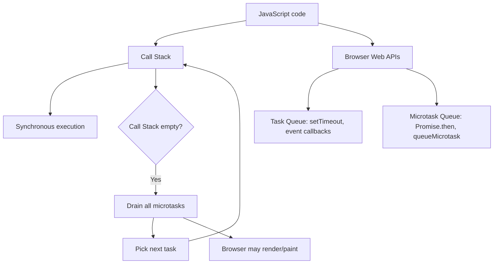

### Trả lời dễ hiểu

JavaScript chạy code chính trên một main thread. Khi một function được gọi, nó được đưa vào Call Stack. Function đang nằm trên đỉnh stack sẽ chạy cho đến khi xong, rồi bị pop ra khỏi stack. Vì vậy code đồng bộ chạy theo thứ tự rõ ràng và không bị chen ngang giữa chừng.

Nhưng browser còn có nhiều việc bất đồng bộ như timer, click event, fetch, Promise. Những việc này không chạy ngay lập tức trong call stack. Browser hoặc runtime ghi nhận chúng, sau đó đưa callback vào hàng đợi phù hợp: task queue cho `setTimeout`/event, microtask queue cho `Promise.then`/`queueMicrotask`.

Event Loop là cơ chế liên tục kiểm tra: khi Call Stack rỗng, nó sẽ xử lý hết microtask trước, rồi mới lấy task tiếp theo. Vì vậy trong ví dụ phổ biến, `Promise.then` chạy trước `setTimeout(..., 0)`. Sau khi task và microtask xử lý xong, browser mới có cơ hội render/paint frame tiếp theo.

### Giải thích chuyên sâu

- `Call Stack` - ngăn xếp lời gọi hàm, function nào đang chạy sẽ nằm trên stack.
- `Event Loop` - vòng lặp điều phối stack, queue và rendering.
- `Task/Macrotask` - callback từ `setTimeout`, `setInterval`, DOM event, network event.
- `Microtask` - callback từ `Promise.then`, `queueMicrotask`, `MutationObserver`.
- `Run-to-completion` - một function đã vào call stack thì chạy xong mới nhường quyền.

### Ví dụ / Case thực tế

```js
console.log("A");

setTimeout(() => {
  console.log("B");
}, 0);

Promise.resolve().then(() => {
  console.log("C");
});

console.log("D");
```

Output:

```text
A
D
C
B
```

Lý do:

| Bước | Giải thích |
|---|---|
| `A` | Code sync chạy ngay trên call stack |
| `D` | `setTimeout` và `Promise.then` chỉ đăng ký callback, sync code chạy tiếp |
| `C` | Microtask của Promise chạy sau khi stack rỗng |
| `B` | Task từ `setTimeout` chạy sau microtask |

### Bảng so sánh task và microtask

| Tiêu chí | Task/Macrotask | Microtask |
|---|---|---|
| Ví dụ | `setTimeout`, click event, message event | `Promise.then`, `queueMicrotask` |
| Thời điểm chạy | Một task mỗi vòng event loop | Drain hết sau task hiện tại |
| Ưu tiên | Sau microtask | Trước task tiếp theo |
| Rủi ro | Task dài gây long task | Microtask tạo thêm microtask có thể starvation |

### Senior follow-up

- Vì sao Promise chạy trước `setTimeout(..., 0)`?
- Microtask starvation là gì và vì sao làm UI không kịp paint?
- `async/await` liên quan gì đến microtask?
- Event loop ảnh hưởng INP và rendering frame như thế nào?
- Làm sao chia nhỏ CPU-heavy work để không block main thread?

### Kết luận dễ nhớ

<span style="color: red; font-weight: 700;">Call stack chạy code hiện tại, event loop quyết định callback nào được chạy tiếp theo.</span>

## Câu 8: Event loop ảnh hưởng rendering frame như thế nào?

### Hình ảnh / Sơ đồ

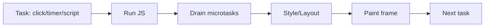

### Trả lời dễ hiểu

Browser không thể vừa chạy JavaScript dài vừa render frame mượt trên cùng main thread. Mỗi vòng event loop thường chạy một task JavaScript, xử lý microtasks, rồi browser mới có cơ hội style/layout/paint.

Nếu một task JavaScript chạy quá lâu, ví dụ sort list lớn hoặc render quá nhiều component, browser không kịp paint frame tiếp theo. User sẽ thấy input lag, animation giật, hoặc click phản hồi chậm. Nếu microtask queue liên tục có thêm Promise callback, browser cũng có thể bị trì hoãn render.

Vì vậy event loop ảnh hưởng trực tiếp đến INP và responsiveness. Muốn UI mượt thì phải chia nhỏ CPU-heavy work, giảm long task, tránh microtask starvation, và nhường main thread cho browser có cơ hội paint.

### Giải thích chuyên sâu

- `Task/Macrotask` - script, event, timer callback.
- `Microtask` - Promise callback, `queueMicrotask`, MutationObserver.
- `Frame budget` - khoảng 16.67ms để đạt 60 FPS.

### Senior follow-up

- Promise chain dài ảnh hưởng paint thế nào?
- Vì sao `setTimeout(0)` có thể giúp nhường frame?

### Kết luận dễ nhớ

<span style="color: red; font-weight: 700;">Main thread bận thì browser không kịp vẽ.</span>

## Câu 9: Microtask starvation là gì?

### Hình ảnh / Sơ đồ

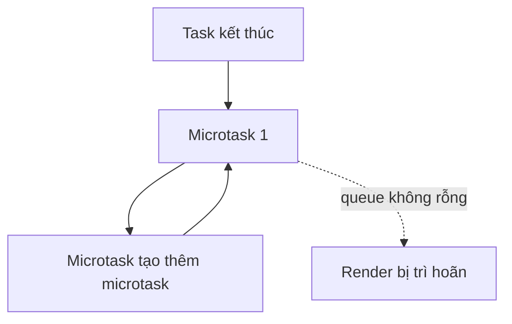

### Trả lời dễ hiểu

Microtask starvation là tình huống microtask queue không bao giờ rỗng hoặc rỗng quá muộn vì microtask liên tục tạo thêm microtask mới. Browser phải xử lý hết microtask trước khi chuyển sang task tiếp theo hoặc render, nên UI có thể bị đứng.

Điều này nguy hiểm vì code nhìn có vẻ async, ví dụ Promise chain, nhưng thực tế vẫn chiếm quyền liên tục. User click hoặc timer callback có thể không được xử lý đúng lúc, frame không được paint, và trang trông như bị freeze.

Cách xử lý là không nhồi quá nhiều việc vào microtask. Với work dài, hãy chia nhỏ bằng task mới như `setTimeout`, `scheduler.postTask`, `requestIdleCallback` khi phù hợp, hoặc đưa CPU-heavy work sang Web Worker.

### Giải thích chuyên sâu

- `Starvation` - một loại công việc chiếm quyền khiến công việc khác không được chạy.
- `Promise recursion` - promise callback tự xếp thêm promise callback.
- `Yield to browser` - nhường quyền bằng task mới như `setTimeout`, `scheduler.postTask`, hoặc chia nhỏ work.

### Case Senior hay hỏi: Promise callback liên tục tạo Promise mới thì task queue bị gì?

Promise callback như `.then()`, `.catch()`, `.finally()` không chạy trong task queue bình thường. Chúng chạy trong **microtask queue**. Browser thường xử lý hết microtask hiện tại trước khi quay lại event loop để chạy task tiếp theo như `setTimeout`, click event, network callback hoặc render frame.

Nếu một Promise callback liên tục tạo Promise mới, nó có thể làm microtask queue cứ đầy mãi. Khi đó task queue không có cơ hội chạy đúng lúc, browser cũng không có cơ hội paint frame mới. Kết quả là UI bị đơ dù code nhìn có vẻ "async".

Ví dụ nguy hiểm:

```js
function loop() {
  Promise.resolve().then(loop);
}

loop();
```

Đoạn code trên liên tục xếp thêm microtask mới. Vì microtask cứ sinh thêm microtask, browser có thể bị kẹt ở vòng xử lý microtask, khiến `setTimeout`, click event hoặc render bị trì hoãn.

Nếu cần xử lý nhiều việc, đừng đẩy tất cả vào Promise chain vô hạn. Hãy chia nhỏ bằng task mới:

```js
function processChunk() {
  doSmallWork();

  if (hasMoreWork()) {
    setTimeout(processChunk, 0);
  }
}
```

`setTimeout` đưa phần tiếp theo sang task queue, giúp browser có cơ hội xử lý input và paint giữa các chunk.

### Senior follow-up

- Vì sao `await` trong loop chưa chắc nhường browser paint?
- Dùng microtask để batch update có rủi ro gì?
- Promise callback liên tục tạo Promise mới có làm `setTimeout` bị chạy trễ không?

### Kết luận dễ nhớ

<span style="color: red; font-weight: 700;">Microtask quá tham sẽ làm browser đói frame.</span>

## Câu 10: Promise, async/await, fetch, AJAX là gì và làm sao tránh Promise Hell?

### Hình ảnh / Sơ đồ

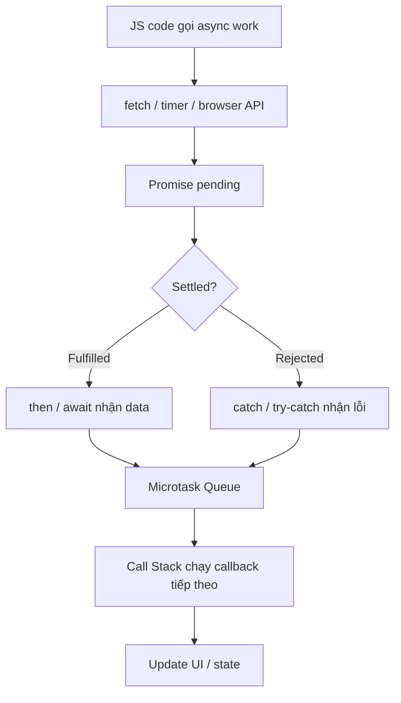

### Trả lời dễ hiểu

`Promise` là một object đại diện cho kết quả của một việc bất đồng bộ trong tương lai. Lúc mới tạo, Promise thường ở trạng thái `pending`. Khi việc async xong, nó chuyển thành `fulfilled` nếu thành công hoặc `rejected` nếu thất bại.

`async/await` không phải cơ chế async mới thay thế Promise. Nó là cú pháp giúp viết code dùng Promise theo kiểu dễ đọc hơn, giống code chạy tuần tự từ trên xuống. Một function có `async` luôn trả về Promise. Khi gặp `await`, function tạm dừng phần còn lại, nhường quyền cho call stack, và chạy tiếp khi Promise settle.

`fetch` là Web API hiện đại để gọi HTTP request trong browser. `fetch()` trả về Promise. `AJAX` là khái niệm rộng hơn: gọi request bất đồng bộ để lấy/gửi dữ liệu mà không reload toàn bộ page. Trước đây AJAX hay gắn với `XMLHttpRequest` hoặc jQuery, còn hiện nay thường dùng `fetch` hoặc thư viện như Axios.

`Promise Hell` xảy ra khi code async bị lồng nhiều tầng `.then()` hoặc callback, làm flow khó đọc, khó bắt lỗi, khó reuse. Cách tránh là return Promise đúng cách, flatten chain, dùng `async/await`, tách logic thành function nhỏ, và dùng `Promise.all` hoặc `Promise.allSettled` khi nhiều request chạy song song.

### Giải thích chuyên sâu

- `Promise` - object biểu diễn kết quả async, có trạng thái `pending`, `fulfilled`, `rejected`.
- `resolve` - hoàn tất Promise thành công.
- `reject` - hoàn tất Promise thất bại.
- `async function` - function luôn trả về Promise.
- `await` - chờ Promise settle rồi lấy fulfilled value hoặc throw rejected reason.
- `fetch` - Web API gọi HTTP request, trả về Promise chứa `Response`.
- `AJAX (Asynchronous JavaScript and XML)` - kỹ thuật request bất đồng bộ không reload page.
- `Promise Hell` - code async lồng nhiều tầng làm khó đọc và khó quản lý lỗi.

### Bảng so sánh

| Khái niệm | Là gì? | Dùng khi |
|---|---|---|
| `Promise` | Primitive để biểu diễn kết quả async | Khi cần chain, compose, hoặc return async result |
| `async/await` | Cú pháp đọc Promise dễ hơn | Khi muốn code async nhìn giống flow tuần tự |
| `fetch` | Browser API để gọi HTTP | Khi cần gọi REST/API/file/resource |
| `AJAX` | Khái niệm request async không reload page | Khi mô tả pattern giao tiếp client-server |

### async/await thực chất liên quan thế nào tới Promise và microtask?

`async/await` là cú pháp viết trên nền Promise. Nó không tạo ra một loại async mới.

Có 3 ý cần nhớ:

1. Function có `async` luôn trả về Promise.
2. `await promise` tạm dừng phần code phía sau trong chính async function đó.
3. Khi Promise settle, phần code sau `await` được xếp chạy tiếp như một microtask.

Ví dụ:

```js
async function run() {
  console.log("A");
  await Promise.resolve();
  console.log("B");
}

run();
console.log("C");
```

Thứ tự log:

```txt
A
C
B
```

Vì `console.log("A")` chạy ngay. Gặp `await`, function `run` tạm dừng phần còn lại. Code bên ngoài tiếp tục chạy nên in `C`. Sau đó Promise đã resolve, phần sau `await` được đưa vào microtask, rồi mới in `B`.

Điều này cũng giải thích vì sao `await` không block toàn bộ main thread. Nó chỉ tạm dừng async function hiện tại. Nhưng nếu sau `await` anh chạy một đoạn CPU-heavy quá dài, UI vẫn có thể lag vì đoạn đó vẫn chạy trên main thread.

### Bảng hiểu nhanh

| Câu hỏi | Trả lời |
|---|---|
| `async function` trả về gì? | Luôn trả về Promise |
| `await` có chờ Promise không? | Có, nhưng chỉ dừng async function hiện tại |
| Code sau `await` chạy khi nào? | Khi Promise settle, thường qua microtask |
| `await` có block main thread không? | Không trong lúc chờ, nhưng code sau await vẫn có thể block nếu quá nặng |

### Ví dụ Promise Hell

```js
getUser(userId).then((user) => {
  getOrders(user.id).then((orders) => {
    getOrderDetail(orders[0].id).then((detail) => {
      getShippingStatus(detail.shippingId).then((status) => {
        console.log(status);
      });
    });
  });
});
```

Code trên khó đọc vì mỗi bước bị lồng sâu thêm một tầng. Nếu cần bắt lỗi riêng từng bước hoặc thêm điều kiện rẽ nhánh, code sẽ rất nhanh rối.

### Cách tránh Promise Hell

#### 1. Return Promise để flatten chain

```js
getUser(userId)
  .then((user) => getOrders(user.id))
  .then((orders) => getOrderDetail(orders[0].id))
  .then((detail) => getShippingStatus(detail.shippingId))
  .then((status) => {
    console.log(status);
  })
  .catch((error) => {
    console.error(error);
  });
```

#### 2. Dùng async/await để flow dễ đọc hơn

```js
async function loadShippingStatus(userId) {
  try {
    const user = await getUser(userId);
    const orders = await getOrders(user.id);
    const detail = await getOrderDetail(orders[0].id);
    const status = await getShippingStatus(detail.shippingId);

    return status;
  } catch (error) {
    console.error(error);
    throw error;
  }
}
```

#### 3. Dùng Promise.all khi các request độc lập

```js
async function loadDashboard() {
  const [profile, notifications, settings] = await Promise.all([
    fetchProfile(),
    fetchNotifications(),
    fetchSettings(),
  ]);

  return { profile, notifications, settings };
}
```

### Lưu ý quan trọng về fetch

```js
async function getUser(id) {
  const response = await fetch(`/api/users/${id}`);

  if (!response.ok) {
    throw new Error(`Request failed: ${response.status}`);
  }

  return response.json();
}
```

`fetch` chỉ reject khi có lỗi network hoặc request bị abort. Nếu server trả HTTP `400`, `404`, `500`, Promise của `fetch` vẫn có thể fulfilled, nên cần tự check `response.ok`.

### Senior follow-up

- `await` có block main thread không?
- Vì sao `fetch` HTTP 500 không tự đi vào `catch`?
- Khi nào dùng `Promise.all`, `Promise.allSettled`, `Promise.race`, `Promise.any`?
- Error handling nên đặt ở từng function hay một tầng service/API client chung?
- Làm sao cancel request bằng `AbortController`?
- Promise callback chạy ở task queue hay microtask queue?
- Vì sao `await Promise.resolve()` vẫn chạy sau synchronous code hiện tại?

### Kết luận dễ nhớ

<span style="color: red; font-weight: 700;">Promise quản lý kết quả async, async/await làm code dễ đọc, fetch gọi API, và tránh Promise Hell bằng cách flatten flow.</span>

## Câu 11: Race condition trong async request thường xảy ra thế nào?

### Hình ảnh / Sơ đồ

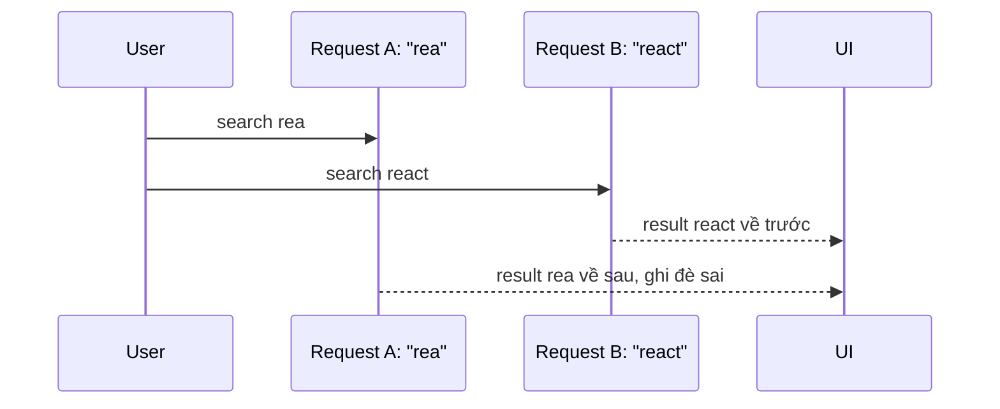

### Trả lời dễ hiểu

Race condition trong async request xảy ra khi nhiều request cùng tồn tại, nhưng response về không theo thứ tự mình mong muốn. Frontend thường giả định request gửi sau sẽ về sau, nhưng network không đảm bảo điều đó.

Ví dụ user gõ “rea” rồi gõ tiếp “react”. Request “react” có thể về trước và render result đúng. Sau đó request “rea” cũ về muộn hơn và ghi đè UI bằng result sai. User nhìn thấy kết quả không khớp keyword hiện tại.

Cách xử lý là mỗi request phải có quyền cập nhật rõ ràng. Hoặc abort request cũ, hoặc dùng request id/latest token để chỉ response mới nhất được update state. Với React Query, query key theo keyword giúp tách cache và quản lý lifecycle tốt hơn.

### Giải thích chuyên sâu

- `Out-of-order response` - response về không theo thứ tự gửi.
- `Stale closure` - callback giữ state/props cũ.
- `Idempotency` - thao tác lặp lại không gây sai trạng thái.

### Senior follow-up

- Mutation double-submit xử lý thế nào?
- Optimistic update rollback khi request fail ra sao?

### Kết luận dễ nhớ

<span style="color: red; font-weight: 700;">Async không đảm bảo request gửi trước sẽ về trước.</span>

## Câu 12: Cancel hoặc ignore request cũ khi user search nhanh thế nào?

### Hình ảnh / Sơ đồ

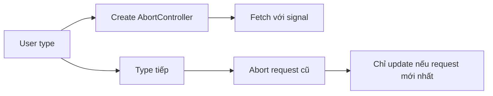

### Trả lời dễ hiểu

Khi user search nhanh, request cũ thường không còn giá trị với UI hiện tại. Nếu vẫn để nó update state, app có thể hiển thị kết quả sai hoặc nhấp nháy.

Có hai hướng xử lý. Một là cancel request cũ bằng `AbortController`, truyền `signal` vào `fetch`, và gọi `abort()` khi keyword đổi. Hai là không cancel network nhưng ignore response cũ bằng request id: chỉ id mới nhất được quyền cập nhật UI.

Cancel giúp tiết kiệm tài nguyên nếu backend/client hỗ trợ. Ignore vẫn cần thiết trong một số trường hợp vì abort phía client không luôn đảm bảo backend đã dừng xử lý. Production thường kết hợp debounce, abort và latest-wins guard.

### Giải thích chuyên sâu

- `AbortSignal` - tín hiệu truyền vào fetch để hủy request.
- `Latest wins` - chỉ response mới nhất được quyền update UI.
- `Debounced query` - giảm số request gửi đi.

### Ví dụ / Case thực tế

```ts
const controller = new AbortController();
fetch(`/api/search?q=${q}`, { signal: controller.signal });
controller.abort();
```

### Senior follow-up

- Abort request có đảm bảo backend dừng xử lý không?
- Khi nào nên cancel, khi nào chỉ ignore?

### Kết luận dễ nhớ

<span style="color: red; font-weight: 700;">Search nhanh thì request cũ phải bị hủy hoặc mất quyền update.</span>

## Câu 13: Debounce và Throttle là gì? Khi nào nên dùng?

### Hình ảnh / Sơ đồ

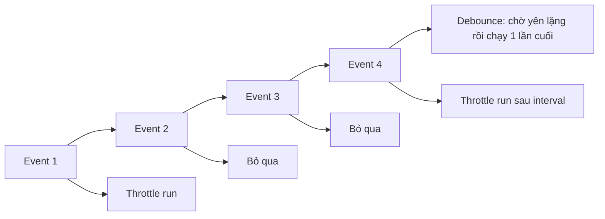

### Trả lời dễ hiểu

`Debounce` và `Throttle` đều dùng để kiểm soát một function bị gọi quá nhiều lần trong thời gian ngắn. Chúng hay dùng với search input, scroll, resize, mousemove, autosave hoặc tracking event.

`Debounce` nghĩa là: chỉ chạy function sau khi event đã ngừng xảy ra trong một khoảng thời gian. Ví dụ user đang gõ vào ô search, ta không nên gọi API theo từng ký tự. Ta đợi user ngừng gõ khoảng 300ms rồi mới search. Nếu user tiếp tục gõ, timer được reset.

`Throttle` nghĩa là: cho phép function chạy tối đa một lần trong mỗi khoảng thời gian cố định. Ví dụ user scroll liên tục, ta không cần xử lý scroll event 100 lần/giây. Ta chỉ xử lý mỗi 100ms một lần, để UI nhẹ hơn nhưng vẫn cập nhật đều.

Nói dễ nhớ: debounce phù hợp khi chỉ cần kết quả cuối cùng sau một chuỗi event; throttle phù hợp khi cần cập nhật đều đều trong lúc event vẫn đang diễn ra.

### Giải thích chuyên sâu

- `Debounce` - trì hoãn gọi function cho đến khi event ngừng trong một khoảng delay.
- `Throttle` - giới hạn tần suất gọi function tối đa một lần trong một khoảng interval.
- `Leading call` - gọi ngay ở đầu chuỗi event.
- `Trailing call` - gọi ở cuối chuỗi event.
- `Rate limiting` - giới hạn tần suất xử lý để bảo vệ UI, browser hoặc backend.

### Bảng so sánh

| Tiêu chí | Debounce | Throttle |
|---|---|---|
| Cách hoạt động | Reset timer mỗi lần event xảy ra | Chạy tối đa 1 lần mỗi interval |
| Khi nào chạy | Sau khi user ngừng trigger | Trong lúc event vẫn diễn ra |
| Phù hợp | Search input, autosave sau khi ngừng gõ, validate form | Scroll, resize, mousemove, drag, tracking |
| Mục tiêu | Lấy kết quả cuối cùng | Giữ update đều nhưng không quá dày |
| Rủi ro | Delay quá dài làm UI phản hồi chậm | Interval quá dài làm UI cập nhật giật |

### Ví dụ Debounce

```js
function debounce(fn, delay) {
  let timerId;

  return function (...args) {
    clearTimeout(timerId);

    timerId = setTimeout(() => {
      fn.apply(this, args);
    }, delay);
  };
}

const search = debounce((keyword) => {
  fetch(`/api/search?q=${keyword}`);
}, 300);

search("r");
search("re");
search("rea");
search("react"); // Chỉ request "react" sau khi ngừng gõ 300ms
```

### Ví dụ Throttle

```js
function throttle(fn, interval) {
  let lastRun = 0;

  return function (...args) {
    const now = Date.now();

    if (now - lastRun >= interval) {
      lastRun = now;
      fn.apply(this, args);
    }
  };
}

const handleScroll = throttle(() => {
  console.log(window.scrollY);
}, 100);

window.addEventListener("scroll", handleScroll);
```

### Lưu ý khi dùng trong React

Trong React, vấn đề hay gặp là tạo lại debounced/throttled function ở mỗi render. Nếu function bị tạo lại liên tục, timer bên trong cũng bị reset và debounce/throttle không hoạt động như mong muốn.

Nên giữ function ổn định bằng `useMemo`, `useCallback` hoặc `useRef`, đồng thời cleanup timer/listener khi component unmount.

```tsx
function SearchBox() {
  const debouncedSearch = useMemo(
    () =>
      debounce((keyword: string) => {
        fetch(`/api/search?q=${keyword}`);
      }, 300),
    []
  );

  return (
    <input
      onChange={(event) => {
        debouncedSearch(event.target.value);
      }}
    />
  );
}
```

Nếu callback cần đọc state mới nhất, phải cẩn thận `stale closure`. Khi logic phức tạp, có thể dùng custom hook `useDebouncedCallback` hoặc thư viện đã xử lý cleanup/leading/trailing tốt.

### Khi nào nên dùng?

| Tình huống | Nên dùng | Lý do |
|---|---|---|
| User gõ search keyword | Debounce | Chỉ cần search khi user tạm ngừng gõ |
| Validate form sau khi nhập | Debounce | Tránh validate quá dày |
| Autosave draft | Debounce | Lưu sau khi user ngừng chỉnh |
| Scroll position tracking | Throttle | Cần cập nhật đều trong lúc scroll |
| Resize window | Throttle hoặc Debounce | Throttle nếu cần live update, debounce nếu chỉ cần kết quả cuối |
| Drag/mousemove | Throttle hoặc `requestAnimationFrame` | Giữ UI mượt theo frame |

### Senior follow-up

- Debounce `leading` và `trailing` khác nhau thế nào?
- Khi nào dùng throttle bằng `requestAnimationFrame` thay vì `setTimeout`?
- Debounce khác `useDeferredValue` ở điểm nào?
- Debounce search có cần cancel request cũ không?
- Làm sao test debounce/throttle bằng fake timers?

### Kết luận dễ nhớ

<span style="color: red; font-weight: 700;">Debounce chờ event ngừng rồi chạy, throttle cho chạy đều nhưng giới hạn tần suất.</span>

## Câu 14: Garbage Collector biết object nào có thể xóa bằng cách nào?

### Hình ảnh / Sơ đồ

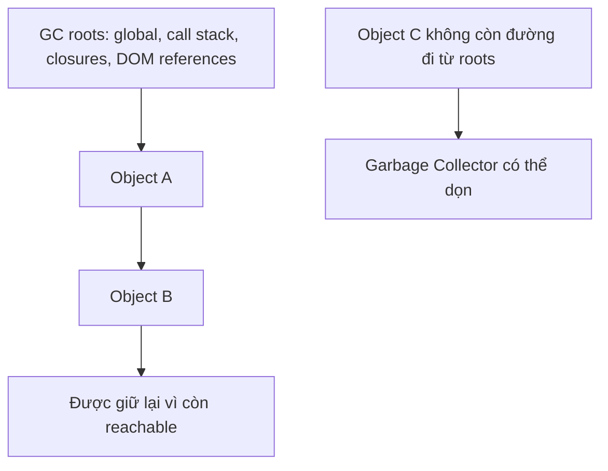

### Trả lời dễ hiểu

Garbage Collector, thường gọi tắt là `GC`, là cơ chế tự dọn memory của JavaScript engine. Nó không hỏi "object này còn cần về mặt nghiệp vụ không?". Nó chỉ hỏi: **từ các điểm gốc còn sống, có còn đường reference nào đi tới object này không?**

Các điểm gốc, hay `GC roots`, thường gồm global object, biến đang nằm trên call stack, closure còn sống, DOM node còn được giữ, event listener, timer, store/cache. Nếu object còn đi tới được từ những điểm này, object được xem là `reachable` - còn với tới được - nên chưa bị xóa.

Nếu không còn đường reference nào từ roots tới object, object được xem là unreachable. Khi GC chạy, object đó có thể bị dọn. Vì vậy memory leak xảy ra khi object đáng lẽ không cần nữa nhưng vẫn còn một reference giữ nó lại.

### Giải thích chuyên sâu

- `Garbage Collector (GC)` - bộ dọn memory tự động của JS engine.
- `Reachable object` - object còn được đi tới từ một root reference.
- `Unreachable object` - object không còn đường reference từ roots, có thể bị dọn.
- `Mark-and-sweep` - thuật toán phổ biến: đánh dấu object còn reachable, rồi dọn phần không được đánh dấu.
- `Retaining path` - đường reference khiến object chưa được GC.

### Ví dụ / Case thực tế

```js
let user = { name: "Anh", profile: { age: 30 } };

user = null;
```

Sau khi `user = null`, nếu không còn biến/cache/listener nào khác giữ object ban đầu, object `{ name, profile }` không còn reachable nữa. GC có thể dọn nó ở một thời điểm sau đó.

Nhưng nếu còn reference khác:

```js
const cache = [];
let user = { name: "Anh", profile: { age: 30 } };

cache.push(user);
user = null;
```

Object user vẫn chưa dọn được vì `cache[0]` còn giữ reference tới nó.

### Bảng dễ nhớ

| Tình huống | GC có dọn được không? | Vì sao |
|---|---|---|
| Object không còn biến/listener/cache nào giữ | Có thể | Không còn reachable |
| Object còn trong global store | Chưa | Store vẫn giữ reference |
| Object bị closure còn sống giữ | Chưa | Closure là đường retaining path |
| Object trong event listener chưa remove | Chưa | Listener vẫn được browser giữ |

### Senior follow-up

- Vì sao set biến về `null` không luôn giải quyết memory leak?
- Retaining path trong heap snapshot giúp debug gì?
- Vòng tham chiếu có luôn gây leak không?
- Vì sao cache cần eviction policy?

### Kết luận dễ nhớ

<span style="color: red; font-weight: 700;">GC dọn object không còn reachable; leak xảy ra khi object không dùng nữa nhưng vẫn còn đường reference giữ lại.</span>

## Câu 15: WeakMap khác Map ở đâu? Vì sao WeakMap giúp tránh leak và vì sao không iterate được?

### Hình ảnh / Sơ đồ

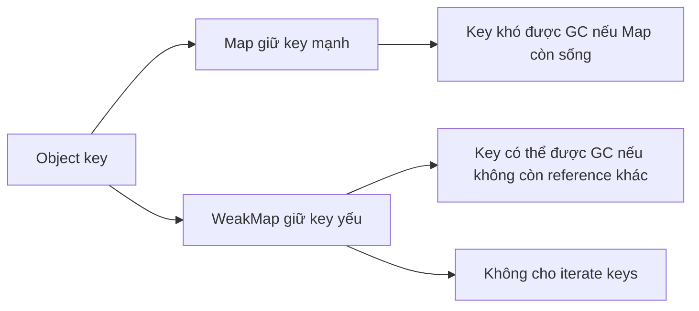

### Trả lời dễ hiểu

`Map` và `WeakMap` đều lưu dữ liệu theo dạng key/value. Khác biệt quan trọng nhất là: `Map` giữ key bằng strong reference, còn `WeakMap` giữ key object theo cách không ngăn Garbage Collector dọn key đó.

Nếu anh dùng `Map` để gắn metadata cho DOM node, component instance hoặc object tạm, Map có thể giữ object đó sống mãi nếu không xóa entry. Đây là nguồn leak hay gặp.

`WeakMap` phù hợp khi dữ liệu chỉ có ý nghĩa nếu object key còn sống. Khi object key không còn được reference ở nơi khác, GC có thể dọn key và entry liên quan. Vì vậy WeakMap hay dùng để lưu metadata private cho object, cache phụ theo object hoặc tránh giữ DOM node cũ quá lâu.

WeakMap không iterate được, không có `.keys()`, `.values()`, `.entries()` và không biết `.size`. Lý do là nếu cho iterate, code có thể quan sát key nào đã bị GC dọn, trong khi thời điểm GC chạy là không deterministic - không đoán trước được. JavaScript cố tình không cho quan sát chuyện đó.

### Giải thích chuyên sâu

- `Strong reference` - reference đủ mạnh để giữ object không bị GC.
- `Weak reference` - reference yếu, không ngăn object bị GC.
- `WeakMap key` - phải là object hoặc non-registered symbol có thể được garbage collect.
- `Non-deterministic GC` - thời điểm GC chạy không cố định và không nên phụ thuộc vào logic app.

### Bảng so sánh

| Tiêu chí | Map | WeakMap |
|---|---|---|
| Key có thể là gì? | Object hoặc primitive | Chủ yếu object |
| Có giữ key sống không? | Có, strong reference | Không ngăn key bị GC |
| Iterate được không? | Có `.keys()`, `.values()`, `.entries()` | Không |
| Có `.size` không? | Có | Không |
| Dùng tốt cho | Collection cần duyệt | Metadata/cache theo object |
| Rủi ro leak | Cao hơn nếu quên delete | Thấp hơn với object key tạm |

### Ví dụ / Case thực tế

```js
const metadata = new WeakMap();

function registerElement(element) {
  metadata.set(element, {
    createdAt: Date.now(),
  });
}
```

Nếu `element` bị xóa khỏi DOM và không còn reference nào khác giữ nó, entry trong WeakMap không ngăn GC dọn element đó.

Với `Map`, anh phải tự delete:

```js
const metadata = new Map();

metadata.set(element, { createdAt: Date.now() });
metadata.delete(element);
```

Nếu quên `delete`, `metadata` vẫn giữ `element`, làm element khó được dọn.

### Senior follow-up

- Vì sao WeakMap không có `.size`?
- Vì sao WeakMap không iterate được?
- WeakMap có thay thế Map hoàn toàn không?
- Khi nào dùng WeakSet?

### Kết luận dễ nhớ

<span style="color: red; font-weight: 700;">Map giữ key sống, WeakMap không ngăn key object bị GC; vì GC không đoán trước được nên WeakMap không cho iterate.</span>

## Câu 16: Shallow copy, deep copy, spread object và structuredClone() khác nhau thế nào?

### Hình ảnh / Sơ đồ

```mermaid
flowchart TD
  Original[Original object] --> Nested[Nested object]
  Shallow[Shallow copy] --> Nested
  Deep[Deep copy] --> NewNested[New nested object]
  Spread[{...object}] --> Shallow
  Structured[structuredClone] --> Deep
```

### Trả lời dễ hiểu

`Shallow copy` là copy lớp ngoài cùng của object/array. Nếu bên trong có object con, bản copy và bản gốc vẫn trỏ tới cùng object con đó.

`Deep copy` là copy sâu cả object con bên trong, để bản copy và bản gốc không dùng chung nested object. Khi sửa object con trong bản copy, bản gốc không bị ảnh hưởng.

`{ ...object }` chỉ là shallow copy. Nó tạo object mới ở lớp ngoài, nhưng các property dạng object/array/function bên trong vẫn là reference cũ.

`structuredClone()` là Web API giúp deep clone nhiều kiểu dữ liệu tốt hơn JSON trick. Nó xử lý được object lồng nhau, array, Date, Map, Set, ArrayBuffer và circular reference. Nhưng nó không clone được function, DOM node, một số object không serializable. Nếu gặp dữ liệu không clone được, nó có thể throw `DataCloneError`.

### Giải thích chuyên sâu

- `Shallow copy` - copy nông, chỉ copy tầng đầu.
- `Deep copy` - copy sâu cả các object/array lồng nhau.
- `Reference` - biến/property trỏ tới cùng object trong memory.
- `structuredClone()` - API dùng structured clone algorithm để deep clone dữ liệu serializable.
- `Transferable object` - object như ArrayBuffer có thể chuyển quyền sở hữu thay vì clone.

### Ví dụ spread không phải deep clone

```js
const original = {
  name: "Anh",
  address: {
    city: "HCM",
  },
};

const copy = { ...original };

copy.address.city = "Da Nang";

console.log(original.address.city); // "Da Nang"
```

Vì `copy.address` và `original.address` đang trỏ tới cùng object con.

### Ví dụ structuredClone

```js
const original = {
  name: "Anh",
  address: {
    city: "HCM",
  },
};

const copy = structuredClone(original);

copy.address.city = "Da Nang";

console.log(original.address.city); // "HCM"
```

### Bảng so sánh

| Cách copy | Copy sâu không? | Ưu điểm | Hạn chế |
|---|---|---|---|
| `{ ...object }` | Không | Nhanh, đơn giản | Nested object vẫn dùng chung reference |
| `Array.prototype.slice()` | Không | Copy array tầng đầu | Object con vẫn dùng chung |
| `JSON.parse(JSON.stringify(obj))` | Có giới hạn | Dễ hiểu | Mất Date/undefined/function, lỗi với circular |
| `structuredClone(obj)` | Có, với dữ liệu cloneable | Hỗ trợ nhiều kiểu và circular reference | Không clone function/DOM node/non-serializable object |

### Senior follow-up

- Tại sao spread object không phải deep clone?
- Khi nào shallow copy là đủ trong React state update?
- `structuredClone()` có clone được function không?
- Vì sao deep clone lớn có thể ảnh hưởng performance?

### Kết luận dễ nhớ

<span style="color: red; font-weight: 700;">Spread chỉ copy tầng ngoài; muốn copy sâu dữ liệu cloneable thì dùng structuredClone, nhưng nó không clone được mọi thứ.</span>

## Câu 17: Memory leak trong SPA thường đến từ đâu?

### Hình ảnh / Sơ đồ

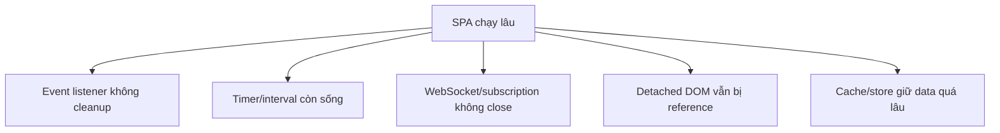

### Trả lời dễ hiểu

Memory leak trong SPA xảy ra khi user đã rời khỏi màn hình hoặc dữ liệu không còn cần nữa, nhưng JavaScript vẫn giữ reference khiến garbage collector không dọn được.

Nguồn leak hay gặp là event listener không remove, interval/timer không clear, WebSocket/subscription không close, observer không disconnect, closure giữ object lớn, detached DOM vẫn bị reference, hoặc cache/global store giữ data quá lâu.

SPA chạy lâu không reload trang như website truyền thống, nên leak nhỏ cũng có thể tích lũy qua nhiều giờ. Vì vậy mọi effect kết nối với hệ thống bên ngoài phải có cleanup, và cache phải có policy rõ ràng.

Closure cũng là một nguồn leak hay bị hỏi. Nếu một callback còn sống và callback đó "nhớ" một object rất lớn, object đó chưa thể bị garbage collector dọn. Ví dụ component đã unmount nhưng event listener chưa remove, listener vẫn giữ closure, closure giữ `bigData`, nên `bigData` vẫn còn trong memory.

### Giải thích chuyên sâu

- `Garbage collection` - cơ chế dọn object không còn reachable.
- `Retained object` - object vẫn bị reference nên không được dọn.
- `Detached DOM tree` - DOM node đã rời document nhưng JS vẫn giữ reference.

### Case Senior hay hỏi: closure giữ object lớn gây leak như thế nào?

```js
function setup() {
  const bigData = new Array(1_000_000).fill({ value: "heavy" });

  function onClick() {
    console.log(bigData.length);
  }

  window.addEventListener("click", onClick);
}

setup();
```

Trong ví dụ này, `onClick` là function closure. Nó nhớ biến `bigData`. Nếu không remove event listener, `window` vẫn giữ `onClick`, `onClick` vẫn giữ `bigData`, nên object lớn không được dọn dù `setup()` đã chạy xong.

Cách sửa:

```js
function setup() {
  const bigData = new Array(1_000_000).fill({ value: "heavy" });

  function onClick() {
    console.log(bigData.length);
  }

  window.addEventListener("click", onClick);

  return () => {
    window.removeEventListener("click", onClick);
  };
}

const cleanup = setup();
cleanup();
```

Trong React, tư duy tương tự: effect nào add listener/subscription/timer thì phải return cleanup.

### Senior follow-up

- React unmount có tự cleanup listener custom không?
- Cache policy cho dashboard realtime nên thiết kế thế nào?
- Closure giữ object lớn xuất hiện ở retaining path thì xử lý ra sao?

### Kết luận dễ nhớ

<span style="color: red; font-weight: 700;">Leak xảy ra khi thứ không dùng nữa vẫn còn bị giữ reference.</span>

## Câu 18: Debug memory leak trong Chrome DevTools thế nào?

### Hình ảnh / Sơ đồ

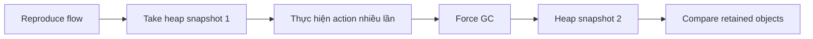

### Trả lời dễ hiểu

Debug memory leak cần chứng minh memory tăng và không giảm sau khi garbage collection, chứ không chỉ nhìn task manager thấy memory cao. Browser có thể giữ memory để tái sử dụng, nên phải đo đúng.

Cách làm là tạo flow reproduce, chụp heap snapshot ban đầu, thực hiện flow nhiều lần như mở/đóng modal hoặc navigate qua lại, force GC, rồi chụp snapshot sau. So sánh object nào tăng dần và xem retaining path để biết ai đang giữ reference.

Nếu object bị giữ bởi listener, store, closure hoặc detached DOM, đó là đầu mối sửa. Nếu memory tăng rồi giảm sau GC, có thể chỉ là memory bloat tạm thời chứ không phải leak thật.

### Giải thích chuyên sâu

- `Heap snapshot` - ảnh chụp object trong JS heap.
- `Retaining path` - đường reference khiến object chưa được GC.
- `Allocation instrumentation` - theo dõi object được cấp phát theo thời gian.

### Senior follow-up

- Làm sao phân biệt memory bloat và leak thật?
- Vì sao cần reproduce nhiều vòng navigation?

### Kết luận dễ nhớ

<span style="color: red; font-weight: 700;">Leak phải được chứng minh bằng object sống sót sau GC.</span>

---

# Phần 2: React

Phần React gom rendering, reconciliation, hooks và state. Mục tiêu là hiểu chính xác điều gì làm component render, khi nào memo có ích, và state nên đặt ở đâu.

## Câu 19: Phân biệt Props và State trong ReactJS?

### Hình ảnh / Sơ đồ

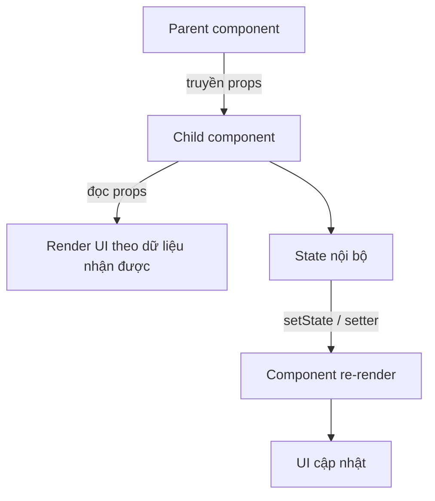

### Trả lời dễ hiểu

`Props` là dữ liệu component **nhận từ bên ngoài**, thường là từ parent truyền xuống. Props giống như tham số của một function: parent gọi component và đưa dữ liệu vào, component con đọc dữ liệu đó để render UI.

`State` là dữ liệu component **tự quản lý bên trong**. Khi state thay đổi bằng setter như `setCount`, React sẽ render lại component để UI phản ánh giá trị mới.

Ví dụ dễ hiểu: `UserCard` nhận `user` qua props để biết cần hiển thị ai. Nhưng việc mở/đóng phần chi tiết trong chính `UserCard` có thể là state nội bộ `isExpanded`. `user` đến từ cha, còn `isExpanded` do `UserCard` tự quản lý.

Điểm quan trọng: component không nên mutate props vì props thuộc quyền sở hữu của parent. Nếu child muốn thay đổi dữ liệu, child nên gọi callback được parent truyền xuống, ví dụ `onChange`, `onSelect`, `onSubmit`. Parent quyết định cập nhật state hay không.

### Giải thích chuyên sâu

- `Props` - dữ liệu input truyền từ parent xuống child.
- `State` - dữ liệu nội bộ làm component nhớ trạng thái qua các lần render.
- `One-way data flow` - dữ liệu trong React thường đi một chiều từ parent xuống child.
- `Lifting state up` - đưa state lên parent chung khi nhiều component cần dùng/chỉnh cùng dữ liệu.
- `Controlled component` - component nhận value qua props và báo thay đổi qua callback.

### Bảng so sánh

| Tiêu chí | Props | State |
|---|---|---|
| Nguồn dữ liệu | Parent truyền xuống | Component tự tạo/quản lý |
| Ai sở hữu? | Parent | Component đang giữ state |
| Có sửa trực tiếp được không? | Không nên mutate | Có thể cập nhật qua setter |
| Khi đổi có re-render không? | Child re-render khi parent truyền props mới | Component re-render khi state update |
| Dùng cho | Config, data input, callback | UI interaction, local form value, toggle, selected item |
| Ví dụ | `user`, `theme`, `onClick` | `isOpen`, `count`, `inputValue` |

### Ví dụ / Case thực tế

```tsx
type User = {
  id: string;
  name: string;
};

function UserCard({ user }: { user: User }) {
  const [isExpanded, setIsExpanded] = useState(false);

  return (
    <article>
      <h3>{user.name}</h3>
      <button onClick={() => setIsExpanded((value) => !value)}>
        {isExpanded ? "Hide details" : "Show details"}
      </button>
      {isExpanded ? <p>User id: {user.id}</p> : null}
    </article>
  );
}
```

Trong ví dụ này:

| Dữ liệu | Là gì? | Vì sao |
|---|---|---|
| `user` | Props | Parent truyền xuống `UserCard` |
| `isExpanded` | State | `UserCard` tự quản lý trạng thái mở/đóng |
| `setIsExpanded` | State setter | Gọi để update state và render lại UI |

### Case Senior hay hỏi

Nếu nhiều component cùng cần đọc/chỉnh một dữ liệu, state đó không nên nằm trong một child riêng lẻ. Nên đưa state lên parent chung gần nhất, gọi là `lifting state up`.

```tsx
function Parent() {
  const [selectedUserId, setSelectedUserId] = useState<string | null>(null);

  return (
    <>
      <UserList selectedUserId={selectedUserId} onSelect={setSelectedUserId} />
      <UserDetail userId={selectedUserId} />
    </>
  );
}
```

Ở đây `selectedUserId` là state của `Parent` vì cả `UserList` và `UserDetail` đều cần biết user đang được chọn.

### Senior follow-up

- Props đổi có làm child re-render không?
- Khi nào nên lifting state up?
- Vì sao không nên copy props vào state một cách tùy tiện?
- Controlled component liên quan props/state như thế nào?
- Nếu state chỉ dùng trong một component, có nên đưa lên global store không?

### Kết luận dễ nhớ

<span style="color: red; font-weight: 700;">Props là dữ liệu nhận từ cha, State là dữ liệu component tự nhớ và tự cập nhật.</span>

## Câu 20: Controlled Component và Uncontrolled Component là gì? Khi nào dùng cái nào?

### Hình ảnh / Sơ đồ

```mermaid
flowchart LR
  User1[User typing] --> Input1[Input]
  Input1 --> OnChange[onChange]
  OnChange --> State[React state]
  State --> Value[value prop]
  Value --> Input1

  User2[User typing] --> Input2[DOM input tự giữ value]
  Input2 --> Ref[React đọc qua ref khi cần]
```

### Trả lời dễ hiểu

Trong React form, câu hỏi quan trọng là: **giá trị của input đang được ai quản lý?** Nếu React state quản lý giá trị đó, ta gọi là `Controlled Component`. Nếu DOM/input tự giữ giá trị bên trong nó, còn React chỉ đọc khi cần bằng `ref`, ta gọi là `Uncontrolled Component`.

Với Controlled Component, mỗi lần user gõ, `onChange` chạy, React cập nhật state, rồi state đó được truyền ngược lại vào input qua prop `value`. Vì React state là `source of truth`, mình dễ validate realtime, disable submit button, sync field này với field khác, hoặc gửi value sang component khác.

Với Uncontrolled Component, input tự quản lý value giống HTML truyền thống. React không update state theo từng lần gõ. Khi submit form hoặc khi cần đọc value, mình dùng `ref` để lấy giá trị hiện tại từ DOM. Cách này ít re-render hơn và hợp với form đơn giản hoặc tích hợp thư viện không thuộc React.

### Giải thích chuyên sâu

- `Controlled Component` - component mà value được điều khiển bởi React state.
- `Uncontrolled Component` - component mà value được DOM tự quản lý, React đọc qua `ref`.
- `Source of truth` - nơi dữ liệu đúng nhất đang nằm.
- `value` - prop buộc input hiển thị theo state React.
- `defaultValue` - giá trị ban đầu cho uncontrolled input.
- `ref` - cách React giữ tham chiếu tới DOM node hoặc instance.

### Bảng so sánh

| Tiêu chí | Controlled Component | Uncontrolled Component |
|---|---|---|
| Source of truth | React state | DOM/input |
| Cách lấy value | Đọc từ state | Đọc từ `ref.current.value` |
| Update mỗi lần gõ | Có, qua `onChange` + `setState` | Không bắt buộc |
| Validation realtime | Rất phù hợp | Khó hơn |
| Performance form lớn | Có thể re-render nhiều nếu làm kém | Ít re-render hơn |
| Độ dễ kiểm soát UI | Cao | Thấp hơn |
| Dùng tốt cho | Search, filter, dependent fields, controlled form | Form đơn giản, file input, non-React library |

### Ví dụ Controlled Component

```tsx
function ControlledInput() {
  const [email, setEmail] = useState("");
  const isValid = email.includes("@");

  return (
    <form>
      <input
        value={email}
        onChange={(event) => {
          setEmail(event.target.value);
        }}
      />

      {!isValid && <p>Email chưa hợp lệ</p>}

      <button disabled={!isValid}>Submit</button>
    </form>
  );
}
```

Ở ví dụ này, React state `email` là nguồn dữ liệu chính. UI validation và trạng thái disabled của button phụ thuộc trực tiếp vào state đó.

### Ví dụ Uncontrolled Component

```tsx
function UncontrolledInput() {
  const emailRef = useRef<HTMLInputElement>(null);

  function handleSubmit(event: React.FormEvent) {
    event.preventDefault();

    const email = emailRef.current?.value;
    console.log(email);
  }

  return (
    <form onSubmit={handleSubmit}>
      <input ref={emailRef} defaultValue="" />
      <button>Submit</button>
    </form>
  );
}
```

Ở ví dụ này, React không lưu `email` vào state mỗi lần user gõ. Khi submit, React mới đọc value hiện tại từ DOM thông qua `ref`.

### Khi nào nên dùng?

| Tình huống | Nên dùng | Lý do |
|---|---|---|
| Search input cập nhật result/filter | Controlled | State cần điều khiển UI khác |
| Form có validation realtime | Controlled | Cần kiểm tra value mỗi lần thay đổi |
| Field phụ thuộc field khác | Controlled | Dễ sync logic giữa các field |
| Submit button enable/disable theo input | Controlled | UI phụ thuộc state |
| Form rất đơn giản chỉ đọc khi submit | Uncontrolled | Ít code và ít re-render |
| File input | Uncontrolled | File input không nên/khó control bằng value |
| Tích hợp non-React library | Uncontrolled | Library có thể tự quản lý DOM |
| Form lớn cần performance tốt | Hybrid hoặc form library | React Hook Form thường dùng uncontrolled/ref để giảm re-render |

### Hybrid controlled + uncontrolled dùng khi nào?

Hybrid controlled + uncontrolled nên dùng khi **form hoặc component quá lớn/phức tạp để control mọi field**, nhưng vẫn có **một vài field hoặc state cần React kiểm soát chặt**.

Ví dụ một checkout form có 50 fields. Nếu controlled toàn bộ, mỗi lần gõ một field có thể update React state và làm nhiều component re-render. Nhưng một vài field như `country`, `paymentMethod`, `accountType` lại cần controlled vì chúng quyết định field khác hiện/ẩn, validate thế nào, hoặc submit button có được enable không.

Pattern thường dùng là: field nào ảnh hưởng UI realtime thì controlled; field nào chỉ cần đọc lúc submit thì uncontrolled.

```tsx
function CheckoutForm() {
  const formRef = useRef<HTMLFormElement>(null);
  const [paymentMethod, setPaymentMethod] = useState("card");

  function handleSubmit(event: React.FormEvent) {
    event.preventDefault();

    const formData = new FormData(formRef.current!);

    const payload = {
      name: formData.get("name"),
      email: formData.get("email"),
      address: formData.get("address"),
      paymentMethod,
    };

    console.log(payload);
  }

  return (
    <form ref={formRef} onSubmit={handleSubmit}>
      <input name="name" defaultValue="" />
      <input name="email" defaultValue="" />
      <input name="address" defaultValue="" />

      <select
        value={paymentMethod}
        onChange={(event) => setPaymentMethod(event.target.value)}
      >
        <option value="card">Card</option>
        <option value="paypal">PayPal</option>
      </select>

      {paymentMethod === "card" && (
        <input name="cardNumber" defaultValue="" />
      )}

      <button>Submit</button>
    </form>
  );
}
```

| Tình huống | Cách làm |
|---|---|
| Field thường chỉ cần lấy khi submit | Uncontrolled |
| Field quyết định field khác hiện/ẩn | Controlled |
| Field cần validation realtime | Controlled |
| Field chỉ để nhập text dài, ít logic realtime | Uncontrolled |
| Custom select/date picker cần sync với React UI | Controlled hoặc Controller wrapper |

### Lỗi thường gặp

Không nên chuyển một input từ uncontrolled sang controlled hoặc ngược lại trong vòng đời component. Ví dụ ban đầu `value` là `undefined`, sau đó đổi thành string, React có thể warning vì input đổi mode.

```tsx
// Dễ warning nếu name ban đầu là undefined
<input value={name} onChange={handleChange} />

// An toàn hơn
<input value={name ?? ""} onChange={handleChange} />
```

Cũng cần phân biệt `value` và `defaultValue`. `value` dùng cho controlled input và luôn bị React state điều khiển. `defaultValue` chỉ đặt giá trị ban đầu cho uncontrolled input; sau đó DOM tự quản lý.

### Senior follow-up

- Vì sao file input thường là uncontrolled?
- Controlled input có thể gây performance issue trong form lớn như thế nào?
- React Hook Form vì sao thường ít re-render hơn form controlled thuần?
- Khi nào dùng hybrid controlled + uncontrolled?
- Warning “A component is changing an uncontrolled input to be controlled” nghĩa là gì?

### Kết luận dễ nhớ

<span style="color: red; font-weight: 700;">Controlled là React giữ value, uncontrolled là DOM giữ value và React đọc khi cần.</span>

## Câu 21: React render, re-render, reconciliation khác gì browser paint?

### Hình ảnh / Sơ đồ

```mermaid
flowchart LR
  State[State/props change] --> Render[React render phase]
  Render --> Reconcile[Reconciliation]
  Reconcile --> Commit[Commit DOM changes]
  Commit --> Browser[Browser style/layout/paint]
```

### Trả lời dễ hiểu

React render và browser paint là hai giai đoạn khác nhau. React render là React gọi component để tính ra React elements mới. Sau đó reconciliation so sánh cây mới với cây cũ để biết cần thay đổi gì.

Nếu có thay đổi cần ghi ra DOM, React đi vào commit phase và update DOM. Sau khi DOM/CSS thay đổi, browser mới xử lý style, layout, paint và composite để vẽ pixels lên màn hình. Vì vậy component re-render không đồng nghĩa DOM đổi, và DOM đổi cũng chưa chắc paint tốn nhiều nếu thay đổi nhỏ.

Điểm này rất quan trọng khi debug performance: React Profiler giúp xem render/commit của React, còn Chrome Performance giúp xem main thread, layout, paint và long task của browser.

### Giải thích chuyên sâu

- `Render phase` - React tính toán output component.
- `Reconciliation` - thuật toán diff cây React element.
- `Commit phase` - React apply thay đổi vào DOM.
- `Paint` - browser vẽ pixels lên màn hình.
- `Interruptible render` - React concurrent có thể pause/abandon render trước commit.

### Bảng so sánh

| Khái niệm | Ai làm | Có chạm DOM không? |
|---|---|---|
| React render | React | Chưa chắc |
| Reconciliation | React | Chưa |
| Commit | React DOM | Có |
| Layout/Paint | Browser | Browser xử lý |

### Reconciliation trong React là gì? React cập nhật UI như thế nào?

`Reconciliation` là quá trình React so sánh cây UI mới với cây UI cũ để quyết định phần nào cần thay đổi. Khi state hoặc props đổi, React không lập tức sửa DOM từng dòng code. Nó gọi lại component để tạo ra React elements mới, rồi diff với tree trước đó.

Luồng cập nhật UI thường là:

```mermaid
flowchart TD
  A[State/props update] --> B[React gọi lại component]
  B --> C[Tạo React element tree mới]
  C --> D[Reconciliation: so sánh tree mới và cũ]
  D --> E[Commit: apply minimal DOM changes]
  E --> F[Browser style/layout/paint]
```

React dùng một số giả định để diff nhanh hơn. Nếu element khác type, React thường bỏ subtree cũ và tạo subtree mới. Nếu render list, `key` giúp React nhận biết item nào là cùng một entity qua các lần render. Nếu key không ổn định, React có thể reuse sai component hoặc mất state nội bộ.

Ví dụ:

```tsx
items.map((item) => (
  <TodoItem key={item.id} item={item} />
));
```

Ở đây `item.id` giúp React biết todo nào giữ nguyên, todo nào thêm/xóa/di chuyển. Không nên dùng index làm key cho list có reorder, insert hoặc delete vì React có thể hiểu nhầm identity của item.

### Senior follow-up

- Vì sao console log render không chứng minh UI đã paint?
- Component re-render nhưng DOM không đổi thì browser có paint lại không?
- React Profiler đo được gì, Chrome Performance đo được gì?
- Vì sao key trong list ảnh hưởng reconciliation?
- Khi nào React unmount/remount thay vì update component hiện có?

### Kết luận dễ nhớ

<span style="color: red; font-weight: 700;">React tính UI trước, browser vẽ UI sau; hai chuyện liên quan nhưng không giống nhau.</span>

## Câu 22: Reconciliation và key trong React hoạt động thế nào?

### Hình ảnh / Sơ đồ

```mermaid
flowchart TD
  A[List render lần 1] --> B[React lưu identity theo type + key]
  C[List render lần 2] --> D[React so sánh tree mới và cũ]
  D --> E{Key có khớp không?}
  E -->|Có| F[Reuse component/fiber, giữ state]
  E -->|Không| G[Unmount cũ, mount mới, mất state]
  H[Index key khi list reorder] --> I[React có thể gán nhầm state cho item khác]
```

### Trả lời dễ hiểu

`Reconciliation` là quá trình React so sánh cây UI mới với cây UI cũ để quyết định phần nào có thể giữ lại, phần nào phải update, phần nào phải bỏ đi và tạo mới.

Trong list, React cần biết item nào ở render trước tương ứng với item nào ở render sau. `key` chính là "chứng minh nhân dân" của item trong list. Nếu key ổn định, React nhận ra đúng item và giữ lại component/state của item đó. Nếu key sai hoặc đổi lung tung, React có thể hiểu nhầm item, reuse sai component hoặc remount component không cần thiết.

Ví dụ tốt:

```tsx
todos.map((todo) => (
  <TodoItem key={todo.id} todo={todo} />
));
```

Ở đây `todo.id` đại diện cho identity thật của todo. Dù todo bị di chuyển lên/xuống trong list, React vẫn biết đó là cùng một todo.

### React sử dụng key để làm gì?

React dùng `key` để nhận diện element trong cùng một list qua các lần render. Nó không truyền `key` như prop bình thường vào component. `key` là thông tin nội bộ để React phục vụ reconciliation.

```tsx
function TodoItem({ todo }: { todo: Todo }) {
  // Không nhận được props.key ở đây
  return <li>{todo.title}</li>;
}
```

Nếu cần dùng id trong component, phải truyền prop riêng:

```tsx
<TodoItem key={todo.id} todoId={todo.id} todo={todo} />
```

### Tại sao không nên dùng array index làm key?

Không nên dùng index làm key nếu list có thể thêm, xóa, sort, filter hoặc reorder. Vì index mô tả **vị trí**, không mô tả **identity thật của item**.

Ví dụ ban đầu:

| Index | Todo | Key nếu dùng index |
|---|---|---|
| 0 | A | `0` |
| 1 | B | `1` |
| 2 | C | `2` |

Sau khi thêm item X vào đầu:

| Index | Todo | Key nếu dùng index |
|---|---|---|
| 0 | X | `0` |
| 1 | A | `1` |
| 2 | B | `2` |
| 3 | C | `3` |

React nhìn key `0` và có thể nghĩ "component cũ ở key 0 vẫn là item cũ", nhưng thực tế item ở vị trí đó đã đổi từ A sang X. Nếu row có input, focus, animation hoặc state nội bộ, state có thể bị dính sang item sai.

### Ví dụ bug với index key

```tsx
items.map((item, index) => (
  <EditableRow key={index} item={item} />
));
```

Nếu user đang nhập text ở row B, sau đó list bị sort hoặc thêm item lên đầu, row B đổi index. React có thể reuse state của row cũ cho row mới, làm input/focus/validation state hiển thị sai.

Tốt hơn:

```tsx
items.map((item) => (
  <EditableRow key={item.id} item={item} />
));
```

### Khi nào dùng index làm key chấp nhận được?

Index key có thể chấp nhận được nếu tất cả điều kiện sau đúng:

| Điều kiện | Vì sao |
|---|---|
| List tĩnh | Không thêm/xóa/reorder |
| Item không có id ổn định | Không có identity tốt hơn |
| Item không có state nội bộ quan trọng | Không sợ state dính nhầm |
| Không filter/sort | Index không bị đổi ý nghĩa |
| Chỉ render text đơn giản | Rủi ro thấp |

Ví dụ chấp nhận được:

```tsx
const steps = ["Login", "Shipping", "Payment"];

steps.map((step, index) => (
  <li key={index}>{step}</li>
));
```

List này tĩnh, không reorder, không có state nội bộ trong item. Dùng index lúc này ít rủi ro.

### Điều gì xảy ra nếu key thay đổi?

Nếu key thay đổi, React xem element đó là một component khác. Component cũ bị unmount, component mới được mount lại. Kết quả:

| Hậu quả | Ý nghĩa |
|---|---|
| State nội bộ mất | `useState` trong component reset |
| Effect cleanup chạy | `useEffect` cleanup của component cũ chạy |
| Effect setup chạy lại | Component mới mount lại từ đầu |
| DOM có thể bị tạo lại | Focus/selection/animation có thể mất |

Ví dụ cố tình dùng key để reset form:

```tsx
<UserForm key={userId} userId={userId} />
```

Khi `userId` đổi, React remount `UserForm`, làm state form reset. Đây là kỹ thuật hợp lệ nếu mình **cố tình** muốn reset subtree.

### Bảng tổng kết

| Câu hỏi | Trả lời ngắn |
|---|---|
| Reconciliation là gì? | React diff tree mới/cũ để quyết định update UI |
| Key dùng để làm gì? | Giữ identity của item/component trong list |
| Vì sao không dùng index? | Index là vị trí, không phải identity |
| Khi nào index ổn? | List tĩnh, không reorder, item không có state |
| Key đổi thì sao? | React remount, state reset, effect chạy lại |

### Senior follow-up

- Vì sao key chỉ cần unique trong cùng một list, không cần global unique?
- Key có được truyền vào component như prop không?
- Khi nào cố tình đổi key để reset state là đúng?
- Random key như `Math.random()` gây vấn đề gì?
- Reconciliation khác browser DOM diff thủ công ở điểm nào?

### Kết luận dễ nhớ

<span style="color: red; font-weight: 700;">Key là identity của item trong list; key ổn định giúp React giữ đúng state, key đổi làm React xem như component mới.</span>

## Câu 23: React render trigger, React.memo, useMemo, useCallback hoạt động thật sự như thế nào?

### Hình ảnh / Sơ đồ

```mermaid
flowchart TD
  Trigger[Điều gì trigger render?] --> State[State update]
  Trigger --> Parent[Parent render]
  Trigger --> Context[Context value đổi]
  Trigger --> Store[External store/router/framework update]
  Parent --> Child[Child thường render lại]
  Child --> Memo{Child có React.memo?}
  Memo -->|Không| Render[Render lại]
  Memo -->|Có| Compare[So sánh props nông bằng Object.is]
  Compare -->|Props giống| Skip[Skip render]
  Compare -->|Props khác| Render
```

### Trả lời dễ hiểu

React render xảy ra khi React cần tính lại UI cho một phần cây component. Những trigger phổ biến là state update, props mới từ parent, context value đổi, external store update, route/framework update hoặc parent render kéo child render theo.

Mặc định, khi parent render lại thì child component bên trong parent cũng thường được gọi lại để React tính UI mới. Điều này vẫn xảy ra ngay cả khi nhìn bằng mắt thường props của child "giống như cũ". Lý do là trong JavaScript, object/function/array inline có thể là reference mới ở mỗi render.

`React.memo()` thay đổi behavior này bằng cách bọc child component và nói với React: "Nếu props mới và props cũ giống nhau theo shallow comparison, có thể bỏ qua render child". Nhưng `memo` không phải lá chắn tuyệt đối. Nếu child dùng state của chính nó, đọc context bị update, hoặc props đổi reference, child vẫn render lại.

### Chính xác điều gì trigger React render?

| Trigger | Ví dụ | Ghi chú |
|---|---|---|
| State update | `setCount(count + 1)` | Component giữ state sẽ render lại |
| Parent render | Parent state đổi | Child thường được gọi lại theo parent |
| Props đổi | Parent truyền prop mới | Child nhận input mới |
| Context update | `Provider value` đổi | Component dùng `useContext` sẽ bị notify |
| External store update | Redux/Zustand/useSyncExternalStore | Component subscribe store render lại |
| Router/framework update | URL/search params đổi | Framework có thể render route/page lại |

### Parent render thì child có render lại không?

Có, **mặc định là có**. Nếu parent render, React sẽ gọi lại function component của parent. Khi parent return JSX chứa child, React có thể gọi child để tính cây UI mới.

Ví dụ:

```tsx
function Parent() {
  const [count, setCount] = useState(0);

  return (
    <>
      <button onClick={() => setCount(count + 1)}>Increase</button>
      <Child label="hello" />
    </>
  );
}

function Child({ label }: { label: string }) {
  console.log("Child render");
  return <p>{label}</p>;
}
```

Khi bấm button, `Parent` render lại vì `count` đổi. `Child` cũng thường render lại dù `label="hello"` không đổi.

### Props không thay đổi thì child có render lại không?

Nếu child **không bọc `React.memo`**, child vẫn thường render lại khi parent render. React không tự shallow compare props cho mọi function component thường, vì việc so sánh cũng có chi phí.

Nếu child **có bọc `React.memo`**, React sẽ so sánh props cũ và props mới. Nếu props giống nhau theo shallow comparison, child có thể skip render.

```tsx
const Child = React.memo(function Child({ label }: { label: string }) {
  console.log("Child render");
  return <p>{label}</p>;
});
```

### React.memo() so sánh props bằng cách nào?

Mặc định `React.memo` so sánh từng prop bằng `Object.is`. Đây là so sánh nông, không so sánh sâu object lồng nhau.

| Prop | Kết quả so sánh |
|---|---|
| `label="hello"` render trước và sau | Giống |
| `count={1}` render trước và sau | Giống |
| `config={{ enabled: true }}` render trước và sau | Khác reference |
| `onClick={() => submit()}` render trước và sau | Khác reference |

### Tại sao inline object phá memoization?

```tsx
<Component config={{ enabled: true }} />
```

Mỗi lần parent render, `{ enabled: true }` tạo ra một object mới. Nội dung nhìn giống nhau, nhưng reference khác nhau.

```js
Object.is({ enabled: true }, { enabled: true }); // false
```

Vì vậy nếu `Component` được bọc `React.memo`, prop `config` vẫn bị xem là đổi, làm memo mất tác dụng.

Cách sửa nếu thật sự cần reference ổn định:

```tsx
const config = useMemo(() => ({ enabled: true }), []);

return <Component config={config} />;
```

Hoặc tốt hơn nếu có thể, truyền primitive prop:

```tsx
<Component enabled />
```

Primitive như boolean/string/number dễ so sánh ổn định hơn object inline.

### useMemo có đảm bảo value không bao giờ recompute không?

Không nên hiểu như vậy. `useMemo` là công cụ tối ưu hiệu năng, không phải cam kết logic nghiệp vụ. React có thể tính lại memoized value khi dependency đổi. Trong development, Strict Mode cũng có thể gọi lại calculation để phát hiện impurity. Tư duy đúng là: code vẫn phải đúng nếu `useMemo` bị tính lại.

Không nên dùng `useMemo` để tạo side effect hoặc dựa vào nó như nơi lưu dữ liệu bắt buộc không được mất. Nếu cần giữ mutable value qua render mà không trigger render, dùng `useRef`. Nếu cần state làm UI cập nhật, dùng `useState`/`useReducer`.

### Tại sao không nên xem useMemo như semantic guarantee?

`Semantic guarantee` nghĩa là "bảo đảm về ý nghĩa đúng sai của chương trình". `useMemo` không nên quyết định chương trình đúng hay sai. Nó chỉ nên giúp chương trình đúng đó chạy ít tốn hơn.

Sai:

```tsx
const connection = useMemo(() => createConnection(), []);
```

Nếu `createConnection()` mở kết nối hoặc gây side effect, đây không phải việc nên làm trong `useMemo`. Side effect nên đặt trong `useEffect` và cleanup đúng.

Đúng hơn:

```tsx
useEffect(() => {
  const connection = createConnection();
  connection.connect();

  return () => {
    connection.disconnect();
  };
}, []);
```

### useCallback(fn, deps) liên quan thế nào tới useMemo(() => fn, deps)?

Về tư duy, hai câu này gần tương đương:

```tsx
const handleClick = useCallback(() => {
  submit();
}, [submit]);
```

```tsx
const handleClick = useMemo(() => {
  return () => {
    submit();
  };
}, [submit]);
```

`useCallback` không làm function chạy nhanh hơn. Nó chỉ giữ **function reference** ổn định giữa các render nếu dependency không đổi. Nó hữu ích nhất khi truyền callback xuống child đã `React.memo`, hoặc khi callback là dependency của một hook khác.

### Khi nào useCallback làm application tệ hơn?

| Tình huống | Vì sao tệ hơn |
|---|---|
| Child không memo | Giữ callback ổn định nhưng child vẫn render |
| Function rất đơn giản | Chi phí memo/deps làm code rối hơn lợi ích |
| Dependency list phức tạp | Dễ stale closure hoặc bug thiếu dependency |
| Dùng khắp nơi theo thói quen | Code khó đọc, khó review |
| Props khác vẫn đổi reference | Callback ổn định nhưng object/array khác phá memo |

Senior nên nói: dùng `useCallback` khi có lý do rõ, ví dụ child memoized thật sự đắt hoặc callback cần reference ổn định. Không dùng chỉ vì "function trong render là xấu". Function tạo lại trong render không tự động là vấn đề.

### Senior follow-up

- Vì sao parent render có thể kéo child render?
- `React.memo` có chặn context update không?
- Vì sao shallow comparison không phát hiện object nested đổi bên trong?
- Khi nào custom comparison trong `React.memo(Component, areEqual)` nguy hiểm?
- Tại sao profiler quan trọng hơn đoán bằng mắt?

### Kết luận dễ nhớ

<span style="color: red; font-weight: 700;">Parent render thường kéo child render; React.memo chỉ skip khi props ổn định, còn useMemo/useCallback là tối ưu hiệu năng chứ không phải bảo đảm logic.</span>

## Câu 24: React component không đổi props nhưng vẫn render lại. Liệt kê nguyên nhân cần kiểm tra?

### Hình ảnh / Sơ đồ

```mermaid
flowchart TD
  Render[Component render lại] --> Parent[Parent render]
  Render --> OwnState[State nội bộ đổi]
  Render --> Context[Context update]
  Render --> Store[External store selector update]
  Render --> Key[Key đổi làm remount]
  Render --> Strict[Strict Mode dev render thêm]
  Render --> Suspense[Suspense/Error boundary retry]
```

### Trả lời dễ hiểu

Props không đổi không có nghĩa component chắc chắn không render. Với function component bình thường, khi parent render thì child thường cũng render lại. React không tự shallow compare props cho mọi component vì so sánh cũng có chi phí. Muốn skip render theo props, child cần `React.memo`.

Nếu component đã dùng `React.memo` mà vẫn render, em kiểm tra các nguồn update khác: component có state nội bộ đổi không, có đọc context không, có subscribe external store như Redux/Zustand không, selector có trả object mới không, hook có trigger update không. `React.memo` chỉ so props, không chặn state/context/store update.

Ngoài ra cần kiểm tra `key`. Nếu key thay đổi, React xem đó là instance mới, component bị unmount/mount lại chứ không chỉ render lại. Trong dev, Strict Mode có thể render/effect thêm để phát hiện side effect. Suspense, Error Boundary, hot reload, route transition cũng có thể tạo render thêm.

Cuối cùng, đôi khi props “nhìn như không đổi” nhưng reference thật sự đổi: inline object/function/array, data clone mỗi lần, selector trả object mới, hoặc parent tạo derived props mới trong render.

### Bảng nguyên nhân

| Nguyên nhân | Có cần props đổi không? | Cách kiểm |
|---|---|---|
| Parent render, child không memo | Không | React Profiler |
| State nội bộ đổi | Không | Inspect hooks |
| Context value đổi | Không | Kiểm Provider value |
| External store update | Không | Kiểm selector/subscription |
| Inline object/function | Có đổi reference | Log `Object.is` |
| Key đổi | Không phải render, là remount | Log mount/unmount |
| Strict Mode dev | Không | So sánh production build |

### Senior follow-up

- `React.memo` có chặn context update không?
- Vì sao selector trả object mới làm component render lại?
- Render lại có luôn là performance bug không?

### Kết luận dễ nhớ

<span style="color: red; font-weight: 700;">Props không đổi chỉ giúp skip render khi có memo đúng; state, context, store, key và Strict Mode vẫn có thể làm component chạy lại.</span>

## Câu 25: Khi nào dùng Context, Zustand/Redux, khi nào dùng React Query?

### Hình ảnh / Sơ đồ

```mermaid
flowchart LR
  A[State cần quản lý] --> B{Nguồn dữ liệu ở đâu?}
  B -->|Server/API| C[React Query]
  B -->|Client/UI| D{Phạm vi dùng?}
  D -->|Một component hoặc subtree nhỏ| E[Local state / Context nhỏ]
  D -->|Nhiều feature, nhiều team| F[Zustand hoặc Redux]
  F --> G{Cần audit/debug nghiêm ngặt?}
  G -->|Có| H[Redux Toolkit]
  G -->|Không, cần đơn giản| I[Zustand]
```

### Trả lời dễ hiểu

Khi chọn công cụ quản lý state, đừng chọn theo độ nổi tiếng của thư viện trước. Hãy hỏi: dữ liệu này đến từ đâu, ai sở hữu nó, nó sống bao lâu, và bao nhiêu nơi trong app cần dùng nó.

Nếu dữ liệu đến từ backend, ví dụ danh sách user, product detail, search result, notification từ API, đó là `server state`. Loại state này có loading, error, retry, cache, stale data và refetch, nên React Query phù hợp hơn Context hoặc Redux.

Nếu dữ liệu chỉ là cấu hình ít thay đổi như theme, locale, thông tin auth đơn giản, dependency injection, Context là đủ. Nhưng nếu state là trạng thái client dùng chéo nhiều màn hình như cart, selected workspace, editor mode, multi-step wizard, thì nên dùng Zustand hoặc Redux. Redux hợp app lớn cần convention/debug/middleware rõ; Zustand hợp state global client đơn giản hơn.

### Giải thích chuyên sâu

- `Server state` - trạng thái nằm ở server, bất đồng bộ, có thể stale, cần cache và revalidation.
- `Client state` - trạng thái chỉ tồn tại ở trình duyệt, do UI quyết định.
- `Context propagation` - khi `value` của Provider đổi, component đọc context sẽ được cập nhật.
- `Selector` - hàm chọn một phần nhỏ của store để giảm re-render.

| Công cụ | Dùng khi | Không nên dùng khi |
|---|---|---|
| Context | Theme, locale, dependency injection, auth info ít đổi | Store lớn update liên tục |
| Zustand | Global client state vừa/nhẹ, API đơn giản | Cần event log, strict workflow, team rất lớn |
| Redux Toolkit | App lớn, nhiều team, cần convention, DevTools, middleware | State đơn giản, team nhỏ |
| React Query | API data, cache, retry, pagination, mutation | UI state thuần client |

### Ví dụ / Case thực tế

Search page: keyword nằm ở URL, kết quả API nằm ở React Query, trạng thái mở dropdown nằm local, selected filters dùng Zustand nếu nhiều vùng UI cùng dùng.

### Senior follow-up

- Query key thiết kế thế nào để cache không sai?
- Server state có cần đưa vào Redux không?
- Khi nào split store theo domain?

### Kết luận dễ nhớ

<span style="color: red; font-weight: 700;">API data dùng React Query, UI global dùng Zustand/Redux, config nhỏ dùng Context.</span>

## Câu 26: Vì sao Context có thể gây re-render không mong muốn?

### Hình ảnh / Sơ đồ

```mermaid
flowchart TD
  A[Provider render lại] --> B[value tạo object mới]
  B --> C[Object.is oldValue vs newValue = false]
  C --> D[Tất cả component dùng context bị notify]
  D --> E[Component con render lại dù chỉ cần 1 field]
```

### Trả lời dễ hiểu

Context không tự xấu. Vấn đề là Context update theo toàn bộ `value` của Provider. Khi Provider render lại và tạo ra object/function mới, React xem đó là value mới, nên các component đang đọc context sẽ được notify.

Ví dụ Provider truyền `value={{ user, login }}`. Dù `user` không đổi, object `{ user, login }` vẫn là object mới sau mỗi render. Component nào dùng `useContext` sẽ bị render lại vì nó subscribe cả context value, không subscribe riêng từng field.

Vì vậy Context phù hợp cho dữ liệu ít đổi. Nếu data đổi liên tục hoặc store rất lớn, nên split context, memoize value, hoặc dùng store có selector để component chỉ subscribe đúng phần nó cần.

### Giải thích chuyên sâu

- `Referential equality` - so sánh cùng tham chiếu object/function.
- `Object.is` - cơ chế React dùng để so sánh context value cũ và mới.
- `Memoization` - cache object/function bằng `useMemo` hoặc `useCallback`.

```tsx
const login = useCallback(() => {}, []);
const value = useMemo(() => ({ user, login }), [user, login]);

return <AuthContext value={value}>{children}</AuthContext>;
```

### Bảng so sánh

| Cách làm | Hậu quả |
|---|---|
| `<Provider value={{ user, login }}>` | Object mới mỗi render |
| `useMemo(() => ({ user, login }), [user, login])` | Chỉ đổi khi dependency đổi |
| Một context chứa mọi thứ | Dễ kéo re-render rộng |
| Split context theo domain | Giảm phạm vi cập nhật |

### Case Senior hay hỏi: một Context chứa `theme`, `language`, `userInfo` thì update một field có re-render hết không?

Có. Nếu component gọi `useContext(AppContext)`, component đó đang subscribe vào **toàn bộ context value**, không subscribe riêng từng field.

Giả sử Provider truyền:

```tsx
<AppContext.Provider value={{ theme, language, userInfo }}>
  {children}
</AppContext.Provider>
```

Khi `theme` đổi, object `{ theme, language, userInfo }` là context value mới. React so sánh value cũ và mới bằng kiểu so sánh tham chiếu tương tự `Object.is`. Vì object đổi reference, tất cả component đang đọc `AppContext` sẽ được notify, kể cả component chỉ dùng `language` hoặc `userInfo`.

```mermaid
flowchart TD
  Provider[AppContext value: theme, language, userInfo] --> A[ThemeButton dùng theme]
  Provider --> B[LanguageSwitcher dùng language]
  Provider --> C[UserAvatar dùng userInfo]
  ThemeChange[theme đổi] --> NewObject[Provider value object mới]
  NewObject --> Notify[React notify tất cả AppContext consumers]
  Notify --> A
  Notify --> B
  Notify --> C
```

Điểm hay bị hỏi tiếp: `React.memo` có chặn được không? Nếu component **trực tiếp gọi `useContext(AppContext)`**, `React.memo` không chặn được context update. `memo` chủ yếu so sánh props từ parent, còn context change là một nguồn update riêng.

### React.memo có chặn được context update không?

Không. `React.memo` chỉ giúp component bỏ qua re-render khi **props không đổi**. Nhưng `context` là một nguồn update riêng. Khi `Provider value` đổi, React sẽ notify những component đang đọc context đó, và component vẫn re-render dù props y chang.

Ví dụ:

```tsx
const UserCard = React.memo(function UserCard() {
  const { theme, userInfo } = useContext(AppContext);

  return <div className={theme}>{userInfo.name}</div>;
});
```

Trong ví dụ trên, `UserCard` vẫn re-render khi `AppContext.Provider value` đổi, vì chính `UserCard` đang subscribe vào `AppContext`.

Cách xử lý tốt hơn là tách component đọc context thật mỏng, rồi truyền phần data cần thiết xuống child đã `memo`:

```tsx
const UserCardView = React.memo(function UserCardView({
  userInfo,
}: {
  userInfo: UserInfo;
}) {
  return <div>{userInfo.name}</div>;
});

function UserCard() {
  const { userInfo } = useContext(AppContext);
  return <UserCardView userInfo={userInfo} />;
}
```

Ở đây `UserCard` vẫn re-render khi context đổi, nhưng `UserCardView` có thể không re-render nếu prop `userInfo` vẫn cùng reference. Pattern này hữu ích khi phần UI nặng nằm ở child, còn component đọc context chỉ là adapter mỏng.

### Cách tránh re-render lan rộng

| Cách xử lý | Khi nào dùng | Ví dụ |
|---|---|---|
| Split context | Các field đổi độc lập | `ThemeContext`, `LanguageContext`, `UserContext` |
| Memoize provider value | Tránh object/function mới khi dependency không đổi | `useMemo`, `useCallback` |
| Tách context reader mỏng | Component lớn không cần đọc context trực tiếp | Reader đọc context rồi truyền prop xuống child `memo` |
| Store có selector | State lớn/update thường xuyên | Zustand/Redux selector |
| `useSyncExternalStore` | Tự viết external store/library | Subscribe theo snapshot ổn định |

Ví dụ tốt hơn:

```tsx
<ThemeContext.Provider value={theme}>
  <LanguageContext.Provider value={language}>
    <UserContext.Provider value={userInfo}>
      {children}
    </UserContext.Provider>
  </LanguageContext.Provider>
</ThemeContext.Provider>
```

Khi tách như vậy, component chỉ dùng `LanguageContext` sẽ không bị re-render chỉ vì `theme` đổi, miễn là parent của nó không tự render lại theo đường khác.

Một pattern khác là tách component đọc context thật nhỏ:

```tsx
const UserAvatarView = memo(function UserAvatarView({ userInfo }: Props) {
  return ;
});

function UserAvatar() {
  const { userInfo } = useContext(AppContext);
  return <UserAvatarView userInfo={userInfo} />;
}
```

Pattern này không ngăn `UserAvatar` re-render khi context đổi, nhưng giúp phần UI nặng nằm trong `UserAvatarView` có thể được `memo` bảo vệ nếu prop `userInfo` không đổi.

### Senior follow-up

- `React.memo` có chặn được context update không?
- Khi nào dùng `useSyncExternalStore` hoặc store selector thay Context?
- Nếu một Context chứa `theme`, `language`, `userInfo`, update `theme` có làm component chỉ đọc `language` re-render không?
- Vì sao split context tốt hơn một object context lớn?

### Kết luận dễ nhớ

<span style="color: red; font-weight: 700;">Component đọc Context sẽ cập nhật theo cả context value; muốn giảm re-render thì split context hoặc dùng selector store.</span>

## Câu 27: Phân biệt local state, URL state, server state, global client state?

### Hình ảnh / Sơ đồ

```mermaid
flowchart LR
  A[State] --> B[Local State]
  A --> C[URL State]
  A --> D[Server State]
  A --> E[Global Client State]
  B --> B1[modal open, input draft]
  C --> C1[page, sort, filter, tab]
  D --> D1[user list, product detail]
  E --> E1[cart, editor session, selected workspace]
```

### Trả lời dễ hiểu

Bốn loại state này khác nhau ở nguồn gốc và vòng đời. Nếu nhầm chúng với nhau, app dễ bị duplicate data, URL không share được, hoặc cache sai.

Local state là thứ chỉ một component hoặc một subtree nhỏ cần, ví dụ modal open, input draft, hover state. URL state là thứ nên xuất hiện trên URL vì user có thể reload, bookmark, back/forward hoặc gửi link cho người khác, ví dụ page, tab, filter, sort. Server state là dữ liệu backend mới là nguồn đúng nhất, ví dụ user list hoặc product detail. Global client state là trạng thái do frontend sở hữu nhưng nhiều nơi cần dùng, ví dụ cart, selected workspace, editor session.

Một câu hỏi tốt trước khi code là: nếu reload page thì state này có nên còn không? Nếu gửi URL cho người khác thì họ có cần thấy cùng state không? Backend có phải source of truth không? Trả lời được ba câu đó thì gần như chọn đúng chỗ đặt state.

### Bảng so sánh

| Loại state | Chủ sở hữu | Vòng đời | Tool phù hợp |
|---|---|---|---|
| Local state | Component | Ngắn | `useState`, `useReducer` |
| URL state | Router/browser | Theo URL | search params, route params |
| Server state | Backend | Theo cache/stale time | React Query |
| Global client state | Frontend app | Theo session/app | Zustand/Redux |

### Giải thích chuyên sâu

- `Source of truth` - nơi dữ liệu đúng nhất.
- `Persistence` - state còn tồn tại sau reload không.
- `Shareability` - state có cần copy URL gửi người khác không.

### Senior follow-up

- Filter table nên nằm URL hay store?
- Form draft nên nằm local, store hay IndexedDB?
- Server response có nên copy sang global store?

### Kết luận dễ nhớ

<span style="color: red; font-weight: 700;">Nhìn nguồn gốc và vòng đời trước khi chọn tool.</span>

## Câu 28: Khi nào nên colocate state thay vì đưa lên global?

### Hình ảnh / Sơ đồ

```mermaid
flowchart TD
  A[Component cần state] --> B{Ai dùng state này?}
  B -->|Chỉ component/subtree| C[Colocate]
  B -->|Sibling gần| D[Lift lên parent gần nhất]
  B -->|Nhiều route/feature| E[Global store]
```

### Trả lời dễ hiểu

Colocate state nghĩa là đặt state gần nơi sử dụng nhất. Đây thường là lựa chọn mặc định tốt hơn việc đưa mọi thứ lên global store.

Nếu state chỉ phục vụ một component hoặc một cụm component nhỏ, ví dụ input đang focus, dropdown đang mở, tab nội bộ, modal open, form draft, thì để local sẽ dễ hiểu hơn. Component tự quản lý thứ của nó, ít phụ thuộc bên ngoài, ít làm component khác render theo.

Chỉ nên đưa state lên cao hơn khi có nhu cầu thật: sibling cần dùng chung thì lift lên parent gần nhất; nhiều route hoặc nhiều feature cần dùng thì mới đưa vào global store. Global state là tài nguyên chung, đưa vào càng nhiều thì coupling càng lớn.

### Giải thích chuyên sâu

- `Colocation` - đặt logic/state gần nơi sử dụng.
- `Lifting state up` - đưa state lên ancestor chung gần nhất.
- `Accidental global state` - state bị global hóa dù không cần.

### Ví dụ / Case thực tế

Một form checkout có `cardNumber`, `cvv`, `isFocused`. Các state này nên local trong form. Chỉ `checkoutStep` hoặc `cartId` có thể global nếu header/sidebar cũng cần.

### Senior follow-up

- Khi colocate có gây duplicate logic không?
- Khi nào custom hook tốt hơn global store?

### Kết luận dễ nhớ

<span style="color: red; font-weight: 700;">State càng gần nơi dùng càng dễ hiểu, chỉ global khi thật sự có nhiều nơi cần.</span>

## Câu 29: So sánh Redux thường và Redux Toolkit

### Hình ảnh / Sơ đồ

```mermaid
flowchart LR
  Old[Redux thường] --> A[createStore]
  Old --> B[Action types thủ công]
  Old --> C[Reducers immutable thủ công]
  RTK[Redux Toolkit] --> D[configureStore]
  RTK --> E[createSlice sinh actions/reducers]
  RTK --> F[Immer cho immutable updates]
```

### Trả lời dễ hiểu

Redux thường là cách viết Redux thủ công: tự tạo action types, action creators, reducers, store setup, middleware và immutable update. Cách này rõ nguyên lý nhưng nhiều boilerplate và dễ sai khi update object/array lồng nhau.

Redux Toolkit là cách chính thức được khuyến nghị để viết Redux hiện đại. Nó vẫn là Redux, nhưng cung cấp `configureStore`, `createSlice`, `createAsyncThunk`, RTK Query và các default tốt hơn. `createSlice` tự sinh action creator/action type, còn Immer cho phép viết reducer như đang mutate state nhưng thực tế vẫn tạo immutable update an toàn.

Trong phỏng vấn, nên nói: học Redux thường để hiểu nguyên lý one-way data flow, reducer, action, store; nhưng nếu build app thật hôm nay thì nên dùng Redux Toolkit.

### Giải thích chuyên sâu

- `Action` - object mô tả chuyện gì xảy ra.
- `Reducer` - function nhận state/action và trả state mới.
- `configureStore` - setup store với default middleware và DevTools.
- `createSlice` - gom initialState, reducers, actions trong một slice.
- `Immer` - thư viện giúp viết immutable update bằng syntax giống mutate.

### Bảng so sánh

| Tiêu chí | Redux thường | Redux Toolkit |
|---|---|---|
| Store setup | Thủ công | `configureStore` |
| Action types | Tự viết string constants | Tự sinh từ `createSlice` |
| Action creators | Tự viết | Tự sinh |
| Immutable update | Tự spread/copy | Immer hỗ trợ |
| Middleware/DevTools | Tự cấu hình | Có default tốt |
| Boilerplate | Nhiều | Ít hơn |
| Khuyến nghị hiện tại | Học để hiểu | Dùng cho app thực tế |

### Ví dụ Redux Toolkit

```ts
import { createSlice, configureStore } from "@reduxjs/toolkit";

const counterSlice = createSlice({
  name: "counter",
  initialState: { value: 0 },
  reducers: {
    increment(state) {
      state.value += 1;
    },
  },
});

export const { increment } = counterSlice.actions;

export const store = configureStore({
  reducer: {
    counter: counterSlice.reducer,
  },
});
```

### Senior follow-up

- Vì sao Redux Toolkit vẫn đảm bảo immutable dù reducer nhìn như mutate?
- Khi nào không cần Redux/RTK?
- RTK Query khác React Query ở điểm nào?

### Kết luận dễ nhớ

<span style="color: red; font-weight: 700;">Redux Toolkit là Redux hiện đại: ít boilerplate hơn, default tốt hơn, ít lỗi immutable hơn.</span>

## Câu 30: React batching, state update, functional update và stale closure hoạt động thế nào?

### Hình ảnh / Sơ đồ

```mermaid
flowchart TD
  Event[User event / async callback] --> A[setState 1]
  Event --> B[setState 2]
  Event --> C[setState 3]
  A --> Queue[React đưa update vào queue]
  B --> Queue
  C --> Queue
  Queue --> Batch[Batch updates]
  Batch --> Render[Render một lần với state mới]
  Render --> Commit[Commit UI]
```

### Trả lời dễ hiểu

`Batching` nghĩa là React gom nhiều state update lại, rồi render một lần thay vì render ngay sau từng update. Việc này giúp UI nhanh hơn vì giảm số lần render/commit không cần thiết.

Ví dụ trong một click handler, anh gọi `setCount`, `setName`, `setOpen`. React không nhất thiết render 3 lần. Nó gom các update đó lại, tính state mới, rồi render một lần.

Trong React hiện đại, đặc biệt từ React 18 trở đi, `automatic batching` rộng hơn trước. React không chỉ batch trong React event handler, mà còn có thể batch trong nhiều async boundary như Promise, timeout, native event hoặc callback async khác khi dùng root hiện đại. Ý chính cần nhớ: React cố gắng gom update cùng một lượt xử lý để giảm render.

### State update là synchronous hay asynchronous?

Câu trả lời đúng là: **gọi setter là synchronous, nhưng state value không đổi ngay trong render hiện tại**.

Khi gọi `setCount(count + 1)`, React nhận update ngay và đưa vào queue. Nhưng biến `count` trong function hiện tại vẫn là snapshot của render hiện tại. React sẽ dùng update queue để tính state mới ở lần render tiếp theo.

Ví dụ:

```tsx
function Counter() {
  const [count, setCount] = useState(0);

  function handleClick() {
    setCount(count + 1);
    console.log(count); // vẫn là count của render hiện tại
  }

  return <button onClick={handleClick}>{count}</button>;
}
```

Nếu `count` đang là `0`, sau `setCount(count + 1)`, dòng `console.log(count)` vẫn in `0`. Không phải vì React không nhận update, mà vì function hiện tại đang giữ snapshot cũ.

### Direct update vs Functional update

Direct update dùng giá trị từ render hiện tại:

```tsx
setCount(count + 1);
setCount(count + 1);
setCount(count + 1);
```

Nếu `count` đang là `0`, ba dòng trên đều tương đương `setCount(1)`. Sau batching, kết quả có thể chỉ là `1`.

Functional update dùng state mới nhất trong update queue:

```tsx
setCount((prev) => prev + 1);
setCount((prev) => prev + 1);
setCount((prev) => prev + 1);
```

Nếu `count` đang là `0`, update đầu nhận `prev = 0`, update hai nhận `prev = 1`, update ba nhận `prev = 2`. Kết quả là `3`.

### Bảng so sánh

| Cách update | Dùng giá trị nào? | Kết quả khi gọi 3 lần từ `count = 0` |
|---|---|---|
| `setCount(count + 1)` | Snapshot `count` của render hiện tại | Thường thành `1` |
| `setCount((prev) => prev + 1)` | State mới nhất trong queue | Thành `3` |

### Functional update giải quyết stale state như thế nào?

`Stale state` là khi code dùng giá trị state cũ hơn mong muốn. Điều này hay xảy ra khi update mới phụ thuộc vào state trước đó.

Functional update giải quyết bằng cách không đọc `count` từ closure hiện tại. Thay vào đó, React truyền state mới nhất đang được tính trong queue vào `prev`.

```tsx
setCount((prev) => prev + 1);
```

Cách này đặc biệt nên dùng khi:

| Tình huống | Vì sao nên dùng functional update |
|---|---|
| Gọi setter nhiều lần liên tiếp | Mỗi update cần dựa trên kết quả update trước |
| Callback chạy sau như timer/promise | Closure có thể giữ state cũ |
| Event handler phụ thuộc state trước | Tránh đọc snapshot cũ |
| Update array/object dựa trên state cũ | Tránh mất update trước đó |

### Stale closure là gì?

`Stale closure` là khi một callback giữ lại props/state của một render cũ, rồi sau đó callback chạy ở thời điểm state/props thật đã thay đổi.

Ví dụ:

```tsx
function Counter() {
  const [count, setCount] = useState(0);

  function alertLater() {
    setTimeout(() => {
      alert(count);
    }, 3000);
  }

  return (
    <>
      <button onClick={() => setCount((prev) => prev + 1)}>Increase</button>
      <button onClick={alertLater}>Alert later</button>
    </>
  );
}
```

Nếu bấm `Alert later` lúc `count = 0`, rồi bấm tăng lên `5`, alert sau 3 giây vẫn có thể hiển thị `0`. Callback trong `setTimeout` đã nhớ snapshot `count` tại render lúc `alertLater` được gọi.

Tùy mục đích, cách xử lý có thể là:

| Mục tiêu | Cách xử lý |
|---|---|
| Update dựa trên state mới nhất | Dùng functional update |
| Effect phụ thuộc state/props | Khai báo đủ dependency |
| Callback async cần đọc latest value | Dùng `useRef` để giữ latest value |
| Logic phức tạp nhiều transition | Dùng `useReducer` |

### Senior follow-up

- Automatic batching khác React cũ ở điểm nào?
- Vì sao `console.log(state)` ngay sau setter thường thấy giá trị cũ?
- Khi nào cần `flushSync`?
- Functional update có giải quyết mọi stale closure không?
- Stale closure khác stale server data như thế nào?

### Kết luận dễ nhớ

<span style="color: red; font-weight: 700;">React gom state update để render ít hơn; khi update phụ thuộc state cũ, dùng functional update để tránh stale state.</span>

## Câu 31: useMemo, useCallback, React.memo khi nào có ích, khi nào vô dụng?

### Hình ảnh / Sơ đồ

```mermaid
flowchart LR
  A[Component re-render] --> B{Có expensive calculation hoặc child memo?}
  B -->|Có| C[useMemo/useCallback/React.memo có ích]
  B -->|Không| D[Vô dụng hoặc làm code khó đọc]
  C --> E{Props có stable reference?}
  E -->|Không| F[Memo bị phá]
  E -->|Có| G[Skip render hiệu quả]
```

### Trả lời dễ hiểu

Ba API này đều liên quan đến memoization nhưng không phải cứ app chậm là thêm chúng. Chúng chỉ có ích khi có thứ thật sự đắt hoặc cần giữ reference ổn định.

`useMemo` dùng để cache kết quả tính toán, ví dụ sort/filter list lớn hoặc tạo object dependency ổn định. `useCallback` dùng để giữ function reference ổn định, thường khi truyền callback xuống component đã `React.memo`. `React.memo` giúp component bỏ qua render nếu props không đổi theo shallow comparison.

Chúng vô dụng nếu component render rất rẻ, props luôn đổi, hoặc bạn tạo object/function mới ở parent làm phá memo. Memo cũng có chi phí so sánh và làm code khó đọc hơn, nên phải profile hoặc có lý do rõ.

### Giải thích chuyên sâu

- `Shallow equality` - so sánh nông props.
- `Stable reference` - object/function giữ cùng tham chiếu qua các render.
- `Memoization overhead` - memo cũng có chi phí lưu và so sánh.

### Bảng so sánh

| API | Cache gì | Dùng khi |
|---|---|---|
| `useMemo` | Kết quả tính toán | Filter/sort lớn, object dependency |
| `useCallback` | Function reference | Truyền callback xuống child memo |
| `React.memo` | Output component theo props | Child render nặng, props ổn định |

### React.memo khác useMemo như thế nào?

`React.memo` và `useMemo` đều có chữ “memo”, nhưng chúng cache hai thứ khác nhau.

`React.memo` dùng để bọc một component. Khi parent re-render, React sẽ so sánh props cũ và props mới của component được bọc. Nếu props không đổi theo shallow comparison, React có thể bỏ qua việc render lại component con đó.

`useMemo` dùng bên trong component để cache kết quả của một phép tính. Nếu dependency array không đổi, React trả lại kết quả cũ thay vì chạy lại function tính toán.

| Tiêu chí | `React.memo` | `useMemo` |
|---|---|---|
| Là gì? | Higher-order component | Hook |
| Cache gì? | Kết quả render của component theo props | Kết quả của một phép tính |
| Dùng ở đâu? | Bọc component khi define/export | Gọi bên trong component |
| Mục tiêu | Skip re-render component con | Tránh tính toán lại value đắt |
| Phụ thuộc vào | Props shallow equality | Dependency array |
| Ví dụ | `React.memo(ProductCard)` | `useMemo(() => filter(items), [items])` |

Ví dụ dùng `React.memo`:

```tsx
const ProductCard = React.memo(function ProductCard({ product }) {
  return <div>{product.name}</div>;
});
```

Nếu parent re-render nhưng `product` vẫn là cùng reference, `ProductCard` có thể không render lại.

Ví dụ dùng `useMemo`:

```tsx
function ProductList({ products, keyword }) {
  const filteredProducts = useMemo(() => {
    return products.filter((product) =>
      product.name.toLowerCase().includes(keyword.toLowerCase())
    );
  }, [products, keyword]);

  return filteredProducts.map((product) => (
    <ProductCard key={product.id} product={product} />
  ));
}
```

Ở đây `useMemo` không memo component. Nó chỉ memo kết quả `filteredProducts`.

Hai API này thường đi chung khi parent tạo ra object/array mới truyền xuống child memoized:

```tsx
const visibleColumns = useMemo(
  () => columns.filter((column) => !column.hidden),
  [columns]
);

return <DataTable columns={visibleColumns} />;
```

Nếu `DataTable` được bọc bằng `React.memo`, việc giữ `visibleColumns` ổn định bằng `useMemo` giúp `React.memo` có cơ hội skip render.

### Senior follow-up

- Vì sao memo không cứu được component dùng context?
- Làm sao chứng minh memo có tác dụng?
- Xem thêm Câu 86 để hiểu sâu parent render, props không đổi, inline object và semantic guarantee của `useMemo`.

### Kết luận dễ nhớ

<span style="color: red; font-weight: 700;">Memo chỉ đáng dùng khi có render đắt và reference ổn định.</span>

## Câu 32: Component re-render nhiều có luôn là vấn đề không?

### Hình ảnh / Sơ đồ

```mermaid
flowchart TD
  A[Re-render nhiều] --> B{User thấy lag?}
  B -->|Không| C[Không cần tối ưu sớm]
  B -->|Có| D[Profiler]
  D --> E{Render đắt hay commit đắt?}
  E --> F[Tối ưu đúng điểm nghẽn]
```

### Trả lời dễ hiểu

Re-render là chuyện bình thường trong React. Mỗi khi state hoặc props thay đổi, React gọi lại component để tính UI mới. Điều này không có nghĩa DOM chắc chắn đổi, và cũng không có nghĩa browser chắc chắn paint lại.

Re-render chỉ trở thành vấn đề khi nó gây cảm giác chậm cho user: input lag, scroll giật, commit lâu, layout/paint nhiều, hoặc component rất nặng render lại không cần thiết. Nếu render rẻ và user không thấy lag, tối ưu có thể làm code phức tạp hơn mà không mang lại lợi ích.

Vì vậy cần profile trước. Console log thấy component render nhiều chưa đủ kết luận performance. Hãy xem thời gian render/commit, interaction nào bị chậm, và component nào tốn chi phí thật.

### Giải thích chuyên sâu

- `Render is not paint` - component function chạy lại chưa chắc DOM thay đổi.
- `Bailout` - React có thể bỏ qua update nếu state/props không đổi.
- `Premature optimization` - tối ưu trước khi đo dễ làm code phức tạp.

### Senior follow-up

- Khi nào re-render rẻ hơn memo?
- Tại sao console log render không đủ kết luận performance?

### Kết luận dễ nhớ

<span style="color: red; font-weight: 700;">Re-render không xấu, re-render gây lag mới xấu.</span>

## Câu 33: Tránh global store update kéo quá nhiều component render lại thế nào?

### Hình ảnh / Sơ đồ

```mermaid
flowchart TD
  A[Store update] --> B{Component subscribe gì?}
  B -->|Subscribe whole store| C[Render rộng]
  B -->|Selector nhỏ| D[Render hẹp]
  D --> E[Shallow/memoized selector]
  E --> F[Split store/domain]
```

### Trả lời dễ hiểu

Global store update dễ kéo nhiều component render lại nếu component subscribe quá rộng. Ví dụ component lấy cả store object, thì bất kỳ field nào đổi cũng có thể làm component đó render.

Cách đúng là component chỉ subscribe phần nhỏ nó cần bằng selector. Nếu selector trả object hoặc array mới, cần shallow equality hoặc memoized selector để reference ổn định. Store cũng nên split theo domain để update checkout không ảnh hưởng editor hoặc dashboard.

Ngoài ra cần normalize data và tránh derived data tạo mới trong mỗi update. Mục tiêu là update một field chỉ làm những component thật sự phụ thuộc field đó render.

### Giải thích chuyên sâu

- `Subscription granularity` - độ mịn của vùng subscribe.
- `Derived data` - dữ liệu tính từ state gốc.
- `Memoized selector` - selector cache kết quả để giữ reference.

### Ví dụ / Case thực tế

```tsx
const name = useUserStore(s => s.profile.name);
// Tốt hơn: const user = useUserStore(s => s);
```

### Senior follow-up

- Khi nào selector trả array gây re-render?
- Redux Reselect và Zustand `useShallow` giải quyết gì?

### Kết luận dễ nhớ

<span style="color: red; font-weight: 700;">Subscribe càng nhỏ, render càng ít.</span>

## Câu 34: startTransition và useDeferredValue dùng trong tình huống nào?

### Hình ảnh / Sơ đồ

```mermaid
flowchart LR
  A[Urgent update] --> B[Input value]
  A --> C[startTransition: non-urgent state]
  B --> D[UI phản hồi ngay]
  C --> E[List/filter/render nặng chạy sau]
  F[Prop/value từ ngoài] --> G[useDeferredValue]
```

### Trả lời dễ hiểu

Cả hai API đều giúp UI responsive hơn khi có update không khẩn cấp, nhưng dùng trong tình huống khác nhau.

`startTransition` dùng khi bạn chủ động gọi `setState` và muốn nói với React: update này không cần ưu tiên cao, có thể bị ngắt nếu user đang gõ/click. Ví dụ click tab làm render chart lớn, hoặc đổi filter làm list nặng render lại.

`useDeferredValue` dùng khi bạn đã có một value, thường từ state/props, và muốn một phần UI dùng phiên bản chậm hơn của value đó. Ví dụ input dùng text mới ngay, nhưng list search dùng deferred text để render sau. Hai API này không làm computation nhẹ đi; chúng chỉ đổi độ ưu tiên render.

### Giải thích chuyên sâu

- `Urgent update` - input, click feedback cần phản hồi ngay.
- `Transition` - update có thể bị interrupt để giữ UI responsive.
- `Deferred value` - bản value chậm hơn một nhịp để render phần nặng sau.

### Bảng so sánh

| API | Dùng khi | Ví dụ |
|---|---|---|
| `startTransition` | Bạn gọi `setState` | Click tab, render panel nặng |
| `useDeferredValue` | Value đến từ props/state ngoài | Search text truyền vào list nặng |

### Senior follow-up

- Transition có làm network nhanh hơn không?
- Deferred value có thay thế debounce không?

### Kết luận dễ nhớ

<span style="color: red; font-weight: 700;">Transition giảm ưu tiên render, không giảm độ phức tạp công việc.</span>

## Câu 35: Strict Mode trong React hoạt động như thế nào?

### Hình ảnh / Sơ đồ

```mermaid
flowchart TD
  A[React StrictMode trong development] --> B[Render thêm 1 lần]
  A --> C[Re-run Effects thêm 1 lần]
  A --> D[Re-run ref callbacks thêm 1 lần]
  A --> E[Check deprecated APIs]
  B --> F[Phát hiện impure render]
  C --> G[Phát hiện thiếu cleanup]
```

### Trả lời dễ hiểu

`StrictMode` là công cụ của React chạy trong môi trường development để giúp phát hiện bug sớm. Nó không làm thay đổi behavior production build.

Khi bật Strict Mode, React có thể cố tình render component thêm một lần, chạy effect cleanup/setup thêm một lần, hoặc chạy ref callback thêm một lần. Mục tiêu là tìm các lỗi như render không pure, effect thiếu cleanup, subscription không unsubscribe, timer không clear, hoặc dùng API cũ.

Ví dụ nếu component mutate trực tiếp props trong render, việc render thêm lần trong Strict Mode có thể làm bug lộ ra ngay. Nếu `useEffect` mở WebSocket nhưng không cleanup, Strict Mode re-run effect sẽ khiến connection bị mở lặp và mình thấy vấn đề sớm hơn.

### Giải thích chuyên sâu

- `StrictMode` - wrapper development-only để bật thêm kiểm tra cho cây React bên trong.
- `Pure render` - render không mutate input, cùng props/state thì cùng output.
- `Effect cleanup` - function return từ `useEffect` để cleanup subscription/timer/listener.
- `Deprecated API` - API cũ không còn được khuyến nghị.

### Ví dụ

```tsx
import { StrictMode } from "react";
import { createRoot } from "react-dom/client";

createRoot(document.getElementById("root")!).render(
  <StrictMode>
    <App />
  </StrictMode>
);
```

### Bảng cần nhớ

| Strict Mode làm gì? | Mục đích |
|---|---|
| Render thêm trong development | Tìm render không pure |
| Re-run Effects | Tìm effect thiếu cleanup |
| Re-run ref callbacks | Tìm ref cleanup thiếu |
| Warning deprecated APIs | Chuẩn bị code cho React version mới |

### Senior follow-up

- Vì sao `useEffect` chạy 2 lần trong development?
- Strict Mode có chạy double render ở production không?
- Làm sao viết effect idempotent và cleanup đúng?

### Kết luận dễ nhớ

<span style="color: red; font-weight: 700;">Strict Mode cố tình làm development “khó chịu hơn” để bug lộ ra trước production.</span>

## Câu 36: Error Boundary trong React là gì?

### Hình ảnh / Sơ đồ

```mermaid
flowchart TD
  A[Child component render error] --> B[Error Boundary catches]
  B --> C[Render fallback UI]
  B --> D[Log error/component stack]
  C --> E[App không crash toàn bộ]
```

### Trả lời dễ hiểu

`Error Boundary` là một React component dùng để bắt lỗi render ở cây component con và hiển thị fallback UI thay vì làm hỏng toàn bộ app.

Ví dụ một widget chart bị lỗi vì data sai shape. Nếu không có Error Boundary, lỗi render có thể làm cả trang trắng. Nếu bọc chart bằng Error Boundary, chỉ khu vực chart hiển thị “Something went wrong”, còn các phần khác của page vẫn dùng được.

Error Boundary bắt lỗi trong render, lifecycle và constructor của component con. Nó không bắt lỗi trong event handler async callback theo cách thông thường; các lỗi đó cần tự `try/catch` hoặc đưa vào state rồi throw trong render nếu muốn boundary xử lý.

### Giải thích chuyên sâu

- `Fallback UI` - UI thay thế khi một vùng component bị lỗi.
- `componentDidCatch` - lifecycle dùng để log error.
- `getDerivedStateFromError` - lifecycle dùng để chuyển state sang lỗi và render fallback.
- `Component stack` - stack component giúp biết lỗi đến từ component nào.

### Ví dụ

```tsx
class ErrorBoundary extends React.Component<
  { fallback: React.ReactNode; children: React.ReactNode },
  { hasError: boolean }
> {
  state = { hasError: false };

  static getDerivedStateFromError() {
    return { hasError: true };
  }

  componentDidCatch(error: unknown, info: React.ErrorInfo) {
    console.error(error, info.componentStack);
  }

  render() {
    if (this.state.hasError) return this.props.fallback;
    return this.props.children;
  }
}
```

### Khi nào dùng?

| Vị trí | Lý do |
|---|---|
| Route/page boundary | Không để cả app trắng màn hình |
| Widget rủi ro cao | Chart, editor, third-party component |
| Micro-frontend boundary | Cô lập lỗi giữa team/module |
| Suspense/data UI phức tạp | Có fallback rõ khi render fail |

### Senior follow-up

- Error Boundary có bắt lỗi trong `onClick` không?
- Đặt boundary quá cao hoặc quá thấp có trade-off gì?
- Logging error nên gửi những metadata nào?

### Kết luận dễ nhớ

<span style="color: red; font-weight: 700;">Error Boundary cô lập lỗi render để một vùng UI hỏng không kéo sập cả app.</span>

## Câu 37: Tổng quan các React Hooks mới nhất và phân nhóm theo mục đích

### Hình ảnh / Sơ đồ

```mermaid
flowchart TD
  Hooks[React Hooks] --> State[State hooks]
  Hooks --> Effects[Effect hooks]
  Hooks --> Performance[Performance hooks]
  Hooks --> Context[Context / external store]
  Hooks --> Id[ID / form / optimistic]
  State --> A[useState / useReducer]
  Effects --> B[useEffect / useLayoutEffect / useInsertionEffect]
  Performance --> C[useMemo / useCallback / useTransition / useDeferredValue]
  Context --> D[useContext / useSyncExternalStore]
  Id --> E[useId / useActionState / useOptimistic / use]
```

### Trả lời dễ hiểu

React Hooks là các function đặc biệt giúp component dùng được state, lifecycle-like behavior, context, concurrency và integration với hệ thống bên ngoài mà không cần class component.

Điểm quan trọng không phải là học thuộc tên hook, mà là hiểu hook đang giải quyết loại vấn đề nào. Nếu cần dữ liệu làm UI render lại, dùng `useState` hoặc `useReducer`. Nếu cần đồng bộ với hệ thống ngoài React như API, DOM event, timer, WebSocket, dùng effect hooks. Nếu cần tránh UI bị lag do update nặng, nghĩ tới `useTransition` hoặc `useDeferredValue`. Nếu cần đọc external store một cách an toàn với concurrent rendering, dùng `useSyncExternalStore`.

Ở React hiện đại, đặc biệt React 19, có thêm nhóm hook phục vụ async UI và form action như `use`, `useActionState`, `useOptimistic`. Các hook này giúp UI xử lý promise, pending state và optimistic update rõ ràng hơn, nhưng phải dùng đúng ngữ cảnh framework hỗ trợ như React Server Components hoặc form actions.

### Bảng phân nhóm

| Nhóm | Hooks | Dùng để làm gì |
|---|---|---|
| State | `useState`, `useReducer` | Quản lý state làm component re-render |
| Escape hatch | `useRef`, `useImperativeHandle` | Giữ mutable value hoặc expose imperative API |
| Side effects | `useEffect`, `useLayoutEffect`, `useInsertionEffect` | Đồng bộ với hệ thống ngoài React |
| Performance | `useMemo`, `useCallback`, `memo` | Cache calculation/function/component render |
| Concurrent UX | `useTransition`, `useDeferredValue` | Giữ UI responsive khi update nặng |
| Data source | `useContext`, `useSyncExternalStore` | Đọc context hoặc store bên ngoài React |
| Identity/form/async | `useId`, `use`, `useActionState`, `useOptimistic` | ID ổn định, đọc promise/context, form state, optimistic UI |

### Senior follow-up

- Hook nào làm component re-render, hook nào không?
- Vì sao hook phải gọi ở top-level, không gọi trong `if` hoặc loop?
- Hook mới có thay thế React Query/Zustand/Redux không?
- Khi nào custom hook là tốt, khi nào chỉ làm code khó đọc hơn?

### Kết luận dễ nhớ

<span style="color: red; font-weight: 700;">Đừng học hook theo tên; hãy học hook theo loại vấn đề nó giải quyết.</span>

## Câu 38: useState và useReducer khác nhau thế nào? Khi nào dùng cái nào?

### Hình ảnh / Sơ đồ

```mermaid
flowchart LR
  Simple[State đơn giản] --> UseState[useState]
  Complex[Nhiều action / transition] --> UseReducer[useReducer]
  UseReducer --> Reducer[reducer state + action -> nextState]
```

### Trả lời dễ hiểu

`useState` phù hợp khi state đơn giản, update ít nhánh và logic dễ đọc ngay trong component. Ví dụ mở modal, text input, selected tab, boolean loading, một object nhỏ.

`useReducer` phù hợp khi state có nhiều transition hoặc nhiều action cùng tác động lên một state machine nhỏ. Thay vì rải logic update state ở nhiều handler, mình gom lại thành reducer: nhận state hiện tại và action, trả về state mới. Cách này giúp code dễ test hơn và dễ nói chuyện theo event: `submit`, `success`, `error`, `reset`.

Senior không nên nói `useReducer` luôn tốt hơn `useState`. Nếu state đơn giản mà dùng reducer, code bị ceremony nhiều hơn. Nhưng nếu component có nhiều `setState` phụ thuộc lẫn nhau, nhiều trạng thái như idle/loading/success/error, hoặc logic update dễ bị bug, `useReducer` làm flow rõ hơn.

### Bảng so sánh

| Tiêu chí | `useState` | `useReducer` |
|---|---|---|
| Độ phức tạp state | Đơn giản | Trung bình đến phức tạp |
| Update logic | Nằm trong handler | Gom trong reducer |
| Dễ test logic | Trung bình | Tốt hơn vì reducer là pure function |
| Phù hợp với state machine | Không rõ bằng | Rõ hơn |
| Boilerplate | Ít | Nhiều hơn |

### Ví dụ

```tsx
type State = { status: "idle" | "loading" | "success" | "error"; error?: string };
type Action =
  | { type: "submit" }
  | { type: "success" }
  | { type: "error"; error: string }
  | { type: "reset" };

function reducer(state: State, action: Action): State {
  switch (action.type) {
    case "submit":
      return { status: "loading" };
    case "success":
      return { status: "success" };
    case "error":
      return { status: "error", error: action.error };
    case "reset":
      return { status: "idle" };
  }
}
```

### Senior follow-up

- Vì sao reducer nên là pure function?
- Khi nào `useReducer` tốt hơn nhiều `useState`?
- Có nên đưa reducer ra ngoài component không?
- `dispatch` có cần nằm trong dependency array không?

### Kết luận dễ nhớ

<span style="color: red; font-weight: 700;">useState tốt cho state đơn giản, useReducer tốt khi state có nhiều hành động và luật chuyển trạng thái.</span>

## Câu 39: useEffect, useLayoutEffect, useInsertionEffect khác nhau thế nào?

### Hình ảnh / Sơ đồ

```mermaid
sequenceDiagram
  participant R as React render
  participant D as DOM commit
  participant L as useLayoutEffect
  participant P as Browser paint
  participant E as useEffect
  R->>D: Commit DOM changes
  D->>L: Run layout effects before paint
  L->>P: Browser paints
  P->>E: Run normal effects after paint
```

### Trả lời dễ hiểu

`useEffect` chạy sau khi browser đã paint. Đây là hook mặc định cho side effect như gọi API, subscribe event, ghi analytics, đồng bộ với localStorage hoặc WebSocket. Vì chạy sau paint nên ít chặn user nhìn thấy UI.

`useLayoutEffect` chạy sau khi React commit DOM nhưng trước khi browser paint. Nó dùng khi cần đo layout hoặc sửa DOM synchronously trước khi user thấy frame mới. Ví dụ đo tooltip position rồi đặt lại vị trí trước khi paint. Vì nó chặn paint, dùng quá nhiều sẽ làm app chậm.

`useInsertionEffect` là hook rất chuyên biệt, chạy sớm hơn layout effect để CSS-in-JS library inject style trước khi layout được tính. App code bình thường gần như không nên dùng hook này, trừ khi anh viết styling library.

### Bảng so sánh

| Hook | Chạy khi nào | Dùng cho | Cảnh báo |
|---|---|---|---|
| `useEffect` | Sau paint | API, subscription, timer, analytics | Cần cleanup đúng |
| `useLayoutEffect` | Sau commit, trước paint | Đo layout, chỉnh position trước khi user thấy | Có thể block paint |
| `useInsertionEffect` | Trước layout effect | Inject CSS runtime | Chủ yếu cho library |

### Ví dụ cleanup đúng

```tsx
useEffect(() => {
  const controller = new AbortController();

  fetch("/api/search", { signal: controller.signal });

  return () => {
    controller.abort();
  };
}, []);
```

### Senior follow-up

- Vì sao không nên lạm dụng `useLayoutEffect`?
- Effect có phải là nơi derive state từ props không?
- Cleanup chạy khi nào?
- Strict Mode làm effect chạy lại trong development để bắt lỗi gì?

### Kết luận dễ nhớ

<span style="color: red; font-weight: 700;">Mặc định dùng useEffect; chỉ dùng useLayoutEffect khi phải đo/sửa layout trước paint.</span>

## Câu 40: Dependency array, stale closure và exhaustive-deps là gì?

### Hình ảnh / Sơ đồ

```mermaid
flowchart TD
  Render1[Render lần 1] --> Closure1[Effect giữ biến của render 1]
  Render2[Render lần 2 state mới] --> Closure2[Closure mới]
  MissingDeps[Thiếu dependency] --> OldClosure[Effect vẫn dùng closure cũ]
  OldClosure --> Bug[Stale closure bug]
```

### Trả lời dễ hiểu

Dependency array là danh sách giá trị mà effect, memo hoặc callback phụ thuộc vào. Khi một dependency đổi, React chạy lại effect hoặc tính lại memo/callback.

`Stale closure` xảy ra khi function/effect đang giữ biến cũ từ render trước. Trong React, mỗi render tạo ra một snapshot riêng của props/state. Nếu effect dùng `userId` nhưng dependency array không có `userId`, effect có thể tiếp tục dùng `userId` cũ và gây bug khó debug.

`exhaustive-deps` là rule của `eslint-plugin-react-hooks` nhắc mình khai báo đủ dependency. Đừng xem warning này là phiền phức. Nó đang hỏi: "Effect này thật sự phụ thuộc vào cái gì?". Nếu thêm dependency làm effect chạy quá nhiều, thường vấn đề là effect đang làm quá nhiều việc hoặc function/object dependency chưa được ổn định đúng cách.

### Ví dụ bug stale closure

```tsx
function UserProfile({ userId }: { userId: string }) {
  useEffect(() => {
    fetch(`/api/users/${userId}`);
  }, []); // Sai: thiếu userId

  return null;
}
```

Sửa đúng:

```tsx
function UserProfile({ userId }: { userId: string }) {
  useEffect(() => {
    fetch(`/api/users/${userId}`);
  }, [userId]);

  return null;
}
```

### Bảng cần nhớ

| Trường hợp | Cách nghĩ đúng |
|---|---|
| Effect đọc props/state | Thường phải đưa vào dependency |
| Setter từ `useState` | Stable, không cần đưa vào deps |
| `dispatch` từ `useReducer` | Stable, không cần đưa vào deps |
| Ref object từ `useRef` | Stable, không cần đưa vào deps |
| Object/function tạo trong render | Dễ đổi reference mỗi render |

### Senior follow-up

- Vì sao bỏ dependency để "chạy một lần" có thể sai?
- Khi nào dùng functional update để tránh phụ thuộc state cũ?
- Khi nào tách effect thành nhiều effect nhỏ?
- Có nên disable `exhaustive-deps` không?

### Kết luận dễ nhớ

<span style="color: red; font-weight: 700;">Dependency array không phải lịch chạy effect, nó mô tả effect phụ thuộc vào dữ liệu nào.</span>

## Câu 41: useRef khác useState thế nào? Khi nào dùng ref?

### Hình ảnh / Sơ đồ

```mermaid
flowchart LR
  State[useState update] --> Render[Trigger re-render]
  Ref[useRef update .current] --> NoRender[Không trigger re-render]
  Ref --> DOM[Giữ DOM node]
  Ref --> Mutable[Giữ mutable value qua nhiều render]
```

### Trả lời dễ hiểu

`useState` dùng cho dữ liệu ảnh hưởng đến UI. Khi state đổi, component re-render để UI cập nhật.

`useRef` dùng để giữ một giá trị mutable tồn tại qua nhiều render nhưng không làm component re-render khi thay đổi. Ref thường dùng để giữ DOM node, timer id, previous value, latest callback, AbortController hoặc một mutable flag cần đọc trong async callback.

Không nên dùng ref để né React state cho dữ liệu thật sự cần hiển thị trên UI. Nếu UI phải đổi khi value đổi, dùng state. Nếu chỉ cần giữ value để code đọc được nhưng UI không cần render lại, dùng ref.

### Bảng so sánh

| Tiêu chí | `useState` | `useRef` |
|---|---|---|
| Thay đổi có re-render không? | Có | Không |
| Dùng cho UI data | Có | Không nên |
| Giữ DOM node | Không phải mục đích chính | Rất phù hợp |
| Giữ mutable value qua render | Có nhưng gây render | Phù hợp |
| Dễ debug flow UI | Tốt hơn | Dễ bị lạm dụng |

### Ví dụ

```tsx
function SearchBox() {
  const inputRef = useRef<HTMLInputElement>(null);

  function focusInput() {
    inputRef.current?.focus();
  }

  return (
    <>
      <input ref={inputRef} />
      <button onClick={focusInput}>Focus</button>
    </>
  );
}
```

### Senior follow-up

- Vì sao update `ref.current` không re-render?
- Khi nào ref gây bug vì UI không cập nhật?
- Dùng ref để lưu latest callback trong interval có lợi gì?
- `forwardRef` và `useImperativeHandle` dùng khi nào?

### Kết luận dễ nhớ

<span style="color: red; font-weight: 700;">State dành cho dữ liệu render UI, ref dành cho dữ liệu cần nhớ nhưng không cần render lại.</span>

## Câu 42: useTransition và useDeferredValue dùng để tối ưu UX như thế nào?

### Hình ảnh / Sơ đồ

```mermaid
flowchart TD
  Input[User typing] --> Urgent[Urgent update: input value]
  Input --> Heavy[Heavy update: filter large list]
  Heavy --> Transition[useTransition: lower priority]
  Heavy --> Deferred[useDeferredValue: dùng giá trị trễ hơn]
  Urgent --> Smooth[Typing vẫn mượt]
```

### Trả lời dễ hiểu

`useTransition` và `useDeferredValue` không làm thuật toán nhanh hơn. Chúng giúp React ưu tiên update quan trọng trước để UI cảm giác mượt hơn.

`useTransition` dùng khi mình chủ động đánh dấu một update là non-urgent. Ví dụ user click tab hoặc gõ search, input value cần cập nhật ngay, nhưng render danh sách kết quả lớn có thể chạy ở priority thấp hơn. React sẽ giữ tương tác chính responsive hơn.

`useDeferredValue` dùng khi mình có một value đang đổi nhanh và muốn dùng phiên bản "trễ hơn" của value đó cho phần UI nặng. Ví dụ input hiển thị ký tự mới ngay, nhưng list dùng `deferredQuery`, nên list có thể cập nhật chậm hơn một nhịp.

### Bảng so sánh

| Tiêu chí | `useTransition` | `useDeferredValue` |
|---|---|---|
| Mình kiểm soát gì? | Update nào là non-urgent | Value nào được dùng trễ |
| API chính | `startTransition(() => setState(...))` | `const deferred = useDeferredValue(value)` |
| Dùng tốt cho | Navigation/tab/filter update nặng | Search/filter value đổi nhanh |
| Có làm computation nhanh hơn không? | Không | Không |
| Có thể cần thêm | Virtualization, memo, debounce | Virtualization, memo, loading hint |

### Ví dụ

```tsx
function SearchPage() {
  const [query, setQuery] = useState("");
  const deferredQuery = useDeferredValue(query);

  return (
    <>
      <input value={query} onChange={(event) => setQuery(event.target.value)} />
      <SearchResults query={deferredQuery} />
    </>
  );
}
```

### Senior follow-up

- `useTransition` khác debounce ở điểm nào?
- Vì sao transition không thay thế virtualization?
- Khi nào nên hiển thị pending state?
- Nếu list filter O(n) quá lớn thì hook này có đủ không?

### Kết luận dễ nhớ

<span style="color: red; font-weight: 700;">Transition/deferred không làm việc nhẹ hơn, chúng giúp việc quan trọng được ưu tiên trước.</span>

## Câu 43: useSyncExternalStore dùng để làm gì?

### Hình ảnh / Sơ đồ

```mermaid
flowchart LR
  ExternalStore[External store] --> Subscribe[subscribe callback]
  ExternalStore --> Snapshot[getSnapshot]
  Subscribe --> React[React re-render khi store đổi]
  Snapshot --> React
  React --> UI[UI nhất quán với concurrent rendering]
```

### Trả lời dễ hiểu

`useSyncExternalStore` dùng để đọc dữ liệu từ store nằm bên ngoài React một cách an toàn. Ví dụ Redux store, Zustand store, browser API, custom event emitter hoặc cache tự viết.

Vấn đề là React concurrent rendering cần đảm bảo UI không đọc snapshot cũ/lệch trong lúc render. Hook này yêu cầu store cung cấp hai thứ: `subscribe` để React biết khi nào store đổi, và `getSnapshot` để React đọc giá trị hiện tại. Nhờ đó React có thể kiểm soát việc re-render nhất quán hơn.

Trong app bình thường, anh ít khi gọi trực tiếp hook này nếu dùng Redux/Zustand vì library đã bọc sẵn. Nhưng Senior nên hiểu nó vì đây là nền tảng để viết state library hoặc tích hợp external mutable source đúng cách.

### Bảng thành phần

| Thành phần | Vai trò |
|---|---|
| `subscribe(listener)` | Đăng ký listener khi store thay đổi |
| `getSnapshot()` | Trả về snapshot hiện tại cho client |
| `getServerSnapshot()` | Snapshot dùng khi server render/hydration |
| External store | Nguồn dữ liệu ngoài React |

### Ví dụ tối giản

```tsx
function useOnlineStatus() {
  return useSyncExternalStore(
    (callback) => {
      window.addEventListener("online", callback);
      window.addEventListener("offline", callback);

      return () => {
        window.removeEventListener("online", callback);
        window.removeEventListener("offline", callback);
      };
    },
    () => navigator.onLine,
    () => true
  );
}
```

### Senior follow-up

- Vì sao đọc external mutable store trực tiếp trong render có thể nguy hiểm?
- `getSnapshot` cần trả về giá trị ổn định như thế nào?
- Hook này liên quan gì tới Redux/Zustand?
- SSR cần `getServerSnapshot` để tránh lỗi gì?

### Kết luận dễ nhớ

<span style="color: red; font-weight: 700;">useSyncExternalStore là cầu nối chuẩn giữa React và store bên ngoài React.</span>

## Câu 44: React 19 hooks use, useActionState, useOptimistic dùng khi nào?

### Hình ảnh / Sơ đồ

```mermaid
flowchart TD
  React19[React 19 async/form hooks] --> Use[use: đọc Promise hoặc Context]
  React19 --> Action[useActionState: state từ form action]
  React19 --> Optimistic[useOptimistic: UI cập nhật lạc quan]
  Action --> Pending[Biết pending state]
  Optimistic --> Rollback[Rollback khi server fail]
```

### Trả lời dễ hiểu

React 19 bổ sung các hook giúp xử lý async UI và form flow rõ hơn.

`use` cho phép component đọc một resource như Promise hoặc Context. Khi đọc Promise chưa resolve, React có thể phối hợp với Suspense để hiển thị fallback. Hook này rất mạnh nhưng phải dùng đúng môi trường/framework hỗ trợ, nhất là khi kết hợp Server Components.

`useActionState` giúp quản lý state sinh ra từ form action. Thay vì tự tạo `isPending`, `error`, `success` rải rác, hook trả về state hiện tại, action function mới và pending boolean. Nó hợp với form submit, validation error, server action hoặc action async.

`useOptimistic` dùng khi muốn UI phản hồi ngay trước khi server xác nhận. Ví dụ gửi comment: comment hiện lên ngay với trạng thái pending; nếu server thành công thì giữ lại, nếu fail thì rollback hoặc hiện lỗi. Đây là kỹ thuật `optimistic UI` - UI lạc quan.

### Bảng so sánh

| Hook | Dùng khi nào | Vấn đề giải quyết |
|---|---|---|
| `use` | Đọc Promise/Context trong render ở môi trường hỗ trợ | Kết hợp async data với Suspense |
| `useActionState` | Form/action có state trả về | Pending, result, validation error |
| `useOptimistic` | Cần UI phản hồi ngay trước server | Optimistic update và rollback |

### Ví dụ useOptimistic

```tsx
function Comments({ comments }: { comments: Comment[] }) {
  const [optimisticComments, addOptimisticComment] = useOptimistic(
    comments,
    (currentComments, newComment: Comment) => [
      ...currentComments,
      { ...newComment, pending: true },
    ]
  );

  async function submitComment(text: string) {
    addOptimisticComment({ id: crypto.randomUUID(), text });
    await saveComment(text);
  }

  return <CommentList comments={optimisticComments} />;
}
```

### Senior follow-up

- `useOptimistic` xử lý rollback/error UX thế nào?
- `useActionState` khác tự quản lý `isSubmitting` bằng `useState` ở đâu?
- `use` có thay thế React Query không?
- Khi nào optimistic UI không nên dùng, ví dụ payment/checkout?

### Kết luận dễ nhớ

<span style="color: red; font-weight: 700;">React 19 hooks giúp async UI rõ hơn: use đọc async resource, useActionState quản lý form action, useOptimistic cho phản hồi tức thì.</span>

---

# Phần 3: Browser

Browser là môi trường runtime thật của frontend: rendering pipeline, network, storage, accessibility tree, worker, HTML/CSS và HTTP cache đều ảnh hưởng trực tiếp tới UX.

## Câu 45: Thứ tự render trong browser đối với client-side rendering diễn ra như thế nào?

### Hình ảnh / Sơ đồ

```mermaid
flowchart TD
  HTML[Download HTML] --> CSS[Download/parse CSS]
  HTML --> JS[Download/parse/execute JS bundle]
  CSS --> DOMCSSOM[DOM + CSSOM]
  JS --> App[React/Vue app render UI]
  DOMCSSOM --> RenderTree[Render tree]
  App --> DOMUpdate[DOM updates]
  DOMUpdate --> Style[Style calculation]
  Style --> Layout[Layout]
  Layout --> Paint[Paint]
  Paint --> Composite[Composite]
```

### Trả lời dễ hiểu

Với client-side rendering, browser nhận HTML ban đầu khá mỏng, thường chỉ có một root div và link đến CSS/JS. Nội dung chính của app chưa có sẵn trong HTML.

Browser phải tải JavaScript bundle, parse và execute nó. Framework như React chạy trên client để tạo UI, update DOM, rồi browser mới tính style, layout, paint và composite để user thấy nội dung. Vì vậy nếu JS bundle lớn hoặc chạy chậm, user có thể thấy blank screen/loading lâu.

Điểm cần nhớ là CSR đặt nhiều trách nhiệm lên browser: tải JS, chạy app, dựng DOM và render UI. Nó đơn giản về server nhưng dễ ảnh hưởng initial load nếu bundle nặng.

### Giải thích chuyên sâu

- `DOM` - cây node HTML sau khi browser parse HTML.
- `CSSOM` - cây CSS rule sau khi browser parse CSS.
- `Layout` - tính kích thước/vị trí element.
- `Paint` - vẽ pixel cho text, border, shadow, background.
- `Composite` - ghép các layer lên màn hình.

### Bảng thứ tự cần nhớ

| Bước | Điều xảy ra |
|---|---|
| 1 | Browser nhận HTML, CSS, JS |
| 2 | JS bundle được parse và execute |
| 3 | Framework render UI và update DOM |
| 4 | Browser tính style/layout |
| 5 | Browser paint/composite ra màn hình |

### Senior follow-up

- JS bundle lớn ảnh hưởng bước nào?
- Vì sao CSR thường có `blank screen` hoặc loading lâu hơn SSR?
- Hydration có xảy ra trong CSR thuần không?

### Kết luận dễ nhớ

<span style="color: red; font-weight: 700;">CSR là browser phải tải JS rồi mới dựng UI chính.</span>

## Câu 45.1: Critical Rendering Path là gì? CSS và JavaScript ảnh hưởng nó thế nào?

### Hình ảnh / Sơ đồ

```mermaid
flowchart TD
  HTML[HTML] --> DOM[DOM]
  CSS[CSS] --> CSSOM[CSSOM]
  DOM --> RenderTree[Render Tree]
  CSSOM --> RenderTree
  RenderTree --> Layout[Layout]
  Layout --> Paint[Paint]
  Paint --> Composite[Composite]
  JS[JavaScript] --> DOM
  JS --> CSSOM
```

### Trả lời dễ hiểu

Critical Rendering Path là chuỗi bước browser phải đi qua để biến HTML, CSS và JavaScript thành pixels hiển thị trên màn hình. Nói ngắn gọn: browser parse HTML thành DOM, parse CSS thành CSSOM, kết hợp DOM và CSSOM thành render tree, sau đó tính layout, paint và composite.

CSS thường là render-blocking vì browser cần biết style trước khi vẽ đúng. Nếu CSS tải chậm hoặc quá lớn, browser có thể trì hoãn việc hiển thị nội dung đầu tiên. JavaScript cũng có thể block HTML parsing nếu dùng script đồng bộ, vì JS có thể sửa DOM hoặc đọc/sửa style. Vì vậy browser phải dừng parse HTML, tải và chạy JS trước khi tiếp tục.

Điểm Senior cần nói là tối ưu Critical Rendering Path không chỉ là "giảm file". Phải biết resource nào nằm trên đường vẽ nội dung đầu tiên: critical CSS, font, ảnh hero, script đồng bộ, third-party script, hydration hoặc long task. Tối ưu đúng là giảm thứ chặn first paint/LCP, không tối ưu mù.

### Giải thích chuyên sâu

- `Critical Rendering Path` - đường xử lý tối thiểu để browser vẽ nội dung lên màn hình.
- `DOM` - cây object từ HTML.
- `CSSOM` - cây object từ CSS rule.
- `Render Tree` - cây node cần hiển thị sau khi kết hợp DOM và CSSOM.
- `Render-blocking resource` - tài nguyên làm browser phải chờ trước khi render.
- `Parser-blocking script` - script đồng bộ làm HTML parser phải dừng.
- `Critical CSS` - CSS cần thiết cho nội dung above-the-fold.

### Bảng thứ tự xử lý

| Bước | Browser làm gì | Ghi chú phỏng vấn |
|---|---|---|
| 1 | Parse HTML thành DOM | Gặp script sync có thể bị chặn |
| 2 | Parse CSS thành CSSOM | CSS thường chặn render |
| 3 | DOM + CSSOM thành render tree | `display: none` không vào render tree |
| 4 | Layout | Tính kích thước/vị trí |
| 5 | Paint | Vẽ text, màu, border, shadow, image |
| 6 | Composite | Ghép layer thành frame cuối |

### Bảng tối ưu

| Vấn đề | Cách tối ưu |
|---|---|
| CSS lớn/chậm | Inline critical CSS, split CSS theo route, preload CSS quan trọng |
| JS block parser | Dùng `defer`, tránh script sync không cần thiết |
| JS execute lâu | Giảm bundle, code splitting, bỏ third-party không cần |
| Font chặn text | Preload font quan trọng, dùng `font-display` phù hợp |
| Ảnh LCP tải muộn | Preload/priority ảnh hero, đúng `srcset/sizes`, CDN tốt |
| Main thread bận | Giảm long task, chia nhỏ work, dùng worker nếu CPU-heavy |

### Ví dụ / Case thực tế

Script đồng bộ có thể chặn HTML parser:

```html
<script src="/app.js"></script>
```

Nếu script không cần chạy ngay trong lúc parse HTML, dùng `defer` để browser tiếp tục parse HTML và chạy script sau khi DOM sẵn sàng:

```html
<script src="/app.js" defer></script>
```

Với CSS, nếu toàn bộ CSS của cả app nằm trong một file lớn, route hiện tại cũng phải chờ nhiều rule không dùng tới. Có thể tách CSS theo route hoặc inline critical CSS cho phần above-the-fold.

### Senior follow-up

- Vì sao CSS được xem là render-blocking?
- `async` và `defer` khác nhau thế nào với Critical Rendering Path?
- Critical CSS khác toàn bộ CSS ở điểm nào?
- LCP element nằm trên Critical Rendering Path nghĩa là gì?
- Preload quá nhiều resource có thể làm chậm hơn không?
- Hydration có luôn nằm trên Critical Rendering Path không?

### Kết luận dễ nhớ

<span style="color: red; font-weight: 700;">Critical Rendering Path là đường từ HTML/CSS/JS tới pixels; tối ưu nó là bỏ hoặc trì hoãn những thứ chặn browser vẽ nội dung quan trọng.</span>

## Câu 46: Thứ tự render trong browser đối với server-side rendering diễn ra như thế nào?

### Hình ảnh / Sơ đồ

```mermaid
sequenceDiagram
  participant B as Browser
  participant S as Server
  participant R as React
  B->>S: Request page
  S->>S: Render HTML on server
  S-->>B: HTML already contains content
  B->>B: Parse HTML/CSS and paint content
  B->>B: Download JS bundle
  B->>R: hydrateRoot attaches events/state
  R-->>B: Page becomes interactive
```

### Trả lời dễ hiểu

Với server-side rendering, server không gửi một HTML rỗng. Server chạy React render trước để tạo HTML có nội dung, rồi gửi HTML đó về browser.

Browser có thể parse HTML/CSS và paint nội dung sớm hơn, nên user nhìn thấy page trước khi JavaScript client chạy xong. Sau đó browser tải JS bundle và React chạy hydration: gắn event handler, state và logic tương tác vào HTML đã có.

Vì vậy SSR có hai mốc khác nhau: thấy được nội dung và tương tác được. SSR có thể cải thiện LCP/SEO, nhưng nếu hydration chậm hoặc mismatch thì user vẫn có thể thấy page mà chưa bấm được mượt.

### Giải thích chuyên sâu

- `Server render` - render HTML ở server trước khi gửi về client.
- `Hydration` - React gắn logic tương tác vào HTML server render.
- `TTFB` - Time To First Byte, thời gian nhận byte đầu tiên từ server.
- `Interactive` - thời điểm UI không chỉ nhìn thấy được mà còn bấm/gõ được.

### Bảng so sánh thứ tự CSR và SSR

| Tiêu chí | CSR | SSR |
|---|---|---|
| HTML ban đầu | Mỏng, ít nội dung | Có sẵn nội dung |
| Nội dung thấy được | Sau khi JS chạy | Có thể thấy trước khi JS hydrate |
| Interactivity | Sau JS render | Sau hydration |
| Rủi ro chính | JS bundle lớn, blank screen | Hydration mismatch, server cost |

### Senior follow-up

- SSR cải thiện LCP nhưng có luôn cải thiện INP không?
- Vì sao SSR vẫn cần JavaScript trên client?
- Hydration mismatch xảy ra khi nào?

### Kết luận dễ nhớ

<span style="color: red; font-weight: 700;">SSR cho thấy nội dung sớm, hydration làm nội dung đó tương tác được.</span>

## Câu 47: Sự khác nhau giữa SSR, SSG, ISR, CSR là gì?

### Hình ảnh / Sơ đồ

```mermaid
flowchart LR
  CSR[CSR] --> CSR1[Browser render bằng JS]
  SSR[SSR] --> SSR1[Server render mỗi request]
  SSG[SSG] --> SSG1[Build-time render HTML]
  ISR[ISR] --> ISR1[Static HTML + revalidate sau một khoảng thời gian]
```

### Trả lời dễ hiểu

CSR, SSR, SSG và ISR khác nhau ở **thời điểm HTML được tạo ra** và **ai chịu trách nhiệm tạo nội dung ban đầu**.

`CSR (Client-Side Rendering)` để browser tải JavaScript rồi tự render UI. HTML ban đầu thường mỏng, nên phù hợp dashboard sau login hoặc app ít cần SEO. `SSR (Server-Side Rendering)` render HTML ở server cho mỗi request, nên user/crawler thấy nội dung sớm hơn, nhưng server cost và cache phức tạp hơn.

`SSG (Static Site Generation)` tạo HTML sẵn tại build time. Nó rất nhanh khi serve qua CDN, hợp blog, docs, marketing page, trang ít đổi. `ISR (Incremental Static Regeneration)` là static generation có revalidate: page vẫn được serve như static, nhưng Next.js có thể tạo lại page sau một khoảng thời gian hoặc khi data cần cập nhật.

Không có lựa chọn luôn đúng. Landing page public có thể dùng SSG/ISR. Trang product thay đổi định kỳ dùng ISR. Trang personalized theo user/request dùng SSR. Admin dashboard sau login có thể CSR hoặc hybrid. Senior phải chọn theo freshness, SEO, performance, infra cost và complexity.

### Bảng so sánh

| Tiêu chí | CSR | SSR | SSG | ISR |
|---|---|---|---|---|
| HTML tạo khi nào | Trên browser sau khi JS chạy | Trên server mỗi request | Lúc build | Lúc build và regenerate sau |
| Data freshness | Tùy client fetch | Rất mới theo request | Cũ theo lần build | Gần mới theo revalidate |
| SEO | Kém hơn nếu crawler không chạy JS tốt | Tốt | Tốt | Tốt |
| Tốc độ serve | Phụ thuộc JS client | Phụ thuộc server render | Rất nhanh qua CDN | Nhanh như static phần lớn thời gian |
| Server cost | Thấp | Cao hơn | Thấp | Trung bình |
| Phù hợp | Dashboard, app sau login | Personalized page, auth-sensitive page | Blog/docs/marketing | Product/news/catalog đổi định kỳ |

### Giải thích chuyên sâu

- `Hydration` - quá trình gắn React event/state vào HTML server render.
- `SSG` - render trước ở build time.
- `ISR` - static page có cơ chế revalidate/regenerate sau một thời gian.
- `Streaming SSR` - server gửi HTML từng phần thay vì chờ render xong hết.

### Chú thích thuật ngữ viết tắt

| Viết tắt | Đầy đủ | Nghĩa tiếng Việt dễ hiểu |
|---|---|---|
| `CSR` | Client-Side Rendering | Browser tải JavaScript rồi tự dựng UI |
| `SSR` | Server-Side Rendering | Server dựng HTML cho từng request |
| `SSG` | Static Site Generation | Tạo HTML sẵn lúc build |
| `ISR` | Incremental Static Regeneration | Trang static nhưng có thể tự tạo lại sau một khoảng thời gian |
| `SEO` | Search Engine Optimization | Tối ưu để công cụ tìm kiếm hiểu và index trang tốt hơn |
| `CDN` | Content Delivery Network | Mạng máy chủ phân phối nội dung gần user hơn |

### Senior follow-up

- Khi nào SSR không đáng dùng?
- SSR có giải quyết được bundle JS lớn không?
- App dashboard sau login có cần SSR không?
- ISR có rủi ro stale data như thế nào?
- Trang nào nên SSG thay vì SSR để giảm server cost?

### Kết luận dễ nhớ

<span style="color: red; font-weight: 700;">CSR render ở client, SSR render mỗi request, SSG render lúc build, ISR render static nhưng có revalidate.</span>

## Câu 48: HTML semantic ảnh hưởng accessibility và SEO thế nào?

### Hình ảnh / Sơ đồ

```mermaid
flowchart TD
  Semantic[Semantic HTML] --> A11y[Accessibility tree]
  Semantic --> SEO[Search engine understanding]
  Semantic --> DX[Less custom ARIA/JS]
  A11y --> ScreenReader[Screen reader navigation]
```

### Trả lời dễ hiểu

Semantic HTML nghĩa là dùng element đúng với ý nghĩa của nội dung và hành vi, không chỉ dùng `div` cho mọi thứ. Browser, screen reader và search engine dựa vào semantic để hiểu trang.

Ví dụ button nên dùng `<button>`, form field nên có `<label>`, vùng điều hướng nên dùng `<nav>`, nội dung chính dùng `<main>`, heading theo thứ tự `h1-h6`. Những element này có role, keyboard behavior hoặc landmark mặc định.

Khi dùng semantic đúng, accessibility tốt hơn mà không cần nhiều ARIA custom. SEO cũng hiểu cấu trúc nội dung tốt hơn vì heading, landmark và text relationship rõ ràng.

### Giải thích chuyên sâu

- `Semantic element` - element có ý nghĩa mặc định.
- `Accessibility tree` - cây thông tin browser cung cấp cho assistive technology.
- `Landmark` - vùng điều hướng như `main`, `nav`, `header`, `footer`.

### Chú thích thuật ngữ viết tắt

| Viết tắt | Đầy đủ | Nghĩa tiếng Việt dễ hiểu |
|---|---|---|
| `HTML` | HyperText Markup Language | Ngôn ngữ đánh dấu cấu trúc nội dung web |
| `SEO` | Search Engine Optimization | Tối ưu để công cụ tìm kiếm hiểu trang |
| `ARIA` | Accessible Rich Internet Applications | Bộ thuộc tính bổ sung ý nghĩa accessibility cho UI custom |
| `JS` | JavaScript | Ngôn ngữ lập trình chạy logic tương tác trên web |
| `DX` | Developer Experience | Trải nghiệm của lập trình viên khi phát triển/bảo trì code |

### Bảng so sánh

| Không tốt | Tốt hơn | Vì sao |
|---|---|---|
| `<div onClick={...}>Submit</div>` | `<button type="submit">Submit</button>` | Có keyboard/focus/role mặc định |
| `<div class="nav">` | `<nav>` | Screen reader nhận ra vùng điều hướng |
| Text label rời input | `<label for="email">Email</label>` | Input có accessible name |

### Senior follow-up

- Khi nào dùng `aria-label`?
- Vì sao heading hierarchy ảnh hưởng screen reader?

### Kết luận dễ nhớ

<span style="color: red; font-weight: 700;">HTML đúng nghĩa giúp accessibility và SEO trước khi cần JavaScript.</span>

## Câu 49: CSS cascade, specificity, inheritance là gì?

### Hình ảnh / Sơ đồ

```mermaid
flowchart TD
  Rule[Multiple CSS rules] --> Cascade[Cascade order]
  Cascade --> Specificity[Specificity]
  Specificity --> SourceOrder[Source order]
  SourceOrder --> Final[Final computed style]
  Parent[Parent style] --> Inheritance[Inherited properties]
  Inheritance --> Final
```

### Trả lời dễ hiểu

CSS cascade là lý do khi nhiều rule cùng áp vào một element, browser biết rule nào thắng. Nếu không hiểu cascade, CSS dễ thành cuộc chiến thêm selector dài hơn hoặc `!important`.

Browser xét nhiều yếu tố: origin/importance, specificity, rồi source order. Specificity là độ ưu tiên của selector: id mạnh hơn class, class mạnh hơn element. Inheritance là chuyện một số property như `color`, `font-family` được truyền từ parent xuống child.

Khi debug CSS, hãy hỏi: rule nào đang áp dụng, rule nào bị override, selector nào có specificity cao hơn, và property này có được inherit không. Đây là nền tảng để hiểu CSS Modules, Tailwind, cascade layers hoặc design system styling.

### Giải thích chuyên sâu

- `Cascade` - thuật toán gộp CSS theo origin, importance, specificity, order.
- `Specificity` - điểm ưu tiên của selector: inline, id, class/attribute, element.
- `Inheritance` - child nhận giá trị từ parent với property có tính kế thừa.
- `Computed style` - style cuối cùng browser tính ra cho element.

### Bảng specificity

| Selector | Độ ưu tiên tương đối |
|---|---|
| Inline style | Rất cao |
| `#id` | Cao |
| `.class`, `[attr]`, `:hover` | Trung bình |
| `div`, `button`, `::before` | Thấp |

### Senior follow-up

- Vì sao lạm dụng `!important` làm CSS khó maintain?
- CSS Modules/Tailwind/Cascade Layers giải quyết vấn đề gì?

### Kết luận dễ nhớ

<span style="color: red; font-weight: 700;">CSS khó không phải vì thiếu rule, mà vì rule nào thắng rule nào.</span>

## Câu 50: Modal accessible cần những gì?

### Hình ảnh / Sơ đồ

```mermaid
flowchart TD
  Open[Open modal] --> Focus[Move focus inside]
  Focus --> Trap[Trap focus]
  Trap --> Label[aria-labelledby/description]
  Label --> Close[Esc/close button]
  Close --> Return[Return focus to trigger]
```

### Trả lời dễ hiểu

Modal accessible phải kiểm soát focus và ngữ nghĩa. Khi modal mở, user dùng bàn phím hoặc screen reader cần hiểu rằng họ đang ở trong một dialog và không bị lạc ra nội dung nền.

Vì vậy modal cần role/semantic dialog, label rõ bằng title, focus chuyển vào modal khi mở, Tab bị trap trong modal, Escape đóng modal nếu phù hợp, close button rõ ràng, và khi đóng thì focus quay lại element đã mở modal.

Nếu modal là blocking, nội dung nền nên inert hoặc không reachable với screen reader. Nếu thiếu các bước này, modal có thể nhìn đẹp nhưng không dùng được với keyboard.

### Giải thích chuyên sâu

- `Focus trap` - giữ Tab navigation trong modal.
- `aria-modal` - báo dialog là modal.
- `Inert background` - vùng nền không tương tác khi modal mở.

### Senior follow-up

- Nested modal xử lý focus stack thế nào?
- Alert dialog khác dialog thường thế nào?

### Kết luận dễ nhớ

<span style="color: red; font-weight: 700;">Modal tốt là người dùng bàn phím không bị lạc focus.</span>

## Câu 51: Dropdown/menu keyboard navigation cần xử lý ra sao?

### Hình ảnh / Sơ đồ

```mermaid
flowchart LR
  Button --> Open[Enter/Space opens]
  Open --> Items[Arrow moves active item]
  Items --> Select[Enter selects]
  Items --> Close[Escape closes]
  Close --> Button
```

### Trả lời dễ hiểu

Dropdown/menu accessible không chỉ là click để mở danh sách. Nó phải có keyboard interaction đúng vì nhiều user không dùng chuột.

Button mở menu nên dùng Enter/Space. Khi menu mở, Arrow Up/Down di chuyển item active, Enter chọn item, Escape đóng menu, click outside cũng đóng. Focus cần được quản lý bằng roving tabindex hoặc aria-activedescendant tùy pattern.

Quan trọng là chọn đúng pattern: menu dùng cho danh sách action, listbox/select dùng cho chọn giá trị, combobox dùng cho input có gợi ý. Dùng sai role sẽ làm screen reader hiểu sai.

### Giải thích chuyên sâu

- `Roving tabindex` - chỉ item active có `tabindex=0`.
- `aria-activedescendant` - focus ở input/button nhưng chỉ định item active.
- `Menu button pattern` - pattern ARIA cho menu lệnh.

### Senior follow-up

- Dropdown navigation và select/listbox khác nhau thế nào?
- Hover-only menu có vấn đề gì?

### Kết luận dễ nhớ

<span style="color: red; font-weight: 700;">Menu accessible phải dùng được không cần chuột.</span>

## Câu 52: Khi nào dùng ARIA, khi nào không?

### Hình ảnh / Sơ đồ

```mermaid
flowchart TD
  A[Cần accessibility] --> B{Có native HTML làm được?}
  B -->|Có| C[Dùng native HTML]
  B -->|Không| D[Dùng ARIA đúng pattern]
  D --> E[Quản lý keyboard/focus/state]
```

### Trả lời dễ hiểu

ARIA dùng để bổ sung ý nghĩa accessibility khi HTML native không đủ. Nhưng ARIA không tự tạo behavior. Nếu đặt `role="button"` cho div, bạn vẫn phải tự xử lý focus, Enter/Space, disabled state và keyboard behavior.

Vì vậy nguyên tắc là ưu tiên semantic HTML trước. Dùng `button`, `input`, `label`, `nav`, `main` nếu chúng đáp ứng được nhu cầu. Chỉ dùng ARIA khi xây custom widget mà native element không diễn đạt đủ role, state hoặc relationship.

ARIA sai có thể tệ hơn không có ARIA vì screen reader nhận thông tin sai. Senior nên nói được “No ARIA is better than bad ARIA”.

### Giải thích chuyên sâu

- `Semantic HTML` - HTML có ý nghĩa mặc định như `button`, `nav`, `label`.
- `ARIA role/state/property` - metadata cho assistive technology.
- `No ARIA is better than bad ARIA` - ARIA sai có thể làm trải nghiệm tệ hơn.

### Senior follow-up

- Vì sao `div role="button"` vẫn kém hơn `button`?
- `aria-label` có thay visible label không?

### Kết luận dễ nhớ

<span style="color: red; font-weight: 700;">ARIA bổ sung ý nghĩa, không thay thế behavior.</span>

## Câu 53: Layout thrashing là gì và tránh thế nào?

### Hình ảnh / Sơ đồ

```mermaid
flowchart TD
  A[Write DOM style] --> B[Read layout: offsetHeight]
  B --> C[Browser forced layout]
  C --> D[Write tiếp]
  D --> E[Read tiếp]
  E --> F[Thrashing]
```

### Trả lời dễ hiểu

Layout thrashing xảy ra khi code liên tục ghi style/DOM rồi ngay sau đó đọc layout như `offsetHeight`, `getBoundingClientRect`. Browser bị ép tính layout ngay để trả lời giá trị chính xác, rồi lại phải tính tiếp nếu code ghi nữa.

Ví dụ trong loop, mỗi item vừa set width vừa đọc height. Thay vì browser tính layout một lần cuối frame, nó bị ép tính nhiều lần trong cùng frame. Điều này làm main thread bận và UI giật.

Cách tránh là batch read trước, batch write sau. Đọc toàn bộ layout cần đo, lưu lại, rồi mới update style. Với animation, ưu tiên `transform` và `opacity` vì thường không gây layout.

### Giải thích chuyên sâu

- `Forced synchronous layout` - browser bị ép tính layout ngay.
- `Reflow` - tính lại layout.
- `Composite-only animation` - animation chỉ dùng transform/opacity để tránh layout.

### Senior follow-up

- Property CSS nào gây layout, paint, composite?
- Virtualized list dynamic height dễ layout thrashing vì sao?

### Kết luận dễ nhớ

<span style="color: red; font-weight: 700;">Đừng xen kẽ đọc layout và ghi style trong loop.</span>

## Câu 54: Web Worker giải quyết vấn đề gì, trade-off gì?

### Hình ảnh / Sơ đồ

```mermaid
flowchart LR
  Main[Main thread: UI] <-->|postMessage / structured clone| Worker[Worker thread: CPU work]
  Main --> Paint[Render/Paint]
  Worker --> Calc[Parse, diff, compress, search]
```

### Trả lời dễ hiểu

Web Worker giúp chạy CPU-heavy work ở thread khác để main thread rảnh xử lý input, layout và paint. Nó phù hợp cho parse file lớn, search/filter nặng, diff dữ liệu lớn, compress, encrypt, hoặc xử lý ảnh.

Worker không làm network nhanh hơn và không trực tiếp thao tác DOM được. Main thread và worker giao tiếp bằng message, dữ liệu thường phải structured clone hoặc transfer. Vì vậy nếu dữ liệu gửi qua lại quá lớn hoặc quá thường xuyên, chi phí message có thể ăn mất lợi ích.

Nói ngắn gọn: worker hữu ích khi bottleneck là CPU trên main thread. Nếu bottleneck là API chậm, DOM quá nhiều, hoặc layout thrashing, worker không giải quyết gốc vấn đề.

### Giải thích chuyên sâu

- `Main thread` - nơi chạy JS UI, layout, paint.
- `Structured clone` - cơ chế copy dữ liệu qua worker.
- `Transferable object` - chuyển quyền sở hữu dữ liệu như ArrayBuffer để giảm copy.

### Senior follow-up

- Khi nào worker không giúp được gì?
- Dùng worker pool khi nào?

### Kết luận dễ nhớ

<span style="color: red; font-weight: 700;">Worker đổi độ phức tạp lấy main thread rảnh hơn.</span>

## Câu 55: LocalStorage, SessionStorage, Cookies hoạt động thế nào? XSS là gì? HttpOnly là gì?

### Hình ảnh / Sơ đồ

```mermaid
flowchart TD
  Browser[Browser storage] --> LS[localStorage]
  Browser --> SS[sessionStorage]
  Browser --> CK[Cookies]
  LS --> JS1[JavaScript đọc/ghi được]
  SS --> JS2[JavaScript đọc/ghi được]
  CK --> Req[Tự gửi kèm HTTP request nếu match domain/path]
  XSS[XSS chạy JavaScript độc hại] --> LS
  XSS --> SS
  CK --> HttpOnly[HttpOnly cookie]
  HttpOnly --> BlockJS[JavaScript không đọc được cookie]
```

### Trả lời dễ hiểu

Trong browser có nhiều nơi để lưu dữ liệu, nhưng mỗi nơi có vòng đời và rủi ro bảo mật khác nhau.

`localStorage` là kho lưu key/value theo origin. Dữ liệu vẫn còn sau khi đóng tab, đóng browser rồi mở lại. JavaScript đọc/ghi được bằng `localStorage.getItem()` và `localStorage.setItem()`. Vì JavaScript đọc được, nếu app dính XSS thì attacker có thể đọc dữ liệu trong localStorage.

`sessionStorage` cũng là kho key/value theo origin, nhưng sống theo từng tab. Khi đóng tab, dữ liệu sessionStorage của tab đó mất. Nó không phải “server session”; nó là storage tạm trong browser. JavaScript vẫn đọc/ghi được, nên vẫn có rủi ro với XSS.

`Cookies` là dữ liệu nhỏ browser lưu theo domain/path và có thể tự gửi kèm mỗi HTTP request phù hợp. Cookie có nhiều thuộc tính quan trọng như `HttpOnly`, `Secure`, `SameSite`, `Expires`, `Max-Age`. Nếu cookie được set `HttpOnly`, JavaScript không đọc được cookie đó qua `document.cookie`.

`XSS (Cross-Site Scripting)` là lỗi cho phép kẻ xấu chèn hoặc chạy JavaScript trong chính website của mình. Khi XSS xảy ra, script độc hại chạy cùng origin với app, nên nó có thể đọc localStorage/sessionStorage, gọi API như user, sửa UI, gửi dữ liệu ra ngoài.

`HttpOnly` là thuộc tính của cookie giúp giảm rủi ro token/session id bị lấy qua XSS, vì JavaScript không đọc được cookie đó. Nhưng HttpOnly không có nghĩa là hết nguy hiểm: nếu XSS còn tồn tại, attacker vẫn có thể thao tác trong trang hoặc gửi request từ browser của user. Vì cookie tự gửi theo request, app dùng cookie auth vẫn cần `SameSite` và chiến lược chống CSRF phù hợp.

### Giải thích chuyên sâu

- `Origin` - bộ ba protocol + domain + port, ví dụ `https://example.com:443`.
- `localStorage` - storage bền theo origin, tồn tại sau khi đóng browser.
- `sessionStorage` - storage tạm theo origin và theo tab, mất khi đóng tab.
- `Cookie` - dữ liệu browser lưu và tự gửi kèm request nếu domain/path/flag phù hợp.
- `HttpOnly` - cookie flag chặn JavaScript đọc cookie qua `document.cookie`.
- `Secure` - cookie chỉ gửi qua HTTPS.
- `SameSite` - kiểm soát cookie có được gửi trong request cross-site không.
- `XSS` - Cross-Site Scripting, lỗi chạy script độc hại trong origin của app.
- `CSRF` - Cross-Site Request Forgery, lỗi web khác lừa browser gửi request kèm cookie.

### Bảng so sánh

| Tiêu chí | localStorage | sessionStorage | Cookies |
|---|---|---|---|
| Vòng đời | Còn sau khi đóng browser | Mất khi đóng tab | Theo `Expires` hoặc `Max-Age`, hoặc session cookie |
| Scope | Theo origin | Theo origin + tab | Theo domain/path |
| JavaScript đọc được? | Có | Có | Có, trừ khi `HttpOnly` |
| Tự gửi theo request? | Không | Không | Có |
| Hợp để lưu | Preference ít nhạy cảm, cache nhẹ | Data tạm trong một tab | Session id/auth cookie nếu set flag đúng |
| Rủi ro chính | XSS đọc được | XSS đọc được | CSRF nếu dùng cookie auth không đúng cách |

### Chú thích thuật ngữ viết tắt

| Viết tắt | Đầy đủ | Nghĩa tiếng Việt dễ hiểu |
|---|---|---|
| `XSS` | Cross-Site Scripting | Kẻ xấu chạy JavaScript trong website của mình |
| `CSRF` | Cross-Site Request Forgery | Web xấu lừa browser gửi request kèm cookie |
| `HTTP` | HyperText Transfer Protocol | Giao thức browser/server dùng để gửi request/response |
| `HTTPS` | HTTP Secure | HTTP có mã hóa |
| `API` | Application Programming Interface | Cổng/giao diện để frontend gọi backend |

### Ví dụ / Case thực tế

```js
localStorage.setItem("theme", "dark");
sessionStorage.setItem("checkoutDraft", "step-2");
document.cookie = "lang=vi; Path=/; Max-Age=86400";
```

Cookie bảo mật hơn cho session thường được server set bằng header:

```http
Set-Cookie: session=abc123; Path=/; HttpOnly; Secure; SameSite=Lax
```

Ý nghĩa:

| Cookie flag | Nghĩa |
|---|---|
| `HttpOnly` | JavaScript không đọc được cookie |
| `Secure` | Chỉ gửi cookie qua HTTPS |
| `SameSite=Lax` | Giảm rủi ro CSRF trong nhiều request cross-site |
| `Path=/` | Cookie áp dụng cho toàn site |

### Case Senior hay hỏi

Nếu lưu access token trong localStorage, app dễ code hơn nhưng nếu dính XSS thì token có thể bị đọc và gửi ra ngoài. Nếu dùng HttpOnly cookie, JavaScript không đọc được token/session id, nhưng browser vẫn tự gửi cookie khi gọi request phù hợp. Vì vậy backend vẫn phải kiểm tra quyền, CSRF strategy, SameSite, CORS và logout/session rotation.

Không có nơi lưu nào “an toàn tuyệt đối”. Senior phải nói theo threat model: dữ liệu có nhạy cảm không, XSS risk ra sao, app có cross-site request không, token sống bao lâu, refresh/session rotation thế nào.

### Senior follow-up

- localStorage và sessionStorage khác nhau ở vòng đời nào?
- Cookie có `HttpOnly` thì XSS còn nguy hiểm không?
- Vì sao cookie auth cần `SameSite` hoặc CSRF token?
- localStorage có tự gửi kèm request như cookie không?
- SessionStorage có phải server session không?
- Nên lưu access token/refresh token ở đâu?

### Kết luận dễ nhớ

<span style="color: red; font-weight: 700;">localStorage/sessionStorage JavaScript đọc được nên sợ XSS; HttpOnly cookie JavaScript không đọc được nhưng vẫn cần chống CSRF.</span>

## Câu 56: CORS thực chất là gì? Preflight, OPTIONS, simple request và `credentials: "include"` hoạt động thế nào?

### Hình ảnh / Sơ đồ

```mermaid
sequenceDiagram
  participant JS as Frontend JS
  participant B as Browser
  participant API as API server
  JS->>B: fetch("https://api.example.com")
  B->>B: Kiểm tra cross-origin?
  B->>API: OPTIONS preflight nếu request không simple
  API-->>B: Access-Control-Allow-* headers
  B->>API: Request thật nếu được phép
  API-->>B: Response
  B-->>JS: Cho JS đọc response hoặc chặn vì CORS
```

### Trả lời dễ hiểu

**CORS (Cross-Origin Resource Sharing)** là cơ chế bảo mật của browser để kiểm soát JavaScript từ origin này có được đọc response từ origin khác hay không. Ví dụ web ở `https://app.example.com` gọi API ở `https://api.example.com` là cross-origin vì khác host.

Điểm rất hay bị hỏi: **browser mới là bên enforce CORS**, không phải server. Server chỉ trả header như `Access-Control-Allow-Origin`, `Access-Control-Allow-Methods`, `Access-Control-Allow-Headers`, `Access-Control-Allow-Credentials`. Browser đọc các header đó rồi quyết định có cho JavaScript truy cập response hay không. Vì vậy cùng một API có thể gọi được bằng curl/Postman nhưng browser lại báo CORS.

**Preflight request** là request kiểm tra trước khi gửi request thật. Browser tự gửi request `OPTIONS` để hỏi server: “Frontend origin này có được gọi method/header này không?”. Nếu server trả header cho phép, browser mới gửi request thật.

Một request trigger `OPTIONS` khi nó không còn là **simple request**. Ví dụ dùng method `PUT`, `PATCH`, `DELETE`, gửi header custom như `Authorization`, `X-Request-Id`, hoặc `Content-Type: application/json` thường sẽ trigger preflight.

**Simple request** là nhóm request đủ “an toàn theo chuẩn CORS” để browser gửi thẳng không cần preflight. Thường là `GET`, `HEAD`, `POST` với header safelisted và `Content-Type` giới hạn như `text/plain`, `multipart/form-data`, `application/x-www-form-urlencoded`.

`credentials: "include"` trong `fetch` nói browser gửi kèm credentials trong cross-origin request, ví dụ cookie, HTTP auth hoặc TLS client certificate nếu có. Nhưng để cookie thật sự đi qua và response được JS đọc, server phải trả `Access-Control-Allow-Credentials: true` và `Access-Control-Allow-Origin` phải là origin cụ thể, không được là `*`. Nếu là cookie cross-site, cookie cũng cần flag phù hợp như `SameSite=None; Secure`.

### Giải thích chuyên sâu

- `CORS` - Cross-Origin Resource Sharing, cơ chế browser cho phép/chặn JS đọc response cross-origin.
- `Origin` - `scheme + host + port`, ví dụ `https://app.example.com:443`.
- `Preflight request` - request kiểm tra trước, thường dùng method `OPTIONS`.
- `OPTIONS` - HTTP method để hỏi server hỗ trợ method/header nào.
- `Simple request` - request cross-origin đơn giản không cần preflight.
- `Credentials` - thông tin định danh như cookie, HTTP authentication, TLS client certificate.
- `ACAO` - `Access-Control-Allow-Origin`, header server cho biết origin nào được phép.
- `ACAC` - `Access-Control-Allow-Credentials`, header cho phép gửi/nhận credentials.

### Bảng request nào trigger preflight?

| Request | Có preflight không? | Lý do |
|---|---|---|
| `GET` bình thường, không custom header | Thường không | Simple request |
| `POST` với `Content-Type: application/x-www-form-urlencoded` | Thường không | Content-Type thuộc safelist |
| `POST` với `Content-Type: application/json` | Có | `application/json` không thuộc simple content-type |
| `PUT /users/1` | Có | Method không thuộc simple method |
| `DELETE /posts/1` | Có | Method không thuộc simple method |
| `GET` kèm `Authorization` header | Có | `Authorization` không phải CORS-safelisted header |
| `GET` kèm `X-Request-Id` | Có | Custom header |

### Bảng header CORS quan trọng

| Header | Ai trả/gửi | Ý nghĩa |
|---|---|---|
| `Origin` | Browser gửi | Request đến từ origin nào |
| `Access-Control-Allow-Origin` | Server trả | Origin nào được phép đọc response |
| `Access-Control-Allow-Methods` | Server trả | Method nào được phép |
| `Access-Control-Allow-Headers` | Server trả | Header nào được phép gửi |
| `Access-Control-Allow-Credentials` | Server trả | Có cho credentials cross-origin không |
| `Access-Control-Max-Age` | Server trả | Cache kết quả preflight bao lâu |

### Ví dụ fetch có credentials

```ts
await fetch("https://api.example.com/me", {
  method: "GET",
  credentials: "include",
});
```

Server cần trả kiểu:

```http
Access-Control-Allow-Origin: https://app.example.com
Access-Control-Allow-Credentials: true
```

Không được dùng:

```http
Access-Control-Allow-Origin: *
Access-Control-Allow-Credentials: true
```

### Senior follow-up

- Vì sao Postman gọi được nhưng browser bị CORS?
- CORS có ngăn server nhận request không?
- Preflight có ảnh hưởng performance không?
- Vì sao `Authorization` header thường làm request bị preflight?
- Cookie `SameSite` và CORS liên quan nhưng khác nhau thế nào?
- Vì sao wildcard origin nguy hiểm khi đi với credentials?

### Kết luận dễ nhớ

<span style="color: red; font-weight: 700;">CORS là browser chặn JS đọc response cross-origin; server chỉ khai báo quyền bằng header, còn browser mới là người enforce.</span>

## Câu 57: CDN, caching, prefetching ảnh hưởng UX thế nào?

### Hình ảnh / Sơ đồ

```mermaid
flowchart LR
  User[User] --> CDN[CDN edge]
  CDN --> Cache[HTTP cache]
  Cache --> App[App loads faster]
  App --> Prefetch[Prefetch likely next]
```

### Trả lời dễ hiểu

CDN, caching và prefetching đều làm UX nhanh hơn bằng cách đưa tài nguyên đến gần user hơn hoặc tải trước thứ có khả năng cần. Nhưng chúng cũng có rủi ro nếu cache sai hoặc prefetch quá tay.

CDN edge giảm latency vì asset/API response được phục vụ gần user. HTTP cache giúp browser không tải lại asset đã có. Prefetch giúp navigation tiếp theo nhanh hơn nếu đoán đúng. Nhưng nếu cache HTML quá lâu, user thấy nội dung cũ. Nếu prefetch nhiều, nó có thể cạnh tranh bandwidth với tài nguyên quan trọng.

Thiết kế tốt thường cache static asset bằng content hash lâu dài, cache HTML/API thận trọng hơn, và chỉ prefetch khi xác suất user cần đủ cao.

### Giải thích chuyên sâu

- `Cache-Control` - chỉ dẫn browser/CDN cache bao lâu.
- `ETag` - xác thực tài nguyên có đổi chưa.
- `Speculative prefetch` - tải trước tài nguyên có khả năng cần.

### Senior follow-up

- HTML và static asset nên cache khác nhau thế nào?
- Cache busting bằng content hash giải quyết gì?

### Kết luận dễ nhớ

<span style="color: red; font-weight: 700;">Cache tốt làm app nhanh, cache sai làm app cũ.</span>

## Câu 58: Same-origin vs same-site khác nhau thế nào? CDN, Cache-Control, ETag và 304 Not Modified hoạt động ra sao?

### Hình ảnh / Sơ đồ

```mermaid
sequenceDiagram
  participant B as Browser
  participant C as CDN edge
  participant O as Origin server
  B->>C: Request /app.abc123.js
  C-->>B: 200 OK + Cache-Control + ETag
  B->>B: Lưu browser cache
  B->>C: Request lại + If-None-Match
  C-->>B: 304 Not Modified nếu chưa đổi
  B->>B: Dùng lại body trong cache
  C->>O: Chỉ gọi origin khi CDN miss/stale
```

### Trả lời dễ hiểu

**Same-origin** và **same-site** nghe giống nhau nhưng không phải một. `Origin` được xác định bằng **protocol/scheme + host + port**. Ví dụ `https://app.example.com:443` và `https://api.example.com:443` khác origin vì khác host. `Site` thường dựa trên registrable domain, ví dụ `app.example.com` và `api.example.com` có thể cùng site là `example.com`.

Điểm này quan trọng vì CORS dùng khái niệm **origin**, còn cookie `SameSite` dùng khái niệm **site**. Vì vậy một request có thể là cross-origin nhưng vẫn same-site. Ví dụ frontend ở `app.example.com` gọi API ở `api.example.com`: khác origin, nhưng thường vẫn cùng site.

**CDN (Content Delivery Network)** là mạng server edge đặt gần user. Thay vì user ở Việt Nam luôn gọi origin ở Mỹ, browser có thể lấy static asset hoặc response đã cache từ edge gần hơn. CDN giảm latency, giảm tải origin, và giúp website chịu traffic tốt hơn.

**Cache-Control** là header server dùng để nói browser/CDN được cache tài nguyên như thế nào và bao lâu. Static asset có content hash như `app.abc123.js` thường cache rất lâu. HTML hoặc API data cá nhân thì phải cẩn thận hơn vì cache sai có thể làm user thấy dữ liệu cũ hoặc dữ liệu không thuộc về mình.

**ETag** là mã định danh phiên bản của response. Khi browser đã có cache, lần sau nó có thể gửi `If-None-Match` kèm ETag cũ. Nếu server/CDN thấy tài nguyên chưa đổi, nó trả `304 Not Modified`. `304` nghĩa là: “nội dung chưa đổi, đừng tải body lại, dùng bản cache đang có”. Nó không phải lỗi.

### Giải thích chuyên sâu

- `Origin` - bộ ba `scheme + host + port`, ví dụ `https://app.example.com:443`.
- `Site` - phạm vi dựa trên registrable domain, ví dụ `example.com`.
- `CDN (Content Delivery Network)` - mạng edge server phân phối nội dung gần user.
- `Cache-Control` - header điều khiển caching.
- `ETag` - định danh phiên bản của response để revalidate.
- `304 Not Modified` - response không có body mới, client dùng lại cache cũ.
- `Revalidation` - hỏi server xem cache còn hợp lệ không.

### Bảng so sánh same-origin và same-site

| URL A | URL B | Same-origin? | Same-site? | Giải thích |
|---|---|---|---|---|
| `https://app.example.com` | `https://app.example.com` | Có | Có | Cùng scheme, host, port |
| `https://app.example.com` | `https://api.example.com` | Không | Thường có | Khác subdomain nhưng cùng site `example.com` |
| `https://example.com` | `http://example.com` | Không | Thường có | Khác scheme, nhưng cùng registrable domain |
| `https://example.com` | `https://evil.com` | Không | Không | Khác domain |

### Bảng Cache-Control hay gặp

| Directive | Nghĩa dễ hiểu | Dùng khi nào |
|---|---|---|
| `max-age=31536000` | Browser cache trong số giây chỉ định | Static asset có hash |
| `s-maxage=3600` | CDN/shared cache cache riêng theo thời gian này | Response public cache qua CDN |
| `no-cache` | Được lưu nhưng phải revalidate trước khi dùng lại | HTML cần kiểm tra phiên bản mới |
| `no-store` | Không được lưu cache | Dữ liệu rất nhạy cảm |
| `must-revalidate` | Hết hạn thì phải hỏi lại server | Nội dung cần đúng freshness |
| `stale-while-revalidate=60` | Cho dùng cache cũ tạm thời trong lúc refresh nền | UX nhanh, chấp nhận hơi cũ |

### Ví dụ flow ETag/304

```http
GET /app.abc123.js HTTP/1.1
```

```http
HTTP/1.1 200 OK
Cache-Control: public, max-age=31536000, immutable
ETag: "v1"
```

Lần sau browser revalidate:

```http
GET /app.abc123.js HTTP/1.1
If-None-Match: "v1"
```

Nếu chưa đổi:

```http
HTTP/1.1 304 Not Modified
ETag: "v1"
```

### Senior follow-up

- Vì sao HTML thường không cache giống static asset có hash?
- `no-cache` khác `no-store` thế nào?
- CDN cache API response có rủi ro gì với user-specific data?
- Khi deploy app mới, content hash giúp tránh cache bug thế nào?
- `304` có tiết kiệm network hoàn toàn không?

### Kết luận dễ nhớ

<span style="color: red; font-weight: 700;">Same-origin phục vụ browser security, same-site phục vụ cookie policy; cache nhanh nhờ lưu body, ETag/304 giúp kiểm tra bản lưu còn mới không.</span>

---

# Phần 4: Architecture

Architecture nối JavaScript, React và Browser thành hệ thống lớn: state boundary, server/client boundary, migration, framework choice và contract giữa các team.

## Câu 59: Thiết kế state architecture cho app lớn nhiều team như thế nào?

### Hình ảnh / Sơ đồ

```mermaid
flowchart TB
  App[App Shell] --> Auth[Auth/Session]
  App --> Router[Router + URL State]
  App --> Query[Server State: React Query]
  App --> Stores[Client Stores by Domain]
  Stores --> Checkout[checkoutStore]
  Stores --> Editor[editorStore]
  Stores --> Workspace[workspaceStore]
  Query --> API[API Clients]
  API --> Backend[Backend Services]
```

### Trả lời dễ hiểu

Với app lớn nhiều team, state architecture phải giúp mọi người biết dữ liệu nằm ở đâu và ai chịu trách nhiệm. Nếu state bị đặt tùy tiện, app sẽ có nhiều source of truth, khó debug và dễ re-render lan rộng.

Cách thiết kế rõ ràng là chia state theo loại: local state để gần component, URL state để route/search params quản lý, server state để React Query quản lý, global client state để Zustand/Redux quản lý theo domain. Mỗi domain như checkout, workspace, editor, billing nên có boundary rõ.

Ngoài chuyện chọn thư viện, Senior còn phải thiết kế contract: component được đọc gì từ store, action nào được gọi, cache invalidation diễn ra ở đâu, và team nào sở hữu state đó. Kiến trúc tốt là khi feature mới thêm vào không cần hỏi “state này nên nhét vào đâu?” mỗi lần.

### Giải thích chuyên sâu

- `Domain boundary` - ranh giới nghiệp vụ như billing, editor, workspace.
- `Ownership` - team nào chịu trách nhiệm state nào.
- `Normalized state` - lưu entity theo id để tránh duplicate và update khó kiểm soát.
- `State contract` - API public của store, tránh component chạm trực tiếp cấu trúc nội bộ.

### Ví dụ / Case thực tế

Trong app SaaS nhiều team:

- `workspaceId` nằm URL hoặc session.
- `currentUser` nằm auth/session context nhẹ.
- `projects` lấy bằng React Query.
- `selectedRows` nằm local nếu chỉ table dùng, global nếu toolbar ngoài table cũng dùng.

### Senior follow-up

- Làm sao versioning store contract khi nhiều team cùng dùng?
- Làm sao tránh circular dependency giữa feature stores?
- Có cần micro-frontend không, hay chỉ cần module boundary?

### Kết luận dễ nhớ

<span style="color: red; font-weight: 700;">State architecture tốt là state có chủ sở hữu rõ, vòng đời rõ, và phạm vi update rõ.</span>

## Câu 60: Server state khác client state thế nào? Vì sao không nên đưa tất cả API data vào Redux/Zustand?

### Hình ảnh / Sơ đồ

```mermaid
flowchart LR
  Server[Backend database/API] --> ServerState[Server state]
  ServerState --> Query[React Query cache]
  UI[Frontend interaction] --> ClientState[Client state]
  ClientState --> Store[Zustand/Redux/local state]
  Query --> Freshness[stale/refetch/cache/retry]
  Store --> UIState[modal, cart draft, selected item]
```

### Trả lời dễ hiểu

`Server state` là dữ liệu mà backend mới là nguồn đúng nhất. Ví dụ user list, product detail, order history, notification từ API. Frontend chỉ đang giữ một bản copy tạm thời để hiển thị.

`Client state` là dữ liệu do frontend sở hữu và quyết định. Ví dụ modal đang mở, tab đang chọn, input draft, selected row, cart draft chưa sync, editor mode. Những state này không nhất thiết có bản đúng hơn ở backend.

Không nên đưa tất cả API data vào Redux/Zustand vì API data có lifecycle rất khác UI state. API data có loading, error, retry, cache, stale data, background refetch, request deduplication, pagination, mutation, invalidation. Nếu tự nhét hết vào Redux/Zustand, team phải tự viết lại rất nhiều logic mà React Query đã xử lý sẵn.

Điểm Senior nên nói: Redux/Zustand tốt cho **global client state**, còn React Query/TanStack Query tốt cho **server state synchronization** - đồng bộ dữ liệu server với UI.

### Bảng so sánh

| Tiêu chí | Server state | Client state |
|---|---|---|
| Source of truth | Backend/database | Frontend/browser |
| Có thể stale không? | Có | Thường không theo nghĩa server |
| Cần refetch/retry không? | Có | Không phải mặc định |
| Cần cache lifecycle không? | Có | Tùy case |
| Ví dụ | user list, product detail, search result | modal open, selected tab, local form |
| Tool phù hợp | React Query/TanStack Query | local state, Zustand, Redux |

### Vì sao không nên copy API data vào global store?

| Vấn đề | Hậu quả |
|---|---|
| Hai source of truth | React Query cache và store có thể lệch nhau |
| Tự quản lý stale/refetch | Code nhiều, dễ thiếu case |
| Mutation phức tạp | Update list/detail/cache thủ công dễ sai |
| Race condition | Request cũ có thể ghi đè data mới |
| Memory tăng | Store giữ data lâu hơn cần thiết |
| Team khó thống nhất | Mỗi feature tự chế cache một kiểu |

### Khi nào vẫn đưa một phần API data vào store?

Có thể đưa vào store nếu dữ liệu đã trở thành **client-owned state**. Ví dụ user chọn một product từ API để chỉnh trong form draft offline; lúc này draft không còn là bản server nguyên vẹn nữa, nó là bản nháp do frontend sở hữu.

Một rule dễ nhớ:

| Câu hỏi | Nên dùng |
|---|---|
| Dữ liệu này backend mới là bản đúng nhất? | React Query |
| Dữ liệu này chỉ mô tả UI đang tương tác? | Client state |
| Dữ liệu này cần share qua URL/reload/bookmark? | URL state |
| Dữ liệu này là draft frontend chỉnh trước khi submit? | Local/store tùy scope |

### Senior follow-up

- Server state có nên normalize như Redux entity không?
- Khi nào React Query không đủ và cần store riêng?
- Nếu nhiều component cần cùng API data thì dùng store hay query cache?
- Làm sao tránh hai source of truth giữa query cache và Redux?

### Kết luận dễ nhớ

<span style="color: red; font-weight: 700;">API data là server state: dùng React Query để sync/cache/refetch, đừng biến Redux/Zustand thành cache tự chế.</span>

## Câu 61: staleTime, gcTime, stale query, invalidateQueries và refetchQueries trong React Query hoạt động thế nào?

### Hình ảnh / Sơ đồ

```mermaid
flowchart TD
  Fetch[Query fetch thành công] --> Fresh[Fresh trong staleTime]
  Fresh -->|hết staleTime| Stale[Stale: dữ liệu cũ nhưng vẫn còn cache]
  Stale --> Active{Query active?}
  Active -->|Có + trigger refetch| Refetch[Background refetch]
  Active -->|Không còn observer| Inactive[Inactive query]
  Inactive -->|hết gcTime| GC[Garbage collect cache]
```

### Trả lời dễ hiểu

Trong React Query, `stale` không có nghĩa là dữ liệu bị xóa. `Stale` chỉ nghĩa là dữ liệu **đã cũ theo chính sách freshness**, nên React Query có thể refetch khi có trigger phù hợp như component mount lại, window focus, reconnect hoặc invalidate.

`staleTime` là khoảng thời gian data được coi là fresh sau khi fetch thành công. Trong khoảng này, React Query không cần refetch chỉ vì component mount lại.

`gcTime` là thời gian cache của query **inactive** được giữ trong memory trước khi bị garbage collect. Query inactive là query không còn component nào đang subscribe/observe. Trong TanStack Query v5, tên đúng là `gcTime`; đời cũ thường gọi là `cacheTime`.

### staleTime khác gcTime thế nào?

| Tiêu chí | `staleTime` | `gcTime` |
|---|---|---|
| Trả lời câu hỏi | Data còn mới không? | Cache inactive giữ bao lâu trước khi xóa? |
| Áp dụng khi | Query có data sau fetch | Query không còn observer/không active |
| Hết thời gian thì sao? | Data thành stale | Cache có thể bị xóa khỏi memory |
| Có nghĩa data bị xóa không? | Không | Có thể, nếu inactive đủ lâu |
| Ví dụ | `staleTime: 60_000` | `gcTime: 5 * 60_000` |

### Query lúc nào được coi là stale?

Query được coi là stale khi:

| Trường hợp | Giải thích |
|---|---|
| Vừa fetch xong nhưng `staleTime: 0` | Mặc định thường stale ngay |
| Hết thời gian `staleTime` | Fresh window kết thúc |
| Bị `invalidateQueries()` | Bị đánh dấu stale chủ động |
| Query data cũ hơn `initialDataUpdatedAt + staleTime` | Với initial data có timestamp |

Stale không xóa data. UI vẫn có thể hiển thị data cũ trong lúc background refetch. Đây là lý do user thường thấy data ngay, rồi sau đó data tự cập nhật nếu server có thay đổi.

### invalidateQueries() thực sự làm gì?

`invalidateQueries()` tìm các query match filter/query key, rồi đánh dấu chúng là stale. Nếu query đang active, React Query thường sẽ refetch để lấy data mới. Nếu query inactive, nó được đánh dấu stale và có thể refetch khi được dùng lại tùy config.

Ví dụ:

```tsx
queryClient.invalidateQueries({ queryKey: ["todos"] });
```

Câu này nghĩa là: "Các query liên quan `todos` không còn đáng tin là fresh nữa, hãy coi chúng là stale và cập nhật lại khi phù hợp."

### refetchQueries() khác invalidateQueries() thế nào?

| API | Làm gì? | Khi nào dùng |
|---|---|---|
| `invalidateQueries()` | Đánh dấu query là stale, active query có thể refetch | Sau mutation để báo cache cũ |
| `refetchQueries()` | Chủ động gọi refetch các query match filter | Khi muốn ép fetch lại ngay theo filter |

Tư duy dễ nhớ: `invalidate` là **báo data cũ**, còn `refetch` là **đi lấy lại data**.

### Senior follow-up

- Vì sao stale data vẫn được hiển thị?
- `gcTime: Infinity` có rủi ro gì?
- Khi nào nên tăng `staleTime`?
- Sau mutation nên `invalidateQueries` hay `setQueryData`?

### Kết luận dễ nhớ

<span style="color: red; font-weight: 700;">staleTime quyết định data còn mới không; gcTime quyết định cache inactive sống bao lâu; stale không có nghĩa là data bị xóa.</span>

## Câu 62: Query key, optimistic update, request deduplication và mutation race condition xử lý thế nào?

### Hình ảnh / Sơ đồ

```mermaid
flowchart TD
  Key[Query key] --> Cache[Query cache identity]
  SameKey[Hai component cùng key] --> Dedup[Dùng chung in-flight request]
  Mutation[Mutation update resource] --> Cancel[Cancel queries liên quan]
  Cancel --> Snapshot[Snapshot previous cache]
  Snapshot --> Optimistic[setQueryData optimistic]
  Optimistic --> Result{Server result}
  Result -->|Success| Invalidate[Invalidate/refetch để sync server]
  Result -->|Fail| Rollback[Rollback previous cache]
```

### Trả lời dễ hiểu

`Query key` là identity của dữ liệu trong React Query cache. Thiết kế query key tốt giúp cache đúng, dedupe request đúng, invalidate đúng và tránh data của filter này lẫn với filter khác.

Query key nên mô tả đầy đủ dữ liệu cần fetch: domain/resource + id + params ảnh hưởng đến response.

Ví dụ:

```tsx
useQuery({
  queryKey: ["projects", workspaceId, { page, status, keyword }],
  queryFn: () => fetchProjects({ workspaceId, page, status, keyword }),
});
```

Ở đây nếu `page`, `status`, `keyword` đổi thì response khác, nên chúng phải nằm trong query key.

### Query key nên thiết kế thế nào?

| Rule | Ví dụ |
|---|---|
| Bắt đầu bằng domain/resource | `["projects"]` |
| Thêm id nếu fetch detail | `["projects", projectId]` |
| Thêm params ảnh hưởng response | `["projects", workspaceId, { page, status }]` |
| Dùng cấu trúc nhất quán | List/detail/filter có convention chung |
| Tránh nhét dữ liệu không ảnh hưởng fetch | Không đưa `isModalOpen` vào query key |

### Object trong query key có vấn đề không?

Object trong query key dùng được nếu object đó serializable và đại diện cho params fetch. TanStack Query hash query key theo nội dung một cách ổn định, nên object params là pattern phổ biến.

Nhưng cần lưu ý:

| Nên | Tránh |
|---|---|
| Object đơn giản: `{ page, status }` | Function/class instance/DOM node |
| Params thật sự ảnh hưởng response | UI state không ảnh hưởng API |
| Key factory để thống nhất | Mỗi nơi tự tạo key một kiểu |

Ví dụ key factory:

```ts
const projectKeys = {
  all: ["projects"] as const,
  list: (workspaceId: string, filters: ProjectFilters) =>
    ["projects", workspaceId, "list", filters] as const,
  detail: (projectId: string) => ["projects", "detail", projectId] as const,
};
```

### Optimistic update hoạt động thế nào?

`Optimistic update` là cập nhật UI trước khi server trả kết quả, với giả định request sẽ thành công. Nếu server thành công, user thấy UI phản hồi rất nhanh. Nếu server fail, mình rollback hoặc refetch để quay về trạng thái đúng.

Flow phổ biến:

```tsx
useMutation({
  mutationFn: updateTodo,
  onMutate: async (nextTodo) => {
    await queryClient.cancelQueries({ queryKey: ["todos"] });

    const previousTodos = queryClient.getQueryData<Todo[]>(["todos"]);

    queryClient.setQueryData<Todo[]>(["todos"], (old = []) =>
      old.map((todo) => (todo.id === nextTodo.id ? nextTodo : todo))
    );

    return { previousTodos };
  },
  onError: (_error, _variables, context) => {
    queryClient.setQueryData(["todos"], context?.previousTodos);
  },
  onSettled: () => {
    queryClient.invalidateQueries({ queryKey: ["todos"] });
  },
});
```

### Nếu optimistic update fail thì sao?

| Strategy | Khi dùng |
|---|---|
| Rollback snapshot | Có previous data rõ ràng |
| Refetch từ server | Muốn chắc chắn về source of truth |
| Hiển thị error + giữ pending state | UX cần user quyết định retry |
| Reconcile với server response | Server trả về state cuối cùng |

### Hai mutation cùng update một resource thì sao?

Đây là case Senior hay bị hỏi. Nếu hai mutation cùng update một resource, rủi ro là response về ngược thứ tự hoặc optimistic update sau bị rollback bởi mutation trước.

Cách xử lý tùy domain:

| Cách xử lý | Ý nghĩa |
|---|---|
| Serialize mutation | Cho mutation chạy tuần tự nếu order quan trọng |
| Dùng version/updatedAt từ server | Chỉ accept response mới hơn |
| Invalidate sau settled | Đưa cache về server source of truth |
| Patch theo mutation id | Rollback đúng mutation, không rollback nhầm update mới |
| Disable UI tạm thời | Nếu không cho phép concurrent edit |

### Request deduplication hoạt động thế nào?

Nếu nhiều component cùng gọi query với cùng query key trong cùng thời điểm, React Query có thể dùng chung request đang bay thay vì bắn nhiều request giống nhau. Nói dễ hiểu: **cùng key, cùng in-flight promise**.

Ví dụ `HeaderUser`, `SidebarUser`, `ProfilePage` đều dùng:

```tsx
useQuery({
  queryKey: ["me"],
  queryFn: fetchMe,
});
```

React Query không cần gọi `/me` ba lần cùng lúc. Nó chia sẻ kết quả cho các observer cùng query key.

### Race condition giữa mutation và refetch xử lý ra sao?

Race condition thường xảy ra khi đang optimistic update nhưng một refetch cũ về sau và ghi đè optimistic data. Pattern xử lý thường là:

1. `cancelQueries()` trước khi optimistic update để request cũ không clobber cache.
2. Snapshot previous data.
3. `setQueryData()` để update UI ngay.
4. Nếu fail thì rollback.
5. `invalidateQueries()` sau settled để sync lại với server.

### Senior follow-up

- Query key thiếu filter sẽ gây bug gì?
- Khi nào dùng `setQueryData` thay vì invalidate?
- Optimistic update có nên dùng cho payment/checkout không?
- Request deduplication có xảy ra nếu query key khác nhau không?
- Làm sao xử lý response mutation về sai thứ tự?

### Kết luận dễ nhớ

<span style="color: red; font-weight: 700;">Query key là identity của cache; optimistic update cần cancel, snapshot, update, rollback và invalidate để tránh race condition.</span>

## Câu 63: React Server Components thay đổi cách thiết kế frontend như thế nào?

### Hình ảnh / Sơ đồ

```mermaid
flowchart LR
  Server[Server Component] -->|fetch data, render HTML/RSC payload| Client[Client Component]
  Client -->|event, state, effect| Browser[Browser UI]
  Server -. không dùng hooks client .-> Limit[No useState/useEffect]
  Client -. cần directive .-> UseClient["'use client'"]
```

### Trả lời dễ hiểu

React Server Components thay đổi cách nghĩ về frontend vì không phải component nào cũng cần chạy trong browser nữa. Trước đây ta thường nghĩ React component mặc định là JavaScript chạy ở client. Với RSC, một phần component có thể render ở server và không gửi JavaScript của component đó xuống browser.

Điều này buộc mình tách rõ hai loại component. Component chỉ cần fetch data và hiển thị UI tĩnh nên để server render. Component cần state, effect, event handler, browser API như click, input, drag/drop thì phải là Client Component.

Kết quả là frontend architecture không chỉ là component tree nữa, mà là ranh giới server/client. Đặt ranh giới đúng giúp giảm bundle và tránh waterfall. Đặt `'use client'` quá cao sẽ kéo nhiều UI quay lại client, mất lợi ích của RSC.

### Giải thích chuyên sâu

- `Server Component` - component render trên server, không gửi JS component đó xuống client.
- `Client Component` - component chạy ở browser, dùng state/effect/event.
- `Hydration boundary` - ranh giới nơi client cần gắn logic tương tác.
- `Bundle reduction` - giảm JavaScript gửi xuống trình duyệt.

### Bảng so sánh

| Tiêu chí | Server Component | Client Component |
|---|---|---|
| Chạy ở đâu | Server | Browser |
| Dùng `useState` | Không | Có |
| Dùng event handler | Không | Có |
| Fetch data trực tiếp | Phù hợp | Có thể nhưng dễ waterfall |
| Ảnh hưởng bundle | Giảm JS client | Tăng JS client |

### Senior follow-up

- Đặt boundary `'use client'` quá cao có vấn đề gì?
- RSC ảnh hưởng design system thế nào?
- Dữ liệu server và React Query cache phối hợp ra sao?

### Kết luận dễ nhớ

<span style="color: red; font-weight: 700;">RSC buộc ta tách rõ phần render data và phần tương tác.</span>

## Câu 64: Server Component khác Client Component như thế nào? `"use client"` thực sự tạo boundary gì?

### Hình ảnh / Sơ đồ

```mermaid
flowchart TD
  Page[app/page.tsx Server Component mặc định] --> ProductList[ProductList Server Component]
  ProductList --> DB[(Database/API server-side)]
  Page --> CartButton["CartButton.tsx có 'use client'"]
  CartButton --> Browser[Browser chạy JS tương tác]
  CartButton --> Imported[Module import bên dưới boundary]
  Imported --> Bundle[Được đưa vào client bundle]
```

### Trả lời dễ hiểu

Trong Next.js App Router, component mặc định là **Server Component**. Nghĩa là code của component đó chạy ở server để tạo UI, nhưng bản thân code component không được gửi xuống browser. Vì vậy Server Component phù hợp cho phần đọc data, gọi API nội bộ, truy vấn database, render layout, render danh sách hoặc nội dung không cần tương tác trực tiếp.

**Client Component** là component cần chạy JavaScript trong browser. Khi component cần `useState`, `useEffect`, `onClick`, `onChange`, đọc `window`, `document`, `localStorage`, xử lý animation hoặc input realtime, mình phải đánh dấu file bằng `"use client"`.

`"use client"` không có nghĩa là chỉ component đó chạy ở client. Nó tạo một **client boundary** trong module graph. Nói dễ hiểu: từ file có `"use client"`, các component/module được import trực tiếp bên dưới nó sẽ bị đưa vào client bundle. Vì vậy nếu đặt `"use client"` ở root như `layout.tsx` hoặc component quá cao, mình vô tình biến quá nhiều UI thành Client Component, làm bundle JavaScript lớn hơn và mất lợi ích của Server Component.

Server Component có thể fetch data trực tiếp ở server, thậm chí gọi database nếu code chạy trong môi trường server tin cậy và không làm lộ secret ra client. Nhưng Server Component không dùng `useState` vì nó không sống lâu trong browser để giữ trạng thái tương tác. Nó render ra kết quả từ server; phần tương tác sau đó phải giao cho Client Component.

### Giải thích chuyên sâu

- `Server Component` - component render ở server, code component không chạy trong browser.
- `Client Component` - component có JavaScript chạy trong browser để xử lý tương tác.
- `Client boundary` - ranh giới từ `"use client"` trở xuống trong module graph.
- `Client bundle` - gói JavaScript gửi xuống browser.
- `DB (Database)` - cơ sở dữ liệu, chỉ nên truy cập ở server/trusted environment.

### Bảng so sánh

| Tiêu chí | Server Component | Client Component |
|---|---|---|
| Code component chạy trong browser không | Không | Có |
| Có thể dùng `useState`/`useEffect` | Không | Có |
| Có thể dùng event handler như `onClick` | Không | Có |
| Có thể đọc `window`/`localStorage` | Không | Có, sau khi chạy ở browser |
| Fetch data server-side | Rất phù hợp | Có thể, nhưng thường nên dùng query/cache client nếu cần tương tác |
| Ảnh hưởng JS bundle | Giảm JS gửi xuống client | Tăng JS gửi xuống client |
| Phù hợp | Layout, page data, static UI, server-only logic | Form, button, modal, dropdown, realtime interaction |

### Ví dụ đặt boundary đúng

```tsx
// app/products/page.tsx - Server Component
import CartButton from "./CartButton";

export default async function ProductsPage() {
  const products = await db.product.findMany();

  return (
    <main>
      {products.map((product) => (
        <article key={product.id}>
          <h2>{product.name}</h2>
          <CartButton productId={product.id} />
        </article>
      ))}
    </main>
  );
}
```

```tsx
// app/products/CartButton.tsx - Client Component
"use client";

import { useState } from "react";

export default function CartButton({ productId }: { productId: string }) {
  const [pending, setPending] = useState(false);

  return (
    <button onClick={() => setPending(true)}>
      {pending ? "Adding..." : "Add to cart"}
    </button>
  );
}
```

### Senior follow-up

- Nếu một Client Component import một component lớn, component lớn đó có bị kéo vào client bundle không?
- Vì sao nên đặt `"use client"` ở leaf component thay vì root?
- Server Component có truyền function thường xuống Client Component được không?
- Khi nào nên dùng composition: Server Component truyền `children` vào Client Component?

### Kết luận dễ nhớ

<span style="color: red; font-weight: 700;">Server Component lo data/render ở server; Client Component lo tương tác trong browser; đặt `"use client"` càng thấp càng tốt.</span>

## Câu 65: Hydration mismatch thường xảy ra vì sao và debug thế nào?

### Hình ảnh / Sơ đồ

```mermaid
sequenceDiagram
  participant S as Server render
  participant B as Browser first render
  participant R as React hydration
  S->>B: HTML ban đầu
  B->>R: Client render lần đầu
  R->>R: So sánh markup
  R-->>B: Mismatch nếu server != client
```

### Trả lời dễ hiểu

Hydration mismatch xảy ra khi HTML mà server gửi xuống khác với kết quả render đầu tiên của React trên client. React kỳ vọng hai bản này giống nhau để có thể gắn event handler vào HTML sẵn có. Nếu khác, React cảnh báo hoặc phải sửa lại DOM.

Nguyên nhân thường là render không deterministic: server render một giá trị, client render giá trị khác. Ví dụ dùng `Date.now()`, `Math.random()`, timezone/locale khác, đọc `window` hoặc `localStorage` ngay trong render, data server và client lệch nhau, hoặc HTML nesting sai.

Cách debug là tìm node bị mismatch, kiểm tra mọi giá trị dynamic trong render, đảm bảo render đầu tiên của server và client dùng cùng input. Logic chỉ tồn tại ở browser nên chạy sau mount bằng `useEffect`, hoặc đặt vào Client Component/boundary phù hợp.

### Giải thích chuyên sâu

- `Hydration` - React gắn event handler và state vào HTML server đã có.
- `Deterministic render` - cùng input phải render cùng output.
- `Client-only logic` - logic chỉ chạy sau mount, nên đặt trong `useEffect` hoặc client boundary phù hợp.

### Debug checklist

| Bước | Việc làm |
|---|---|
| 1 | Đọc warning chỉ rõ node mismatch |
| 2 | Tìm dynamic value: time, random, locale |
| 3 | So sánh server data và client data |
| 4 | Tắt dần component nghi ngờ bằng boundary nhỏ |
| 5 | Kiểm tra invalid HTML nesting |

### Senior follow-up

- Mismatch có phải luôn bug nghiêm trọng không?
- Khi nào dùng `suppressHydrationWarning`?
- SSR với React Query cần dehydrate/hydrate thế nào?

### Kết luận dễ nhớ

<span style="color: red; font-weight: 700;">Hydration cần render đầu tiên của server và client giống nhau.</span>

## Câu 66: Hydration, Hydration mismatch, Streaming SSR và Suspense liên quan với nhau thế nào?

### Hình ảnh / Sơ đồ

```mermaid
sequenceDiagram
  participant S as Server
  participant B as Browser
  participant R as React
  S->>B: Gửi HTML shell trước
  S->>B: Stream thêm chunk theo Suspense boundary
  B->>R: Load client JS
  R->>B: Hydration - gắn event handler/state
  R-->>B: Warning nếu HTML server != render đầu client
```

### Trả lời dễ hiểu

**Hydration** là quá trình React lấy HTML đã được server render sẵn rồi gắn thêm JavaScript tương tác vào nó. Trước hydration, user có thể nhìn thấy HTML. Sau hydration, button, input, dropdown, modal mới thật sự hoạt động như React app.

**Hydration mismatch** xảy ra khi HTML server gửi xuống khác với kết quả render đầu tiên ở client. Ví dụ:

```tsx
export default function Clock() {
  return <div>{Date.now()}</div>;
}
```

Đoạn trên dễ mismatch vì server render tại một thời điểm, browser hydrate ở thời điểm khác. `Date.now()` bên server có thể là `1000`, nhưng client render lần đầu là `1200`. React thấy text khác nhau nên cảnh báo. Cách xử lý là truyền giá trị thời gian cố định từ server xuống, hoặc render giá trị động sau mount bằng `useEffect` trong Client Component.

**Streaming SSR** là kỹ thuật server không chờ toàn bộ page render xong mới gửi HTML. Server gửi phần shell trước, phần nào chậm thì gửi sau theo từng chunk. User thấy UI sớm hơn thay vì nhìn màn hình trắng.

**Suspense** giúp React biết phần nào của UI có thể chờ data. Mỗi `<Suspense fallback={...}>` giống một ranh giới: server có thể gửi fallback trước, sau đó stream nội dung thật khi data xong. Vì vậy Suspense không chỉ là loading UI; trong SSR hiện đại nó còn là đơn vị chia nhỏ luồng streaming.

### Giải thích chuyên sâu

- `Hydration` - React gắn logic tương tác vào HTML server render.
- `Hydration mismatch` - render đầu tiên ở client không khớp HTML từ server.
- `SSR (Server-Side Rendering)` - server render HTML cho request.
- `Streaming SSR` - server gửi HTML từng phần/chunk thay vì gửi một lần.
- `Suspense boundary` - ranh giới loading cho phép fallback và stream từng phần UI.
- `Deterministic render` - cùng input thì server và client phải render cùng output.

### Bảng lỗi thường gặp

| Nguyên nhân | Vì sao mismatch | Cách xử lý |
|---|---|---|
| `Date.now()` trong render | Server time và client time khác nhau | Tính ở server rồi truyền xuống, hoặc render sau mount |
| `Math.random()` trong render | Mỗi môi trường sinh số khác nhau | Tạo id/data ổn định từ server |
| `toLocaleString()` | Locale/timezone server và browser khác nhau | Format thống nhất hoặc format sau mount |
| Đọc `localStorage` ngay trong render | Server không có `localStorage` | Đọc trong `useEffect` |
| HTML nesting sai | Browser tự sửa DOM khác HTML React kỳ vọng | Sửa markup hợp lệ |

### Streaming với Suspense

```tsx
import { Suspense } from "react";

export default function DashboardPage() {
  return (
    <main>
      <Summary />

      <Suspense fallback={<ChartSkeleton />}>
        <SlowChart />
      </Suspense>

      <Suspense fallback={<TableSkeleton />}>
        <SlowTable />
      </Suspense>
    </main>
  );
}
```

Trong ví dụ này, `Summary` có thể được gửi sớm. `SlowChart` và `SlowTable` có fallback riêng, nên phần nào xong trước có thể stream ra trước. Nếu không có Suspense boundary rõ, server có thể phải chờ nhiều phần chậm hơn trước khi gửi UI hữu ích.

### Senior follow-up

- Streaming SSR có luôn cải thiện LCP không?
- Suspense boundary đặt quá nhiều có trade-off gì?
- Hydration mismatch có nên sửa bằng `suppressHydrationWarning` không?
- Vì sao loading skeleton cũng phải tránh layout shift?

### Kết luận dễ nhớ

<span style="color: red; font-weight: 700;">Hydration là gắn React vào HTML có sẵn; Streaming SSR là gửi HTML từng phần; Suspense là ranh giới giúp stream và loading rõ ràng.</span>

## Câu 67: Khi nào dùng Server Action? Authentication check nên đặt ở đâu? Middleware có thay thế authorization logic không?

### Hình ảnh / Sơ đồ

```mermaid
flowchart TD
  User[User submit form/click action] --> Client[Client Component]
  Client --> Action[Server Action]
  Action --> Auth[Check authentication]
  Auth --> Permission[Check authorization/permission]
  Permission --> DB[(Database)]
  User --> Middleware[Middleware route guard sớm]
  Middleware --> Page[Protected page]
  Page --> ServerComponent[Server Component đọc session để render UI]
```

### Trả lời dễ hiểu

**Server Action** dùng khi UI cần thực hiện một mutation phía server: submit form, tạo order, update profile, delete post, add to cart, logout. Thay vì tự tạo một API route riêng cho mọi form, Server Action cho phép component gọi một function chạy ở server.

Nhưng vì Server Action chạy được từ client interaction, nó vẫn phải được xem như một server endpoint. Nghĩa là bên trong action phải kiểm tra user là ai và user có quyền làm việc đó không. Không được tin dữ liệu gửi từ client.

**Authentication** trả lời câu hỏi: “User này đã đăng nhập chưa, là ai?”. Check này thường đặt ở server boundary: Server Component, Route Handler, Server Action, hoặc data access layer. Với page cần login, có thể check session ở Server Component để redirect/unauthorized sớm.

**Authorization** trả lời câu hỏi: “User này có quyền làm hành động này trên resource này không?”. Check này nên đặt gần nơi truy cập data hoặc thực hiện mutation nhất: Server Action, Route Handler, backend API, service/data access layer. Ví dụ delete post thì phải kiểm tra `post.authorId === session.user.id` ngay trước khi delete.

**Middleware** hữu ích để guard route sớm, ví dụ chưa login thì redirect khỏi `/dashboard`. Nhưng Middleware không phải nơi phù hợp cho mọi authorization logic vì nó chạy ở tầng request sớm, thường thiếu context chi tiết của resource, không nên query database phức tạp, và không thay thế được permission check trong action/API. Middleware là cổng ngoài; authorization thật nên nằm ở nơi dữ liệu bị đọc/ghi.

### Giải thích chuyên sâu

- `Server Action` - function chạy ở server, thường dùng cho form/mutation.
- `Authentication` - xác thực danh tính user.
- `Authorization` - phân quyền user có được làm hành động cụ thể không.
- `Middleware` - logic chạy sớm trước route để rewrite/redirect/guard thô.
- `Route Handler` - endpoint server trong Next.js.
- `DAL (Data Access Layer)` - lớp truy cập dữ liệu, nơi gom query và permission gần data.
- `IDOR (Insecure Direct Object Reference)` - lỗi user đổi id trên request để truy cập resource không thuộc quyền mình.

### Bảng đặt logic ở đâu

| Nhu cầu | Nên đặt ở đâu | Lý do |
|---|---|---|
| Redirect user chưa login khỏi `/dashboard` | Middleware hoặc Server Component | Chặn sớm, UX tốt |
| Render menu theo session | Server Component | Có session server-side, tránh flash UI sai |
| Submit form tạo/update/delete | Server Action | Mutation chạy ở server |
| Check user có sở hữu resource không | Server Action/Route Handler/DAL | Gần nơi đọc/ghi data nhất |
| Check permission phức tạp theo DB | Server layer/DAL | Middleware thường không đủ context |
| Ẩn nút trên UI | Client/Server Component | Chỉ là UX, không phải bảo mật cuối cùng |

### Ví dụ Server Action có auth check

```tsx
"use server";

import { db } from "@/lib/db";
import { auth } from "@/lib/auth";

export async function deletePost(postId: string) {
  const session = await auth();

  if (!session?.user) {
    throw new Error("Unauthorized");
  }

  const post = await db.post.findUnique({ where: { id: postId } });

  if (!post || post.authorId !== session.user.id) {
    throw new Error("Forbidden");
  }

  await db.post.delete({ where: { id: postId } });
}
```

### Senior follow-up

- Server Action có thay thế hoàn toàn API route không?
- Vì sao hidden button không phải authorization?
- Middleware đọc cookie được thì vì sao vẫn cần check trong Server Action?
- Khi Server Component đọc session thì caching cần chú ý gì?
- Với multi-tenant app, permission nên check theo user id, role hay organization id?

### Kết luận dễ nhớ

<span style="color: red; font-weight: 700;">Middleware chỉ guard sớm; quyền thật phải kiểm ở server action/API/data layer ngay trước khi đọc hoặc ghi dữ liệu.</span>

## Câu 68: Migrate React app cũ sang architecture mới thế nào mà không rewrite toàn bộ?

### Hình ảnh / Sơ đồ

```mermaid
flowchart LR
  A[Legacy App] --> B[Strangler Fig Pattern]
  B --> C[Feature mới dùng architecture mới]
  B --> D[Adapter quanh API cũ]
  C --> E[Migrate từng route/domain]
  E --> F[Remove legacy dần]
```

### Trả lời dễ hiểu

Không nên migrate React app cũ bằng cách rewrite toàn bộ vì rủi ro rất lớn: mất feature cũ, delivery dừng lại, bug khó kiểm soát. Cách an toàn hơn là migrate từng phần theo domain hoặc route.

Đầu tiên cần đo hiện trạng: phần nào đau nhất, phần nào thay đổi nhiều nhất, phần nào ít rủi ro để thử architecture mới. Sau đó tạo boundary hoặc adapter để code mới có thể sống cạnh code cũ. Feature mới nên đi theo architecture mới, còn legacy được bóc dần khi có lý do.

Ví dụ app cũ dùng Redux chứa cả API data. Mình có thể migrate một route sang React Query trước, chuẩn hóa API client và query key, rồi từ từ đưa server state ra khỏi Redux. Quan trọng là tránh hai source of truth cho cùng một dữ liệu.

### Giải thích chuyên sâu

- `Strangler Fig Pattern` - bao quanh hệ thống cũ và thay dần từng phần.
- `Adapter layer` - lớp chuyển đổi giữa API/shape cũ và mới.
- `Incremental migration` - migrate nhỏ, release liên tục, rollback được.

### Ví dụ / Case thực tế

App cũ dùng Redux chứa cả server state. Bước đầu đưa API mới qua React Query ở một route ít rủi ro. Sau đó tạo shared API client, chuẩn hóa query key, migrate từng slice server data ra khỏi Redux.

### Senior follow-up

- Đo thành công migration bằng metric gì?
- Làm sao tránh hai source of truth?
- Có cần feature flag không?

### Kết luận dễ nhớ

<span style="color: red; font-weight: 700;">Migrate tốt là thay máu từng phần, không đập đi xây lại.</span>

## Câu 69: Làm thế nào để xử lý authentication trong Next.js?

### Hình ảnh / Sơ đồ

```mermaid
flowchart TD
  Login[User login] --> Server[Next.js Route Handler / Auth Provider]
  Server --> Cookie[Set HttpOnly Secure SameSite cookie]
  Cookie --> Middleware[Middleware guard routes]
  Cookie --> ServerComponent[Server Component reads session]
  ServerComponent --> UI[Render user-specific UI]
  UI --> Logout[Logout clears session]
```

### Trả lời dễ hiểu

Authentication trong Next.js nên được thiết kế quanh server boundary, cookie/session và route protection. Với App Router, nhiều phần chạy được ở server, nên không nên chỉ dựa vào client-side localStorage check để bảo vệ route.

Flow phổ biến là user login qua auth provider hoặc backend, server set session cookie dạng `HttpOnly`, `Secure`, `SameSite`. Cookie này browser tự gửi trong request sau. Server Component, Route Handler hoặc middleware có thể đọc session để quyết định render gì hoặc redirect.

Phần quan trọng: authentication không chỉ là “ẩn nút trên UI”. Route/API cần được bảo vệ ở server. Client-side guard chỉ giúp UX, không đủ bảo mật.

### Giải thích chuyên sâu

- `HttpOnly cookie` - cookie JavaScript không đọc được, giảm rủi ro token theft qua XSS.
- `Middleware` - logic chạy trước request để redirect/guard route.
- `Server Component` - có thể đọc session phía server để render UI theo user.
- `Route Handler` - endpoint server trong Next.js để login/logout/callback/API.
- `CSRF` - rủi ro request giả mạo khi dùng cookie, cần SameSite/CSRF strategy tùy case.

### Chú thích thuật ngữ viết tắt

| Viết tắt | Đầy đủ | Nghĩa tiếng Việt dễ hiểu |
|---|---|---|
| `API` | Application Programming Interface | Cổng/giao diện để frontend gọi backend |
| `UI` | User Interface | Giao diện người dùng |
| `UX` | User Experience | Trải nghiệm người dùng |
| `XSS` | Cross-Site Scripting | Kẻ xấu chạy script trong web của mình |
| `CSRF` | Cross-Site Request Forgery | Web xấu lừa browser gửi request kèm cookie |

### Bảng trách nhiệm

| Lớp | Trách nhiệm |
|---|---|
| Middleware | Chặn/redirect route cần auth sớm |
| Server Component | Đọc session và render UI theo user |
| Route Handler | Login/logout/callback/refresh session |
| Client Component | Hiển thị trạng thái, gọi action, optimistic UX |
| Backend/API | Verify permission thật sự trước khi trả data |

### Ví dụ guard đơn giản bằng middleware

```ts
import { NextResponse } from "next/server";
import type { NextRequest } from "next/server";

export function middleware(request: NextRequest) {
  const session = request.cookies.get("session");

  if (!session && request.nextUrl.pathname.startsWith("/dashboard")) {
    return NextResponse.redirect(new URL("/login", request.url));
  }

  return NextResponse.next();
}
```

### Senior follow-up

- Vì sao không nên chỉ lưu token trong localStorage?
- Middleware guard khác authorization trong API như thế nào?
- Refresh token/session rotation xử lý ở đâu?
- Server Component đọc session có ảnh hưởng cache không?

### Kết luận dễ nhớ

<span style="color: red; font-weight: 700;">Auth trong Next.js nên bảo vệ ở server bằng session/cookie, client guard chỉ là UX.</span>

## Câu 70: Sự khác nhau giữa Next.js và Create React App là gì?

### Hình ảnh / Sơ đồ

```mermaid
flowchart LR
  CRA[Create React App] --> CSR[Client-side React app]
  CRA --> Bundler[Build tooling cơ bản]
  Next[Next.js] --> Routing[File-system routing]
  Next --> Rendering[SSR/SSG/ISR/RSC]
  Next --> Fullstack[Route Handlers / Middleware]
  Next --> Optimizations[Image/font/script optimizations]
```

### Trả lời dễ hiểu

Create React App là tool tạo React app client-side truyền thống. Nó chủ yếu giúp setup build/dev tooling để viết SPA. App CRA thường render chính ở browser, routing/data fetching/auth/server concerns phải tự chọn thêm thư viện hoặc backend riêng.

Next.js là React framework full-stack hơn. Nó cung cấp routing theo file, SSR, SSG, ISR, React Server Components, Route Handlers, Middleware, image/font/script optimization và nhiều convention production sẵn. Next.js không chỉ là bundler; nó quyết định cả cách render, data fetching, routing và deployment.

Hiện nay nếu làm app React mới cần SEO, performance, routing chuẩn, server rendering hoặc full-stack features, Next.js thường phù hợp hơn CRA. CRA phù hợp để hiểu SPA hoặc dự án cũ, nhưng nhiều project hiện đại đã chuyển sang framework như Next.js hoặc Vite tùy nhu cầu.

### Bảng so sánh

| Tiêu chí | CRA | Next.js |
|---|---|---|
| Loại công cụ | React app setup | React framework |
| Rendering | Chủ yếu CSR | CSR, SSR, SSG, ISR, RSC |
| Routing | Tự thêm React Router | File-system routing |
| API/server | Không có built-in full-stack layer | Route Handlers, Middleware |
| SEO | Cần xử lý thêm | Tốt hơn nhờ server/static rendering |
| Optimization | Ít built-in hơn | Image/font/script/bundle optimizations |
| Use case | SPA đơn giản, legacy | Production app đa dạng rendering |

### Chú thích thuật ngữ viết tắt

| Viết tắt | Đầy đủ | Nghĩa tiếng Việt dễ hiểu |
|---|---|---|
| `CRA` | Create React App | Công cụ cũ để tạo React SPA client-side |
| `SPA` | Single Page Application | App web một trang, chuyển màn hình bằng JavaScript |
| `CSR` | Client-Side Rendering | Render UI ở browser |
| `SSR` | Server-Side Rendering | Render HTML ở server |
| `SSG` | Static Site Generation | Tạo HTML sẵn lúc build |
| `ISR` | Incremental Static Regeneration | Static page có cơ chế tạo lại sau |
| `RSC` | React Server Components | Component React chạy ở server |

### Senior follow-up

- Khi nào không nên dùng Next.js?
- Next.js có thay thế backend hoàn toàn không?
- App nội bộ sau login có cần SSR/Next.js không?
- Next.js khác Vite ở điểm nào?

### Kết luận dễ nhớ

<span style="color: red; font-weight: 700;">CRA chủ yếu tạo SPA React, Next.js là framework React có routing, rendering và full-stack features.</span>

## Câu 71: Thiết kế design system/component library cho nhiều team

### Hình ảnh / Sơ đồ

```mermaid
flowchart TB
  Tokens[Design Tokens] --> Components[Component Library]
  Components --> Docs[Docs + Examples]
  Components --> Tests[Unit/A11y/Visual tests]
  Docs --> Teams[Product Teams]
  Components --> Versioning[Semver + Changelog]
```

### Trả lời dễ hiểu

Design system cho nhiều team là một sản phẩm nội bộ, không chỉ là thư mục components. Nó phải giúp team build UI nhanh hơn mà vẫn consistent, accessible và dễ maintain.

Nền tảng là design tokens cho màu, spacing, typography. Trên đó là component library có API rõ, states đầy đủ, accessibility mặc định, docs/example dễ dùng, visual regression test, versioning và changelog. Nếu component thay đổi breaking, phải có migration guide.

Senior cần quan tâm governance: ai được thêm component, khi nào tạo variant mới, khi nào reject use case quá riêng, và làm sao tránh một component có quá nhiều props trở thành khó hiểu.

### Giải thích chuyên sâu

- `Design tokens` - biến màu, spacing, typography dùng chung.
- `Controlled API surface` - public props ít nhưng đủ dùng.
- `Governance` - quy trình quyết định thay đổi component.

### Senior follow-up

- Làm sao tránh component quá nhiều props?
- Breaking change xử lý thế nào?

### Kết luận dễ nhớ

<span style="color: red; font-weight: 700;">Design system là sản phẩm nội bộ, không chỉ là folder components.</span>

---

# Phần 4.1: Design System

Design System là một chủ đề Senior rất hay bị hỏi vì nó nằm giữa UI engineering, accessibility, design collaboration, platform thinking và governance. Khi trả lời, đừng chỉ nói "em tạo component dùng chung"; hãy nói về token, API surface, theming, versioning, adoption, testing và cách nhiều team cùng dùng mà không làm chậm delivery.

## Câu DS-01: Design system khác component library ở điểm nào?

### Hình ảnh / Sơ đồ

```mermaid
flowchart TB
  DS[Design System] --> Principles[Nguyên tắc thiết kế]
  DS --> Tokens[Design Tokens]
  DS --> Components[Component Library]
  DS --> Docs[Documentation]
  DS --> Governance[Governance]
  Components --> Buttons[Button/Input/Modal/Table]
```

### Trả lời dễ hiểu

Component library chỉ là một phần của design system. Nó cung cấp các component dùng lại như Button, Input, Modal, Table. Design system rộng hơn: nó bao gồm nguyên tắc thiết kế, token, component, guideline, pattern, documentation, quy trình đóng góp và cách versioning.

Nếu chỉ có folder components mà không có rule dùng, không có token rõ ràng, không có accessibility, không có docs, không có governance, thì các team vẫn có thể dùng sai hoặc fork component riêng. Khi đó UI vẫn lệch và maintain vẫn khó.

Senior nên nói design system là một sản phẩm platform nội bộ. Người dùng của nó là product engineer, designer, QA và đôi khi cả PM. Mục tiêu là tăng tốc delivery nhưng vẫn giữ consistency, accessibility và chất lượng dài hạn.

### Giải thích chuyên sâu

- `Component library` - thư viện component dùng lại trong code.
- `Design system` - hệ thống gồm nguyên tắc, token, component, guideline, process và governance.
- `Platform product` - sản phẩm nội bộ phục vụ các team khác.

### Bảng so sánh

| Tiêu chí | Component library | Design system |
|---|---|---|
| Phạm vi | Component code | Token, component, docs, guideline, process |
| Người dùng | Engineer | Engineer, designer, QA, PM |
| Mục tiêu | Reuse UI | Consistency, speed, quality, governance |
| Thiếu gì dễ gặp | Docs, rule, adoption | Cần owner và quy trình duy trì |

### Senior follow-up

- Khi nào component library là đủ, chưa cần design system đầy đủ?
- Vì sao design system thất bại dù component đẹp?
- Design system team nên đo success bằng metric nào?

### Kết luận dễ nhớ

<span style="color: red; font-weight: 700;">Component library là code dùng chung; design system là cách cả tổ chức xây UI nhất quán.</span>

## Câu DS-02: Design token là gì? Primitive, semantic và component token khác nhau thế nào?

### Hình ảnh / Sơ đồ

```mermaid
flowchart TB
  Primitive[Primitive tokens: blue-500, spacing-4] --> Semantic[Semantic tokens: color-primary, bg-danger]
  Semantic --> Component[Component tokens: button-bg-primary, input-border-error]
  Component --> UI[Rendered UI]
```

### Trả lời dễ hiểu

Design token là biến đại diện cho quyết định thiết kế như màu, spacing, typography, radius, shadow, z-index hoặc motion. Token giúp designer và engineer nói cùng một ngôn ngữ, tránh hardcode giá trị rải rác.

Primitive token là giá trị thô, ví dụ `blue-500`, `space-4`, `font-size-14`. Semantic token gắn với ý nghĩa sử dụng, ví dụ `color-primary`, `text-muted`, `bg-danger`. Component token áp vào component cụ thể, ví dụ `button-primary-bg`, `input-error-border`.

Trong production, semantic token quan trọng hơn primitive token vì nó giúp đổi theme hoặc brand dễ hơn. Nếu code dùng thẳng `blue-500` khắp nơi, khi brand đổi từ xanh sang tím sẽ phải sửa rất nhiều chỗ. Nếu code dùng `color-primary`, chỉ cần map semantic token sang màu mới.

### Giải thích chuyên sâu

- `Primitive token` - token giá trị gốc, chưa nói rõ mục đích dùng.
- `Semantic token` - token theo ý nghĩa UI hoặc trạng thái.
- `Component token` - token dành riêng cho một component/state.
- `Token aliasing` - token này tham chiếu tới token khác.

### Bảng ví dụ

| Loại token | Ví dụ | Khi dùng |
|---|---|---|
| Primitive | `color-blue-500` | Palette gốc, ít dùng trực tiếp trong app |
| Semantic | `color-action-primary` | Màu nút/link/action chính |
| Component | `button-primary-background` | Khi component cần tinh chỉnh riêng |

### Senior follow-up

- Vì sao không nên để product code dùng primitive token quá nhiều?
- Token nên build ra CSS variables, JS object hay cả hai?
- Token cho dark mode nên map ở tầng nào?

### Kết luận dễ nhớ

<span style="color: red; font-weight: 700;">Primitive nói giá trị là gì; semantic nói giá trị dùng để làm gì.</span>

## Câu DS-03: Làm dark mode và multi-theme cho design system thế nào?

### Hình ảnh / Sơ đồ

```mermaid
flowchart LR
  Theme[Theme name] --> CSSVars[CSS variables]
  CSSVars --> Semantic[color-bg, color-text, color-border]
  Semantic --> Components[Components]
  Components --> UI[Light/Dark/Brand UI]
```

### Trả lời dễ hiểu

Dark mode tốt không phải là đảo màu thủ công trong từng component. Nên dùng semantic token và CSS variables. Component chỉ dùng token như `--color-bg-surface`, `--color-text-primary`, `--color-border-muted`. Theme light/dark sẽ thay giá trị của các biến đó.

Nếu hệ thống có nhiều brand, nên tách theme theo layer: base token, semantic token, brand override, mode override. Cần kiểm tra contrast, trạng thái hover/focus/disabled, chart color, icon, shadow và image asset. Dark mode không chỉ là background đen và text trắng.

Senior cần nhắc tới SSR/hydration nếu app dùng Next.js. Nếu theme phụ thuộc localStorage nhưng server render light theme, client đổi sang dark sau hydration thì dễ flash hoặc mismatch. Cách xử lý là set theme class sớm, dùng cookie hoặc inline script nhỏ trước khi paint.

### Giải thích chuyên sâu

- `Theme` - tập giá trị token cho một mode hoặc brand.
- `CSS variables` - biến CSS runtime có thể đổi theo selector.
- `FOUC` - flash of unstyled content hoặc theme nháy sai trước khi CSS đúng được áp dụng.
- `Contrast ratio` - tỷ lệ tương phản để đảm bảo accessibility.

### Bảng checklist

| Vấn đề | Cần xử lý |
|---|---|
| Token | Component dùng semantic token, không hardcode màu |
| Accessibility | Check contrast cho text, border, focus ring |
| SSR | Tránh flash theme sai khi page load |
| Assets | Logo, image, chart color có variant phù hợp |
| Testing | Visual regression cho light/dark/brand |

### Senior follow-up

- Theme đổi runtime có làm toàn app re-render không?
- CSS variables khác gì theme bằng React Context?
- Làm sao tránh flash theme sai trong SSR?

### Kết luận dễ nhớ

<span style="color: red; font-weight: 700;">Dark mode bền vững nằm ở semantic token, không nằm ở if else trong từng component.</span>

## Câu DS-04: Thiết kế API cho Button/Input/Modal sao cho dễ dùng nhưng không quá nhiều props?

### Hình ảnh / Sơ đồ

```mermaid
flowchart TD
  UseCase[Use cases] --> Core[Core props]
  UseCase --> Variants[Variants]
  UseCase --> EscapeHatch[Escape hatch]
  Core --> API[Public API]
  Variants --> API
  EscapeHatch --> API
```

### Trả lời dễ hiểu

Component API tốt phải dễ dùng cho case phổ biến, nhưng vẫn có đường thoát cho case đặc biệt. Nếu mỗi yêu cầu mới đều thêm một prop như `isBlue`, `hasBigIcon`, `isMarketing`, component sẽ thành prop soup và rất khó maintain.

Nên thiết kế API theo ý nghĩa, không theo style cụ thể. Ví dụ Button có `variant`, `size`, `disabled`, `loading`, `icon`, `children`. Không nên expose quá nhiều prop layout nội bộ. Với Modal, nên tách phần trigger, content, title, description, footer hoặc dùng compound component nếu layout phức tạp.

Senior cần nói về API surface: prop nào là public contract thì sau này đổi sẽ breaking. Vì vậy phải giữ API nhỏ, nhất quán, có default hợp lý, docs rõ và có escape hatch được kiểm soát như `className`, `slotProps`, hoặc composition.

### Giải thích chuyên sâu

- `API surface` - phần public mà consumer dùng và mình phải giữ tương thích.
- `Prop soup` - component có quá nhiều prop rời rạc, khó hiểu.
- `Escape hatch` - lối tùy biến cho case đặc biệt nhưng không phá core API.
- `Composition` - ghép component nhỏ thay vì nhét mọi thứ vào một component lớn.

### Bảng nguyên tắc

| Nên làm | Tránh |
|---|---|
| Prop theo ý nghĩa: `variant="danger"` | Prop theo màu: `redButton` |
| Default tốt | Bắt consumer truyền quá nhiều prop |
| Composition cho layout phức tạp | Một component ôm mọi case |
| Escape hatch có kiểm soát | Cho override mọi CSS nội bộ |

### Senior follow-up

- Khi nào thêm variant mới, khi nào yêu cầu team tự compose?
- `className` là escape hatch tốt hay nguy hiểm?
- Làm sao deprecate một prop cũ?

### Kết luận dễ nhớ

<span style="color: red; font-weight: 700;">Component API càng public càng phải nhỏ, có ý nghĩa và khó bị phá vỡ.</span>

## Câu DS-05: Compound component pattern dùng khi nào trong design system?

### Hình ảnh / Sơ đồ

```mermaid
flowchart TB
  Modal[Modal] --> Trigger[Modal.Trigger]
  Modal --> Content[Modal.Content]
  Content --> Header[Modal.Header]
  Content --> Body[Modal.Body]
  Content --> Footer[Modal.Footer]
```

### Trả lời dễ hiểu

Compound component pattern cho phép consumer ghép các phần con lại với nhau trong một component cha, ví dụ `Modal.Root`, `Modal.Trigger`, `Modal.Content`, `Modal.Close`. Pattern này hợp với component có nhiều phần liên quan và cần chia sẻ state nội bộ như Tabs, Accordion, Menu, Dialog, Select.

Ưu điểm là API linh hoạt hơn prop soup. Thay vì truyền `title`, `description`, `footerButton`, `secondaryButton`, `showCloseIcon`, consumer có thể compose layout bằng các subcomponent. Component cha vẫn kiểm soát state, accessibility và keyboard behavior.

Trade-off là implementation phức tạp hơn. Thường cần Context nội bộ, kiểm soát thứ tự dùng, warning khi thiếu part quan trọng, và docs/example rõ. Nếu component đơn giản như Button thì compound pattern là quá mức.

### Giải thích chuyên sâu

- `Compound component` - nhiều component con phối hợp dưới một API chung.
- `Internal context` - Context chỉ dùng trong component family để chia sẻ state.
- `Headless component` - component quản lý behavior nhưng ít áp style.

### Bảng khi dùng

| Nên dùng compound | Không cần compound |
|---|---|
| Tabs, Accordion, Dialog, Menu | Button, Badge, Spinner |
| Layout nhiều slot | Component chỉ có một vùng nội dung |
| Cần state/accessibility chung | Stateless visual component |

### Senior follow-up

- Compound component có ảnh hưởng tree-shaking không?
- Làm sao đảm bảo consumer không dùng sai thứ tự?
- Compound component khác render props thế nào?

### Kết luận dễ nhớ

<span style="color: red; font-weight: 700;">Compound component đổi implementation phức tạp lấy API linh hoạt và dễ compose hơn.</span>

## Câu DS-06: Controlled và uncontrolled component trong component library nên thiết kế ra sao?

### Hình ảnh / Sơ đồ

```mermaid
flowchart LR
  Component --> Controlled[value + onChange]
  Component --> Uncontrolled[defaultValue + internal state]
  Controlled --> Forms[Form libs / external state]
  Uncontrolled --> Simple[Simple usage]
```

### Trả lời dễ hiểu

Component library tốt nên hỗ trợ controlled và uncontrolled khi component có state nội bộ như Input, Checkbox, Tabs, Accordion, Dialog, Select. Controlled nghĩa là state nằm ở consumer, component nhận `value/open` và callback `onChange/onOpenChange`. Uncontrolled nghĩa là component tự giữ state, consumer truyền `defaultValue/defaultOpen`.

Pattern phổ biến là dùng cặp prop nhất quán: `value` + `onValueChange`, `defaultValue`; hoặc `open` + `onOpenChange`, `defaultOpen`. Không nên vừa để component tự đổi state vừa bỏ qua `value` từ ngoài, vì sẽ tạo bug khó debug.

Senior cần nói rõ rule: component không nên chuyển qua lại giữa controlled và uncontrolled trong cùng lifecycle. Nếu phát hiện consumer truyền `value` lúc đầu rồi bỏ đi, nên warning trong dev mode.

### Giải thích chuyên sâu

- `Controlled component` - state do parent kiểm soát.
- `Uncontrolled component` - state nằm trong component.
- `Single source of truth` - chỉ có một nơi quyết định state hiện tại.

### Bảng API

| State | Controlled | Uncontrolled |
|---|---|---|
| Input | `value`, `onChange` | `defaultValue` |
| Dialog | `open`, `onOpenChange` | `defaultOpen` |
| Tabs | `value`, `onValueChange` | `defaultValue` |

### Senior follow-up

- Vì sao không nên mix `value` và internal state tùy lúc?
- Form library thường thích controlled hay uncontrolled?
- Làm sao type API để tránh dùng sai?

### Kết luận dễ nhớ

<span style="color: red; font-weight: 700;">State của component phải có một nguồn sự thật: parent hoặc chính component, không lưng chừng.</span>

## Câu DS-07: Accessibility mặc định trong design system cần đảm bảo gì?

### Hình ảnh / Sơ đồ

```mermaid
flowchart TB
  A11y[Accessibility by default] --> Semantic[Semantic HTML]
  A11y --> Keyboard[Keyboard behavior]
  A11y --> Focus[Focus management]
  A11y --> ARIA[ARIA state/relationship]
  A11y --> Contrast[Contrast + focus ring]
```

### Trả lời dễ hiểu

Design system nên làm accessibility mặc định cho consumer, không bắt mỗi product team tự nhớ từng rule. Button phải là `button`, input phải có label/error relationship, modal phải trap focus, menu phải có keyboard navigation, form control phải báo disabled/invalid đúng.

Các component tương tác cần xử lý focus, keyboard và ARIA theo pattern chuẩn. Visual state cũng quan trọng: focus ring không được bị xóa, disabled state phải rõ, error message phải được liên kết với field, màu phải đủ contrast.

Senior nên nói rằng accessibility không chỉ là thêm `aria-label`. Nếu dùng sai role hoặc custom div thay native element, mình phải tự implement behavior tương ứng. Design system là nơi tốt để chuẩn hóa điều này vì sửa một lần có lợi cho nhiều product.

### Giải thích chuyên sâu

- `Accessibility by default` - component dùng đúng a11y ngay khi consumer dùng bình thường.
- `Focus management` - đưa focus đúng chỗ khi mở/đóng UI.
- `ARIA relationship` - liên kết label, description, error, active item.
- `WCAG` - bộ guideline accessibility phổ biến.

### Bảng checklist

| Component | A11y cần có |
|---|---|
| Button | Native button, focus ring, disabled đúng |
| Input | Label, error text, describedby, invalid state |
| Modal | Dialog role, focus trap, return focus |
| Menu/Select | Keyboard navigation, active item, correct role |
| Toast | Live region phù hợp, không quá ồn |

### Senior follow-up

- Vì sao `aria-label` không thay thế visible label trong mọi trường hợp?
- Focus trap trong nested modal xử lý thế nào?
- A11y test tự động bắt được gì và không bắt được gì?

### Kết luận dễ nhớ

<span style="color: red; font-weight: 700;">Design system tốt làm accessibility thành mặc định, không phải việc nhớ thêm của từng team.</span>

## Câu DS-08: Responsive component và layout primitive nên thiết kế thế nào?

### Hình ảnh / Sơ đồ

```mermaid
flowchart LR
  Tokens[Breakpoint/space tokens] --> Layout[Stack/Grid/Container]
  Layout --> Components[Responsive components]
  Components --> Pages[Product screens]
```

### Trả lời dễ hiểu

Design system không chỉ có Button/Input, mà nên có layout primitive như Container, Stack, Inline, Grid, Cluster hoặc Box. Những primitive này giúp team build layout nhất quán mà không phải viết CSS ad hoc quá nhiều.

Responsive nên dựa trên token breakpoint và spacing. Component không nên tự đoán mọi layout của page. Ví dụ Card có thể responsive ở mức nội bộ, nhưng quyết định grid 2 cột hay 4 cột thường nên thuộc layout parent.

Senior cần phân biệt component responsiveness và page layout responsiveness. Nếu component quá thông minh, nó dễ xung đột với layout bên ngoài. Nếu component quá dumb, product team phải viết lại nhiều CSS. Điểm cân bằng là cung cấp primitive tốt, token tốt, và component có behavior responsive ở phần nó thật sự sở hữu.

### Giải thích chuyên sâu

- `Layout primitive` - component nền tảng cho spacing/alignment/layout.
- `Breakpoint token` - breakpoint chuẩn dùng chung.
- `Container query` - query theo kích thước container, hữu ích cho component độc lập.

### Bảng nguyên tắc

| Vấn đề | Cách nghĩ |
|---|---|
| Spacing | Dùng spacing token, tránh magic number |
| Page layout | Parent quyết định grid/column chính |
| Component internals | Component tự xử lý layout nội bộ |
| Reusable card/widget | Cân nhắc container query |

### Senior follow-up

- Khi nào dùng media query, khi nào dùng container query?
- Layout primitive khác utility class ở điểm nào?
- Vì sao component không nên quyết định toàn bộ page layout?

### Kết luận dễ nhớ

<span style="color: red; font-weight: 700;">Responsive tốt đến từ token và layout primitive, không phải mỗi page tự chế CSS.</span>

## Câu DS-09: Versioning, changelog và migration guide cho design system làm thế nào?

### Hình ảnh / Sơ đồ

```mermaid
flowchart LR
  Change[Change] --> Type{Breaking?}
  Type -->|No| Minor[Minor/Patch + changelog]
  Type -->|Yes| Major[Major + migration guide]
  Major --> Codemod[Codemod nếu có thể]
  Minor --> Consumers[Product teams upgrade]
  Codemod --> Consumers
```

### Trả lời dễ hiểu

Design system dùng bởi nhiều team nên mọi thay đổi public API đều là contract. Nếu đổi prop, đổi behavior, đổi DOM structure ảnh hưởng test hoặc CSS override, đó có thể là breaking change. Cần versioning rõ, changelog dễ đọc và migration guide khi có breaking change.

Semver là cách phổ biến: patch cho bugfix tương thích, minor cho feature tương thích, major cho breaking change. Nhưng chỉ semver chưa đủ. Team dùng design system cần biết: thay đổi gì, vì sao đổi, ảnh hưởng ai, cách migrate, có deadline không, có codemod không.

Senior nên nói thêm về deprecation period. Không nên xóa API ngay nếu nhiều app đang dùng. Có thể warning trong dev, ghi migration doc, cung cấp codemod, rồi mới remove ở major version.

### Giải thích chuyên sâu

- `Semver` - version theo major.minor.patch.
- `Breaking change` - thay đổi khiến consumer cũ có thể lỗi.
- `Deprecation` - đánh dấu API cũ sẽ bị bỏ trong tương lai.
- `Codemod` - script tự động sửa code theo migration.

### Bảng loại thay đổi

| Thay đổi | Loại version |
|---|---|
| Sửa bug visual nhỏ, không đổi API | Patch |
| Thêm prop mới tương thích | Minor |
| Đổi tên prop hoặc đổi behavior mặc định | Major |
| Xóa component/variant đang public | Major |

### Senior follow-up

- DOM structure đổi có phải breaking change không?
- Khi nào cần codemod?
- Làm sao buộc nhiều repo upgrade mà không gây hỗn loạn?

### Kết luận dễ nhớ

<span style="color: red; font-weight: 700;">Design system API là contract; đổi contract phải có version, changelog và đường migrate.</span>

## Câu DS-10: Storybook, visual regression test và a11y test dùng thế nào trong design system?

### Hình ảnh / Sơ đồ

```mermaid
flowchart TB
  Component[Component] --> Stories[Storybook stories]
  Stories --> Visual[Visual regression]
  Stories --> A11y[A11y checks]
  Stories --> Docs[Docs/examples]
  Visual --> CI[CI gate]
  A11y --> CI
```

### Trả lời dễ hiểu

Storybook giúp document component bằng example sống: các variant, state, edge case, loading, error, disabled, responsive. Với design system, Storybook không chỉ để demo, mà còn là nguồn test case cho visual regression và accessibility check.

Visual regression test chụp ảnh component trước/sau để phát hiện UI thay đổi ngoài ý muốn. A11y test tự động có thể bắt lỗi như thiếu label, contrast một phần, role sai cơ bản. Nhưng không thay thế manual QA bằng keyboard/screen reader cho component phức tạp.

Senior nên nói rõ CI gate: PR vào design system nên chạy unit test, typecheck, lint, story build, visual regression, a11y check. Với thay đổi visual intentional, reviewer cần approve snapshot mới và changelog phải ghi rõ.

### Giải thích chuyên sâu

- `Storybook` - môi trường phát triển/docs component độc lập.
- `Visual regression` - so ảnh trước/sau để phát hiện thay đổi UI.
- `A11y automated check` - kiểm tra accessibility tự động bằng tool.
- `Snapshot approval` - duyệt thay đổi ảnh khi visual change là chủ đích.

### Bảng test

| Loại test | Bắt được gì | Không đủ cho |
|---|---|---|
| Unit test | Logic, state, callback | Visual layout |
| Visual regression | UI lệch, spacing/màu đổi | Behavior sâu |
| A11y automated | Lỗi a11y cơ bản | Screen reader UX đầy đủ |
| Interaction test | Click/keyboard flow | Toàn bộ app flow |

### Senior follow-up

- Visual regression test dễ flaky vì sao?
- Story nào nên bắt buộc có cho mỗi component?
- A11y automated test có giới hạn gì?

### Kết luận dễ nhớ

<span style="color: red; font-weight: 700;">Storybook tốt biến component example thành docs, test case và review surface.</span>

## Câu DS-11: Đồng bộ Figma token và code token như thế nào?

### Hình ảnh / Sơ đồ

```mermaid
flowchart LR
  Figma[Figma variables/tokens] --> Source[Token source of truth]
  Source --> Build[Token build pipeline]
  Build --> CSS[CSS variables]
  Build --> JS[JS/TS tokens]
  Build --> Docs[Docs]
```

### Trả lời dễ hiểu

Figma và code cần dùng chung ngôn ngữ token. Nếu designer dùng màu `Primary/500` còn code hardcode `#2563eb`, sau vài tháng hai bên sẽ lệch. Cần một nguồn sự thật cho token, hoặc ít nhất một quy trình sync rõ ràng giữa Figma variables và code tokens.

Pipeline thường là: token được định nghĩa ở dạng JSON hoặc trong tool quản lý token, sau đó build ra CSS variables, TS constants, documentation, và import/sync vào Figma. Một số team chọn Figma là nơi edit chính, một số team chọn repo là source of truth. Cách nào cũng được nếu có owner, review và versioning.

Senior cần nhắc tới semantic token. Designer và engineer nên nói `color-bg-surface` hoặc `color-text-danger`, không chỉ nói mã hex. Khi đổi brand/theme, cả Figma và code cùng update mapping.

### Giải thích chuyên sâu

- `Source of truth` - nơi được xem là dữ liệu đúng nhất.
- `Token pipeline` - quá trình build token ra nhiều format.
- `Figma variables` - biến trong Figma dùng cho màu, spacing, mode.
- `Drift` - Figma và code lệch nhau theo thời gian.

### Bảng quyết định

| Source chính | Ưu điểm | Rủi ro |
|---|---|---|
| Repo/code | Review bằng PR, version rõ | Designer khó tự chỉnh |
| Figma/tool token | Designer dễ quản lý | Cần pipeline/code review tốt |
| Hybrid | Linh hoạt | Dễ drift nếu process yếu |

### Senior follow-up

- Ai được quyền đổi token?
- Làm sao phát hiện Figma và code bị drift?
- Token đổi có cần release version không?

### Kết luận dễ nhớ

<span style="color: red; font-weight: 700;">Figma và code phải chia sẻ token language, nếu không design system sẽ lệch từ từ.</span>

## Câu DS-12: Governance: khi nào thêm component mới, khi nào reject custom use case?

### Hình ảnh / Sơ đồ

```mermaid
flowchart TD
  Request[Component/variant request] --> Reuse{Use case lặp lại nhiều team?}
  Reuse -->|Có| Standardize[Chuẩn hóa vào DS]
  Reuse -->|Không| Local[Để product team làm local]
  Standardize --> Review[Design + Engineering review]
  Review --> Docs[Docs + tests + release]
```

### Trả lời dễ hiểu

Design system không nên nhận mọi request. Nếu mỗi team cần một variant riêng, component sẽ phình to và mất tính chuẩn. Governance giúp quyết định cái gì nên thành standard và cái gì nên nằm local trong product.

Một component/variant nên được thêm khi use case lặp lại ở nhiều nơi, có pattern rõ, có design approval, có accessibility behavior rõ, và có owner maintain. Nếu use case quá đặc thù cho một màn hình, nên cho team tự compose bằng primitive hoặc local component.

Senior cần nói governance không phải để chặn team, mà để tránh system thành bãi rác. Quy trình tốt nên nhẹ: request template, review định kỳ, tiêu chí rõ, docs/example, deprecation policy.

### Giải thích chuyên sâu

- `Governance` - quy trình ra quyết định và duy trì chuẩn.
- `Adoption` - mức độ các team dùng design system.
- `Contribution model` - cách product team đóng góp ngược về design system.

### Bảng tiêu chí

| Nên đưa vào DS | Nên để local |
|---|---|
| Dùng lặp lại nhiều product | Chỉ một màn hình dùng |
| Có behavior/a11y chuẩn hóa được | Phụ thuộc business đặc thù |
| Có token/pattern rõ | Style one-off |
| Có owner maintain | Không có người chịu trách nhiệm |

### Senior follow-up

- Làm sao không biến governance thành bottleneck?
- Product team có được đóng góp component không?
- Khi hai team cần variant hơi khác nhau, xử lý thế nào?

### Kết luận dễ nhớ

<span style="color: red; font-weight: 700;">Governance tốt không phải để cấm, mà để giữ design system không phình vô kiểm soát.</span>

## Câu DS-13: Làm sao đo adoption và success của design system?

### Hình ảnh / Sơ đồ

```mermaid
flowchart LR
  Metrics[Design system success] --> Adoption[Adoption]
  Metrics --> Quality[Quality]
  Metrics --> Speed[Delivery speed]
  Metrics --> Consistency[Consistency]
  Metrics --> Support[Support load]
```

### Trả lời dễ hiểu

Design system là sản phẩm nội bộ nên cần metric. Không thể chỉ nói "component đẹp hơn". Cần đo adoption, chất lượng, tốc độ delivery, consistency và lượng support.

Adoption có thể đo bằng số repo dùng package, số component import từ design system, tỷ lệ screen dùng token thay vì hardcode. Quality có thể đo bằng bug visual/a11y giảm, visual regression bắt lỗi, số incident UI. Speed có thể đo thời gian build feature tương tự trước/sau, hoặc survey developer satisfaction.

Senior nên cẩn thận: metric import count không đủ. Nếu team import component nhưng override CSS khắp nơi, adoption đó không khỏe. Cần kết hợp định lượng và định tính: analytics từ codebase, design review, survey, support tickets.

### Giải thích chuyên sâu

- `Adoption metric` - số liệu thể hiện mức dùng thật.
- `Design debt` - nợ thiết kế như UI lệch chuẩn, token hardcode, duplicate component.
- `DX` - trải nghiệm developer khi dùng hệ thống.

### Bảng metric

| Nhóm | Metric ví dụ |
|---|---|
| Adoption | Số repo dùng DS, import count, token usage |
| Quality | A11y issue, visual bug, duplicate UI giảm |
| Speed | Thời gian build form/modal/table giảm |
| Support | Số câu hỏi/ticket, thời gian phản hồi |
| Consistency | Số màu/spacing hardcode giảm |

### Senior follow-up

- Import count có thể đánh lừa thế nào?
- Làm sao đo hardcoded color/spacing trong repo?
- Nếu adoption thấp, debug nguyên nhân theo thứ tự nào?

### Kết luận dễ nhớ

<span style="color: red; font-weight: 700;">Design system thành công khi team dùng nhiều, dùng đúng, build nhanh hơn và lỗi UI ít hơn.</span>

## Câu DS-14: Khi design system làm chậm team product thì xử lý thế nào?

### Hình ảnh / Sơ đồ

```mermaid
flowchart TD
  Slow[Product team bị chậm] --> Cause{Nguyên nhân?}
  Cause --> API[API quá cứng]
  Cause --> Process[Review quá nặng]
  Cause --> Missing[Thiếu component/pattern]
  Cause --> Docs[Docs khó dùng]
  API --> Improve[Improve API/escape hatch]
  Process --> Lightweight[Lightweight governance]
  Missing --> Roadmap[Roadmap/contribution]
  Docs --> Examples[Better docs/examples]
```

### Trả lời dễ hiểu

Nếu design system làm chậm product team, không nên ép team "cứ dùng đi". Cần debug nguyên nhân: component API quá cứng, thiếu pattern quan trọng, docs khó hiểu, release chậm, governance quá nặng, hoặc design system chưa hỗ trợ use case thực tế.

Cách xử lý là phân loại. Nếu thiếu component dùng lặp lại, đưa vào roadmap hoặc cho product team contribute. Nếu API quá cứng, thêm composition hoặc escape hatch có kiểm soát. Nếu process quá chậm, làm contribution template và review SLA. Nếu docs yếu, thêm example theo use case thật.

Senior cần cân bằng consistency và delivery. Có thể cho phép local component tạm thời với điều kiện: dùng token, không phá accessibility, tạo issue để chuẩn hóa sau nếu use case lặp lại.

### Giải thích chuyên sâu

- `Escape hatch` - lối tùy biến có kiểm soát.
- `SLA` - cam kết thời gian phản hồi/review.
- `Temporary divergence` - lệch chuẩn tạm thời có kiểm soát.

### Bảng xử lý

| Nguyên nhân | Cách xử lý |
|---|---|
| Thiếu component | Roadmap hoặc contribution |
| API quá cứng | Composition/slot/escape hatch |
| Review chậm | SLA, guideline, ownership rõ |
| Docs khó dùng | Example theo task thật |
| Team override nhiều | Xem lại API/token/pattern |

### Senior follow-up

- Khi nào cho phép product team bypass design system?
- Làm sao tránh bypass tạm thời thành nợ dài hạn?
- Nếu design system team thiếu người, ưu tiên gì?

### Kết luận dễ nhớ

<span style="color: red; font-weight: 700;">Design system phải tăng tốc product; nếu làm chậm, hãy debug system như debug sản phẩm.</span>

## Câu DS-15: Migrate app legacy sang design system mà không rewrite toàn bộ thế nào?

### Hình ảnh / Sơ đồ

```mermaid
flowchart LR
  Audit[Audit UI hiện tại] --> Map[Map token/component]
  Map --> Pilot[Pilot screen]
  Pilot --> Incremental[Incremental migration]
  Incremental --> Guardrails[Lint/test/visual guardrails]
  Guardrails --> Adoption[Broader adoption]
```

### Trả lời dễ hiểu

Không nên rewrite toàn bộ app chỉ để dùng design system. Cách thực tế là migrate từng phần. Đầu tiên audit UI hiện tại: màu hardcode, spacing, typography, component duplicate, form/modal/table đang dùng. Sau đó map sang token và component mới.

Nên chọn một màn hình pilot có giá trị nhưng blast radius vừa phải. Từ đó rút ra gap của design system: thiếu variant nào, API nào khó dùng, style legacy nào cần adapter. Sau pilot mới mở rộng sang flow khác, ưu tiên component dùng nhiều như Button, Input, Modal, Form, Table.

Senior cần nói về guardrail: lint rule cấm màu hardcode mới, visual regression cho màn hình migrate, wrapper adapter cho component legacy, migration guide và tracking progress. Mục tiêu là giảm rủi ro, không làm product delivery dừng lại.

### Giải thích chuyên sâu

- `Incremental migration` - chuyển dần từng phần thay vì rewrite toàn bộ.
- `Adapter` - lớp bọc giúp API cũ dùng implementation mới.
- `Blast radius` - phạm vi ảnh hưởng nếu thay đổi lỗi.
- `Guardrail` - cơ chế ngăn regressions hoặc nợ mới.

### Bảng lộ trình

| Bước | Mục tiêu |
|---|---|
| Audit | Biết UI debt và duplicate component |
| Mapping | Gắn style cũ sang token/component mới |
| Pilot | Thử migration ở phạm vi nhỏ |
| Adapter | Giảm breaking change cho code cũ |
| Guardrail | Ngăn hardcode/nợ mới quay lại |

### Senior follow-up

- Migrate token trước hay component trước?
- Khi nào dùng adapter thay vì sửa toàn bộ consumer?
- Làm sao đo migration progress?

### Kết luận dễ nhớ

<span style="color: red; font-weight: 700;">Migrate design system nên đi từng bước: audit, map, pilot, guardrail, rồi mới scale.</span>

## Câu 72: Với mỗi bài thiết kế hệ thống frontend, xử lý cache, lỗi, khả năng truy cập, hiệu năng, kiểm thử ra sao?

### Hình ảnh / Sơ đồ

```mermaid
flowchart LR
  Feature[Thiết kế một tính năng] --> Cache[Bộ nhớ đệm dữ liệu]
  Feature --> Error[Trạng thái lỗi]
  Feature --> A11y[Khả năng truy cập]
  Feature --> Perf[Hiệu năng]
  Feature --> Test[Kiểm thử]
```

### Trả lời dễ hiểu

Một bài thiết kế hệ thống frontend cho Senior không chỉ hỏi “có những component nào”. Người phỏng vấn muốn xem mình có nghĩ đủ về trải nghiệm chạy thật ngoài production không: dữ liệu có nhanh không, lỗi có làm sập màn hình không, người dùng bàn phím có dùng được không, UI có mượt không, và có test để giữ chất lượng không.

Với bất kỳ tính năng nào, hãy đi qua 5 lớp:

1. **Bộ nhớ đệm dữ liệu (`Caching`)**: dữ liệu nào nên lưu tạm, lưu theo chìa khóa nào, khi nào cần làm mới dữ liệu.
2. **Trạng thái lỗi (`Error state`)**: khi API lỗi thì UI hiển thị gì, có nút thử lại không, một phần bị lỗi có làm sập cả màn hình không.
3. **Khả năng truy cập (`Accessibility`)**: dùng được bằng bàn phím không, focus có đúng không, HTML có đúng nghĩa không, có cần ARIA không.
4. **Hiệu năng (`Performance`)**: tải mạng có nặng không, bundle JS có lớn không, render có lag không, layout có bị giật không, list lớn có cần chỉ render phần đang thấy không.
5. **Kiểm thử (`Testing`)**: phần nào test bằng unit test, phần nào test flow tích hợp, phần nào cần E2E, phần nào cần test giao diện hoặc accessibility.

Nếu trả lời đủ 5 lớp này, câu thiết kế hệ thống frontend sẽ có chiều sâu hơn nhiều so với chỉ vẽ cây component.

### Bảng checklist

| Lớp cần nghĩ | Tên tiếng Anh | Câu cần trả lời khi phỏng vấn |
|---|---|---|
| Bộ nhớ đệm dữ liệu | `Caching` | Dữ liệu nào cache? Chìa khóa cache là gì? Khi nào làm mất hiệu lực cache? |
| Làm mới cache | `Invalidation` | Sau khi tạo/sửa/xóa dữ liệu, màn hình nào cần refetch? |
| Dữ liệu cũ | `Stale data` | Chấp nhận dữ liệu cũ trong bao lâu trước khi refetch? |
| Trạng thái lỗi | `Error state` | Lỗi hiển thị ở đâu? Có retry không? Có fallback UI không? |
| Lỗi một phần | `Partial failure` | Một widget lỗi có làm sập cả page không? |
| Khả năng truy cập | `Accessibility` | Có dùng được bằng keyboard không? Focus có đúng không? HTML có đúng nghĩa không? |
| Hiệu năng | `Performance` | Chậm do network, bundle, render, layout hay data quá lớn? |
| Chỉ render phần nhìn thấy | `Virtualization` | List/table lớn có cần chỉ render các item đang nằm trong viewport không? |
| Kiểm thử | `Testing` | Test logic, test flow, test E2E và test giao diện ở tầng nào? |

### Ví dụ cách trả lời gọn trong phỏng vấn

Nếu thiết kế autocomplete, mình có thể nói:

```md
Em sẽ cache kết quả theo query, ví dụ query key gồm keyword và filter.
Khi API lỗi, input vẫn dùng được, dropdown hiện trạng thái lỗi và có retry.
Về accessibility, input cần label, dropdown cần keyboard navigation và focus đúng.
Về performance, em dùng debounce, cancel request cũ, và chỉ render số lượng item hợp lý.
Về testing, em test debounce/cancel request, keyboard navigation, error state và E2E flow search.
```

### Bảng dịch thuật ngữ dễ nhớ

| Thuật ngữ | Cách hiểu tiếng Việt |
|---|---|
| `Cache key` | Chìa khóa để phân biệt dữ liệu cache này với dữ liệu cache khác |
| `Invalidation` | Đánh dấu cache đã cũ để lần sau lấy dữ liệu mới |
| `Retry` | Thử lại sau khi request/API bị lỗi |
| `Fallback UI` | Giao diện thay thế khi phần chính bị lỗi hoặc đang tải |
| `Partial failure` | Chỉ một phần tính năng lỗi, không phải toàn bộ page lỗi |
| `Keyboard navigation` | Dùng bàn phím để di chuyển/chọn/thao tác |
| `Focus management` | Quản lý con trỏ focus đúng chỗ sau khi mở/đóng UI |
| `Bundle` | File JavaScript/CSS được đóng gói gửi xuống browser |
| `Virtualization` | Chỉ render phần danh sách/table user đang nhìn thấy |
| `E2E test` | Test toàn bộ luồng người dùng từ đầu đến cuối |

### Senior follow-up

- Nếu chỉ còn 2 tuần delivery, cắt gì giữ gì?
- Metric nào chứng minh design hoạt động tốt?
- Khi nào chấp nhận dữ liệu cũ để đổi lấy tốc độ?
- Khi một widget lỗi, làm sao để cả page vẫn dùng được?

### Kết luận dễ nhớ

<span style="color: red; font-weight: 700;">Thiết kế frontend Senior phải nói đủ: dữ liệu, lỗi, khả năng truy cập, hiệu năng và kiểm thử.</span>

---

# Phần 5: Security

Security với Senior Front-end không chỉ là biết XSS. Cần hiểu browser policy, cookie/token lifecycle, CSRF, CSP, auth boundary và logout thật sự revoke gì.

## Câu 73: XSS trong React có còn đáng lo không?

### Hình ảnh / Sơ đồ

```mermaid
flowchart TD
  Data[Untrusted data] --> React[React escapes text by default]
  React --> Safe[Safe text rendering]
  Data --> Dangerous[dangerouslySetInnerHTML]
  Dangerous --> XSS[XSS risk]
  Data --> URL[Unsafe URL/event handler]
  URL --> XSS
```

### Trả lời dễ hiểu

React giúp giảm XSS vì text render trong JSX được escape mặc định. Nếu user nhập `<script>`, React sẽ hiển thị như text, không chạy script. Nhưng điều đó không có nghĩa React app miễn nhiễm XSS.

Rủi ro vẫn xuất hiện khi dùng `dangerouslySetInnerHTML`, render HTML từ CMS/Markdown/user, tạo URL không validate, dùng third-party script, hoặc dependency bị compromise. Nếu XSS xảy ra, attacker chạy JavaScript trong origin của app và có thể đọc localStorage/sessionStorage.

Vì vậy cần sanitize HTML, validate URL, tránh raw HTML khi không cần, dùng CSP/Trusted Types nếu phù hợp, và không đặt token nhạy cảm ở nơi JavaScript đọc được.

### Giải thích chuyên sâu

- `XSS` - attacker chèn script chạy trong origin của app.
- `Output encoding` - encode dữ liệu theo context.
- `Sanitization` - lọc HTML nguy hiểm bằng thư viện như DOMPurify.
- `CSP` - Content Security Policy giảm khả năng script lạ chạy.

### Chú thích thuật ngữ viết tắt

| Viết tắt | Đầy đủ | Nghĩa tiếng Việt dễ hiểu |
|---|---|---|
| `XSS` | Cross-Site Scripting | Lỗi cho phép kẻ xấu chèn/chạy JavaScript trong web của mình |
| `CSP` | Content Security Policy | Chính sách giới hạn script/resource nào được phép chạy |
| `CMS` | Content Management System | Hệ thống quản lý nội dung như blog/admin nhập bài |
| `URL` | Uniform Resource Locator | Địa chỉ tài nguyên/trang web |

### Senior follow-up

- Markdown preview chống XSS thế nào?
- CSP nonce/hash dùng khi nào?

### Kết luận dễ nhớ

<span style="color: red; font-weight: 700;">React giúp escape text, nhưng không cứu được HTML/URL nguy hiểm.</span>

## Câu 74: XSS có những dạng nào? Stored XSS, Reflected XSS và DOM XSS khác nhau ra sao?

### Hình ảnh / Sơ đồ

```mermaid
flowchart TD
  Attacker[Attacker nhập payload độc hại] --> Stored[Stored XSS: lưu vào DB/CMS]
  Attacker --> Reflected[Reflected XSS: nằm trong URL/request]
  Attacker --> DOM[DOM XSS: đi vào client-side JS]
  Stored --> Victim1[User mở trang và nhận script từ server]
  Reflected --> Victim2[User click link độc hại và server phản chiếu payload]
  DOM --> Victim3[Browser JS đọc location/hash/input rồi ghi vào DOM nguy hiểm]
  Victim1 --> Impact[Script chạy trong origin của app]
  Victim2 --> Impact
  Victim3 --> Impact
```

### Trả lời dễ hiểu

**XSS (Cross-Site Scripting)** là lỗi cho phép attacker chạy JavaScript trong chính website của mình. Khi script độc hại chạy cùng origin với app, nó có thể đọc dữ liệu mà JavaScript đọc được, gọi API như user, sửa UI, keylogging input, hoặc gửi dữ liệu ra ngoài.

**Stored XSS** nguy hiểm vì payload được lưu lại trong database, CMS, comment, profile, chat message. Sau đó bất kỳ user nào mở trang có dữ liệu đó đều bị chạy script. Ví dụ một comment chứa HTML độc hại được lưu vào DB, admin mở trang quản trị comment và bị đánh cắp session/action.

**Reflected XSS** xảy ra khi payload nằm trong request, thường là query string hoặc form input, rồi server phản chiếu nó vào HTML response mà không encode đúng. Attacker thường gửi link độc hại cho nạn nhân. Payload không cần lưu trong DB nhưng vẫn chạy nếu user click link.

**DOM XSS** xảy ra chủ yếu ở client. Server có thể trả HTML an toàn, nhưng JavaScript phía browser đọc dữ liệu không tin cậy từ `location.search`, `location.hash`, `postMessage`, `localStorage`, hoặc API response rồi ghi vào DOM bằng sink nguy hiểm như `innerHTML`, `insertAdjacentHTML`, hoặc URL `javascript:`.

React giảm rủi ro XSS vì JSX text được escape mặc định, nhưng XSS vẫn xuất hiện khi mình dùng raw HTML, Markdown/CMS chưa sanitize, validate URL sai, hoặc dùng third-party script/dependency không an toàn. Senior nên trả lời theo cặp: **source** là dữ liệu độc hại đi vào từ đâu, **sink** là chỗ dữ liệu đó được thực thi/ghi vào DOM nguy hiểm.

### Giải thích chuyên sâu

- `Stored XSS` - payload được lưu lâu dài ở server/database rồi phát lại cho user khác.
- `Reflected XSS` - payload đi theo request và bị server phản chiếu ngay trong response.
- `DOM XSS` - payload được xử lý bởi JavaScript ở browser và ghi vào DOM nguy hiểm.
- `Source` - nguồn dữ liệu không tin cậy, ví dụ URL, input, CMS, `postMessage`.
- `Sink` - API/điểm ghi có thể thực thi HTML/script, ví dụ `innerHTML`.
- `Output encoding` - encode dữ liệu theo đúng context HTML/attribute/URL/JS.
- `Sanitization` - lọc HTML, chỉ giữ tag/attribute an toàn.

### Bảng so sánh

| Dạng XSS | Payload nằm ở đâu | Ai phản chiếu/thực thi | Ví dụ dễ hiểu | Cách phòng chính |
|---|---|---|---|---|
| Stored XSS | DB/CMS/comment/chat | Server trả payload cho nhiều user | Comment chứa HTML độc hại | Sanitize trước khi lưu/hiển thị, encode output |
| Reflected XSS | URL/query/form request | Server đưa payload vào response | Link `/search?q=<script>` | Encode output, validate input, tránh render raw |
| DOM XSS | URL/hash/localStorage/message/API response | Client-side JavaScript ghi vào DOM | `element.innerHTML = location.hash` | Tránh sink nguy hiểm, sanitize, dùng safe DOM API |

### Ví dụ DOM XSS nguy hiểm

```ts
const keyword = new URLSearchParams(location.search).get("q");

// Nguy hiểm nếu keyword chứa HTML/script/event handler.
document.querySelector("#result")!.innerHTML = `Search: ${keyword}`;
```

Cách an toàn hơn là ghi text, không ghi HTML:

```ts
const keyword = new URLSearchParams(location.search).get("q") ?? "";

document.querySelector("#result")!.textContent = `Search: ${keyword}`;
```

### Senior follow-up

- Vì sao `dangerouslySetInnerHTML` cần sanitize chứ không chỉ validate input?
- Markdown preview dễ dính XSS ở đâu?
- URL `javascript:` nguy hiểm thế nào trong link do user nhập?
- CSP có chặn được mọi XSS không?
- Trusted Types giúp gì với DOM XSS?

### Kết luận dễ nhớ

<span style="color: red; font-weight: 700;">XSS là dữ liệu không tin cậy đi vào source rồi rơi vào sink nguy hiểm; Stored lưu ở server, Reflected bật lại từ request, DOM xảy ra trong browser.</span>

## Câu 75: Token nên lưu ở đâu? LocalStorage có rủi ro gì?

### Hình ảnh / Sơ đồ

```mermaid
flowchart LR
  Token[Auth token] --> LS[localStorage: JS đọc được]
  Token --> Cookie[HttpOnly Secure SameSite cookie]
  LS --> XSS[XSS lấy token]
  Cookie --> CSRF[Cần CSRF/SameSite strategy]
```

### Trả lời dễ hiểu

Token là dữ liệu nhạy cảm vì ai có token có thể thay user gọi API. Lưu token ở đâu phải dựa trên threat model, đặc biệt là XSS và CSRF.

localStorage dễ dùng và persist tốt, nhưng bất kỳ JavaScript nào chạy trong origin cũng đọc được. Nếu app dính XSS, token trong localStorage gần như mất. HttpOnly Secure SameSite cookie không đọc được bằng JavaScript, giảm rủi ro token theft qua XSS, nhưng cần thiết kế CSRF/SameSite đúng.

Nhiều hệ thống chọn BFF pattern: browser giữ session cookie, backend for frontend giữ token thật. Cách này tăng backend complexity nhưng giảm việc expose token cho JavaScript client.

### Giải thích chuyên sâu

- `HttpOnly` - JavaScript không đọc được cookie.
- `SameSite` - giảm gửi cookie trong request cross-site.
- `BFF` - Backend For Frontend giữ token phía server, browser chỉ giữ session cookie.

### Chú thích thuật ngữ viết tắt

| Viết tắt | Đầy đủ | Nghĩa tiếng Việt dễ hiểu |
|---|---|---|
| `XSS` | Cross-Site Scripting | Kẻ xấu chạy được JavaScript trong web của mình để đọc token/dữ liệu |
| `CSRF` | Cross-Site Request Forgery | Web xấu lừa browser gửi request kèm cookie của user |
| `BFF` | Backend For Frontend | Backend trung gian thiết kế riêng cho frontend |
| `SPA` | Single Page Application | App web một trang, chuyển màn hình bằng JavaScript |

### Bảng so sánh

| Nơi lưu | Ưu điểm | Rủi ro |
|---|---|---|
| localStorage | Dễ dùng, persist | XSS đọc được |
| memory | Khó bị persist theft | Mất khi reload |
| HttpOnly cookie | JS không đọc được | Cần CSRF strategy |
| BFF | Bảo mật tốt hơn cho SPA | Tăng backend complexity |

### Senior follow-up

- Refresh token rotation là gì?
- Cookie auth trong mobile web và third-party context gặp vấn đề gì?

### Kết luận dễ nhớ

<span style="color: red; font-weight: 700;">Token nhạy cảm không nên nằm ở nơi JavaScript đọc được.</span>

## Câu 76: CSRF hoạt động thế nào? SameSite, CSRF token và custom header chống CSRF ra sao?

### Hình ảnh / Sơ đồ

```mermaid
sequenceDiagram
  participant U as User đã login
  participant Evil as evil.com
  participant B as Browser
  participant Bank as trusted-app.com
  U->>Bank: Login, nhận session cookie
  U->>Evil: Mở trang độc hại
  Evil->>B: Tạo form/img/fetch request tới trusted-app.com
  B->>Bank: Tự gửi request kèm cookie nếu policy cho phép
  Bank-->>B: Thực hiện action nếu không kiểm CSRF
```

### Trả lời dễ hiểu

**CSRF (Cross-Site Request Forgery)** là lỗi attacker lừa browser của user đã đăng nhập gửi request không mong muốn tới website tin cậy. Điểm mấu chốt là browser có thể tự gửi cookie theo request. Attacker không cần đọc được response; chỉ cần ép request state-changing chạy thành công là đủ.

Ví dụ user đang login banking site bằng cookie. User mở `evil.com`. Trang độc hại tạo form POST tới `bank.com/transfer`. Nếu cookie session được browser gửi kèm và backend chỉ dựa vào cookie mà không kiểm thêm CSRF token/origin/permission, backend có thể tưởng request đó là hành động hợp lệ của user.

**SameSite** là cookie attribute giúp browser quyết định có gửi cookie trong cross-site request không. `SameSite=Lax` giảm nhiều CSRF phổ biến vì cookie không gửi trong nhiều cross-site POST, nhưng vẫn có trường hợp top-level navigation bằng safe method. `SameSite=Strict` chặt hơn nhưng có thể làm UX kém khi user đi từ link ngoài vào app. `SameSite=None` cho phép gửi cookie cross-site nhưng bắt buộc đi kèm `Secure`, thường dùng khi app/API thật sự chạy cross-site.

**CSRF token** là token khó đoán mà attacker không biết được. Request thay đổi dữ liệu phải gửi token này trong hidden field hoặc custom header. Backend so token với session/user hiện tại. Nếu attacker chỉ tạo form từ website khác, họ không đọc được token hợp lệ từ trusted site nên request bị chặn.

Với API/AJAX, một cách hay dùng là yêu cầu custom header như `X-CSRF-Token`. Custom header thường trigger CORS preflight. Nếu server chỉ allow origin tin cậy và kiểm token/header, website độc hại khó giả request hợp lệ từ browser.

### Giải thích chuyên sâu

- `CSRF` - Cross-Site Request Forgery, lừa browser gửi request kèm credential tới site tin cậy.
- `State-changing request` - request làm thay đổi dữ liệu, ví dụ transfer money, update email, delete item.
- `SameSite` - cookie flag kiểm soát cookie có gửi trong cross-site context không.
- `CSRF token` - token chống giả mạo request, thường gắn với session/user.
- `Synchronizer token pattern` - server lưu token theo session rồi kiểm khi submit.
- `Double-submit cookie` - gửi token ở cookie và request parameter/header rồi server so khớp.
- `Origin/Referer check` - kiểm request đến từ origin hợp lệ.

### Bảng SameSite

| Giá trị | Cookie gửi khi nào | Ưu điểm | Rủi ro/trade-off |
|---|---|---|---|
| `Strict` | Hầu như không gửi trong cross-site context | Chống CSRF mạnh hơn | Có thể làm user mất trạng thái khi đi từ link ngoài |
| `Lax` | Gửi trong top-level navigation an toàn, hạn chế nhiều cross-site POST | Cân bằng UX và bảo mật | Không thay thế hoàn toàn CSRF defense |
| `None; Secure` | Cho phép cross-site, bắt buộc HTTPS | Cần cho app/API cross-site hoặc third-party context | CSRF risk cao hơn nếu không có token/origin check |

### Bảng cách chống CSRF

| Cách phòng | Chống bằng cách nào | Ghi chú Senior |
|---|---|---|
| `SameSite` cookie | Browser hạn chế gửi cookie cross-site | Defense-in-depth, không phải lúc nào đủ |
| CSRF token | Attacker không biết token hợp lệ | Nên bind token với session/user |
| Custom header | Form HTML thường không tự gửi custom header | Cần CORS allowlist đúng |
| Check `Origin`/`Referer` | Chỉ nhận request từ origin tin cậy | Có thể dùng thêm, không nên là lớp duy nhất |
| Không mutate bằng `GET` | Safe method không được đổi dữ liệu | Nếu `GET` đổi state, SameSite=Lax dễ fail |

### Ví dụ request có CSRF token

```http
POST /api/profile/email HTTP/1.1
Cookie: session=abc123
X-CSRF-Token: token-bound-to-session
Content-Type: application/json
```

Backend cần kiểm:

```ts
const session = await getSession(request);
const csrfToken = request.headers.get("X-CSRF-Token");

if (!session || !isValidCsrfToken(session.id, csrfToken)) {
  throw new Error("Forbidden");
}
```

### Senior follow-up

- Vì sao CORS không phải CSRF protection đầy đủ?
- Nếu cookie là `HttpOnly` thì còn cần CSRF token không?
- Vì sao không được dùng `GET` cho action thay đổi dữ liệu?
- Double-submit cookie bản naive có rủi ro gì?
- SameSite có bảo vệ nếu attacker kiểm soát subdomain cùng site không?

### Kết luận dễ nhớ

<span style="color: red; font-weight: 700;">CSRF lợi dụng việc browser tự gửi cookie; chống bằng SameSite, CSRF token, origin check và không để GET làm đổi dữ liệu.</span>

## Câu 77: CSP, Clickjacking, X-Frame-Options, refresh token rotation, access token lifetime và logout thực sự invalidate cái gì?

### Hình ảnh / Sơ đồ

```mermaid
flowchart TD
  Browser[Browser security layer] --> CSP[CSP giới hạn script/resource]
  Browser --> Frame[X-Frame-Options hoặc CSP frame-ancestors]
  Frame --> Clickjacking[Chống clickjacking]
  Auth[Auth token lifecycle] --> Access[Access token sống ngắn]
  Auth --> Refresh[Refresh token rotation]
  Auth --> Logout[Logout revoke server session/refresh token + clear cookie/client state]
```

### Trả lời dễ hiểu

**CSP (Content Security Policy)** là HTTP response header giúp website khai báo browser được tải script, style, image, font, connection từ nguồn nào. CSP không thay thế việc fix XSS, nhưng giúp giảm impact: nếu attacker inject được một đoạn script inline hoặc load script từ domain lạ, CSP tốt có thể chặn nó.

Ví dụ CSP có thể chỉ cho script chạy từ chính origin và script có `nonce` hợp lệ. Với app phức tạp, CSP nên triển khai từng bước bằng `Content-Security-Policy-Report-Only` trước để xem report, tránh làm hỏng production.

**Clickjacking** là tấn công lừa user click vào website thật nhưng bị nhúng trong iframe trong suốt hoặc bị che UI. User tưởng click nút trên trang attacker, nhưng thật ra đang click nút “Transfer”, “Delete”, “Allow” trên trang tin cậy.

**X-Frame-Options** là header cũ nhưng vẫn phổ biến để nói browser có được nhúng trang vào frame/iframe không. `DENY` là không cho frame ở đâu cả. `SAMEORIGIN` chỉ cho cùng origin frame. Cách hiện đại và linh hoạt hơn là CSP `frame-ancestors`, ví dụ chỉ cho domain nội bộ nhúng.

Về token lifecycle: **access token** nên sống ngắn vì nó là token dùng trực tiếp để gọi API. Nếu bị lộ, attacker chỉ dùng được trong thời gian ngắn. **Refresh token** sống lâu hơn và dùng để xin access token mới, nên phải bảo vệ kỹ hơn.

**Refresh token rotation** nghĩa là mỗi lần dùng refresh token để lấy access token mới, server cấp refresh token mới và làm token cũ hết hiệu lực. Nếu token cũ bị dùng lại, đó là dấu hiệu token bị leak/replay, server có thể revoke cả token family/session để bắt login lại.

**Logout thực sự invalidate cái gì?** Logout ở client chỉ xóa state UI/local cache là chưa đủ. Với cookie/session auth, logout nên clear cookie và invalidate server session. Với OAuth/token auth, logout nên revoke refresh token hoặc session ở authorization server nếu hệ thống hỗ trợ. Access token dạng JWT stateless thường không revoke ngay được nếu không có denylist/introspection, nên cần lifetime ngắn.

### Giải thích chuyên sâu

- `CSP` - Content Security Policy, header giới hạn nguồn resource/script được browser cho chạy.
- `Nonce` - giá trị ngẫu nhiên theo response, script có nonce hợp lệ mới được chạy.
- `Report-Only` - chế độ CSP chỉ báo cáo vi phạm, chưa chặn thật.
- `Clickjacking` - lừa user click vào UI thật bị nhúng/che trong iframe.
- `X-Frame-Options` - header kiểm soát trang có được render trong frame không.
- `frame-ancestors` - directive của CSP kiểm soát ai được embed trang.
- `Access token` - token sống ngắn để gọi API/resource server.
- `Refresh token` - token sống dài hơn để xin access token mới.
- `Token rotation` - đổi token mới mỗi lần dùng và invalidate token cũ.
- `Revocation` - thu hồi token/session phía server.

### Bảng CSP và chống clickjacking

| Cơ chế | Chống vấn đề gì | Ví dụ header | Ghi chú |
|---|---|---|---|
| CSP `script-src` | Giảm impact XSS/script lạ | `script-src 'self' 'nonce-abc'` | Cần tránh whitelist quá rộng |
| CSP `connect-src` | Giới hạn API/WebSocket được gọi | `connect-src 'self' https://api.example.com` | Hữu ích nếu XSS xảy ra |
| CSP `frame-ancestors` | Chống bị embed trái phép | `frame-ancestors 'none'` | Hiện đại hơn `X-Frame-Options` |
| `X-Frame-Options: DENY` | Không cho trang bị frame | `X-Frame-Options: DENY` | Đơn giản, ít linh hoạt |
| `X-Frame-Options: SAMEORIGIN` | Chỉ cho cùng origin frame | `X-Frame-Options: SAMEORIGIN` | Phù hợp admin/internal cùng origin |

### Bảng token lifecycle

| Thành phần | Sống bao lâu | Logout/revoke thế nào | Ghi chú Senior |
|---|---|---|---|
| Access token | Ngắn, ví dụ vài phút | Thường chờ hết hạn nếu JWT stateless | Giảm blast radius nếu leak |
| Refresh token | Dài hơn access token | Revoke/rotate ở server | Phải bảo vệ kỹ, thường dùng HttpOnly cookie hoặc secure storage |
| Server session | Theo session policy | Delete session record hoặc mark revoked | Logout có hiệu lực ngay nếu server check session |
| Client cache/UI state | Tức thì | Clear memory/cache/query store | Chỉ giúp UX, không phải revoke bảo mật |

### Ví dụ header phòng thủ

```http
Content-Security-Policy: default-src 'self'; script-src 'self' 'nonce-random123'; object-src 'none'; frame-ancestors 'none'
X-Frame-Options: DENY
```

Ví dụ token rotation:

```mermaid
sequenceDiagram
  participant C as Client
  participant A as Auth server
  C->>A: refresh_token_v1
  A-->>C: access_token_v2 + refresh_token_v2
  A->>A: invalidate refresh_token_v1
  C->>A: refresh_token_v1 bị dùng lại
  A-->>C: reject + revoke token family
```

### Senior follow-up

- CSP nonce khác hash ở đâu?
- Vì sao CSP không thay thế sanitize output?
- `X-Frame-Options` và CSP `frame-ancestors` nên ưu tiên cái nào?
- Access token JWT stateless logout ngay được không?
- Refresh token rotation phát hiện token theft bằng cách nào?
- Logout nhiều device nên revoke session hiện tại hay toàn bộ sessions?

### Kết luận dễ nhớ

<span style="color: red; font-weight: 700;">CSP và frame policy giảm impact phía browser; token an toàn nhờ access token ngắn hạn, refresh token rotation và logout revoke ở server chứ không chỉ xóa UI.</span>

## Câu 78: Access token hết hạn và 20 API cùng trả 401. Làm sao đảm bảo chỉ có một refresh-token request?

### Hình ảnh / Sơ đồ

```mermaid
flowchart TD
  R[20 requests trả 401] --> Lock{isRefreshing?}
  Lock -->|Không| Refresh[Start refresh token request]
  Lock -->|Có| Queue[Đưa request vào queue chờ]
  Refresh --> OK{Refresh ok?}
  OK -->|Có| Replay[Replay queued requests với token mới]
  OK -->|Không| Reject[Reject queue + logout]
```

### Trả lời dễ hiểu

Nếu 20 API cùng trả 401, không được để 20 request refresh token chạy song song. Cần một cơ chế **single-flight refresh**: request đầu tiên gặp 401 tạo `refreshPromise`; các request sau thấy đang refresh thì chờ cùng promise đó.

Khi refresh thành công, cập nhật token/session state một lần, rồi retry các request đang chờ với token mới. Khi retry phải tránh infinite loop: mỗi request chỉ nên retry refresh một lần, nếu vẫn 401 thì fail/logout.

Nếu dùng cookie HttpOnly và backend refresh qua cookie, frontend vẫn cần queue ở API client để tránh spam endpoint refresh. Nếu nhiều browser tabs, single-flight trong một tab chưa đủ; có thể dùng BroadcastChannel hoặc lock để tab khác biết refresh đang diễn ra.

### Pseudo-code

```ts
let refreshPromise: Promise<string> | null = null;

async function getFreshToken() {
  if (!refreshPromise) {
    refreshPromise = refreshToken().finally(() => {
      refreshPromise = null;
    });
  }

  return refreshPromise;
}
```

### Checklist

| Vấn đề | Cách xử lý |
|---|---|
| Nhiều 401 cùng lúc | Single-flight `refreshPromise` |
| Request đang chờ | Queue hoặc await same promise |
| Refresh thành công | Update token, retry request |
| Refresh fail | Reject toàn bộ queue, logout |
| Infinite retry | Gắn `_retry` flag |
| Multiple tabs | BroadcastChannel/shared lock |

### Senior follow-up

- Queue request nên giữ full request config hay callback retry?
- Nếu request là mutation payment thì có nên auto retry không?
- Multiple tabs refresh token cùng lúc xử lý thế nào?

### Kết luận dễ nhớ

<span style="color: red; font-weight: 700;">Khi nhiều API 401 cùng lúc, dùng single-flight refresh: một request refresh, các request khác chờ và retry có kiểm soát.</span>

## Câu 79: Refresh token cũng expired trong lúc 20 requests đang chờ thì xử lý queue thế nào?

### Hình ảnh / Sơ đồ

```mermaid
flowchart TD
  Queue[Requests đang chờ refresh] --> Refresh[Refresh token request]
  Refresh --> Fail[Refresh fail: expired/revoked]
  Fail --> Reject[Reject toàn bộ queue]
  Reject --> Clear[Clear auth state/cache]
  Clear --> Login[Redirect/login modal]
  Reject --> NoReplay[Không replay mutation nguy hiểm]
```

### Trả lời dễ hiểu

Nếu refresh token cũng expired hoặc bị revoke, queue không được treo mãi và không được retry vô hạn. Tất cả request đang chờ phải được reject bằng cùng một auth error rõ ràng, ví dụ `SESSION_EXPIRED`.

Sau đó frontend clear auth state, clear sensitive cache, đóng WebSocket/subscription riêng tư, redirect login hoặc hiện modal session expired. Những request query có thể fail im lặng hoặc refetch sau login. Nhưng mutation nguy hiểm như payment, submit order, delete item không nên tự động replay sau khi user login lại nếu không có idempotency và confirmation rõ.

Điểm quan trọng là queue phải có trạng thái kết thúc. Nếu refresh fail mà từng request vẫn tiếp tục tự refresh, app sẽ tạo vòng lặp 401/refresh/401 và UX rất tệ.

### Bảng xử lý queue

| Loại request đang chờ | Khi refresh fail nên làm gì |
|---|---|
| GET data thường | Reject, refetch sau login |
| GET data nhạy cảm | Reject, clear cache |
| Mutation idempotent | Có thể cho retry thủ công sau login |
| Payment/order | Không auto replay nếu không có idempotency |
| Upload/file | Mark failed, yêu cầu user thao tác lại |
| WebSocket subscribe | Close connection, reconnect sau auth |

### Senior follow-up

- Vì sao không auto replay mọi mutation sau khi login lại?
- Clear React Query cache khi logout như thế nào?
- Nếu refresh fail do network chứ không phải expired thì khác gì?

### Kết luận dễ nhớ

<span style="color: red; font-weight: 700;">Refresh fail thì reject toàn bộ queue, clear auth/cache và không tự replay mutation nguy hiểm.</span>

---

# Phần 6: Performance

Performance đi từ đo bottleneck tới tối ưu đúng chỗ: Web Vitals, profiling, bundle, render, long session, memory và mobile field data.

## Câu 80: Làm sao biết bottleneck nằm ở React render, network, layout hay bundle?

### Hình ảnh / Sơ đồ

```mermaid
flowchart TD
  A[User thấy chậm] --> B[Chrome Performance]
  B --> C{Long task ở đâu?}
  C -->|JS render/commit| D[React Profiler]
  C -->|Fetch chậm| E[Network tab/RUM]
  C -->|Layout/Recalculate Style| F[Layout profiling]
  C -->|Load JS lâu| G[Bundle analyzer/Coverage]
```

### Trả lời dễ hiểu

Khi user nói “page chậm”, đừng vội kết luận là do React. Một trang có thể chậm vì network, bundle, render JavaScript, layout, image, font, hoặc backend. Senior phải biết đo để tìm đúng bottleneck.

Bắt đầu bằng Chrome Performance để nhìn main thread: có long task không, thời gian nằm ở scripting, rendering hay painting. Mở Network để xem API và asset có chậm không. Dùng React Profiler nếu nghi render/commit của component đắt. Dùng bundle analyzer nếu initial load nặng vì JavaScript.

Sau khi biết bottleneck nằm ở đâu mới tối ưu. Nếu bottleneck là API thì memo component không giúp. Nếu bottleneck là layout thrashing thì code splitting không giải quyết. Nếu bottleneck là bundle lớn thì tối ưu selector store cũng không làm load đầu nhanh hơn.

### Giải thích chuyên sâu

- `Render phase` - React tính UI mới.
- `Commit phase` - React áp thay đổi vào DOM.
- `Long task` - task trên main thread kéo dài làm chặn input/render.
- `Layout` - browser tính vị trí/kích thước phần tử.

### Bảng nhận diện

| Dấu hiệu | Khả năng bottleneck |
|---|---|
| API TTFB cao | Network/backend |
| Main thread đầy JS task | JavaScript/React render |
| Nhiều Recalculate Style/Layout | CSS/layout thrashing |
| LCP chậm vì hero image | Asset/image |
| Initial load chậm, JS lớn | Bundle |

### Senior follow-up

- Lab metric và field metric khác nhau thế nào?
- Vì sao Lighthouse xanh nhưng user vẫn thấy lag?

### Kết luận dễ nhớ

<span style="color: red; font-weight: 700;">Đo bằng timeline trước, tối ưu sau.</span>

## Câu 81: Dùng React DevTools Profiler như thế nào?

### Hình ảnh / Sơ đồ

```mermaid
flowchart LR
  A[Record interaction] --> B[Commit list]
  B --> C[Flamegraph/Ranked]
  C --> D[Why did this render]
  D --> E[Fix]
  E --> F[Record lại so sánh]
```

### Trả lời dễ hiểu

React DevTools Profiler dùng để trả lời câu hỏi: interaction nào làm React render lâu, commit nào tốn thời gian, component nào đắt, và vì sao nó render.

Cách dùng là record đúng hành động bị chậm, ví dụ gõ vào search hoặc đổi filter. Sau đó xem commit list để tìm commit lâu nhất. Dùng Ranked view để biết component nào tốn nhiều thời gian. Dùng “why did this render” hoặc kiểm tra props/state/context để biết nguyên nhân.

Sau khi sửa, phải profile lại cùng một interaction để so sánh. Nếu không đo lại, mình không biết tối ưu có thật sự cải thiện hay chỉ làm code phức tạp hơn.

### Giải thích chuyên sâu

- `Commit duration` - thời gian React áp update.
- `Flamegraph` - cây component theo thời gian render.
- `Ranked view` - xếp component tốn thời gian nhất.

### Senior follow-up

- Profiler development build có khác production không?
- Làm sao kết nối profiler finding với INP ngoài thực tế?

### Kết luận dễ nhớ

<span style="color: red; font-weight: 700;">Profiler dùng để tìm đúng component đắt, không dùng để đoán.</span>

## Câu 82: Một search input làm cả page lag, xử lý từng bước thế nào?

### Hình ảnh / Sơ đồ

```mermaid
flowchart TD
  A[User typing] --> B[Update input ngay]
  B --> C[Debounce query]
  C --> D[Cancel/ignore request cũ]
  D --> E[Render result bằng deferred/virtualized list]
  E --> F[Measure INP/Profiler]
```

### Trả lời dễ hiểu

Search input bị lag thường do mình để mỗi lần gõ kích hoạt quá nhiều việc: update input, gọi API, filter list lớn, render result lớn, update URL hoặc global state. Việc đầu tiên là tách phản hồi typing khỏi các việc nặng.

Input value phải update ngay để user thấy chữ mượt. API call nên debounce để user ngừng gõ một chút mới request. Request cũ cần abort hoặc ignore để result cũ không ghi đè result mới. Danh sách kết quả nếu lớn thì dùng pagination hoặc virtualization. Tính toán nặng thì memo hoặc đưa sang worker.

Trong React có thể dùng `useDeferredValue` hoặc `startTransition` để phần result render sau, còn input vẫn responsive. Nhưng các API này không thay thế debounce network; chúng chỉ giúp ưu tiên render UI.

### Giải thích chuyên sâu

- `Debounce` - chờ user ngừng gõ rồi mới chạy.
- `Throttle` - giới hạn tần suất chạy.
- `AbortController` - hủy fetch cũ.
- `useDeferredValue` - trì hoãn render phần UI ít ưu tiên.

### Ví dụ / Case thực tế

```tsx
const [text, setText] = useState("");
const deferredText = useDeferredValue(text);

// Input dùng text, list dùng deferredText.
```

### Senior follow-up

- Khi nào debounce ở client, khi nào backend search service xử lý?
- Làm sao tránh result cũ ghi đè result mới?

### Kết luận dễ nhớ

<span style="color: red; font-weight: 700;">Typing phải ưu tiên cao, search result có thể đến chậm hơn một nhịp.</span>

## Câu 83: Table 10,000 rows bị chậm, tối ưu ra sao?

### Hình ảnh / Sơ đồ

```mermaid
flowchart LR
  A[10,000 rows] --> B{User có cần thấy tất cả cùng lúc?}
  B -->|Không| C[Pagination]
  B -->|Scroll dài| D[Virtualization]
  C --> E[Server-side sort/filter]
  D --> F[Fixed row height / windowing]
  E --> G[Memo row/cell]
  F --> G
```

### Trả lời dễ hiểu

Table 10,000 rows chậm vì DOM quá nhiều node và mỗi update có thể kéo theo render, layout, paint rất nặng. Cách tối ưu tốt nhất thường không phải memo từng cell trước, mà là không render tất cả 10,000 row cùng lúc.

Nếu user không cần nhìn toàn bộ dữ liệu một lúc, dùng pagination. Nếu user cần scroll qua nhiều dòng, dùng virtualization/windowing để chỉ render vùng đang nhìn thấy. Với data lớn, sort/filter nên làm ở server để client không phải xử lý toàn bộ dataset.

Ngoài ra cần thiết kế selection bằng id, ổn định key, tránh tạo inline object/function làm row memo mất tác dụng, và cân nhắc accessibility vì virtualized table phức tạp hơn table thường.

### Giải thích chuyên sâu

- `Virtualization/windowing` - chỉ render phần đang nhìn thấy.
- `Server-side pagination` - backend trả đúng page cần xem.
- `Row selection model` - lưu selected ids, không lưu whole row object.

### Bảng so sánh

| Cách | Ưu điểm | Trade-off |
|---|---|---|
| Pagination | Đơn giản, tốt cho backend data lớn | UX kém nếu cần scan liên tục |
| Virtualization | Scroll mượt với list lớn | Phức tạp accessibility, dynamic height |
| Infinite scroll | Tốt cho feed | Khó jump, SEO, selection |

### Senior follow-up

- Checkbox select all qua nhiều page thiết kế thế nào?
- Dynamic row height ảnh hưởng virtualization ra sao?

### Kết luận dễ nhớ

<span style="color: red; font-weight: 700;">Table lớn nhanh nhất là table không render hết.</span>

## Câu 84: Table 100k rows vừa virtualized nhưng vẫn lag. Tại sao virtualization chưa chắc giải quyết được?

### Hình ảnh / Sơ đồ

```mermaid
flowchart TD
  Virtual[Virtualized rows] --> DOM[Giảm DOM nodes]
  Virtual --> StillLag[Vẫn lag]
  StillLag --> Compute[Sort/filter/group 100k trên main thread]
  StillLag --> Measure[Dynamic row height đo layout nhiều]
  StillLag --> Cells[Cell render nặng]
  StillLag --> State[Selection/state update quá rộng]
```

### Trả lời dễ hiểu

Virtualization chủ yếu giảm số DOM nodes được render cùng lúc. Nhưng table 100k rows vẫn có thể lag vì bottleneck không nằm ở DOM nodes. Có thể app vẫn sort/filter/group toàn bộ 100k rows trên main thread mỗi lần gõ, format cell quá nặng, column resize gây layout thrashing, dynamic row height làm đo layout liên tục, hoặc selection update làm toàn table re-render.

Ngoài ra virtualization khó với table phức tạp: sticky header/column, variable height, expandable row, accessibility, keyboard navigation, auto-size column, cell editor. Nếu mỗi visible cell vẫn render chart, tooltip, dropdown, highlight search phức tạp, ảo hóa không cứu được.

Giải pháp là đo bottleneck. Nếu compute nặng, chuyển server-side sort/filter/pagination hoặc Web Worker. Nếu state update rộng, normalize row state và selector theo row id. Nếu layout nặng, dùng fixed row height/column width, tránh đo liên tục. Nếu render cell nặng, memo cell đúng chỗ và giảm component complexity.

### Bảng nguyên nhân

| Vẫn lag vì | Cách xử lý |
|---|---|
| Sort/filter 100k trên main thread | Server-side hoặc Web Worker |
| Cell render nặng | Memo cell, giảm formatter/component |
| Dynamic row height | Fixed height hoặc cache measurement |
| Selection update toàn table | Store theo row id + selector nhỏ |
| Column auto layout | Fixed/table-layout, tránh layout thrash |
| Scroll handler nặng | Passive/throttle, tránh sync measure |

### Senior follow-up

- Virtualization ảnh hưởng accessibility thế nào?
- Khi nào server-side pagination tốt hơn virtualization?
- Row height dynamic có trade-off gì?

### Kết luận dễ nhớ

<span style="color: red; font-weight: 700;">Virtualization chỉ giảm DOM đang hiển thị; nếu compute, layout hoặc state update vẫn nặng thì table ảo hóa vẫn lag.</span>

## Câu 85: LCP, INP, CLS là gì và cải thiện thế nào?

### Hình ảnh / Sơ đồ

```mermaid
flowchart LR
  A[Core Web Vitals] --> L[LCP: loading]
  A --> I[INP: responsiveness]
  A --> C[CLS: visual stability]
```

### Trả lời dễ hiểu

Core Web Vitals là bộ chỉ số đo trải nghiệm thật của user ở ba khía cạnh: load có nhanh không, tương tác có mượt không, layout có ổn định không.

`LCP` đo khi nội dung lớn nhất trong viewport xuất hiện, thường liên quan server, image, CSS, font và render delay. `INP` đo độ trễ phản hồi của tương tác, thường liên quan long task, JavaScript nặng, render quá nhiều. `CLS` đo layout shift bất ngờ, thường do ảnh không reserve size, font swap, ad/banner insert sau.

Tối ưu Web Vitals phải theo metric. LCP cao thì tìm LCP element. INP xấu thì giảm main-thread work. CLS xấu thì giữ chỗ layout ổn định.

### Giải thích chuyên sâu

- `LCP` - Largest Contentful Paint, thời điểm phần tử lớn nhất trong viewport render.
- `INP` - Interaction to Next Paint, độ trễ từ tương tác đến frame tiếp theo.
- `CLS` - Cumulative Layout Shift, tổng điểm layout shift không mong muốn.

### Chú thích thuật ngữ viết tắt

| Viết tắt | Đầy đủ | Nghĩa tiếng Việt dễ hiểu |
|---|---|---|
| `LCP` | Largest Contentful Paint | Thời gian nội dung lớn nhất trong màn hình xuất hiện |
| `INP` | Interaction to Next Paint | Độ trễ từ lúc user bấm/gõ đến lúc UI phản hồi |
| `CLS` | Cumulative Layout Shift | Mức độ layout bị nhảy bất ngờ |
| `p75` | 75th percentile | Mốc mà 75% lượt trải nghiệm nằm dưới hoặc bằng |
| `TTFB` | Time To First Byte | Thời gian chờ byte đầu tiên từ server |

### Bảng so sánh

| Metric | Đo gì | Cách cải thiện |
|---|---|---|
| LCP | Load perceived speed | TTFB, preload hero, optimize image, critical CSS |
| INP | Interaction responsiveness | Break long tasks, reduce JS, defer non-critical work |
| CLS | Layout stability | width/height, reserve space, font strategy |

### Senior follow-up

- Field data và lab data khác nhau vì sao?
- INP thay FID có ý nghĩa gì?

### Kết luận dễ nhớ

<span style="color: red; font-weight: 700;">LCP là thấy nhanh, INP là bấm mượt, CLS là không nhảy layout.</span>

## Câu 86: Một page Next.js LCP cao, debug theo thứ tự nào?

### Hình ảnh / Sơ đồ

```mermaid
flowchart TD
  A[LCP cao] --> B[Xác định LCP element]
  B --> C[TTFB?]
  C -->|Cao| D[Server/render/cache]
  C -->|Ổn| E[Image/font/CSS/JS]
  E --> F[Preload/priority/size]
  F --> G[Verify field data]
```

### Trả lời dễ hiểu

Khi page Next.js có LCP cao, bước đầu tiên là xác định phần tử LCP là gì: hero image, heading text, banner, card hay video poster. Nếu không biết LCP element, rất dễ tối ưu sai.

Sau đó phân tích timeline của LCP: TTFB có cao không, resource LCP bắt đầu tải muộn không, ảnh/font/CSS có bị chặn không, main thread có bận khiến render delay không. Với Next.js, cũng cần xem route render động hay static, cache server thế nào, hydration có kéo dài không.

Nếu LCP element là ảnh hero, có thể cần đúng size, priority/preload, format tốt, CDN cache. Nếu TTFB cao, phải tối ưu server/data fetching/cache. Nếu render delay cao, cần giảm JS/main thread work.

### Giải thích chuyên sâu

- `TTFB` - thời gian tới byte đầu tiên từ server.
- `Resource load delay` - delay trước khi browser bắt đầu tải resource LCP.
- `Render delay` - resource đã xong nhưng main thread/CSS chặn render.

### Senior follow-up

- Hero image dùng `priority` khi nào?
- Streaming SSR có luôn cải thiện LCP không?

### Kết luận dễ nhớ

<span style="color: red; font-weight: 700;">Muốn giảm LCP, hãy tìm đúng phần tử LCP trước.</span>

## Câu 87: Bundle tăng 300KB sau một PR, xử lý thế nào?

### Hình ảnh / Sơ đồ

```mermaid
flowchart LR
  A[Bundle tăng] --> B[Bundle analyzer]
  B --> C[Package nào tăng?]
  C --> D[Import sai?]
  D --> E[Tree shaking/code splitting]
  E --> F[Budget CI]
```

### Trả lời dễ hiểu

Bundle tăng 300KB sau một PR là dấu hiệu cần điều tra ngay vì JavaScript không chỉ tốn thời gian tải, mà còn tốn thời gian parse, compile và execute trên main thread.

Cách xử lý là so sánh bundle before/after bằng analyzer để biết module/package nào tăng. Sau đó kiểm tra import có kéo cả library không, package có tree-shake được không, có dùng CJS làm bundler khó loại code chết không, và phần đó có cần nằm trong initial bundle không.

Giải pháp có thể là import nhỏ hơn, thay package nhẹ hơn, dynamic import, route-level splitting, hoặc đặt bundle budget trong CI để tránh regression lặp lại.

### Giải thích chuyên sâu

- `Tree shaking` - loại code không dùng.
- `Side effects` - code có tác dụng phụ khiến bundler khó loại bỏ.
- `Dynamic import` - tách chunk tải khi cần.

### Senior follow-up

- 300KB gzip và 300KB parsed JS khác nhau thế nào?
- Package ESM/CJS ảnh hưởng tree shaking ra sao?

### Kết luận dễ nhớ

<span style="color: red; font-weight: 700;">Bundle tăng phải truy ra module cụ thể, không tranh luận cảm tính.</span>

## Câu 88: Code splitting và lazy loading có trade-off gì?

### Hình ảnh / Sơ đồ

```mermaid
flowchart TD
  A[One big bundle] --> B[Load đầu chậm]
  A --> C[Navigation sau nhanh]
  D[Split chunks] --> E[Load đầu nhẹ]
  D --> F[Route/component sau có thể chờ]
```

### Trả lời dễ hiểu

Code splitting chia JavaScript thành nhiều chunk nhỏ hơn để initial load nhẹ hơn. Lazy loading là chỉ tải một phần code khi thật sự cần, ví dụ route admin, modal chart lớn, editor nặng.

Trade-off là user có thể gặp loading state khi mở phần chưa tải. Nếu split sai, app tạo chunk waterfall: tải file A xong mới biết cần file B, rồi mới tải file C. Điều này làm navigation sau chậm và UX giật.

Vì vậy nên split theo route hoặc feature lớn, prefetch khi có tín hiệu user sắp cần, và đo bằng performance/bundle tools. Mục tiêu không phải càng nhiều chunk càng tốt, mà là critical path nhẹ hơn mà không tạo waterfall.

### Giải thích chuyên sâu

- `Critical path` - tài nguyên cần để render trải nghiệm đầu tiên.
- `Chunk waterfall` - chunk phụ tải nối tiếp gây chậm.
- `Prefetch/preload` - tải trước theo xác suất user cần.

### Senior follow-up

- Split theo route hay theo component?
- Prefetch có thể làm tốn data user thế nào?

### Kết luận dễ nhớ

<span style="color: red; font-weight: 700;">Split để giảm tải đầu, nhưng đừng tạo waterfall mới.</span>

## Câu 89: Image optimization trong production cần chú ý gì?

### Hình ảnh / Sơ đồ

```mermaid
flowchart LR
  A[Image] --> B[Correct dimensions]
  A --> C[Modern format]
  A --> D[Lazy/priority]
  A --> E[CDN/cache]
  A --> F[Alt text]
```

### Trả lời dễ hiểu

Image production cần tối ưu vì ảnh thường là tài nguyên lớn nhất ảnh hưởng LCP và băng thông. Một ảnh sai kích thước có thể làm page chậm dù code React rất tối ưu.

Cần dùng đúng dimension, responsive `srcset/sizes`, format hiện đại, compression hợp lý, CDN/cache, lazy load cho ảnh dưới fold, và priority/preload cho ảnh hero nếu nó là LCP. Đồng thời phải reserve width/height hoặc aspect-ratio để tránh CLS.

Ảnh cũng là nội dung accessibility. `alt` phải mô tả ý nghĩa ảnh nếu ảnh truyền thông tin; nếu ảnh chỉ trang trí thì alt rỗng để screen reader bỏ qua.

### Giải thích chuyên sâu

- `Responsive image` - browser chọn size phù hợp viewport/DPR.
- `Decode time` - ảnh lớn tốn thời gian decode trên main thread.
- `Aspect ratio reservation` - giữ chỗ để tránh CLS.

### Senior follow-up

- Ảnh LCP có nên lazy load không?
- Blur placeholder có thể ảnh hưởng LCP không?

### Kết luận dễ nhớ

<span style="color: red; font-weight: 700;">Ảnh phải đúng size, đúng lúc, đúng priority.</span>

## Câu 90: React app ngày càng chậm sau khi user dùng khoảng 2 tiếng, refresh thì hết. Debug thế nào?

### Hình ảnh / Sơ đồ

```mermaid
flowchart TD
  Slow[App chậm sau 2 tiếng] --> Measure[Đo memory + long task + render]
  Measure --> Leak{Memory tăng không giảm sau GC?}
  Leak -->|Có| Heap[Heap snapshot / retaining path]
  Leak -->|Không| Bloat[CPU/render/cache bloat]
  Heap --> Cause[Listener, timer, WebSocket, closure, cache, detached DOM]
  Bloat --> Cause
  Cause --> Fix[Cleanup + giới hạn cache/history + batch update]
```

### Trả lời dễ hiểu

Refresh thì hết nghĩa là state trong tab/browser process được reset. Vì vậy nghi ngờ lớn nhất là thứ gì đó tích lũy theo thời gian: memory leak, cache không giới hạn, event listener không cleanup, WebSocket subscription bị mở lặp, timer chạy mãi, log/history array tăng vô hạn, hoặc chart/table giữ quá nhiều data.

Em sẽ không đoán ngay. Đầu tiên mở Chrome DevTools Performance và Memory, tái hiện bằng session dài hoặc script giả lập event. Theo dõi heap size, DOM node count, listener count, long task, FPS và React render count. Sau đó bấm manual GC rồi xem memory có giảm không. Nếu sau GC memory vẫn tăng theo từng chu kỳ sử dụng, khả năng là leak thật. Nếu tăng rồi giảm, có thể là memory bloat tạm thời hoặc cache hợp lệ.

Để chứng minh leak, chụp heap snapshot nhiều lần: sau load, sau 30 phút giả lập, sau GC, sau rời màn hình. So sánh object nào tăng: detached DOM, closure giữ object lớn, Map/cache không xóa, query cache quá lâu, array log/message/history tăng, chart instance không destroy. Retaining path cho biết reference nào đang giữ object sống.

Fix thường là cleanup trong `useEffect`, unsubscribe WebSocket, clear timer, disconnect observer, destroy chart instance, giới hạn cache/history bằng TTL/max size, virtualize list, và batch update realtime.

### Checklist debug

| Bước | Kiểm tra | Dấu hiệu |
|---|---|---|
| 1 | Performance recording dài | Long task tăng, FPS giảm |
| 2 | Memory timeline | Heap tăng đều theo thời gian |
| 3 | Manual GC | Không giảm sau GC là nghi leak |
| 4 | Heap snapshot diff | Object type nào tăng |
| 5 | Retaining path | Ai đang giữ reference |
| 6 | React Profiler | Component nào render ngày càng nặng |

### Senior follow-up

- Memory leak khác memory bloat thế nào?
- Refresh hết chậm có luôn chứng minh leak không?
- Vì sao WebSocket subscription lặp có thể làm app chậm dần?

### Kết luận dễ nhớ

<span style="color: red; font-weight: 700;">App chậm dần theo thời gian thì đo memory sau GC, heap snapshot diff và retaining path trước khi kết luận leak.</span>

## Câu 91: API trả response trong 100ms nhưng UI mất 3 giây mới update. Tìm bottleneck ở đâu?

### Hình ảnh / Sơ đồ

```mermaid
sequenceDiagram
  participant API as API
  participant Main as Main thread
  participant React as React render
  participant Browser as Layout/Paint
  API-->>Main: Response 100ms
  Main->>Main: JSON parse / transform / sort
  Main->>React: setState/store update
  React->>React: Render/commit
  React->>Browser: DOM update
  Browser->>Browser: style/layout/paint
```

### Trả lời dễ hiểu

Nếu API chỉ 100ms nhưng UI mất 3 giây, bottleneck nằm sau network. Em sẽ đặt mốc thời gian từ lúc response về tới lúc user thấy UI đổi: parse JSON mất bao lâu, transform/filter/sort data có nặng không, update store có kéo quá nhiều component render không, React commit có lâu không, layout/paint có nặng không.

Trong Chrome Performance panel, em tìm long task sau `responseEnd`. Nếu main thread bị block bởi `JSON.parse`, data normalization, sort 100k items, format date/currency hàng nghìn dòng, hoặc render chart/table lớn, UI sẽ chậm dù network nhanh.

Sau đó dùng React DevTools Profiler để xem component nào render lâu, render bao nhiêu lần, commit mất bao lâu. Nếu bottleneck là React render, tối ưu selector, split state, memo đúng chỗ, virtualize list. Nếu bottleneck là layout/paint, kiểm tra DOM quá lớn, layout thrashing, CSS selector nặng, table auto layout, image decode. Nếu bottleneck là data processing, chuyển sang Web Worker hoặc precompute/server-side pagination.

### Bảng khoanh vùng

| Dấu hiệu | Bottleneck có thể nằm ở | Cách kiểm |
|---|---|---|
| Response nhanh, long task dài | JS parse/transform | Performance panel |
| Commit React lâu | React render | React Profiler |
| DOM node quá nhiều | Layout/paint | Performance + Elements count |
| Store update kéo nhiều view | State architecture | Why did this render / selectors |
| Data lớn | Client processing | đo parse/sort/filter time |

### Senior follow-up

- Tại sao API nhanh không đồng nghĩa UX nhanh?
- Khi nào dùng Web Worker?
- Làm sao thêm performance mark để đo từ response tới paint?

### Kết luận dễ nhớ

<span style="color: red; font-weight: 700;">API nhanh chỉ chứng minh network không chậm; UI còn phụ thuộc parse, compute, React render, layout và paint.</span>

## Câu 92: Website nhanh trên máy developer nhưng chậm trên điện thoại user. Tại sao?

### Hình ảnh / Sơ đồ

```mermaid
flowchart TD
  Dev[Developer machine] --> FastCPU[CPU mạnh]
  Dev --> FastNet[Network nhanh/cache nóng]
  User[User phone] --> SlowCPU[CPU yếu]
  User --> SlowNet[4G/packet loss]
  User --> Thermal[Thermal throttling]
  User --> Memory[RAM thấp]
  SlowCPU --> SlowUX[Parse JS/render/layout chậm]
```

### Trả lời dễ hiểu

Máy developer thường là môi trường tốt hơn user rất nhiều: CPU mạnh, RAM lớn, mạng nhanh, cache nóng, localhost gần như không có latency, và ít khi bị thermal throttling. Điện thoại user có CPU yếu hơn, main thread dễ nghẽn, mạng 4G dao động, pin saver, RAM thấp, browser tab bị background, và device có thể nóng nên giảm xung.

Vì vậy website nhanh trên máy dev không chứng minh production nhanh. Cần test bằng throttling CPU/network trong Chrome DevTools, chạy Lighthouse/WebPageTest với mobile profile, và quan trọng nhất là RUM data từ user thật: LCP, INP, CLS, device class, connection type, route, country.

Điểm Senior cần nói: mobile chậm thường không chỉ do download. Parse/execute JS, hydration, long task, image decode, layout/paint và third-party script đều nặng hơn nhiều trên thiết bị yếu.

### Bảng khác biệt

| Yếu tố | Máy developer | Điện thoại user |
|---|---|---|
| CPU | Mạnh | Yếu hơn nhiều |
| Network | Wi-Fi/localhost | 4G yếu, packet loss |
| Cache | Thường nóng | Có thể cold cache |
| RAM | Nhiều | Ít, dễ tab discard |
| Nhiệt/pin | Ít throttling | Thermal/battery throttling |
| Third-party | Có thể bị mock/tắt | Chạy thật ở production |

### Senior follow-up

- Lab data và field data khác nhau thế nào?
- Vì sao INP trên mobile thường xấu hơn desktop?
- Nên đặt performance budget theo desktop hay mobile?

### Kết luận dễ nhớ

<span style="color: red; font-weight: 700;">Dev machine nhanh không đại diện user thật; phải đo trên mobile profile và field data.</span>

## Câu 93: Bundle giảm từ 4MB xuống 1MB nhưng LCP gần như không cải thiện. Tại sao?

### Hình ảnh / Sơ đồ

```mermaid
flowchart LR
  LCP[LCP] --> TTFB[TTFB]
  LCP --> Delay[Resource load delay]
  LCP --> Load[Resource load time]
  LCP --> Render[Render delay]
  Bundle[JS bundle size] --> Render
  Image[Hero image/font/CSS] --> Load
```

### Trả lời dễ hiểu

Bundle nhỏ hơn không đảm bảo LCP tốt hơn vì LCP không chỉ đo JavaScript. LCP phụ thuộc vào phần tử LCP cụ thể: hero image, heading text, banner, video poster, card lớn. Nếu LCP element là ảnh hero và ảnh vẫn tải muộn, sai size, không preload, CDN chậm, hoặc decode lâu, giảm JS từ 4MB xuống 1MB có thể gần như không tác động.

LCP có nhiều phần: TTFB, resource load delay, resource load time, render delay. Bundle size chủ yếu ảnh hưởng parse/execute JS và hydration/render delay. Nếu bottleneck thật là TTFB cao hoặc ảnh hero bắt đầu tải quá muộn, tối ưu bundle không chạm vào điểm nghẽn.

Senior nên trả lời bằng thứ tự: xác định LCP element, xem LCP breakdown, kiểm request waterfall, preload/priority image/font/CSS, TTFB/cache server, rồi mới kết luận JS có phải bottleneck không.

### Bảng nguyên nhân

| Bundle giảm nhưng LCP không đổi vì | Cách kiểm |
|---|---|
| LCP element là ảnh/font/CSS, không phải JS | Performance panel / Lighthouse LCP element |
| TTFB cao | Server timing, CDN cache, backend trace |
| Hero image tải muộn | Network waterfall, priority/preload |
| CSS render-blocking | Coverage/waterfall |
| Hydration không nằm trên critical path LCP | Timeline render event |

### Senior follow-up

- Bundle size ảnh hưởng LCP khi nào?
- Tại sao giảm JS có thể cải thiện INP hơn LCP?
- LCP element là text thì font ảnh hưởng thế nào?

### Kết luận dễ nhớ

<span style="color: red; font-weight: 700;">Giảm bundle chỉ cải thiện LCP nếu JS là bottleneck của LCP; muốn tối ưu đúng phải nhìn LCP element và waterfall.</span>

## Câu 94: React.memo được thêm khắp project nhưng performance lại tệ hơn. Giải thích?

### Hình ảnh / Sơ đồ

```mermaid
flowchart TD
  Memo[Thêm React.memo khắp nơi] --> Compare[Thêm chi phí so sánh props]
  Memo --> Broken[Props reference vẫn đổi]
  Memo --> Complexity[Code phức tạp hơn]
  Broken --> NoSkip[Không skip được render]
  Compare --> Worse[Performance tệ hơn]
```

### Trả lời dễ hiểu

`React.memo` không miễn phí. Mỗi lần parent render, React phải so sánh props cũ và mới của component được memo. Nếu component render rất nhẹ, chi phí so sánh có thể lớn hơn lợi ích skip render.

Memo cũng vô dụng nếu props luôn đổi reference: inline object, inline array, inline function, selector trả object mới, data clone mỗi lần. Khi đó React vừa phải compare, vừa vẫn render lại. Thêm memo khắp nơi còn làm code khó đọc, dependency phức tạp, dễ kéo theo `useCallback/useMemo` tràn lan.

Memo có ích khi component render nặng, render thường xuyên, props ổn định, và profiler chứng minh render đó đáng tối ưu. Senior không nên nói “cứ memo hết”. Tư duy đúng là đo trước, tối ưu điểm nóng, giữ reference ổn định ở boundary quan trọng.

### Bảng khi nào memo tệ hơn

| Tình huống | Vì sao tệ |
|---|---|
| Component render nhẹ | Compare cost lớn hơn render cost |
| Props luôn đổi reference | Không skip được |
| Custom compare deep equality | So sánh sâu rất đắt |
| Memo toàn project không đo | Tăng complexity, khó debug |
| Component đọc context đổi liên tục | Memo không chặn context update |

### Senior follow-up

- Khi nào custom comparison nguy hiểm?
- Vì sao `useCallback` cũng có chi phí?
- React Compiler ảnh hưởng tư duy memo thủ công thế nào?

### Kết luận dễ nhớ

<span style="color: red; font-weight: 700;">React.memo chỉ có lời khi render đáng đắt và props ổn định; memo bừa bãi chỉ thêm chi phí so sánh và complexity.</span>

## Câu 95: Memory tăng từ 200MB lên 1.5GB sau vài giờ. Làm sao chứng minh đâu là memory leak?

### Hình ảnh / Sơ đồ

```mermaid
flowchart TD
  Baseline[Baseline heap snapshot] --> Action[Chạy scenario lặp lại]
  Action --> GC[Force garbage collection]
  GC --> Snapshot[Heap snapshot sau GC]
  Snapshot --> Diff[Compare snapshots]
  Diff --> Retain[Retaining path]
  Retain --> Proof[Chứng minh object bị giữ bởi reference nào]
```

### Trả lời dễ hiểu

Không thể kết luận leak chỉ vì memory tăng từ 200MB lên 1.5GB. Browser có thể giữ memory để reuse, hoặc app có cache hợp lệ. Muốn chứng minh leak, cần cho thấy memory tăng sau nhiều vòng thao tác và **không giảm sau garbage collection**, đồng thời chỉ ra object nào bị giữ bởi reference nào.

Quy trình: tạo baseline heap snapshot sau khi app ổn định. Chạy scenario lặp lại: vào/rời màn hình, mở/đóng modal, nhận realtime events, scroll list, đổi route. Sau mỗi vòng, force GC rồi chụp snapshot. Nếu object count/retained size tăng đều, dùng comparison view và retaining path để tìm thủ phạm.

Ví dụ chứng minh: sau mỗi lần vào màn hình chart, số `ChartInstance` tăng 1 và retaining path cho thấy array `activeCharts` hoặc event listener giữ reference. Hoặc số detached DOM node tăng vì listener chưa remove. Khi sửa cleanup và chạy lại cùng scenario, count không tăng nữa, đó là bằng chứng fix đúng.

### Bảng bằng chứng cần có

| Bằng chứng | Ý nghĩa |
|---|---|
| Memory tăng sau nhiều vòng thao tác | Có tích lũy |
| Không giảm sau manual GC | Object còn reachable |
| Heap snapshot diff chỉ object tăng | Khoanh vùng type nghi ngờ |
| Retaining path rõ reference giữ | Chứng minh nguyên nhân |
| Reproduce được bằng scenario nhỏ | Có thể fix/test lại |
| Sau fix count không tăng | Xác nhận fix |

### Senior follow-up

- Retained size khác shallow size thế nào?
- Detached DOM node là gì?
- Leak trong closure thường chứng minh bằng retaining path ra sao?

### Kết luận dễ nhớ

<span style="color: red; font-weight: 700;">Chứng minh memory leak bằng snapshot sau GC, diff object tăng và retaining path chỉ rõ reference đang giữ nó sống.</span>

---

# Phần 7: System Design

System Design tập trung vào thiết kế tính năng frontend production-ready: realtime, large data, caching, forms, feed, collaboration và AI streaming.

## Câu 96: Thiết kế autocomplete/search box production-ready

### Hình ảnh / Sơ đồ

```mermaid
flowchart TD
  Input[Input] --> Debounce[Debounce 150-300ms]
  Debounce --> Query[React Query: queryKey search + keyword]
  Query --> API[Search API]
  Query --> Cache[Cache/staleTime]
  Input --> A11y[ARIA combobox]
  Query --> UI[Loading/Error/Empty/Results]
```

### Trả lời dễ hiểu

Autocomplete production-ready không chỉ là input gọi API rồi show list. Nó là một flow realtime nhỏ, nơi user gõ nhanh, request có thể về sai thứ tự, result có thể rỗng/lỗi, và người dùng bàn phím hoặc screen reader vẫn phải dùng được.

Thiết kế tốt thường gồm debounce để giảm request, abort hoặc ignore request cũ, cache theo keyword, loading/empty/error state rõ ràng, keyboard navigation theo combobox pattern, và giới hạn số result trả về. Nếu result dài, cần virtualization hoặc pagination.

Ngoài UI, backend cũng cần được bảo vệ bằng rate limit và ranking/search strategy. Frontend Senior phải nói được cả caching, a11y, performance, error handling và testing của component này.

### Giải thích chuyên sâu

- `Combobox` - input có popup list gợi ý.
- `Query deduplication` - request trùng được gộp.
- `Stale while revalidate` - hiển thị cache cũ trong lúc refetch.

### Production checklist

| Mảng | Cần có |
|---|---|
| Caching | query key theo keyword, staleTime ngắn |
| Error | retry nhẹ, fallback message |
| A11y | `role="combobox"`, active option, keyboard |
| Performance | debounce, abort, limit result, virtualization nếu dài |
| Testing | keyboard, race condition, empty/error |

### Senior follow-up

- Ranking xử lý client hay server?
- Query ngắn dưới 2 ký tự có nên call API không?

### Kết luận dễ nhớ

<span style="color: red; font-weight: 700;">Autocomplete tốt là nhanh, đúng thứ tự, dùng được bằng bàn phím.</span>

## Câu 97: Thiết kế data table lớn có sort, filter, pagination, selection

### Hình ảnh / Sơ đồ

```mermaid
flowchart LR
  UI[Table UI] --> State[URL: page/sort/filter]
  State --> Query[React Query]
  Query --> API[Server pagination/sort/filter]
  UI --> Selection[Client selection model by id]
  Query --> Cache[Page cache]
```

### Trả lời dễ hiểu

Data table lớn là bài system design về data flow, không chỉ là render bảng. Khi data nhiều, client không nên tự ôm toàn bộ sort/filter/pagination nếu backend có thể xử lý tốt hơn.

URL nên chứa page, sort, filter để user reload/share/back-forward vẫn giữ trạng thái. React Query cache theo query key gồm các tham số này. Server trả page hiện tại, còn selection trên client nên lưu theo id để không phụ thuộc object row.

Điểm khó của table production là edge case: select all trên nhiều page, data thay đổi trong lúc user chọn, filter đổi làm selection còn hợp lệ không, loading/error từng phần, accessibility của table và keyboard navigation.

### Giải thích chuyên sâu

- `Cursor pagination` - phân trang bằng cursor, ổn định hơn offset khi data thay đổi.
- `Selection model` - cách biểu diễn item được chọn.
- `Optimistic UI` - UI cập nhật trước khi server xác nhận.

### Senior follow-up

- Select all 50,000 records qua filter làm sao biểu diễn?
- Data thay đổi realtime thì pagination có bị lệch không?

### Kết luận dễ nhớ

<span style="color: red; font-weight: 700;">Table lớn cần server làm việc nặng, client quản lý trải nghiệm.</span>

## Câu 98: Thiết kế dashboard realtime update liên tục

### Hình ảnh / Sơ đồ

```mermaid
flowchart TD
  Server[Backend stream] --> WS[WebSocket/SSE]
  WS --> Buffer[Client buffer/throttle]
  Buffer --> Store[Normalized cache/store]
  Store --> Charts[Charts]
  Store --> Alerts[Alerts]
  Charts --> A11y[Reduced motion / readable updates]
```

### Trả lời dễ hiểu

Dashboard realtime không có nghĩa là mỗi event từ server về là render UI ngay. Nếu backend gửi 50 event/giây mà chart render 50 lần/giây, main thread rất dễ quá tải.

Thiết kế tốt là stream dữ liệu qua WebSocket/SSE hoặc polling tùy nhu cầu, sau đó buffer/batch/throttle update trước khi đưa vào store/UI. Data nên normalize để update đúng entity. Chart hoặc table nặng nên render theo nhịp có kiểm soát.

Ngoài performance còn cần reconnect/backoff, trạng thái offline/stale, giới hạn memory cho dữ liệu lịch sử, và UX rõ khi data đang live hay đã mất kết nối.

### Giải thích chuyên sâu

- `Backpressure` - producer gửi nhanh hơn consumer xử lý.
- `Event batching` - gom nhiều event thành một update UI.
- `Reconnect with exponential backoff` - reconnect tăng dần delay.

### Senior follow-up

- Khi nào dùng polling thay WebSocket?
- Làm sao đảm bảo chart không re-render 60 lần/giây?

### Kết luận dễ nhớ

<span style="color: red; font-weight: 700;">Realtime không có nghĩa là render mọi event ngay lập tức.</span>

## Câu 99: Thiết kế app chat AI streaming token từng chữ như thế nào?

### Hình ảnh / Sơ đồ

```mermaid
sequenceDiagram
  participant U as User
  participant UI as Frontend
  participant API as Backend/BFF
  participant AI as AI Model
  U->>UI: Send prompt
  UI->>UI: Add user message + pending assistant message
  UI->>API: POST prompt with AbortSignal
  API->>AI: Request streaming response
  AI-->>API: Token/delta stream
  API-->>UI: SSE / fetch stream chunks
  UI->>UI: Buffer chunks
  UI->>UI: Batch render per animation frame
  UI-->>U: Assistant appears typing
```

### Trả lời dễ hiểu

Chat AI streaming là UI mà assistant message được sinh ra dần dần thay vì chờ server trả về câu trả lời hoàn chỉnh. Khi user gửi prompt, frontend nên thêm ngay user message và một assistant bubble rỗng ở trạng thái streaming.

Server gửi về nhiều delta nhỏ qua SSE, WebSocket hoặc fetch stream. Frontend không nên `setState` mỗi token vì token có thể về rất nhanh. Thay vào đó, gom delta vào buffer bằng `useRef`, rồi flush theo `requestAnimationFrame` hoặc interval ngắn để UI có cảm giác typing nhưng không render quá dày.

Ngoài streaming text, app cần xử lý stop generating, partial response, retry, markdown chưa hoàn chỉnh, auto-scroll không phá user đang đọc đoạn cũ, a11y live region, và security khi render markdown/link từ model.

### Giải thích chuyên sâu

- `Token streaming` - model trả từng phần nhỏ của câu trả lời thay vì chờ full response.
- `Delta` - phần text mới được sinh ra ở mỗi event/chunk.
- `SSE (Server-Sent Events)` - kết nối một chiều server đẩy event xuống client, rất hợp với AI response streaming.
- `ReadableStream` - stream byte/chunk từ `fetch`, frontend đọc dần bằng reader hoặc `for await...of`.
- `Backpressure` - cơ chế điều tiết khi data đến nhanh hơn khả năng xử lý/render.
- `Optimistic message` - thêm message vào UI trước khi server hoàn tất để UX phản hồi ngay.

### Bảng so sánh transport

| Transport | Phù hợp khi | Ưu điểm | Trade-off |
|---|---|---|---|
| SSE/EventSource | Server chỉ cần đẩy token xuống client | Đơn giản, tự reconnect, hợp text stream | Một chiều, hạn chế connection nếu HTTP/1.1 nhiều tab |
| Fetch ReadableStream | Muốn stream response từ request `POST` | Dễ gắn `AbortController`, hợp BFF/API route | Tự parse chunk/protocol |
| WebSocket | Chat realtime hai chiều, presence, multi-agent events | Full-duplex, linh hoạt | Cần quản lý reconnect, heartbeat, backpressure |

### Data trả về dạng gì?

Với AI chat, data thường không trả về một JSON hoàn chỉnh ngay từ đầu. Backend sẽ trả về **nhiều event nhỏ**, mỗi event chứa một phần text mới gọi là `delta`. Frontend lấy `delta` append vào message assistant đang streaming.

Nếu dùng **SSE**, response là text stream với `Content-Type: text/event-stream`. Mỗi event cách nhau bằng một dòng trống:

```text
event: message.created
data: {"messageId":"msg_789","conversationId":"conv_123","role":"assistant"}

event: message.delta
data: {"messageId":"msg_789","delta":"Xin","sequence":1}

event: message.delta
data: {"messageId":"msg_789","delta":" chào","sequence":2}

event: message.delta
data: {"messageId":"msg_789","delta":" anh!","sequence":3}

event: message.done
data: {"messageId":"msg_789","finishReason":"stop","usage":{"inputTokens":24,"outputTokens":3}}
```

Nếu backend proxy từ OpenAI Responses API, event text delta có thể giống dạng này:

```json
{
  "type": "response.output_text.delta",
  "item_id": "msg_123",
  "output_index": 0,
  "content_index": 0,
  "delta": "Xin",
  "sequence_number": 1
}
```

Khi hoàn tất, server có thể gửi event `done` hoặc `response.output_text.done`:

```json
{
  "type": "response.output_text.done",
  "item_id": "msg_123",
  "output_index": 0,
  "content_index": 0,
  "text": "Xin chào anh!",
  "sequence_number": 4
}
```

Nếu dùng **WebSocket**, payload thường là JSON message thay vì SSE text frame:

```json
{
  "type": "assistant.delta",
  "conversationId": "conv_123",
  "messageId": "msg_789",
  "delta": "Xin",
  "sequence": 1
}
```

Frontend nên chuẩn hóa mọi transport về một internal event contract:

| Event | Ý nghĩa | Frontend làm gì |
|---|---|---|
| `message.created` | Server tạo assistant message | Thêm bubble assistant rỗng, status `streaming` |
| `message.delta` | Có text mới | Append `delta` vào buffer |
| `message.annotation` | Có citation/tool annotation | Gắn metadata vào message |
| `message.error` | Stream lỗi | Mark message `failed`, hiện retry |
| `message.done` | Hoàn tất | Flush buffer, status `done`, lưu usage |

Sau khi nhận đủ stream, state trong frontend có thể trông như sau:

```json
{
  "conversationId": "conv_123",
  "messages": [
    {
      "id": "msg_001",
      "role": "user",
      "content": "Giải thích React hydration",
      "status": "done"
    },
    {
      "id": "msg_789",
      "role": "assistant",
      "content": "Xin chào anh!",
      "status": "done",
      "finishReason": "stop",
      "usage": {
        "inputTokens": 24,
        "outputTokens": 3
      }
    }
  ]
}
```

Điểm Senior cần nói rõ: **chunk mạng không luôn trùng với token hoặc chữ hoàn chỉnh**. Một chunk có thể chứa nửa JSON, nhiều event cùng lúc, hoặc ký tự Unicode bị chia byte. Vì vậy nếu dùng `fetch` stream, cần `TextDecoder` với `{ stream: true }`, buffer theo dòng/event, parse khi event hoàn chỉnh rồi mới lấy `delta`.

### State architecture đề xuất

```mermaid
flowchart TD
  ChatPage[ChatPage] --> Messages[messages array]
  ChatPage --> Stream[currentStream state]
  Stream --> Buffer[token buffer ref]
  Stream --> Abort[AbortController]
  Messages --> VirtualList[Virtualized conversation list]
  Buffer --> RAF[requestAnimationFrame batch]
  RAF --> Assistant[Update assistant message]
```

| State | Nên lưu ở đâu | Ghi chú |
|---|---|---|
| `messages` | local reducer hoặc chat store theo conversation | Lưu message đã commit và message đang streaming |
| `isStreaming` | local/store theo conversation | Disable send hoặc đổi nút thành Stop |
| `abortController` | `useRef` | Không cần render khi thay đổi |
| token buffer | `useRef` | Gom token để tránh render từng token |
| `conversationId` | URL/server state | Share/deep link/history |

### Ví dụ / Case thực tế

```tsx
const bufferRef = useRef("");
const frameRef = useRef<number | null>(null);

function onDelta(delta: string) {
  bufferRef.current += delta;

  if (frameRef.current !== null) return;

  frameRef.current = requestAnimationFrame(() => {
    dispatch({
      type: "append_assistant_delta",
      text: bufferRef.current,
    });
    bufferRef.current = "";
    frameRef.current = null;
  });
}
```

Điểm quan trọng: token có thể về rất nhanh. Nếu mỗi token gọi `setState`, React phải render quá nhiều lần, INP và scroll performance dễ xấu. Buffer bằng `useRef`, flush theo `requestAnimationFrame` hoặc theo interval ngắn giúp UI vẫn có cảm giác typing nhưng không đốt main thread.

### Production checklist

| Mảng | Cần xử lý |
|---|---|
| Streaming protocol | Event `delta`, `done`, `error`, `usage`, `metadata` rõ ràng |
| Stop generating | Abort request phía client và báo server/model dừng nếu hỗ trợ |
| Partial response | Lưu được câu trả lời dang dở hoặc đánh dấu interrupted |
| Markdown | Parse an toàn, chịu được markdown chưa đóng code fence/table |
| Auto-scroll | Chỉ auto-scroll nếu user đang ở gần cuối; không kéo khi user đọc đoạn cũ |
| Performance | Batch token, virtualize conversation dài, memo message item |
| Accessibility | Dùng `aria-live="polite"` có kiểm soát, tránh đọc từng token quá ồn |
| Error | Retry last prompt, resume hoặc regenerate, hiển thị lỗi trong assistant bubble |
| Security | Không render raw HTML từ model; sanitize markdown/link |
| Testing | Mock stream chunk, abort giữa chừng, slow network, malformed event |

### Senior follow-up

- Vì sao không nên update React state theo từng token?
- Nếu stream bị ngắt giữa chừng thì lưu message là `failed`, `partial` hay retry tự động?
- Markdown đang stream mà code fence chưa đóng thì render thế nào để không vỡ UI?
- Khi nào chọn SSE thay WebSocket?
- Làm sao auto-scroll nhưng không phá trải nghiệm user đang đọc message cũ?
- Nếu một conversation có hàng nghìn message thì render và cache thế nào?

### Kết luận dễ nhớ

<span style="color: red; font-weight: 700;">Chat AI streaming tốt là nhận token liên tục, nhưng render có kiểm soát.</span>

## Câu 100: Thiết kế WebSocket/SSE production-ready xử lý reconnect, exponential backoff, heartbeat, authentication và stale connection thế nào?

### Hình ảnh / Sơ đồ

```mermaid
stateDiagram-v2
  [*] --> Connecting
  Connecting --> Connected: open + auth ok
  Connected --> Stale: mất heartbeat/pong
  Stale --> Reconnecting: close/timeout
  Connected --> Reconnecting: network error
  Reconnecting --> Connecting: retry với backoff + jitter
  Reconnecting --> Disconnected: hết retry/user logout
  Disconnected --> Connecting: user online/login lại
  Connected --> Disconnected: logout/close chủ động
```

### Trả lời dễ hiểu

Một kết nối realtime production-ready không chỉ là `new WebSocket(url)`. Frontend phải xem connection như một state machine có nhiều trạng thái: `connecting`, `connected`, `reconnecting`, `stale`, `disconnected`, `auth_expired`. UI cần biết trạng thái này để hiện “Live”, “Reconnecting...”, “Offline” hoặc “Data may be stale”.

**Reconnect** là cơ chế tự kết nối lại khi mạng chập chờn, server deploy lại, tab ngủ dậy, mobile đổi mạng. Không nên reconnect liên tục mỗi vài mili giây vì có thể tự DDoS backend. Thay vào đó dùng **exponential backoff**: lần đầu chờ ngắn, lần sau chờ dài hơn, ví dụ 1s, 2s, 4s, 8s, tối đa 30s. Nên thêm **jitter** để nhiều client không reconnect cùng lúc.

**Heartbeat** dùng để phát hiện kết nối đã chết nhưng browser/server chưa báo `close`. Server hoặc client gửi `ping`, phía kia trả `pong`. Nếu quá thời gian không nhận heartbeat, mark connection là `stale` rồi reconnect. Stale connection rất hay gặp khi laptop sleep, mobile chuyển Wi-Fi sang 4G, proxy/load balancer idle timeout, hoặc tab bị background lâu.

**Authentication** cho realtime thường dùng cookie session, short-lived token, hoặc token tạm cấp riêng cho WebSocket/SSE. Không nên nhét token dài hạn vào query string vì URL dễ bị log. Nếu token hết hạn giữa kết nối, server có thể gửi event `auth.expired`; client refresh session/token rồi reconnect. Mọi subscribe vào room/channel vẫn phải được server authorize, không tin client tự khai `userId` hay `roomId`.

Với SSE/EventSource, browser có auto reconnect mặc định, nhưng app vẫn cần xử lý auth expired, last event id, stale UI và retry policy. Với WebSocket, mình thường phải tự quản lý reconnect, heartbeat và queue message trong lúc reconnect.

### Giải thích chuyên sâu

- `Reconnect` - tự kết nối lại sau khi connection mất.
- `Exponential backoff` - tăng dần thời gian chờ giữa các lần retry.
- `Jitter` - thêm độ ngẫu nhiên vào delay để tránh nhiều client retry cùng lúc.
- `Heartbeat` - ping/pong định kỳ để biết connection còn sống không.
- `Stale connection` - connection nhìn như còn mở nhưng thực tế không còn nhận/gửi dữ liệu tin cậy.
- `Authentication` - xác thực user là ai.
- `Authorization` - kiểm user có quyền subscribe channel/resource không.
- `Last-Event-ID` - id event cuối cùng client đã nhận, thường dùng với SSE để resume.

### Bảng trạng thái connection

| Trạng thái | Nghĩa | UI nên làm gì |
|---|---|---|
| `connecting` | Đang mở kết nối | Hiện loading nhỏ, chưa báo lỗi sớm |
| `connected` | Kết nối sống và auth ok | Hiện trạng thái live |
| `stale` | Không nhận heartbeat/data quá lâu | Cảnh báo data có thể cũ |
| `reconnecting` | Đang retry sau lỗi | Giữ data cũ, hiện reconnecting |
| `auth_expired` | Token/session hết hạn | Refresh token hoặc yêu cầu login lại |
| `disconnected` | Đã dừng hẳn | Cho retry thủ công hoặc fallback polling |

### Bảng reconnect policy

| Vấn đề | Cách xử lý | Lý do |
|---|---|---|
| Server restart | Reconnect tự động | Deploy không làm user phải reload |
| Mạng chập chờn | Backoff + jitter | Tránh retry dồn dập |
| Laptop sleep/tab background | Heartbeat timeout rồi reconnect | Detect stale connection |
| Token hết hạn | Refresh token/session rồi reconnect | Không dùng connection cũ không hợp lệ |
| User logout | Close connection và clear subscription | Tránh tiếp tục nhận data riêng tư |
| Quá nhiều retry fail | Dừng ở disconnected/fallback polling | Không đốt pin/network vô hạn |

### Ví dụ reconnect delay

```ts
function getReconnectDelay(attempt: number) {
  const base = 1000;
  const max = 30000;
  const exponential = Math.min(max, base * 2 ** attempt);
  const jitter = Math.random() * 500;

  return exponential + jitter;
}
```

### Ví dụ protocol event

```json
{ "type": "connection.ready", "connectionId": "conn_123" }
{ "type": "heartbeat.ping", "ts": 1710000000 }
{ "type": "heartbeat.pong", "ts": 1710000001 }
{ "type": "auth.expired" }
{ "type": "subscription.ready", "channel": "orders:123" }
```

### Senior follow-up

- Vì sao reconnect không nên retry ngay lập tức mãi mãi?
- Heartbeat interval nên chọn theo tiêu chí nào?
- SSE auto reconnect rồi có cần logic reconnect riêng không?
- Token realtime nên truyền qua query string, cookie hay subprotocol/header?
- Khi reconnect xong làm sao lấy lại event đã missed?
- Server deploy rolling update ảnh hưởng connection thế nào?

### Kết luận dễ nhớ

<span style="color: red; font-weight: 700;">Realtime production cần state machine cho connection: reconnect có backoff, heartbeat để phát hiện stale, auth lại khi token hết hạn.</span>

## Câu 101: Realtime system xử lý duplicate messages, ordering, multiple browser tabs, 10,000 messages/sec và backpressure thế nào?

### Hình ảnh / Sơ đồ

```mermaid
flowchart LR
  Stream[Incoming events] --> Dedupe[Dedupe bằng messageId]
  Dedupe --> Order[Order bằng sequence/serverTime]
  Order --> Gap{Thiếu sequence?}
  Gap -->|Có| Resync[Fetch snapshot/resume từ cursor]
  Gap -->|Không| Buffer[Buffer/batch]
  Buffer --> Backpressure[Backpressure policy]
  Backpressure --> Store[Normalize store]
  Store --> UI[Throttle render/virtualize UI]
  Tabs[Nhiều browser tabs] --> Leader[Leader tab giữ connection]
  Leader --> Broadcast[BroadcastChannel chia event]
```

### Trả lời dễ hiểu

Realtime system khó không chỉ ở chuyện nhận được message, mà ở chuyện nhận **đúng**, **đủ**, **đúng thứ tự**, và **không làm UI chết** khi data quá nhiều.

**Duplicate messages** xảy ra khi reconnect/resume, retry publish, server redelivery, hoặc client gửi lại request vì không chắc server đã nhận chưa. Mỗi message nên có `messageId` hoặc `idempotencyKey`. Frontend/server lưu id đã xử lý để bỏ qua message trùng. Với mutation từ client, dùng `clientMessageId` để user không thấy một tin nhắn bị nhân đôi khi retry.

**Ordering** là vấn đề thứ tự. Network không đảm bảo event về đúng thứ tự trong mọi tình huống, nhất là khi reconnect, nhiều partition, nhiều server, hoặc merge nhiều stream. Nên dùng `sequence` theo channel/conversation, hoặc server timestamp đáng tin cậy. Nếu client thấy thiếu sequence, ví dụ đang có `41` rồi nhận `43`, nó phải biết đã mất `42` và trigger resync.

**Stale connection** và reconnect làm client có thể miss event. Vì vậy protocol nên có cursor: `lastEventId`, `lastSequence`, hoặc `updatedSince`. Khi reconnect, client gửi cursor để server trả phần thiếu. Nếu gap quá lớn hoặc server không còn log, client fetch lại snapshot mới nhất.

**Multiple browser tabs** có thể tạo quá nhiều connection cho cùng một user. Một cách tốt là dùng `BroadcastChannel` để các tab chia sẻ event. Có thể chọn một tab làm **leader tab** giữ WebSocket chính, các tab còn lại nhận event qua BroadcastChannel. Nếu leader đóng, tab khác bầu leader mới. Nếu hệ thống đơn giản hơn, vẫn có thể cho mỗi tab một connection nhưng cần limit và server cost rõ.

Với **10,000 messages/sec**, frontend không thể render từng message. Cần phân biệt ingest và render. Ingest có thể nhận nhiều event, nhưng UI phải batch, throttle, aggregate, sample hoặc chỉ render viewport hiện tại. Store nên normalize theo entity id, update theo batch, và list dài phải virtualize.

**Backpressure** là cơ chế xử lý khi data đến nhanh hơn khả năng xử lý. Frontend cần giới hạn buffer, drop hoặc merge event ít quan trọng, pause/resume subscription nếu protocol hỗ trợ, hoặc yêu cầu server gửi aggregate thay vì raw event. Nếu không có backpressure, memory phình to, main thread lag, rồi app crash.

### Giải thích chuyên sâu

- `Duplicate message` - event/tin nhắn bị nhận hoặc xử lý nhiều lần.
- `Idempotency key` - khóa giúp retry cùng một hành động không tạo kết quả trùng.
- `Ordering` - đảm bảo event được áp dụng theo thứ tự đúng.
- `Sequence number` - số thứ tự tăng dần theo stream/channel.
- `Cursor` - mốc client đã xử lý tới đâu, dùng để resume.
- `Gap detection` - phát hiện thiếu event khi sequence bị nhảy.
- `Snapshot` - bản dữ liệu đầy đủ tại một thời điểm để resync.
- `BroadcastChannel` - browser API để các tab cùng origin gửi message cho nhau.
- `Leader election` - chọn một tab làm tab chính giữ connection.
- `Backpressure` - điều tiết khi producer gửi nhanh hơn consumer xử lý.

### Bảng vấn đề và giải pháp

| Vấn đề | Dấu hiệu | Giải pháp |
|---|---|---|
| Duplicate messages | Một message hiện 2 lần sau reconnect/retry | `messageId`, `clientMessageId`, idempotency key, dedupe set |
| Ordering sai | Message/event mới hiện trước event cũ | `sequence`, server timestamp, apply theo thứ tự |
| Missed messages | Sequence nhảy từ 41 sang 43 | Gap detection, resume từ cursor, fetch snapshot |
| Stale connection | Socket open nhưng data không cập nhật | Heartbeat, timeout, mark stale, reconnect |
| Multiple tabs | Một user mở 5 tab tạo 5 sockets | BroadcastChannel, leader tab, connection limit |
| 10,000 msg/sec | Main thread lag, memory tăng | Batch, throttle, aggregate, virtualize, drop policy |
| Backpressure thiếu | Buffer tăng mãi không xả kịp | Buffer limit, pause/resume, sampling, server-side aggregation |

### Message contract đề xuất

```json
{
  "type": "order.updated",
  "channel": "orders",
  "messageId": "evt_001",
  "sequence": 42,
  "serverTime": "2026-08-19T10:00:00.000Z",
  "entityId": "order_123",
  "payload": {
    "status": "paid"
  }
}
```

Client apply theo hướng:

```ts
function applyEvent(event: RealtimeEvent) {
  if (seenMessageIds.has(event.messageId)) return;

  const expected = lastSequenceByChannel[event.channel] + 1;

  if (event.sequence !== expected) {
    requestResync({ channel: event.channel, fromSequence: expected });
    return;
  }

  seenMessageIds.add(event.messageId);
  lastSequenceByChannel[event.channel] = event.sequence;
  enqueueBatchedStoreUpdate(event);
}
```

### Backpressure policy cho frontend

| Loại event | Có được drop/merge không? | Policy phù hợp |
|---|---|---|
| Chat message | Không nên drop | Dedupe, order, persist, resume |
| Typing indicator | Có | Drop event cũ, giữ trạng thái mới nhất |
| Cursor/presence | Có | Throttle/sample, lấy latest only |
| Price/order critical update | Không nên drop | Sequence + resync snapshot |
| Chart metric dày đặc | Có thể aggregate | Bucket theo thời gian, render theo frame |
| Log stream cực lớn | Có thể window/drop | Giữ tail mới nhất, cho pause/filter |

### Multiple tabs pattern

```mermaid
flowchart TD
  Tab1[Tab 1 leader] --> WS[1 WebSocket connection]
  WS --> Tab1
  Tab1 --> BC[BroadcastChannel]
  BC --> Tab2[Tab 2 follower]
  BC --> Tab3[Tab 3 follower]
  Tab2 --> BC
  Tab3 --> BC
```

Trong pattern này, chỉ leader tab giữ connection chính. Các tab follower nhận event qua `BroadcastChannel`. Khi leader tab đóng, các tab còn lại dùng heartbeat nội bộ hoặc lock mechanism để chọn leader mới.

### Senior follow-up

- Sequence nên global hay theo từng channel/conversation?
- Nếu nhận event out-of-order thì buffer chờ hay resync ngay?
- Dedupe set giữ bao lâu để không leak memory?
- Khi nào cho mỗi tab một socket thay vì leader tab?
- Với 10,000 messages/sec, phần nào nên xử lý ở server thay vì frontend?
- Backpressure khác debounce/throttle ở điểm nào?

### Kết luận dễ nhớ

<span style="color: red; font-weight: 700;">Realtime đúng nghĩa cần dedupe, ordering, resume và backpressure; nhận được event chưa đủ, phải áp dụng đúng và render có kiểm soát.</span>

## Câu 102: Một WebSocket message khiến 2,000 components update. Thiết kế lại architecture thế nào?

### Hình ảnh / Sơ đồ

```mermaid
flowchart LR
  WS[WebSocket event] --> Normalize[Normalize by entity id]
  Normalize --> Store[External store]
  Store --> Selector[Fine-grained selectors]
  Selector --> A[Only affected components]
  Store --> Batch[Batch/throttle updates]
  Batch --> UI[Render controlled cadence]
```

### Trả lời dễ hiểu

Nếu một WebSocket message làm 2,000 components update, thường là do state quá global hoặc context/store selector quá rộng. Ví dụ đưa toàn bộ `dashboardData` vào một context value lớn; mỗi event tạo object mới ở root, tất cả component đọc context đều re-render.

Thiết kế lại nên đi theo hướng event pipeline. WebSocket nhận event, normalize theo entity id, cập nhật đúng entity trong external store, rồi component subscribe bằng selector nhỏ nhất có thể. Component hiển thị `order_123` chỉ nên update khi `order_123` đổi, không phải khi mọi order đổi.

Không nên đẩy từng event thẳng vào React state root. Nên batch event theo frame hoặc interval ngắn, dùng `unstable_batchedUpdates` nếu cần, throttle chart/table, virtualize list, và tách high-frequency data khỏi low-frequency UI. Với data rất dày, server nên aggregate hoặc gửi patch theo channel thay vì broadcast mọi thứ cho mọi client.

### Bảng thiết kế lại

| Vấn đề cũ | Thiết kế mới |
|---|---|
| One big context/store object | Normalize entity theo id |
| Component subscribe toàn bộ data | Selector nhỏ theo entity/field |
| Mỗi event setState root | Buffer + batch update |
| Render toàn list | Virtualize + memo row |
| Event high-frequency vào React | Aggregate/throttle trước khi render |
| Không đo component affected | React Profiler + store instrumentation |

### Senior follow-up

- Context có phù hợp cho high-frequency realtime data không?
- Selector equality quan trọng thế nào?
- Khi nào nên xử lý aggregation ở server?

### Kết luận dễ nhớ

<span style="color: red; font-weight: 700;">Realtime event không nên update cả cây UI; normalize data, subscribe nhỏ, batch event và chỉ render phần thật sự bị ảnh hưởng.</span>

## Câu 103: Thiết kế news feed/infinite scroll

### Hình ảnh / Sơ đồ

```mermaid
flowchart TD
  Feed[Feed viewport] --> Observer[IntersectionObserver]
  Observer --> Query[Infinite Query]
  Query --> Cursor[Cursor API]
  Cursor --> Cache[Pages cache]
  Feed --> Restore[Scroll restoration]
```

### Trả lời dễ hiểu

News feed/infinite scroll khó vì user đọc theo dòng thời gian dài, data liên tục phân trang, và user có thể rời đi rồi quay lại. Nếu xử lý kém, họ mất vị trí đọc hoặc thấy item trùng/lệch.

Thiết kế thường dùng cursor pagination thay vì offset để ổn định hơn khi data mới được thêm. Infinite query cache từng page. IntersectionObserver phát hiện gần cuối list để tải trang tiếp theo. Cần dedupe item vì feed có thể thay đổi giữa các lần fetch.

UX quan trọng là scroll restoration, loading skeleton, empty/error state, refresh không giật vị trí, và chiến lược xử lý bài mới xuất hiện ở đầu feed.

### Giải thích chuyên sâu

- `Cursor-based pagination` - dùng con trỏ để lấy page tiếp theo.
- `Scroll restoration` - quay lại vẫn giữ vị trí scroll.
- `Content deduplication` - tránh item trùng khi feed cập nhật.

### Senior follow-up

- New post xuất hiện trên đầu feed có tự insert không?
- SEO cần pagination route riêng không?

### Kết luận dễ nhớ

<span style="color: red; font-weight: 700;">Infinite scroll tốt là không làm user lạc mất vị trí.</span>

## Câu 104: Thiết kế form builder phức tạp

### Hình ảnh / Sơ đồ

```mermaid
flowchart LR
  Schema[Form schema] --> Renderer[Renderer]
  Schema --> Validation[Validation rules]
  Renderer --> State[Draft state]
  State --> Autosave[Autosave]
  Renderer --> Preview[Preview]
```

### Trả lời dễ hiểu

Form builder phức tạp nên được thiết kế theo schema, vì form không còn là vài input cố định. User có thể tạo field, điều kiện hiển thị, validation, layout, page/section và publish version mới.

Schema là source of truth mô tả form. Renderer đọc schema để dựng UI. Validation có thể gồm field-level, cross-field và server-side validation. Draft cần autosave, dirty state, preview, undo/redo nếu builder phức tạp.

Điểm Senior là versioning: form đã publish rồi thì submission cũ phải còn đọc được. Nếu schema thay đổi, cần migration hoặc lưu schema version theo từng submission.

### Giải thích chuyên sâu

- `Schema-driven UI` - UI được tạo từ cấu hình có cấu trúc.
- `Conditional logic` - field hiện/ẩn theo câu trả lời khác.
- `Schema migration` - nâng version form cũ sang schema mới.

### Senior follow-up

- Validation cross-field xử lý ở đâu?
- Form đã publish rồi đổi schema có ảnh hưởng submission cũ không?

### Kết luận dễ nhớ

<span style="color: red; font-weight: 700;">Form builder mạnh khi schema là source of truth.</span>

## Câu 105: Thiết kế frontend cho Google Docs/Figma-like collaborative editor

### Hình ảnh / Sơ đồ

```mermaid
flowchart TD
  UserA[Client A] --> Local[Local optimistic edits]
  UserB[Client B] --> LocalB[Local optimistic edits]
  Local --> Sync[Sync protocol]
  LocalB --> Sync
  Sync --> CRDT[CRDT/OT engine]
  CRDT --> Server[Collaboration server]
  Server --> Presence[Presence/cursor/comments]
```

### Trả lời dễ hiểu

Collaborative editor giống Google Docs hoặc Figma khó vì nhiều user sửa cùng một tài liệu cùng lúc. Frontend không thể chỉ gửi “save document” kiểu form thông thường.

Mỗi client cần apply edit local trước để UI mượt, rồi sync operation lên server. Khi nhiều người sửa cùng lúc, hệ thống cần CRDT hoặc OT để merge thay đổi mà không mất dữ liệu. Ngoài nội dung chính còn có presence, cursor, selection, comment, permission và offline queue.

Điểm khó nhất là consistency và user intent. Undo của một user không được xóa nhầm edit của người khác. Cursor/presence phải realtime nhưng không được làm canvas/document render quá nhiều.

### Giải thích chuyên sâu

- `CRDT` - cấu trúc dữ liệu tự merge được giữa nhiều client.
- `OT` - operational transform, biến đổi operation để giữ consistency.
- `Presence` - cursor, selection, online user.

### Senior follow-up

- CRDT và OT trade-off gì?
- Undo trong collaborative editor khác undo local thế nào?

### Kết luận dễ nhớ

<span style="color: red; font-weight: 700;">Collaborative editor khó nhất ở consistency, không phải chỉ WebSocket.</span>

---

# Phần 8: Engineering

Engineering là lớp Senior thật sự: testing, CI/CD, deploy, observability, incident, code review, mentoring, trade-off và phối hợp backend/product.

## Câu 106: Test một checkout flow như thế nào?

### Hình ảnh / Sơ đồ

```mermaid
flowchart TD
  Unit[Unit: price utils/validation] --> Integration[Integration: form + API mock]
  Integration --> E2E[E2E: user checkout path]
  E2E --> Contract[API contract]
  E2E --> Monitoring[Production monitoring]
```

### Trả lời dễ hiểu

Checkout là flow rủi ro cao vì liên quan trực tiếp doanh thu. Test checkout không nên chỉ test component render, mà phải bao phủ các quyết định kinh doanh và lỗi thực tế.

Unit test phù hợp cho pricing, discount, tax, validation. Integration test kiểm tra form, state, API mock và error state. Contract test đảm bảo frontend/backend hiểu cùng schema. E2E test chạy happy path và các lỗi quan trọng như payment fail, out-of-stock, session expired.

Ngoài test tự động, cần monitoring production: conversion rate, payment error, drop-off step, client error. Với critical flow, “test pass” chưa đủ nếu production không được quan sát.

### Giải thích chuyên sâu

- `Critical path` - luồng ảnh hưởng trực tiếp doanh thu.
- `Test pyramid` - nhiều unit/integration, ít E2E nhưng đúng luồng.
- `Mock Service Worker` - mock API ở tầng network trong test.

### Senior follow-up

- Flaky E2E xử lý thế nào?
- Test payment provider thật hay sandbox?

### Kết luận dễ nhớ

<span style="color: red; font-weight: 700;">Checkout phải test theo rủi ro kinh doanh, không chỉ theo coverage.</span>

## Câu 107: Unit, integration, E2E, visual regression dùng ở tầng nào?

### Hình ảnh / Sơ đồ

```mermaid
flowchart TB
  E2E[E2E: ít, luồng chính]
  Integration[Integration: component + API mock]
  Unit[Unit: logic nhỏ]
  Visual[Visual regression: UI snapshots]
  Unit --> Integration --> E2E
  Visual --> Integration
```

### Trả lời dễ hiểu

Mỗi loại test bắt lỗi ở một tầng khác nhau. Nếu dùng sai tầng, test có thể chậm, flaky hoặc không bắt đúng lỗi.

Unit test kiểm tra logic nhỏ, chạy nhanh, ví dụ formatter, reducer, validation. Integration test kiểm tra nhiều phần phối hợp, ví dụ component + hook + API mock. E2E test dùng browser thật để kiểm tra flow như user. Visual regression test so sánh UI để bắt thay đổi layout/style ngoài ý muốn.

Một bộ test tốt thường có nhiều unit/integration, ít E2E nhưng đúng critical path. Accessibility test có thể nằm ở integration và E2E tùy widget.

### Bảng so sánh

| Loại test | Bắt lỗi tốt | Điểm yếu |
|---|---|---|
| Unit | Logic thuần | Không đảm bảo flow thật |
| Integration | Component + state + API mock | Cần setup tốt |
| E2E | Luồng người dùng | Chậm, dễ flaky |
| Visual | UI regression | Cần baseline quản lý |

### Senior follow-up

- Có nên snapshot test mọi component không?
- Test accessibility đặt ở đâu?

### Kết luận dễ nhớ

<span style="color: red; font-weight: 700;">Test đúng tầng giúp bắt lỗi nhanh mà không làm pipeline nặng.</span>

## Câu 108: Kể một lần cải thiện performance có số liệu

### Hình ảnh / Sơ đồ

```mermaid
flowchart LR
  A[Baseline metric] --> B[Find bottleneck]
  B --> C[Change]
  C --> D[Measure after]
  D --> E[Business/user impact]
```

### Trả lời dễ hiểu

Với câu performance leadership, interviewer không muốn nghe “em optimize cho nhanh hơn” chung chung. Họ muốn thấy bạn biết đo, tìm bottleneck, thay đổi có chủ đích và chứng minh kết quả.

Câu trả lời nên theo STAR. Situation: trang nào chậm, user bị ảnh hưởng ra sao. Task: mục tiêu metric cụ thể. Action: bạn dùng tool gì để tìm nguyên nhân, thay đổi gì. Result: số liệu trước/sau và impact business/user.

Ví dụ tốt là “INP p75 từ 420ms xuống 180ms sau khi virtualize table và batch chart update”, kèm cách ngăn regression như performance budget hoặc monitoring.

### Khung trả lời

| STAR | Nội dung |
|---|---|
| Situation | Page dashboard INP p75 420ms |
| Task | Giảm lag khi filter |
| Action | Profile, virtualize table, defer chart update |
| Result | INP p75 còn 180ms, task completion tăng |

### Senior follow-up

- Metric lấy từ lab hay RUM?
- Có trade-off UX nào không?

### Kết luận dễ nhớ

<span style="color: red; font-weight: 700;">Senior nói performance bằng số liệu, không bằng cảm giác.</span>

## Câu 109: Kể một lần refactor legacy frontend mà vẫn giữ delivery

### Hình ảnh / Sơ đồ

```mermaid
flowchart TD
  Legacy[Legacy code] --> Boundary[Create boundary]
  Boundary --> Tests[Add characterization tests]
  Tests --> Increment[Refactor incrementally]
  Increment --> Release[Release behind flag]
  Release --> Remove[Remove old path]
```

### Trả lời dễ hiểu

Refactor legacy mà vẫn giữ delivery nghĩa là cải thiện codebase nhưng không làm team dừng ship feature. Cách làm không phải rewrite toàn bộ, mà là giảm rủi ro từng bước.

Đầu tiên khoanh vùng legacy và thêm characterization tests để giữ hành vi hiện tại. Sau đó tạo boundary/adapter, refactor theo route hoặc feature nhỏ, dùng feature flag nếu rủi ro cao, release từng phần và đo regression.

Senior cần nói được cách trade-off với product: refactor phần đang cản delivery hoặc gây bug nhiều trước, không refactor vì “code xấu” chung chung. Refactor phải gắn với giảm rủi ro hoặc tăng tốc tương lai.

### Giải thích chuyên sâu

- `Characterization test` - test ghi nhận hành vi hiện tại trước khi sửa.
- `Feature flag` - bật/tắt đường code mới an toàn.
- `Technical debt budget` - dành một phần capacity xử lý nợ kỹ thuật.

### Senior follow-up

- Làm sao thuyết phục PM cho thời gian refactor?
- Khi nào không nên refactor?

### Kết luận dễ nhớ

<span style="color: red; font-weight: 700;">Refactor Senior là giảm rủi ro từng bước, không làm hero rewrite.</span>

## Câu 110: Khi disagree với PM/backend/designer, xử lý thế nào?

### Hình ảnh / Sơ đồ

```mermaid
flowchart LR
  A[Disagree] --> B[Clarify goal]
  B --> C[Show constraints/data]
  C --> D[Offer options]
  D --> E[Decide owner]
  E --> F[Commit and document]
```

### Trả lời dễ hiểu

Disagree trong team là bình thường, nhất là giữa frontend, PM, backend và designer vì mỗi bên tối ưu một mục tiêu khác nhau. Senior không biến nó thành tranh luận thắng thua cá nhân.

Cách xử lý là làm rõ mục tiêu chung trước: tối ưu conversion, deadline, accessibility, performance hay maintainability. Sau đó đưa dữ liệu và rủi ro cụ thể, đề xuất vài phương án với trade-off, thống nhất ai là decision owner, rồi commit theo quyết định.

Nếu quyết định có rủi ro production hoặc vi phạm security/accessibility nghiêm trọng, cần escalate bằng lý do kỹ thuật rõ ràng. Không im lặng đồng ý rồi để sự cố xảy ra.

### Giải thích chuyên sâu

- `Trade-off framing` - trình bày lựa chọn cùng chi phí.
- `Disagree and commit` - có thể không đồng ý nhưng vẫn thực thi quyết định đã chốt.
- `Decision record` - ghi lại lý do quyết định để tránh lặp tranh luận.

### Senior follow-up

- Nếu quyết định có rủi ro production lớn thì sao?
- Khi nào escalate?

### Kết luận dễ nhớ

<span style="color: red; font-weight: 700;">Senior tranh luận bằng mục tiêu và dữ liệu, không bằng cái tôi.</span>

## Câu 111: Review PR frontend theo tiêu chí gì?

### Hình ảnh / Sơ đồ

```mermaid
flowchart TD
  PR[Pull Request] --> Correctness[Correctness]
  PR --> UX[UX/A11y]
  PR --> Perf[Performance]
  PR --> Security[Security]
  PR --> Maintain[Maintainability]
  PR --> Tests[Tests]
```

### Trả lời dễ hiểu

Review PR frontend là bảo vệ user và codebase, không chỉ bắt style hoặc naming. Một PR có thể chạy được nhưng vẫn có bug accessibility, performance, security hoặc maintainability.

Khi review, hãy kiểm tra correctness trước: requirement và edge case có đúng không. Sau đó xem UX/error/loading/empty state, keyboard/focus/a11y, performance như render list lớn hoặc bundle import, security như XSS/token exposure, và test có đúng tầng không.

Comment review nên giải thích lý do và đề xuất hướng sửa. Block PR khi có bug nghiêm trọng, rủi ro production, security, data loss, hoặc làm kiến trúc lệch rõ ràng.

### Checklist

| Nhóm | Câu hỏi review |
|---|---|
| Correctness | Có đúng requirement và edge case không? |
| UX/A11y | Keyboard/focus/error state ổn không? |
| Perf | Có render/listener/bundle bất thường không? |
| Security | XSS/token/data exposure không? |
| Maintainability | API component rõ không? |
| Tests | Test đúng tầng chưa? |

### Senior follow-up

- Comment thế nào để mentor chứ không áp đặt?
- Khi nào block PR?

### Kết luận dễ nhớ

<span style="color: red; font-weight: 700;">Review tốt bảo vệ user, codebase và tốc độ team.</span>

## Câu 112: Mentor junior/mid engineer như thế nào?

### Hình ảnh / Sơ đồ

```mermaid
flowchart LR
  A[Assess level] --> B[Set growth goal]
  B --> C[Pairing/code review]
  C --> D[Give actionable feedback]
  D --> E[Increase ownership]
```

### Trả lời dễ hiểu

Mentor không phải là làm hộ junior/mid, cũng không phải chỉ review rồi bắt sửa. Mục tiêu là giúp họ tăng khả năng tự ra quyết định kỹ thuật đúng.

Đầu tiên cần biết level hiện tại và gap cụ thể. Sau đó giao task vừa sức nhưng có stretch, pair ở phần khó, review với lý do, đưa feedback cụ thể có thể hành động, và tăng ownership dần. Với junior, có thể cần hướng dẫn cách chia task; với mid, nên giao nhiều quyền quyết định hơn.

Mentor tốt cũng biết bảo vệ delivery: không giao task critical không có support, nhưng cũng không giữ hết việc khó làm người khác không lớn được.

### Giải thích chuyên sâu

- `Scaffolding` - hỗ trợ vừa đủ để người học tự làm được.
- `Feedback loop` - phản hồi nhanh, cụ thể, đo được.
- `Ownership ladder` - tăng dần phạm vi trách nhiệm.

### Senior follow-up

- Junior code chậm làm ảnh hưởng deadline thì xử lý sao?
- Feedback khó nói truyền đạt thế nào?

### Kết luận dễ nhớ

<span style="color: red; font-weight: 700;">Mentor tốt là giúp người khác tự ra quyết định tốt hơn.</span>

## Câu 113: Production incident frontend xảy ra, xử lý và phòng ngừa thế nào?

### Hình ảnh / Sơ đồ

```mermaid
flowchart TD
  Incident[Incident detected] --> Triage[Triage severity]
  Triage --> Mitigate[Rollback/feature flag/hotfix]
  Mitigate --> Communicate[Communicate status]
  Communicate --> RCA[Root cause analysis]
  RCA --> Prevent[Action items/monitoring/tests]
```

### Trả lời dễ hiểu

Khi production incident xảy ra, mục tiêu đầu tiên không phải tìm ai sai mà là giảm ảnh hưởng cho user. Thứ tự xử lý rất quan trọng.

Đầu tiên xác định severity và blast radius: bao nhiêu user ảnh hưởng, flow nào hỏng, có mất tiền/data không. Sau đó mitigate bằng rollback, tắt feature flag hoặc hotfix nhỏ. Trong lúc đó cần communicate rõ trạng thái cho team/stakeholder.

Sau khi hệ thống ổn, mới làm RCA/postmortem: nguyên nhân gốc là gì, vì sao test/monitoring không bắt được, action item nào ngăn tái diễn. Một incident xử lý tốt phải giảm MTTR hiện tại và giảm xác suất lặp lại trong tương lai.

### Giải thích chuyên sâu

- `MTTR` - Mean Time To Recovery, thời gian khôi phục.
- `Blast radius` - phạm vi ảnh hưởng.
- `Postmortem` - phân tích sau sự cố để học và phòng ngừa.

### Senior follow-up

- Khi nào hotfix, khi nào rollback?
- Alert frontend nên dựa trên metric nào?

### Kết luận dễ nhớ

<span style="color: red; font-weight: 700;">Incident xử lý theo thứ tự: cứu user, hiểu nguyên nhân, chặn tái diễn.</span>

## Câu 114: User double-click Submit và tạo hai payment requests. Front-end xử lý đủ chưa, hay backend cũng phải tham gia?

### Hình ảnh / Sơ đồ

```mermaid
sequenceDiagram
  participant U as User
  participant FE as Frontend
  participant BE as Backend
  participant Pay as Payment provider
  U->>FE: Double click Submit
  FE->>FE: Disable button / pending state
  FE->>BE: POST payment + Idempotency-Key
  FE->>BE: Retry/same key nếu cần
  BE->>BE: Deduplicate by key
  BE->>Pay: Create charge once
```

### Trả lời dễ hiểu

Frontend phải chặn double submit để UX tốt: disable button khi pending, debounce click, show loading, dùng form state để không gửi lại cùng lúc. Nhưng frontend không đủ để đảm bảo correctness vì user có thể double click rất nhanh trước khi state update, reload, mở nhiều tab, retry network, gọi API bằng script, hoặc request bị resend.

Backend bắt buộc phải tham gia bằng **idempotency key**. Mỗi payment intent/order submit có một key duy nhất. Nếu backend nhận hai request cùng key, nó trả cùng kết quả hoặc bỏ qua request trùng, không tạo charge thứ hai. Payment provider cũng nên nhận idempotency key nếu hỗ trợ.

Với payment, không nên chỉ optimistic update rồi tin frontend. Backend cần unique constraint/order state machine, transaction, idempotency record, và kiểm trạng thái: order `pending -> paid` chỉ được chuyển một lần.

### Bảng trách nhiệm

| Lớp | Trách nhiệm |
|---|---|
| Frontend | Disable submit, pending state, tránh accidental double click |
| Backend | Idempotency key, transaction, dedupe request |
| Database | Unique constraint/idempotency record |
| Payment provider | Idempotent charge nếu hỗ trợ |
| Monitoring | Alert duplicate charge/payment anomaly |

### Senior follow-up

- Idempotency key nên sinh ở client hay server?
- Retry payment request có dùng key mới hay key cũ?
- Vì sao optimistic update nguy hiểm với payment?

### Kết luận dễ nhớ

<span style="color: red; font-weight: 700;">Frontend chặn double-click để UX tốt, nhưng payment correctness phải do backend idempotency và transaction bảo vệ.</span>

## Câu 115: Hai browser tabs cùng edit một resource. Làm sao phát hiện conflict?

### Hình ảnh / Sơ đồ

```mermaid
sequenceDiagram
  participant T1 as Tab 1
  participant T2 as Tab 2
  participant API as API
  T1->>API: GET doc version 5
  T2->>API: GET doc version 5
  T1->>API: PUT doc If-Match: v5
  API-->>T1: 200 OK version 6
  T2->>API: PUT doc If-Match: v5
  API-->>T2: 409 Conflict / 412 Precondition Failed
```

### Trả lời dễ hiểu

Hai tab cùng edit một resource là bài toán concurrency. Nếu cả hai tab cùng đọc version 5, Tab 1 lưu thành version 6, rồi Tab 2 vẫn lưu dựa trên version 5, Tab 2 có thể overwrite mất thay đổi của Tab 1 nếu backend không kiểm version.

Cách phổ biến là optimistic concurrency control. Resource có `version`, `updatedAt`, `revision`, hoặc `ETag`. Khi frontend submit, gửi kèm version đã đọc. Backend chỉ update nếu version hiện tại vẫn khớp. Nếu không khớp, trả `409 Conflict` hoặc `412 Precondition Failed`. Frontend hiển thị conflict UI: reload latest, merge, overwrite có xác nhận, hoặc mở diff.

Trong cùng browser, có thể dùng `BroadcastChannel` để Tab 1 báo Tab 2 rằng resource đã đổi. Nhưng đây chỉ giúp UX sớm hơn, không thay thế kiểm version ở backend.

### Bảng giải pháp

| Cơ chế | Dùng để làm gì | Có thay backend check không? |
|---|---|---|
| `version/revision` | Phát hiện update cũ | Không |
| `ETag` + `If-Match` | Conditional update chuẩn HTTP | Không |
| `updatedAt` | Check đơn giản, dễ lệch nếu precision thấp | Không |
| `BroadcastChannel` | Đồng bộ tabs cùng browser | Không |
| Conflict UI | Cho user merge/resolve | Không |

### Senior follow-up

- Khi nào dùng last-write-wins?
- 409 khác 412 thế nào trong case này?
- Collaborative editor có dùng cách này đủ không?

### Kết luận dễ nhớ

<span style="color: red; font-weight: 700;">Multi-tab edit phải có version/ETag ở backend; BroadcastChannel chỉ cải thiện UX, không bảo vệ dữ liệu cuối cùng.</span>

## Câu 116: Deploy version mới khi user vẫn mở version cũ, API contract thay đổi. Làm sao tránh crash?

### Hình ảnh / Sơ đồ

```mermaid
flowchart TD
  OldUI[Old frontend tab] --> OldAPI[Calls old contract]
  Deploy[Deploy new backend] --> Compat{Backward compatible?}
  Compat -->|Có| Safe[Old UI vẫn chạy]
  Compat -->|Không| Crash[Runtime error / broken flow]
  Safe --> Version[Version header + feature flag + schema validation]
```

### Trả lời dễ hiểu

Frontend là artifact có thể sống lâu trong browser. User mở tab version cũ từ sáng, chiều backend deploy contract mới. Nếu backend remove field, đổi enum, đổi response shape hoặc đổi required parameter đột ngột, UI cũ có thể crash.

Cách tránh tốt nhất là **backward compatibility**: backend không phá contract cũ ngay. Thêm field thì thường an toàn; xóa/đổi nghĩa field phải theo deprecation window. API nên version hoặc dùng feature flag để frontend mới và backend mới rollout cùng nhịp.

Frontend cũng cần defensive coding: runtime schema validation ở boundary quan trọng, fallback UI khi field thiếu, error boundary, và không assume enum mới/cũ tuyệt đối. Với breaking change lớn, có thể dùng version header để backend biết client version, hoặc frontend phát hiện version mismatch và yêu cầu reload an toàn.

### Bảng chiến lược

| Rủi ro | Cách giảm |
|---|---|
| Backend xóa field UI cũ cần | Deprecation window, không remove ngay |
| Enum mới làm UI crash | Default/fallback unknown enum |
| Response shape đổi | API versioning hoặc compatibility adapter |
| Feature rollout lệch | Feature flag theo client/server |
| Tab cũ sống quá lâu | Version check, prompt reload |
| Runtime crash | Error boundary + schema guard |

### Senior follow-up

- Additive change có luôn an toàn không?
- Khi nào cần `/v2` API?
- Frontend nên tự reload khi version mismatch không?

### Kết luận dễ nhớ

<span style="color: red; font-weight: 700;">Deploy an toàn cần API backward-compatible vì frontend cũ có thể còn sống trong browser rất lâu.</span>

## Câu 117: Dynamic import chunk sau deployment trả 404 vì HTML cũ tham chiếu bundle cũ. Xử lý thế nào?

### Hình ảnh / Sơ đồ

```mermaid
sequenceDiagram
  participant B as Browser tab cũ
  participant CDN as CDN
  participant App as New deployment
  B->>CDN: HTML cũ trỏ chunk old.abc.js
  App->>CDN: Deploy mới xóa old chunk
  B->>CDN: Load dynamic chunk old.abc.js
  CDN-->>B: 404
  B->>B: ChunkLoadError
```

### Trả lời dễ hiểu

Lỗi này xảy ra khi user đang giữ HTML/runtime cũ, nhưng deployment mới đã xóa bundle cũ khỏi CDN/server. Khi user mở route lazy-loaded, browser cố tải chunk cũ và nhận 404. Đây không phải lỗi React.lazy đơn thuần, mà là deployment/cache strategy.

Fix tốt nhất là không xóa asset cũ ngay. Static chunks có content hash nên có thể cache lâu và giữ nhiều version trên CDN/object storage trong một khoảng thời gian. HTML nên cache ngắn hoặc revalidate, còn JS chunk hashed nên immutable.

Frontend vẫn nên có fallback cho `ChunkLoadError`: hiện thông báo “Có phiên bản mới, vui lòng tải lại”, hoặc auto reload một lần có kiểm soát. Nhưng reload chỉ là lớp UX; gốc vẫn là deployment phải giữ old assets đủ lâu và cache header đúng.

### Bảng xử lý

| Tầng | Giải pháp |
|---|---|
| Build asset | Content hash cho JS/CSS |
| CDN/storage | Giữ old chunks nhiều version, không xóa ngay |
| HTML cache | Cache ngắn/revalidate để lấy manifest mới |
| Runtime | Catch `ChunkLoadError`, reload một lần |
| Deploy | Blue-green/canary, asset upload trước HTML |
| Monitoring | Track chunk load failure rate |

### Senior follow-up

- Vì sao HTML không nên cache immutable giống JS chunk?
- Asset upload trước hay server switch trước?
- Auto reload có thể gây loop thế nào?

### Kết luận dễ nhớ

<span style="color: red; font-weight: 700;">Chunk 404 sau deploy là lỗi cache/deployment strategy; giữ old assets và xử lý ChunkLoadError bằng reload có kiểm soát.</span>


---

# Phụ lục: Bộ từ vựng chuyên môn nên dùng

| Thuật ngữ | Nghĩa tiếng Việt | Dùng trong ngữ cảnh |
|---|---|---|
| Source of truth | Nguồn dữ liệu đúng nhất | State architecture |
| Referential equality | Bằng nhau theo tham chiếu | Memo, Context |
| Selector | Hàm chọn dữ liệu từ store | Redux/Zustand |
| Hydration | Gắn React vào HTML server render | SSR/RSC |
| Reconciliation | React so sánh cây UI cũ/mới | Render performance |
| Commit phase | Pha React ghi thay đổi vào DOM | Profiler |
| Long task | Task JS dài chặn main thread | INP |
| Stale data | Dữ liệu cũ so với server | React Query |
| Invalidation | Đánh dấu cache cần refetch | Server state |
| Virtualization | Chỉ render vùng nhìn thấy | Table/list lớn |
| Backpressure | Consumer xử lý chậm hơn producer | Realtime |
| Retaining path | Đường reference giữ object sống | Memory leak |
| Focus trap | Giữ focus trong modal/menu | Accessibility |
| Content Security Policy | Chính sách hạn chế script/resource | Security |
| Blast radius | Phạm vi ảnh hưởng sự cố | Incident |

## Bảng giải nghĩa thuật ngữ viết tắt

| Viết tắt | Đầy đủ | Nghĩa tiếng Việt dễ hiểu |
|---|---|---|
| `API` | Application Programming Interface | Cổng/giao diện để frontend gọi backend hoặc service |
| `UI` | User Interface | Giao diện người dùng nhìn và thao tác |
| `UX` | User Experience | Trải nghiệm người dùng khi sử dụng sản phẩm |
| `DX` | Developer Experience | Trải nghiệm của lập trình viên khi code, debug, maintain |
| `HTML` | HyperText Markup Language | Ngôn ngữ đánh dấu cấu trúc nội dung web |
| `CSS` | Cascading Style Sheets | Ngôn ngữ mô tả giao diện/style của web |
| `JS` | JavaScript | Ngôn ngữ lập trình chạy logic trên web |
| `DOM` | Document Object Model | Cây object đại diện cho HTML mà JavaScript có thể đọc/sửa |
| `URL` | Uniform Resource Locator | Địa chỉ của trang hoặc tài nguyên |
| `SPA` | Single Page Application | App web một trang, chuyển màn hình bằng JavaScript |
| `CSR` | Client-Side Rendering | Browser tải JavaScript rồi render UI |
| `SSR` | Server-Side Rendering | Server render HTML cho request |
| `SSG` | Static Site Generation | Render HTML sẵn ở lúc build |
| `ISR` | Incremental Static Regeneration | Static page có thể được tạo lại theo thời gian |
| `RSC` | React Server Components | React component chạy ở server, giảm JavaScript gửi xuống client |
| `SEO` | Search Engine Optimization | Tối ưu để công cụ tìm kiếm hiểu/index trang |
| `CDN` | Content Delivery Network | Mạng máy chủ phân phối tài nguyên gần user hơn |
| `LCP` | Largest Contentful Paint | Thời gian nội dung lớn nhất xuất hiện |
| `INP` | Interaction to Next Paint | Độ trễ từ tương tác đến lần UI vẽ phản hồi tiếp theo |
| `CLS` | Cumulative Layout Shift | Mức độ layout bị nhảy bất ngờ |
| `TTFB` | Time To First Byte | Thời gian chờ byte đầu tiên từ server |
| `FPS` | Frames Per Second | Số khung hình mỗi giây, thường 60 FPS là mượt |
| `CPU` | Central Processing Unit | Bộ xử lý chính, chạy tác vụ tính toán |
| `GC` | Garbage Collection | Cơ chế dọn bộ nhớ không còn được dùng |
| `SSE` | Server-Sent Events | Kết nối một chiều để server đẩy event xuống browser |
| `ARIA` | Accessible Rich Internet Applications | Thuộc tính bổ sung ý nghĩa accessibility cho UI custom |
| `E2E` | End-to-End | Kiểm thử toàn bộ luồng người dùng từ đầu đến cuối |
| `XSS` | Cross-Site Scripting | Lỗ hổng cho phép kẻ xấu chạy script trong web của mình |
| `CSRF` | Cross-Site Request Forgery | Lỗ hổng lừa browser gửi request ngoài ý muốn kèm cookie |
| `CSP` | Content Security Policy | Chính sách giới hạn script/resource được phép chạy |
| `JWT` | JSON Web Token | Token dạng JSON đã ký, thường dùng trong auth |
| `BFF` | Backend For Frontend | Backend trung gian được thiết kế riêng cho frontend |
| `RTK` | Redux Toolkit | Bộ công cụ Redux hiện đại, ít boilerplate hơn |
| `CRA` | Create React App | Công cụ cũ để tạo app React client-side |
